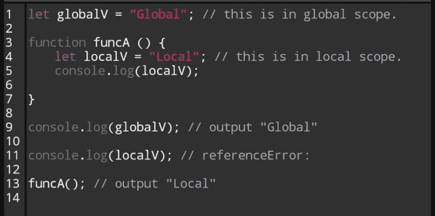
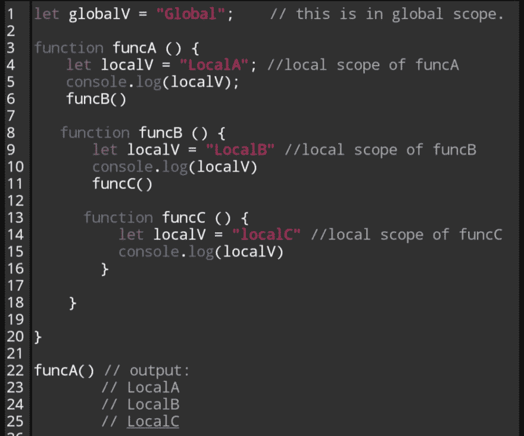

# JavaScript:你说的“范围”是什么意思？

> 原文:[https://dev . to/hostx/JavaScript-what-do-you-mean-by-the-scope-1ll 8](https://dev.to/hostx/javascript-what-do-you-mean-by-the-scope-1ll8)

像许多其他程序员一样，当以自学的方式开始使用 javascript 时，我们会发现我们周围有一个非常常见的词**“Scope”**，不出所料，我们做的第一件事就是找到所有答案的来源伟大的谷歌当然，我们会搜索什么是**范围**或**变量范围**？。

但是这有点混乱，不太清楚。所以，让我解释一下什么是**“范围”**以及它在 JavaScript 中是如何工作的。

**变量的范围是什么？**

作用域是确定运行时在代码中何处可以访问变量、函数和对象。这意味着变量的范围(可以访问它的地方)是由变量声明的位置控制的。

JavaScript 中有两个作用域，**全局作用域**和**局部作用域**，当我们开始用 JavaScript 编程时，会有一个瞬间*引用错误:“*开始弹出，这主要是因为作用域，当你调试时，如果你能理解全局和局部作用域是如何工作的，你将在调试时更有效率，你将能够处理大多数引用和声明错误。

#### ***全球范围** :*

整个 JavaScript 文档中只有一个全局范围。如果变量是在函数之外定义的，那么它就是全局变量。

<figure> 

<figcaption>全局范围内的变量总是在函数声明之外。</figcaption>

</figure>

正如您在上面的代码中看到的，变量“glovalV”是在全局范围内声明的，因为它不在函数内部，您可以自己测试在函数内部和外部声明和记录变量，并检查您发现了什么错误。

"*你也可以从任何其他作用域访问和改变在全局作用域中声明的任何变量."*

#### ***局部范围:***

函数中声明的变量在局部范围内。局部作用域也称为函数作用域，因为局部作用域是由 Javascript 中的函数创建的。局部范围内的变量只能在定义它们的函数中访问，也就是说，它们被绑定到各自具有不同范围的函数中。这允许我们创建具有相同名称并可用于不同函数的变量。

<figure> 

<figcaption>局部范围内</figcaption>

</figure>

在 JavaScript 中，可以在多层嵌套作用域中指定同名的变量。在这种情况下，局部变量优先于全局变量。如果您用相同的名称声明一个局部变量和一个全局变量，当您在函数中使用局部变量时，它将优先。这种类型的行为被称为。简单地说，内部变量遮蔽了外部变量。这就是 Javascript 解释器查找特定变量的方式；它在当时正在执行的最里面的作用域中搜索变量，并继续搜索，直到找到第一个匹配项，即使在外部作用域中还有其他同名的变量。

<figure> 

<figcaption>函数内部同名变量。</figcaption>

</figure>

## **总之**

一开始理解作用域可能会有点混乱，但我推荐的是玩弄代码和 console.log 变量和函数调用的内容，我希望这对理解 JavaScript 有一点帮助，在我的下一篇文章中，我将讨论与 ES6 或 ECMAScript2015 JavaScript 规范中的保留字" **let** 相关的块作用域。