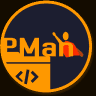
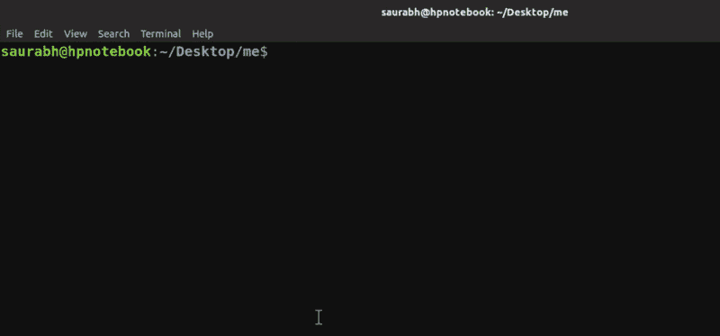

# ProjectMan🦸在这里！将项目添加到收藏夹并从命令行打开它们

> 原文:[https://dev . to/saurabhdawse/project man-is-here-add-projects-to-favorites-and-open-them-from-command-line-5d7k](https://dev.to/saurabhdaware/projectman-is-here-add-projects-to-favorites-and-open-them-from-command-line-5d7k)

[T2】](https://res.cloudinary.com/practicaldev/image/fetch/s--B26YCaF1--/c_limit%2Cf_auto%2Cfl_progressive%2Cq_auto%2Cw_880/https://thepracticaldev.s3.amazonaws.com/i/1my7rdy2dmb34oyfet63.png)

所以我做了一个 NPM 包叫做 **ProjectMan** 。

ProjectMan 是一个项目管理器 CLI，可以让你添加项目到收藏夹，并使用`projectman open`命令从任何地方打开它们。

我懒得输入`p r o j e c t m a n`，所以命令`projectman`有一个别名，也就是`pm`，所以所有的树懒和熊猫，你甚至可以输入`pm <command>`

[T2】](https://res.cloudinary.com/practicaldev/image/fetch/s--KHhpt0qW--/c_limit%2Cf_auto%2Cfl_progressive%2Cq_auto%2Cw_880/https://thepracticaldev.s3.amazonaws.com/i/ohszjsco0ppqkg2vyfuj.png)

整个想法是，我讨厌`cd /till/the/project/path`然后在我最喜欢的编辑器中打开项目，所以使用 ProjectMan 你可以用`pm add`将项目添加到收藏夹，然后用`pm open`从任何你想打开的地方打开它们

安装 ProjectMan 并获得 started🦸

[T2】](https://res.cloudinary.com/practicaldev/image/fetch/s--Ly4puuSY--/c_limit%2Cf_auto%2Cfl_progressive%2Cq_66%2Cw_880/https://thepracticaldev.s3.amazonaws.com/i/ihjt9y942ukz9l9kgmt9.gif)

ProjectMan 还提供了其他一些命令，如`pm seteditor`、`pm remove`和`pm edit`，你可以在 [ProjectMan 文档](https://github.com/saurabhdaware/projectman#readme)中读到它们

GitHub:[https://github.com/saurabhdaware/projectman](https://github.com/saurabhdaware/projectman)T2:[https://npmjs.com/package/projectman](https://npmjs.com/package/projectman)

希望你们都会喜欢！如果你喜欢，一定要启动这个库！

如果有人在开始使用 GitHub 时需要帮助，或者想练习发送拉请求，我很乐意在这个或者我的任何其他库上提供帮助，你可以在我的 Twitter 上联系我:[https://twitter.com/saurabhcodes](https://twitter.com/saurabhcodes)

感谢您的关注和阅读🎉