# 更换 JHipster UI 组件(第 1 部分。导航条)

> 原文:[https://dev . to/Antonio ortizpola/replacing-jhipster-ui-components-part-1-navbar-36dl](https://dev.to/antonioortizpola/replacing-jhipster-ui-components-part-1-navbar-36dl)

[在第一部分](https://dev.to/antonioortizpola/separating-the-jhipster-layout-from-a-custom-ui-implementation-55i8)我开始在 JHipster 和 Appwork 代码之间进行分离，在这一点上，我们将 App.vue 与 JHipster 完全分离，试图保持并排的方法。

# [](#replacing-jhipster-layout)替换 JHipster 布局

首先，我将 Appwork 中的`app.vue`代码合并到我的新`btj/App.vue`中，这就像添加缺失的样式一样简单(我将 javascript 留到后面)。

```
<!--*** JHipster part ***-->
<template>
    <div id="app">
        <ribbon></ribbon>
        <div id="app-header">
            <jhi-navbar></jhi-navbar>
        </div>
        <div class="container-fluid">
            <div class="card jh-card">
                <strong>
                Could it be is loading my layout and no JHipster?
                </strong>
                <router-view></router-view>
            </div>
            <b-modal id="login-page" hide-footer lazy>
                <span slot="modal-title" id="login-title" v-text="$t('login.title')">Sign in</span>
                <login-form></login-form>
            </b-modal>

            <jhi-footer></jhi-footer>
        </div>
    </div>
</template>

<!--*** Styles from appwork ***-->
<style src="@/vendor/styles/bootstrap.scss" lang="scss"></style>
<style src="@/vendor/styles/appwork.scss" lang="scss"></style>
<style src="@/vendor/styles/theme-corporate.scss" lang="scss"></style>
<style src="@/vendor/styles/colors.scss" lang="scss"></style>
<style src="@/vendor/styles/uikit.scss" lang="scss"></style>
<style src="./style.scss" lang="scss"></style>

<script lang="ts" src="./app.component.ts">
</script> 
```

这产生了一个小问题，布局在路径中使用了`@`占位符，这是 Appwork 演示项目的基本路径，但在我的项目中，它们在`src/main/webapp/app/bjt/vendor`中，我可以用 replace 来更改路径，但快速搜索显示至少有 95 处需要替换和维护:/。

[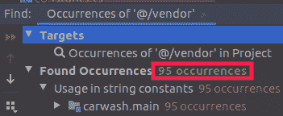T2】](https://res.cloudinary.com/practicaldev/image/fetch/s--RD7TmSaR--/c_limit%2Cf_auto%2Cfl_progressive%2Cq_auto%2Cw_880/https://thepracticaldev.s3.amazonaws.com/i/nam5lvqdjk3cx5xckzg9.png)

因此，在搜索其他解决方案时，我在 JHipster 的`tsconfig.json`文件中找到了`@`的定义:

[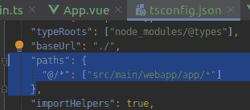T2】](https://res.cloudinary.com/practicaldev/image/fetch/s--SCExb-pZ--/c_limit%2Cf_auto%2Cfl_progressive%2Cq_auto%2Cw_880/https://thepracticaldev.s3.amazonaws.com/i/0qyryzwtgbfyv0mlpr6u.png)

因此，我得出的结论是，打破我自己的规则，将供应商文件夹从`src/main/webapp/app/bjt/vendor`移动到`src/main/webapp/app/vendor`是可以的，作为交换，保留所有文件不变，允许我在新版本的 Appwork 推出时更快地更新。

我发现的另一个问题，也是你迟早会发现的问题是版本的不匹配，在这种情况下 JHipster 使用的是

```
"bootstrap-vue":  "2.0.0-rc.11" 
```

虽然 appwork 在`2.0.0-rc.16`中，在这种特殊情况下，我只是更新到最新版本，并祈祷这不会破坏 JHipster 的布局，但嘿，我正在使用 Appwork，我知道 JHipster 蓝图迟早会更新，所以，**总是试图使用最新的稳定版本**。

这样一来，我可以开始集成 Appwork 组件，首先将`app-layout-navbar`组件添加到`bjt/app.component.ts`

```
...
import LayoutNavbar from '@/bjt/layout/LayoutNavbar.vue';

@Component({
  components: {
    ribbon: Ribbon,
    'jhi-navbar': JhiNavbar,
    'login-form': LoginForm,
    'jhi-footer': JhiFooter,
    'app-layout-navbar': LayoutNavbar // Appwork navbar
  }
})
export default class App extends Vue {
} 
```

现在我可以在我的`bjt/app.vue`
中使用它

```
<template>
    <div id="app">
        <ribbon></ribbon>
        <div id="app-header">
            <app-layout-navbar /> <!--Appwork component-->
            <jhi-navbar></jhi-navbar>
        </div>
        ...
    </div>
</template>
... 
```

然后我可以查看应用程序页面，感觉自己赢了:

[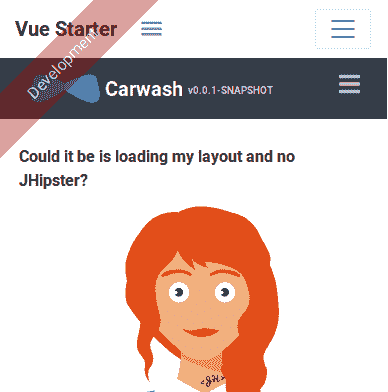T2】](https://res.cloudinary.com/practicaldev/image/fetch/s--Y2xRxZR7--/c_limit%2Cf_auto%2Cfl_progressive%2Cq_auto%2Cw_880/https://thepracticaldev.s3.amazonaws.com/i/y8s0uc9z1uy75mszw8gk.png)

但是，嘿！，感觉有些不对劲...

[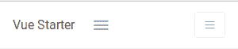T2】](https://res.cloudinary.com/practicaldev/image/fetch/s--GHbpWZQH--/c_limit%2Cf_auto%2Cfl_progressive%2Cq_auto%2Cw_880/https://thepracticaldev.s3.amazonaws.com/i/d3fvvgfeuuacx51scg9r.png)

样式看起来不一样，不像演示中的样式。答案在两个文件中，`global.scss`和`vendor.scss`，如果我删除这两个文件中的代码，那么样式显示得很好，但是，它们是什么，它们来自哪里？

*   `global.scss`

是主样式所在的地方，这里是 JHipster 为默认布局添加自定义样式的地方。

对文件名的快速搜索显示，该文件是在两个 webpack 配置文件中配置的。

[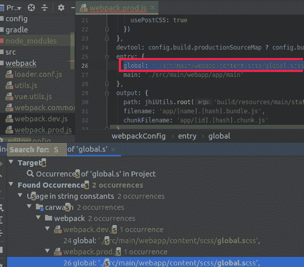T2】](https://res.cloudinary.com/practicaldev/image/fetch/s--jXsGXsyI--/c_limit%2Cf_auto%2Cfl_progressive%2Cq_auto%2Cw_880/https://thepracticaldev.s3.amazonaws.com/i/mfvef0hsviq7i2u4pt9r.png)

*   `vendor.scss`

这个文件在`readme.md`中提到过，据我所知，它应该包含自定义导入和第三方插件的样式

[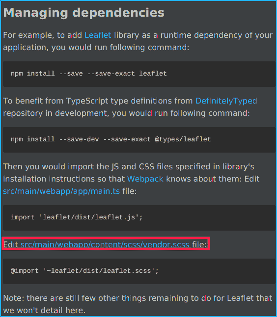T2】](https://res.cloudinary.com/practicaldev/image/fetch/s--ML4K8NIS--/c_limit%2Cf_auto%2Cfl_progressive%2Cq_auto%2Cw_880/https://thepracticaldev.s3.amazonaws.com/i/4oerr6hsphwzj498j727.png)

所以，同样，经过一些思考后，我决定我可以更改两个 webpack 文件(prod 和 dev ),这样我就可以用`bjt/styles.scss`替换`global.scss`,另一方面，我不需要`vendor.scss`,因为 appwork 布局的样式已经包含在`vendor`文件夹中。

遗憾的是，这增加了在我的应用程序和 JHipster 默认应用程序之间进行切换的步骤，现在我必须:

1.  将`main.ts`中的导入替换为`app.vue`或`bjt/App.vue`
2.  注释/取消注释从`main.ts` `// import '../content/scss/vendor.scss';`导入的 vendor.scss
3.  替换我的实现中的`webpack.dev.js`和`webpack.prod.js`中的全局条目或 JHipster 中的条目

```
entry: {
  // global: './src/main/webapp/content/scss/global.scss', // JHipster
  global: './src/main/webapp/app/bjt/style.scss', // Mine
  main: './src/main/webapp/app/main'
} 
```

虽然这增加了一点负担，但我必须记住 JHipster 应该是您的应用程序的基础，迟早会有更多的事情会有所不同，我们的想法是将差异降至最低，但不要忽视开发人员的体验和可维护性，至少替换文件导入，而不是文件本身，如果我想更新 JHipster 或 Appwork 版本，我可以少一些痛苦。

现在`bjt/style.scss`已经包含在 Webpack 中，我可以继续从`bjt/App.vue`中删除它，我也编辑了文件，所以它可以包含其他样式本身，这样我的`bjt/App.vue`现在就清除了所有的全局样式，而`styles.scss`就像这样结束了:

```
// Imports from App.vue
@import '@/vendor/styles/bootstrap.scss';
@import '@/vendor/styles/appwork.scss';
@import '@/vendor/styles/theme-corporate.scss';
@import '@/vendor/styles/colors.scss';
@import '@/vendor/styles/uikit.scss';

// Appwork original style.css file
@import '~bootstrap-vue/src/index.scss';

// Base
//
... 
```

现在，我们可以再次查看我们的应用程序页面...

[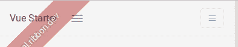T2】](https://res.cloudinary.com/practicaldev/image/fetch/s--aunk4T2z--/c_limit%2Cf_auto%2Cfl_progressive%2Cq_auto%2Cw_880/https://thepracticaldev.s3.amazonaws.com/i/rty22vff8ayj44gxaqkl.png)

我们有 appwork 风格！耶希尔...但是...又一次感觉不好，导航条是灰色的，不是白色的，这个拼图中还缺少一些东西。

在检查了 navbar 组件之后，差异是显而易见的，JHipster 使用 TypeScript，Appwork 使用普通的 Javascript 文件，同样，没有设置颜色，因为它使用了一个名为`getLayoutNavbarBg()`的方法。

```
<template>
  <b-navbar toggleable="lg" :variant="getLayoutNavbarBg()" class="layout-navbar align-items-lg-center container-p-x">

    <!-- Brand -->
    <b-navbar-brand to="/">Vue Starter</b-navbar-brand>

    <!-- Sidenav toggle -->
    <b-navbar-nav class="align-items-lg-center mr-auto mr-lg-4" v-if="sidenavToggle">
      <a class="nav-item nav-link px-0 ml-2 ml-lg-0" href="javascript:void(0)" @click="toggleSidenav">
        <i class="ion ion-md-menu text-large align-middle" />
      </a>
    </b-navbar-nav>

    <!-- Navbar toggle -->
    <b-navbar-toggle target="app-layout-navbar"></b-navbar-toggle>

    <b-collapse is-nav id="app-layout-navbar">
      <b-navbar-nav class="align-items-lg-center">
        <b-nav-item href="#">Link 1</b-nav-item>
        <b-nav-item href="#">Link 2</b-nav-item>
      </b-navbar-nav>
    </b-collapse>

  </b-navbar>
</template>

<script>
export default {
  name: 'app-layout-navbar',

  props: {
    sidenavToggle: {
      type: Boolean,
      default: true
    }
  },

  methods: {
    toggleSidenav () {
      this.layoutHelpers.toggleCollapsed()
    },

    getLayoutNavbarBg () {
      return this.layoutNavbarBg
    }
  }
}
</script> 
```

所以，是时候练习我的打字技巧了，我创建了我的新的 Frankenstein 组件，一个两个世界的混合体，这将是我的`bjt-navbar`组件，html 部分还没有改变，但是，按照 JHipster 结构，我创建了一个新的类来包含 Javascript 代码，将其命名为`bjt-navbar.component.ts`。

这个类还需要一个额外的改变，因为 Appworks 使用的是普通 Javascript，它访问了一个名为`this.layoutHelpers`的属性，这个属性在很多组件中使用。

[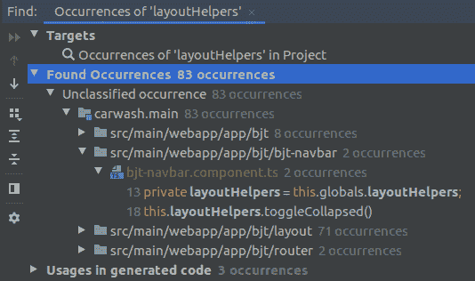T2】](https://res.cloudinary.com/practicaldev/image/fetch/s--OSoIKLPv--/c_limit%2Cf_auto%2Cfl_progressive%2Cq_auto%2Cw_880/https://thepracticaldev.s3.amazonaws.com/i/0ajq2nxtv4xf8agbfyvy.png)

此外，它导出的是一个函数列表，而不是一个类，这里我对 Javascript 的无知让我困惑，我无法找到一个简单的方法来实现这个类，一方面我有布局助手:

```
export default {
  get _layoutHelpers () {
    return window.layoutHelpers
  },

  _exec (fn) {
    return this._layoutHelpers && fn()
  },

  getLayoutSidenav () {
    return this._exec(() => this._layoutHelpers.getLayoutSidenav()) || null
  },

  getSidenav () {
    return this._exec(() => this._layoutHelpers.getSidenav()) || null
  },

  ...
} 
```

我可以看到它在全局中使用，保持相同的结构:

```
import layoutHelpers from './layout/helpers.js'

export default function () {
  return {
    // Public url
    publicUrl: process.env.BASE_URL,

    // Layout helpers
    layoutHelpers,

    // Check for RTL layout
    get isRTL () {
      return document.documentElement.getAttribute('dir') === 'rtl' ||
             document.body.getAttribute('dir') === 'rtl'
    },

    ....
  }
} 
```

但是我找不到在哪里建立连接，组件如何简单地访问这个`this.layoutHelpers`的属性，所以，我找到的使用那个类的唯一方法是实现一个类字段:

```
import { Component } from 'vue-property-decorator';
import JhiNavbar from "@/core/jhi-navbar/jhi-navbar.component";
import globals from "@/bjt/globals";

@Component
export default class BjtNavbar extends JhiNavbar {

  private globals = globals();
  private layoutHelpers = this.globals.layoutHelpers;

  public sidenavToggle = true;

  public toggleSidenav () {
    this.layoutHelpers.toggleCollapsed()
  }

  public getLayoutNavbarBg () {
    return this.globals.layoutNavbarBg
  }
} 
```

同样重要的是要注意一件事，我的组件正在扩展`JhiNavbar`，所以我可以访问所有的属性，但这将是稍后的事情，首先，我需要检查 navbar 样式现在是否已修复，所以，我简单地在`bjt/app.component.ts`
中为我的新组件替换 appwork 组件

```
@Component({
  components: {
    ribbon: Ribbon,
    'jhi-navbar': JhiNavbar,
    'login-form': LoginForm,
    'jhi-footer': JhiFooter,
    'bjt-navbar': BjtNavbar // Look at me, I am the component now
  }
})
... 
```

最后，我们有白色背景的自定义导航条

[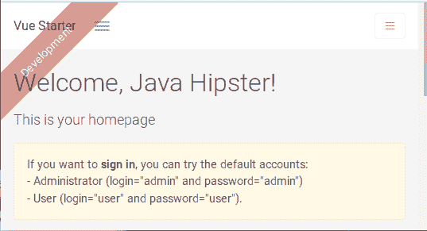T2】](https://res.cloudinary.com/practicaldev/image/fetch/s--D2LxOm7s--/c_limit%2Cf_auto%2Cfl_progressive%2Cq_auto%2Cw_880/https://thepracticaldev.s3.amazonaws.com/i/r365s246yqhhg3tcrr0u.png)

在继续之前，我需要做一点改变，我正在使用最小的 Appwork starter 布局，但为了充分利用布局，我需要基于更完整的`vue-demo`示例。

[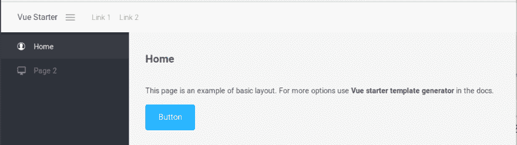](https://res.cloudinary.com/practicaldev/image/fetch/s--v85hvZxH--/c_limit%2Cf_auto%2Cfl_progressive%2Cq_auto%2Cw_880/https://thepracticaldev.s3.amazonaws.com/i/mms8hrt7u8rwe6th053d.png)
*Appwork starter*

[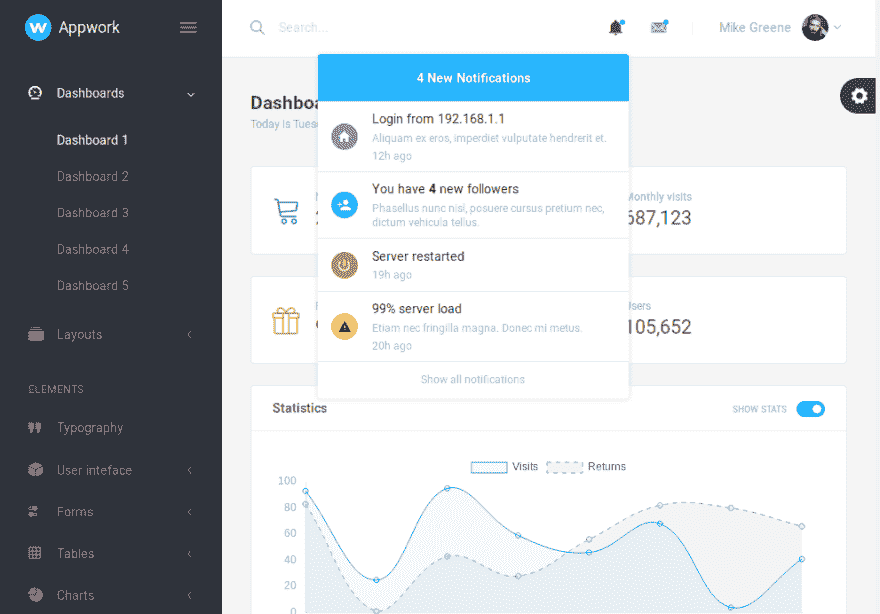](https://res.cloudinary.com/practicaldev/image/fetch/s--Q-3E-EjD--/c_limit%2Cf_auto%2Cfl_progressive%2Cq_auto%2Cw_880/https://thepracticaldev.s3.amazonaws.com/i/kagt5uch9yd5bze4am48.png)
*Appwork demo*

幸运的是，appwork 的作者在组织代码方面做得很好，两个项目在基础文件中没有太多的不同(只有更多的页面和一个`demo.css`)，所以我只是在我的`style.scss`中添加了`demo.css`。

[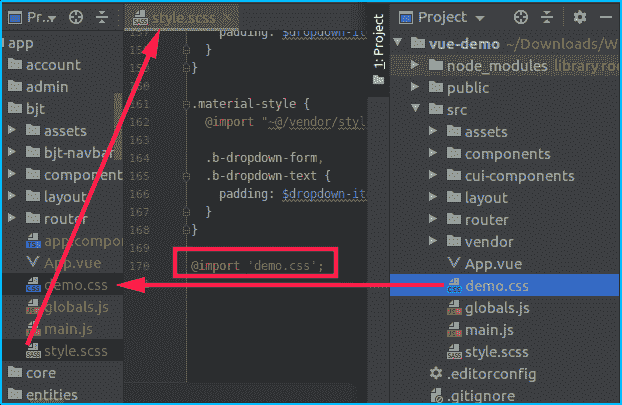T2】](https://res.cloudinary.com/practicaldev/image/fetch/s---qXPRwg6--/c_limit%2Cf_auto%2Cfl_progressive%2Cq_auto%2Cw_880/https://thepracticaldev.s3.amazonaws.com/i/8016h5zpkla9ba5a25l8.png)

然后，我只需用 appwork 演示项目的`LayoutNavbar.vue`中的内容替换我的`bjt/bjt-navbar.vue`文件的内容。

[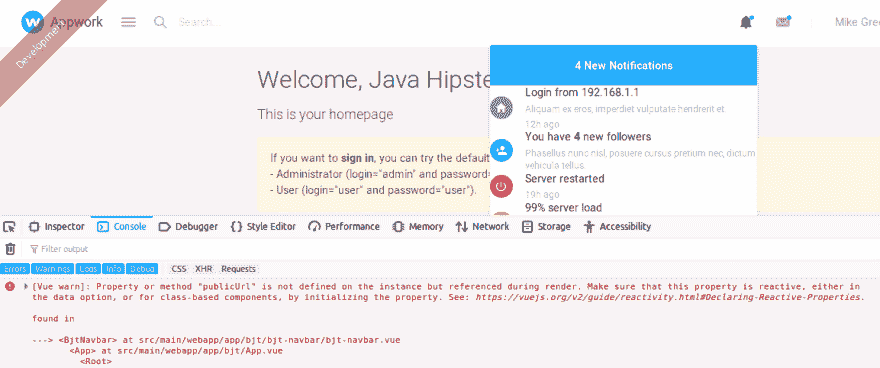T2】](https://res.cloudinary.com/practicaldev/image/fetch/s--NtyVWArN--/c_limit%2Cf_auto%2Cfl_progressive%2Cq_auto%2Cw_880/https://thepracticaldev.s3.amazonaws.com/i/jjooje7wy5gojkqi6rbk.png)

正如你所看到的，样式工作正常，但是下拉菜单中的样式很奇怪，图像无法加载。

图像不是一个大问题，我现在可以删除它，无论如何，它们是不会在最终产品的图像，但下拉菜单需要更深入的调查。

控制台显示没有加载 vue 组件

> [Vue warn]:未知的自定义元素:-您是否正确注册了组件？对于递归组件，请确保提供“名称”选项。

这是我的知识再次限制我的地方，这是我看到的，在 Appwork 演示项目中搜索，我可以看到它被多次使用:

[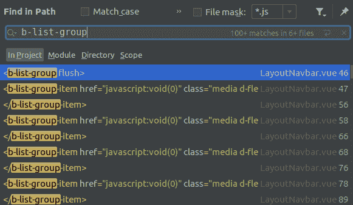T2】](https://res.cloudinary.com/practicaldev/image/fetch/s--WW9G-VA6--/c_limit%2Cf_auto%2Cfl_progressive%2Cq_auto%2Cw_880/https://thepracticaldev.s3.amazonaws.com/i/kgyy4yg1sozmly2evjxq.png)

但是我找不到声明或初始化组件的地方，我知道它是来自 vue-bootstrap 的一个组件，但是似乎不需要特殊的配置。

另一方面，在 JHipster 项目中，我发现了一些有趣的东西，JHipster 确实在`config-boostrap-vue.ts` :
中声明了来自 vue-bootstrap 的每个单独的组件

```
export function initBootstrapVue(vue) {
  vue.component('b-badge', bBadge);
  ..
  vue.directive('b-modal', bModalDirective);
} 
```

我不知道 JHipster 为什么这样做而不是 Appwork，但是因为我使用 JHipster 作为基础，我在`bjt/config/config-bootstrap-vue-bjt.ts`中添加了一个文件，其中包含 JHipster 没有添加的组件:

```
import bDdDivider from 'bootstrap-vue/es/components/dropdown/dropdown-item';
import bDdItem from 'bootstrap-vue/es/components/dropdown/dropdown-item';
import bListGroup from 'bootstrap-vue/es/components/list-group/list-group';
import bListGroupItem from 'bootstrap-vue/es/components/list-group/list-group-item';

export function initBootstrapVueBjt(vue) {
  vue.component('b-dd-divider', bDdDivider);
  vue.component('b-dd-item', bDdItem);
  vue.component('b-list-group', bListGroup);
  vue.component('b-list-group-item', bListGroupItem);
} 
```

然后我在`main.ts`
中添加我的组件初始化

```
...
bootstrapVueConfig.initBootstrapVue(Vue);
bootstrapVueConfigBjt.initBootstrapVueBjt(Vue); // My components will be here
... 
```

最后，我们的项目中有来自 Appwork 的 navbar！！！

[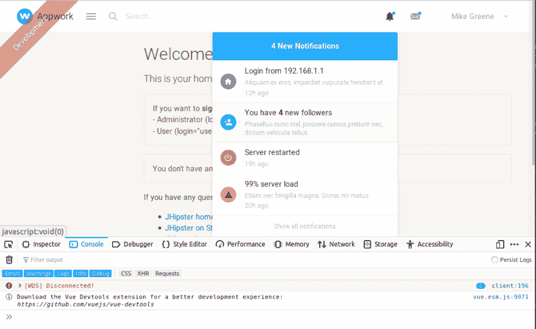T2】](https://res.cloudinary.com/practicaldev/image/fetch/s--JeBJTtTT--/c_limit%2Cf_auto%2Cfl_progressive%2Cq_auto%2Cw_880/https://thepracticaldev.s3.amazonaws.com/i/uxafxo6l8w7zrijhmeji.png)

现在，由于扩展了我的`bjt/bjt-navbar.component.ts`中的`JhiNavbar`，我可以毫无问题地在我的布局中包含 JHipster 组件。

```
export default class BjtNavbar extends JhiNavbar { 
```

然后，是最繁琐的部分，将 Appwork Demo 中的 navbar 合并到我的 JHipster 项目中，但这是一个简单的任务，结果使我的新 navbar 菜单变得生动起来。

[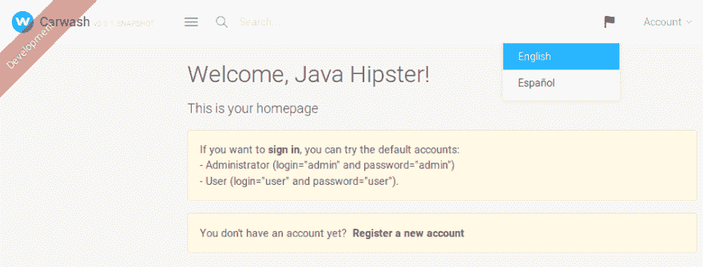](https://res.cloudinary.com/practicaldev/image/fetch/s--xxUfOAfk--/c_limit%2Cf_auto%2Cfl_progressive%2Cq_auto%2Cw_880/https://thepracticaldev.s3.amazonaws.com/i/e3404bac1p04n4ye5sba.png)
[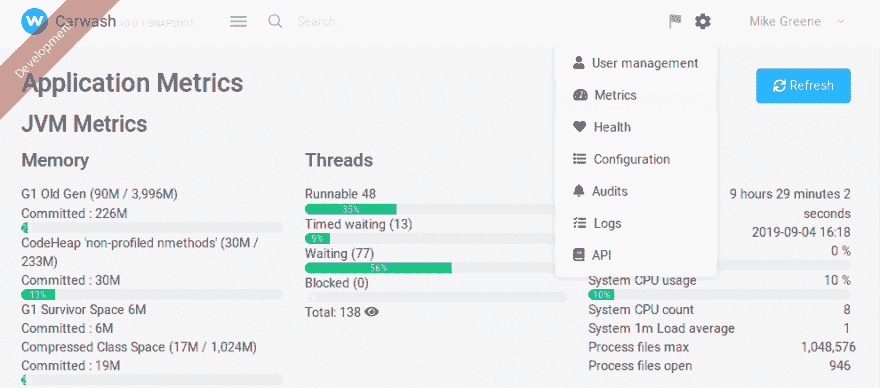](https://res.cloudinary.com/practicaldev/image/fetch/s--h34NNX6Z--/c_limit%2Cf_auto%2Cfl_progressive%2Cq_auto%2Cw_880/https://thepracticaldev.s3.amazonaws.com/i/2sx18xr41eh78pfku9pj.png)
[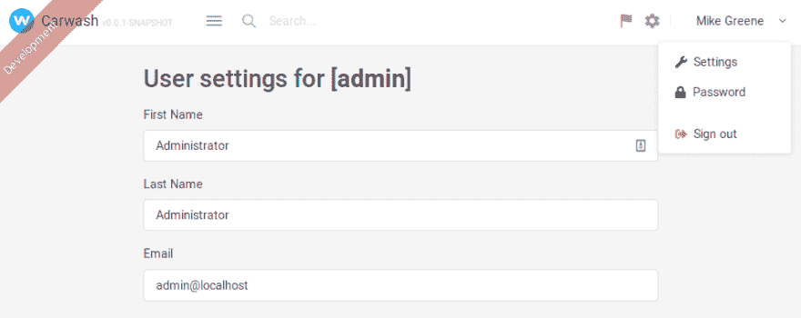](https://res.cloudinary.com/practicaldev/image/fetch/s--rmsiLhmJ--/c_limit%2Cf_auto%2Cfl_progressive%2Cq_auto%2Cw_880/https://thepracticaldev.s3.amazonaws.com/i/lvl9yj70h29xkjl4ed38.png)

我希望您能注意到代码并没有发生巨大的变化，它只是用国际化实用程序替换了文本，用 JHipster 选项替换了菜单。

[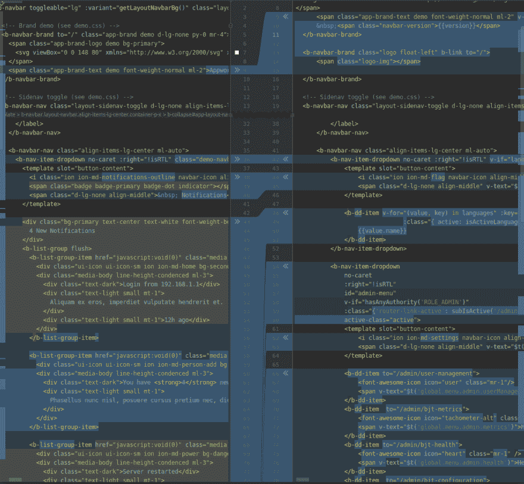T2】](https://res.cloudinary.com/practicaldev/image/fetch/s--t-jmpxZf--/c_limit%2Cf_auto%2Cfl_progressive%2Cq_auto%2Cw_880/https://thepracticaldev.s3.amazonaws.com/i/f8e8n9huwz2w8x6ock2i.png)

你也可以注意到没有实体菜单，这是因为实体会在左边的菜单中(还没有介绍)，用户名也是硬编码的。请继续关注第三部分，我将尝试改进顶部的 nabvar 并插入 Appwork 演示中的左侧菜单。

*免责声明*

抱歉，如果我犯了一些错误或没有遵循帖子中的最佳实践，再次重申，我主要是一名后端开发人员，我只是在学习 Vue.js，所以，如果你发现一些可以以更好的方式完成的事情，或者如果我确实认为 JHipster 有错，请告诉我！