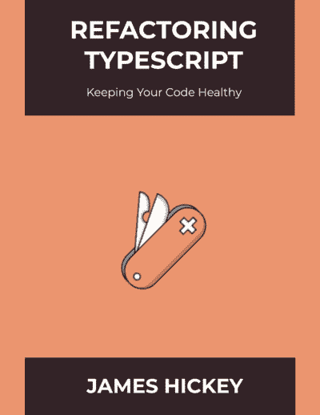

# 不健康的代码:到处都是空检查！

> 原文:[https://dev . to/jamesmh/healthy-code-null-checks-everywhere-2720](https://dev.to/jamesmh/unhealthy-code-null-checks-everywhere-2720)

* * *

这是我的书[重构类型脚本:保持你的代码健康的摘录。](https://leanpub.com/refactoringtypescript)T3】

 [
T4】](https://leanpub.com/refactoringtypescript)

* * *

# [](#identifying-the-problem)识别问题

## [](#billion-dollar-mistake)十亿美元的错误

你知道“空”这个概念的发明者称之为他的[“十亿美元的错误！”](https://www.infoq.com/presentations/Null-References-The-Billion-Dollar-Mistake-Tony-Hoare/)

虽然看起来很简单，但是一旦你进入更大的项目和代码库，你会不可避免地发现一些代码在使用空值时“偏离了底线”。

有时，我们希望让一个对象的属性可选:

```
class Product{
  public id: number;
  public title: string;
  public description: string;
} 
```

<svg width="20px" height="20px" viewBox="0 0 24 24" class="highlight-action crayons-icon highlight-action--fullscreen-on"><title>Enter fullscreen mode</title></svg> <svg width="20px" height="20px" viewBox="0 0 24 24" class="highlight-action crayons-icon highlight-action--fullscreen-off"><title>Exit fullscreen mode</title></svg>

在 TypeScript 中，`string`属性可以被赋予值`null`。

但是...一个`number`属性也可以！

```
const chocolate: Product = new Product();
chocolate.id = null;
chocolate.description = null; 
```

<svg width="20px" height="20px" viewBox="0 0 24 24" class="highlight-action crayons-icon highlight-action--fullscreen-on"><title>Enter fullscreen mode</title></svg> <svg width="20px" height="20px" viewBox="0 0 24 24" class="highlight-action crayons-icon highlight-action--fullscreen-off"><title>Exit fullscreen mode</title></svg>

*嗯....*

## [](#another-example)再比如

乍一看，那并不坏。

但是，它可以导致这样做的可能性:

```
const chocolate: Product = new Product(null, null, null); 
```

<svg width="20px" height="20px" viewBox="0 0 24 24" class="highlight-action crayons-icon highlight-action--fullscreen-on"><title>Enter fullscreen mode</title></svg> <svg width="20px" height="20px" viewBox="0 0 24 24" class="highlight-action crayons-icon highlight-action--fullscreen-off"><title>Exit fullscreen mode</title></svg>

这有什么不好？嗯，它允许您的代码(在本例中是`Product`类)进入不一致的状态。

在你的系统中有一个没有`id`的`Product`有意义吗？大概不会。

理想情况下，一旦创建了`Product`，它就应该有一个`id`。

因此...在其他需要处理产品逻辑的地方会发生什么？

令人悲伤的事实是:

```
let title: string;

if(product != null) {
    if(product.id != null) {
        if(product.title != null) {
            title = product.title;
        } else {
            title = "N/A";
        }
    } else {
        title = "N/A"
    }
} else {
    title = "N/A"
} 
```

<svg width="20px" height="20px" viewBox="0 0 24 24" class="highlight-action crayons-icon highlight-action--fullscreen-on"><title>Enter fullscreen mode</title></svg> <svg width="20px" height="20px" viewBox="0 0 24 24" class="highlight-action crayons-icon highlight-action--fullscreen-off"><title>Exit fullscreen mode</title></svg>

有人会写这样的代码吗？

是的。

在我们研究一些修复它的技术之前，让我们看看为什么这段代码是不健康的，并且被认为是“代码味道”。

## [](#is-it-that-bad)有那么糟糕吗？

这段代码很难阅读和理解。所以改了就很容易出 bug。

我想我们都同意这样的代码分散在你的应用中并不理想。尤其是当这种代码存在于应用程序的重要和关键部分时！

* * *

## 关于 TypeScript 中不可为空的类型的旁注

作为一个相关的旁注，有人可能会提出 TypeScript 支持[不可空类型](https://www.typescriptlang.org/docs/handbook/advanced-types.html#nullable-types)的事实。

这允许你添加一个特殊的标志到你的编译选项中，并且在默认情况下，阻止任何变量将`null`作为一个值。

关于这个论点有几点:

*   我们大多数人都在处理现有的代码库，这些代码库需要花费**吨**的工作和时间来修复这些编译错误。

*   如果没有很好地测试代码，并且小心地避免假设，我们可能**仍然**由于这些变化而潜在地导致运行时错误。

*   这篇文章(摘自我的书)告诉你可以应用于其他语言的解决方案——这些语言可能没有这个选项。

* * *

不管怎样，对我们的代码进行更小的、更有针对性的改进总是更安全的。同样，这使我们能够确保系统仍然表现相同，并避免在进行这些改进时引入大量风险。

# [](#one-solution-null-object-pattern)一种解决方案:空对象模式

## [](#empty-collections)清空收藏

假设你在一家编写处理法律案件软件的公司工作。

当你在开发一个特性时，你发现了一些代码:

```
const legalCases: LegalCase[] = await fetchCasesFromAPI();
for (const legalCase of legalCases) {
    if(legalCase.documents != null) {
        uploadDocuments(legalCase.documents);
    }
} 
```

<svg width="20px" height="20px" viewBox="0 0 24 24" class="highlight-action crayons-icon highlight-action--fullscreen-on"><title>Enter fullscreen mode</title></svg> <svg width="20px" height="20px" viewBox="0 0 24 24" class="highlight-action crayons-icon highlight-action--fullscreen-off"><title>Exit fullscreen mode</title></svg>

记住我们应该警惕空支票。如果代码的其他部分忘记检查一个`null`数组怎么办？

空对象模式会有所帮助:您创建一个表示“空”或`null`对象的对象。

### [](#fixing-it-up)修修补补

我们来看一下`fetchCasesFromAPI()`方法。我们将应用这种模式的一个版本，这是 JavaScript 和 TypeScript 中处理数组时非常常见的做法:

```
const fetchCasesFromAPI = async function() {
    const legalCases: LegalCase[] = await $http.get('legal-cases/');

    for (const legalCase of legalCases) {
        // Null Object Pattern
        legalCase.documents = legalCase.documents || [];
    }
    return legalCases;
} 
```

<svg width="20px" height="20px" viewBox="0 0 24 24" class="highlight-action crayons-icon highlight-action--fullscreen-on"><title>Enter fullscreen mode</title></svg> <svg width="20px" height="20px" viewBox="0 0 24 24" class="highlight-action crayons-icon highlight-action--fullscreen-off"><title>Exit fullscreen mode</title></svg>

我们没有将空数组/集合保留为`null`，而是给它分配了一个实际的空数组。

现在，没有其他人需要进行空检查了！

但是...整个法律案例集本身呢？API 返回`null`怎么办？

```
const fetchCasesFromAPI = async function() {
    const legalCasesFromAPI: LegalCase[] = await $http.get('legal-cases/');
    // Null Object Pattern
    const legalCases = legalCasesFromAPI || [];

    for (const case of legalCases) {
        // Null Object Pattern
        case.documents = case.documents || [];
    }
    return legalCases;
} 
```

<svg width="20px" height="20px" viewBox="0 0 24 24" class="highlight-action crayons-icon highlight-action--fullscreen-on"><title>Enter fullscreen mode</title></svg> <svg width="20px" height="20px" viewBox="0 0 24 24" class="highlight-action crayons-icon highlight-action--fullscreen-off"><title>Exit fullscreen mode</title></svg>

酷！

现在，我们已经确保使用这个方法的每个人都不需要担心检查空值。

## [](#take-2)取 2

其他语言如 C#、Java 等。由于强类型(即`[]`)的规则，不允许您将一个空数组分配给集合。

在这些情况下，您可以使用类似这个版本的空对象模式:

```
class EmptyArray<T> {
    static create<T>() {
        return new Array<T>()
    }
}

// Use it like this:
const myEmptyArray: string[] = EmptyArray.create<string>(); 
```

<svg width="20px" height="20px" viewBox="0 0 24 24" class="highlight-action crayons-icon highlight-action--fullscreen-on"><title>Enter fullscreen mode</title></svg> <svg width="20px" height="20px" viewBox="0 0 24 24" class="highlight-action crayons-icon highlight-action--fullscreen-off"><title>Exit fullscreen mode</title></svg>

## [](#what-about-objects)对象呢？

想象你正在开发一个视频游戏。在里面，有些关卡可能会有老板。

在检查当前关卡是否有 boss 时，你可能会看到这样的内容:

```
if(currentLevel.boss != null) {
    currentLevel.boss.fight(player);
} 
```

<svg width="20px" height="20px" viewBox="0 0 24 24" class="highlight-action crayons-icon highlight-action--fullscreen-on"><title>Enter fullscreen mode</title></svg> <svg width="20px" height="20px" viewBox="0 0 24 24" class="highlight-action crayons-icon highlight-action--fullscreen-off"><title>Exit fullscreen mode</title></svg>

我们可能会在其他地方找到这样的空值检查:

```
if(currentLevel.boss != null) {
    currentLevel.completed = currentLevel.boss.isDead();
} 
```

<svg width="20px" height="20px" viewBox="0 0 24 24" class="highlight-action crayons-icon highlight-action--fullscreen-on"><title>Enter fullscreen mode</title></svg> <svg width="20px" height="20px" viewBox="0 0 24 24" class="highlight-action crayons-icon highlight-action--fullscreen-off"><title>Exit fullscreen mode</title></svg>

如果我们引入一个空对象，那么我们可以删除所有这些空检查。

首先，我们需要一个接口来表示我们的`Boss` :

```
interface IBoss {
    fight(player: Player);
    isDead();
} 
```

<svg width="20px" height="20px" viewBox="0 0 24 24" class="highlight-action crayons-icon highlight-action--fullscreen-on"><title>Enter fullscreen mode</title></svg> <svg width="20px" height="20px" viewBox="0 0 24 24" class="highlight-action crayons-icon highlight-action--fullscreen-off"><title>Exit fullscreen mode</title></svg>

然后，我们可以创建具体的 boss 类:

```
class Boss implements IBoss {
    fight(player: Player) {
        // Do some logic and return a bool.
    }

    isDead() {
        // Return whether boss is dead depending on how the fight went.
    }
} 
```

<svg width="20px" height="20px" viewBox="0 0 24 24" class="highlight-action crayons-icon highlight-action--fullscreen-on"><title>Enter fullscreen mode</title></svg> <svg width="20px" height="20px" viewBox="0 0 24 24" class="highlight-action crayons-icon highlight-action--fullscreen-off"><title>Exit fullscreen mode</title></svg>

接下来，我们将创建一个表示“null”`Boss`:
的`IBoss`接口的实现

```
class NullBoss implements IBoss {
    fight(player: Player) {
        // Player always wins.
    }
    isDead() {
        return true;
    }
} 
```

<svg width="20px" height="20px" viewBox="0 0 24 24" class="highlight-action crayons-icon highlight-action--fullscreen-on"><title>Enter fullscreen mode</title></svg> <svg width="20px" height="20px" viewBox="0 0 24 24" class="highlight-action crayons-icon highlight-action--fullscreen-off"><title>Exit fullscreen mode</title></svg>

`NullBoss`将自动允许玩家“获胜”，我们可以移除所有的无效支票！

在下面的代码示例中，如果 boss 是`NullBoss`或`Boss`的实例，则不需要进行额外的检查。

```
currentLevel.boss.fight(player);
currentLevel.completed = currentLevel.boss.isDead(); 
```

<svg width="20px" height="20px" viewBox="0 0 24 24" class="highlight-action crayons-icon highlight-action--fullscreen-on"><title>Enter fullscreen mode</title></svg> <svg width="20px" height="20px" viewBox="0 0 24 24" class="highlight-action crayons-icon highlight-action--fullscreen-off"><title>Exit fullscreen mode</title></svg>

*注意:书中的这一节包含了更多攻击这种代码味道的技巧！*

# 如何保持你的代码健康

这篇文章摘自 [Refactoring TypeScript](https://leanpub.com/refactoringtypescript) ，它被设计成一个可接近的实用工具，帮助开发人员更好地构建高质量的软件。

[
T3】](https://leanpub.com/refactoringtypescript)

# [](#keep-in-touch)保持联系

不要忘记通过以下方式与我联系:

*   [推特](https://twitter.com/jamesmh_dev)
*   [LinkedIn](https://www.linkedin.com/in/jamesmhickey/)

# [](#navigating-your-software-development-career-newsletter)浏览您的软件开发职业简讯

一封电子邮件简讯，将帮助您提升软件开发人员的职业水平！有没有想过:

✔:软件开发人员的一般阶段是什么？✔:我怎么知道自己处于哪个阶段？我如何进入下一阶段？
✔什么是技术领导者，我如何成为一名技术领导者？✔，有人愿意和我一起走走，回答我的问题吗？

听起来有趣吗？加入社区吧！