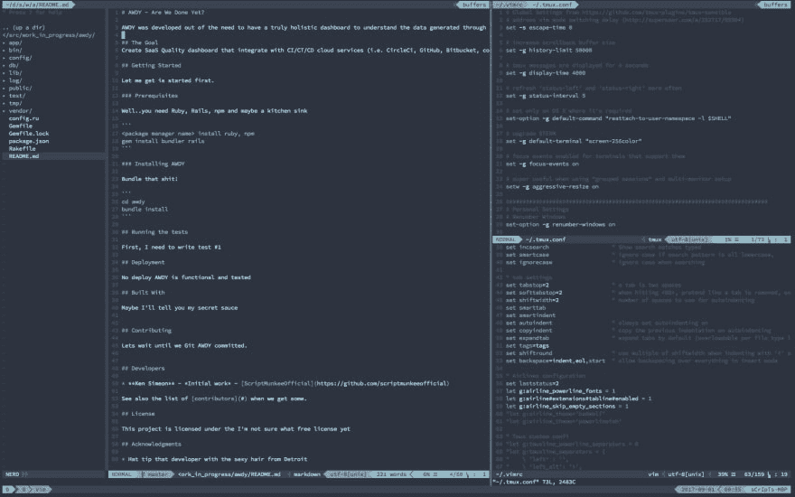
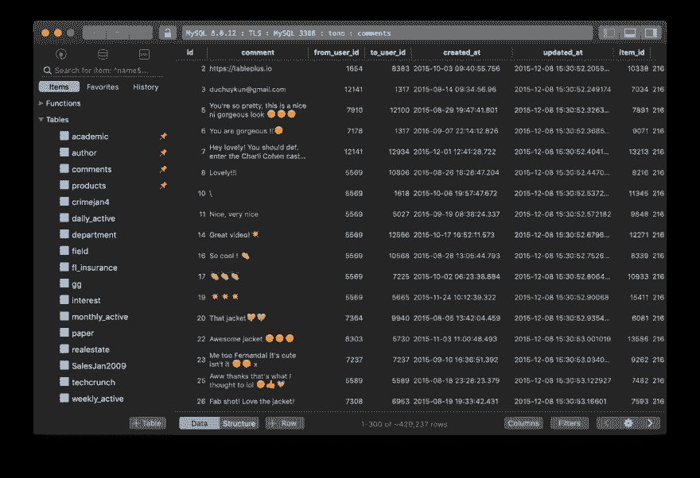
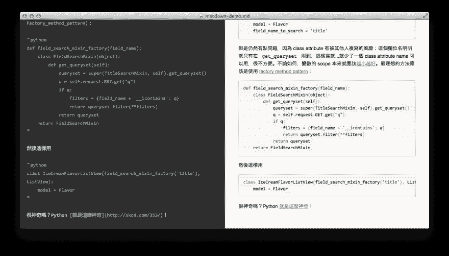
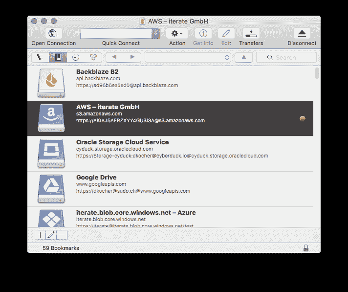
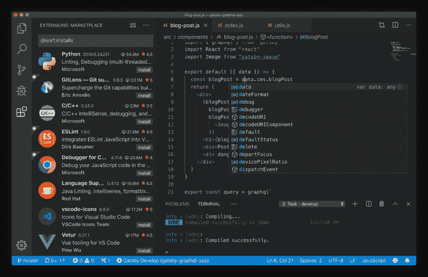
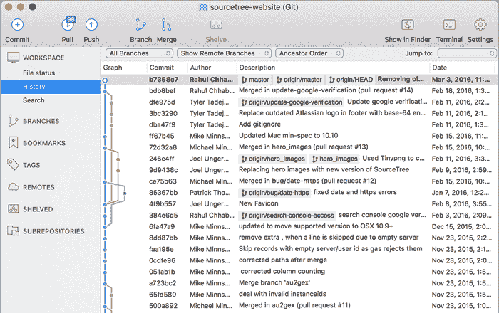
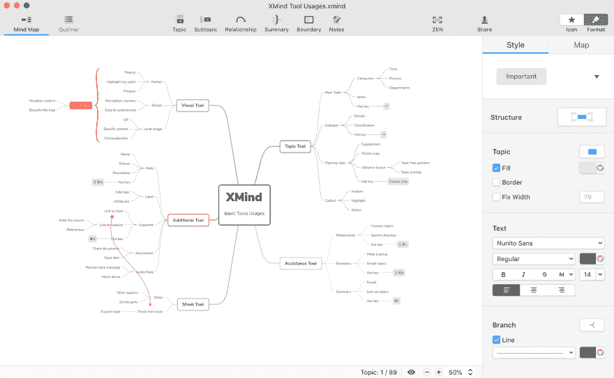
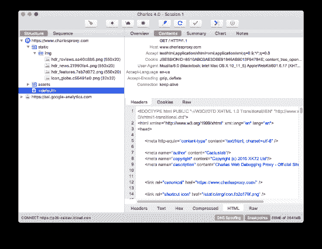
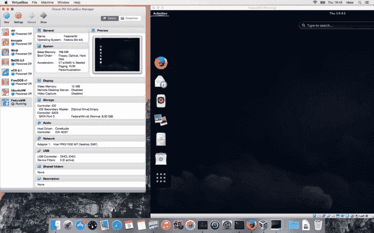

# 我的工具箱里有什么

> 原文：<https://dev.to/scriptmunkee/what-s-in-my-toolbox-n33>

作为一名混合软件开发人员和质量分析人员(QA)[又名质量工程师(QE)]，我使用各种各样的应用程序和工具让自己在 Mac 上的日常活动中保持高效。

# 为终端瘾君子

[iTerm2](https://www.iterm2.com)

*   标准 MacOS 终端的伟大替代品，支持主题化和更多的功能，然后你可以摇一摇棍子。

[Xcode 命令行工具](https://developer.apple.com/download/more/?=command%20line%20tools)

*   这对任何开发人员都是必不可少的。
*   *快速提示*——不要点击链接。只需打开一个终端，输入`git`或`xcode-select --install`或者从 AppStore 安装 Xcode。 [Homewbrew](https://brew.sh)
*   必须安装软件包管理器，这样您就可以获得基本操作系统没有安装的所有基于*nix 的实用程序。

[Tmux](https://github.com/tmux/tmux/wiki)

*   比起内置功能 iTerm2，我更喜欢使用 Tmux 来管理多个终端。
*   Tmux 还允许我使我的配置在*nix 系统之间更加可移植。

[Vim](https://www.vim.og)

*   它包含在每个基于*nix 的系统中。所以知道它比害怕它要好。
*   使用自制软件安装 Vim。MacOS 附带的版本可能已经过时。

# 当你不得不 GUI

麦克维姆

*   没有它我不会离开家！

[黑板加](https://tableplus.com)

*   它把 Sequel Pro 打得落花流水

麦克唐

*   这是一个非常简单的 Markdown 编辑器，包括一个内嵌的浏览器。

[邮递员](https://www.getpostman.com/)

*   当你想测试 API 或编写 API 文档时，这并不容易

[Cyberduck](https://cyberduck.io)

*   不仅仅是一个 FTP 客户端

[VisualStudio 代码](https://code.visualstudio.com/)【当我偷懒的时候】

*   可能是最流行的跨平台编辑器[仅次于 Vim😂] 

[源代码管理](https://www.sourcetreeapp.com/)

*   当 Git 分支变得有点混乱时，我转向 SourceTree 

[Xmind](https://www.xmind.net/)

*   有时候，我不得不直观地描绘出一个工作流程，而 Xmind 正是完成这项工作的合适工具。

# 实用程序

[查尔斯代理](https://www.charlesproxy.com)

*   CP 适用于当您想要查看每个网络通信或操纵您的设备/浏览器和服务器之间的通信时。

[虚拟盒](https://www.virtualbox.org/)

*   如今，虚拟化就是一切。再加上 VirtualBox 与[流浪汉](https://www.vagrantup.com/)和[码头工人](https://www.docker.com/) 配对很好

[咖啡因](http://lightheadsw.com/caffeine/)

*   当我在和某人进行演示或合作时，我最不想担心的就是我的 Mac 进入睡眠状态&锁定。 [宋承宪隧道经理](https://www.tynsoe.org/v2/stm/)

[Chargeberry](https://chargeberry.com/)

*   这只是我的小书呆子电池监视器

就是这样。你呢？你有没有特定的工具或应用是你离不开的？

