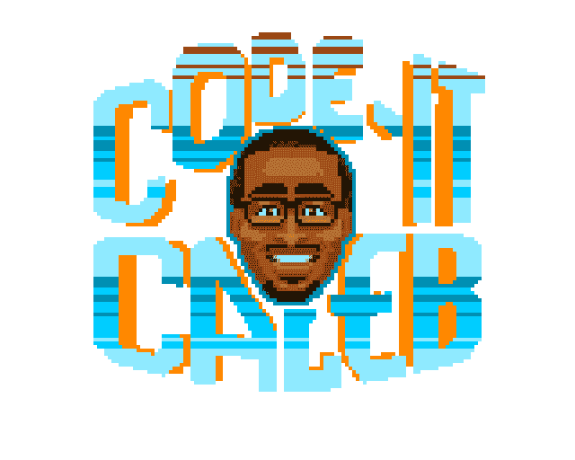

# 谁是“代号凯莱布”？

> 原文:[https://dev.to/codeitcaleb/who-is-code-it-caleb-nmk](https://dev.to/codeitcaleb/who-is-code-it-caleb-nmk)

大家好，我叫凯勒，来自佐治亚州亚特兰大市。我是一名雄心勃勃的全栈 web 和移动应用程序开发人员，最初是自学成才的，但我现在是一个名为 Flatiron School 的编码训练营的学生。2017 年，在观看了克里斯·肖恩(Chris Sean)的 YouTube 视频后，我第一次接触到了编码。他谈到了自己在 3 个月内从一名网站开发人员向职业生涯的转变。我认同他的故事，也很感兴趣。

### 旅程至此

我第一次开始学习 Treehouse，直到今天它仍然是我最喜欢使用的资源之一，我最终开始用 Udemy 上的课程来补充我的学习，随着我对编码的了解越来越多，我爱上了它。

我一直对技术感兴趣，但从未想过把它作为自己的职业道路。我曾经是一名烹饪学生，但最终不得不放弃，因为我一直在处理健康问题，这阻止了我走上这条道路。我知道我想追求的职业是成为我这样有创造力的人，当我发现编码和前端 Web 开发时，我就被吸引住了。它提供了一个解决方案，让我可以将我的创造力、解决问题的能力和对技术的热爱结合到我真正热爱的事情中。

> "找一份你喜欢做的工作，你这辈子就一天都不用工作了。"
> 
> ―马克·吐温

### 如果你是自学的，为什么还要参加训练营？

当我第一次开始学习 HTML 和 CSS 时，它对我来说太容易了，我喜欢它:这是对编码的完美介绍。我不得不发挥我的创造力，并把它们应用到建立网站和为一个我真正喜欢的平台创造东西上，但后来我到了该开始学习 JavaScript 的时候了。那时事情并不容易。

我最终陷入了困境，感觉自己无处寻求答案，也没有人能帮我度过这些挣扎。我差一点就要放弃了，老实说，在我的旅程中，我觉得我不能再孤独下去了，但我讨厌放弃和失败的感觉，尤其是当这是我想做的事情时。

我开始寻找一种方法来克服这个障碍，并最终找到了 Career Karma，一个拥有相同目标的人的社区:学习编码并以此为职业。就在那时，我不再感到孤独和孤立，当我继续了解他们的资源时，我有了参加训练营的想法。能够接触到导师、资源和社区，互相帮助和提升，是我继续学习和朝着我的目标努力所需要的一切。

> “如果你想走得快，就一个人走。想走远，就一起走。”
> 
> -非洲谚语

### **这一切都很好，但谁又是什么迦码呢？**

代码-它迦勒，是一个融合了我所有个人兴趣的给定形式，我的另一个自我，如果你愿意的话。我对动漫、漫画书和视频游戏的热爱(我内心的极客)与作为一名网络开发人员不断增长的技能相结合。

我的一个想法和附带项目是最终基于电影 ***Wreck-It Ralph*** 创建一个编码平台游戏，因此命名为 CODE-IT CALEB。

[T2】](https://res.cloudinary.com/practicaldev/image/fetch/s--K6p1YAxr--/c_limit%2Cf_auto%2Cfl_progressive%2Cq_auto%2Cw_880/https://thepracticaldev.s3.amazonaws.com/i/9g36qc5nn5lz4rc44ltg.png)