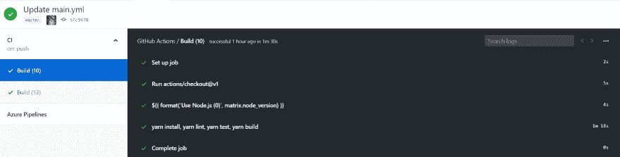

# 第一批 Github 行动

> 原文:[https://dev.to/auvansang/the-first-github-actions-373h](https://dev.to/auvansang/the-first-github-actions-373h)

# [](#1-introduction)1。介绍

[GitHub Actions](https://github.com/features/actions) 借助世界一流的 CI/CD，轻松实现所有软件工作流程的自动化。直接从 GitHub 构建、测试和部署您的代码。按照您想要的方式进行代码审查、分支管理和问题分类。

要获得更多关于 GitHub 动作的细节，你可以查看[关于 Github 动作](https://help.github.com/en/articles/about-github-actions)

# [](#2-lets-start)2。我们开始吧

确保你已经注册了 Github Actions beta 程序，并且收到了来自 Github 的批准邮件，比如“你加入了！GitHub Actions 试用版入门"...

在本教程中，我使用名为 [React Starter Kit](https://github.com/sisa-cafe/react-starter-kit) 的库。

***别再说话了，走吧走吧...*T3】**

### [](#step-1-go-to-your-repository-and-click-on-the-actions-tab)步骤 1:转到您的存储库并单击“Actions”选项卡

### [](#step-2-click-the-button-set-up-a-workflow-yourself)第二步:点击“自己设置工作流程”按钮

您将看到如下所示的模板:

```
name: CI

on: [push]

jobs:
  build:

    runs-on: ubuntu-latest

    steps:
    - uses: actions/checkout@v1
    - name: Run a one-line script
      run: echo Hello, world!
    - name: Run a multi-line script
      run: |
        echo Add other actions to build,
        echo test, and deploy your project. 
```

<svg width="20px" height="20px" viewBox="0 0 24 24" class="highlight-action crayons-icon highlight-action--fullscreen-on"><title>Enter fullscreen mode</title></svg> <svg width="20px" height="20px" viewBox="0 0 24 24" class="highlight-action crayons-icon highlight-action--fullscreen-off"><title>Exit fullscreen mode</title></svg>

### [](#step-3-edit-the-template)第三步:编辑模板

遵循 GitHub 操作
和[的](https://github.com/actions/setup-node)[工作流语法，使用 node.js](https://help.github.com/en/articles/workflow-syntax-for-github-actions) 的特定版本设置您的 GitHub 操作工作流

我编辑我的第一个动作如下:

```
name: CI

on: [push]

jobs:
  build:
    name: Build
    runs-on: ubuntu-18.04
    strategy:
      matrix:
        node_version: [10, 12]

    steps:
    - uses: actions/checkout@v1
    - name: Use Node.js ${{ matrix.node_version }}
      uses: actions/setup-node@v1
      with:
        version: ${{ matrix.node_version }}

    - name: yarn install, yarn lint, yarn test, yarn build
      run: |
        yarn install
        yarn lint
        yarn test
        yarn build 
```

<svg width="20px" height="20px" viewBox="0 0 24 24" class="highlight-action crayons-icon highlight-action--fullscreen-on"><title>Enter fullscreen mode</title></svg> <svg width="20px" height="20px" viewBox="0 0 24 24" class="highlight-action crayons-icon highlight-action--fullscreen-off"><title>Exit fullscreen mode</title></svg>

说明:
在上面的配置中

*   任何分支上的`push`事件都会触发 Github 动作
*   它将使用 Ubuntu 18.04 `runs-on: ubuntu-18.04`
*   它将在两个节点版本上运行两次:`node_version: [10, 12]`
*   它将使用`yarn`而不是`npm`运行
*   它将运行`yarn install`、`yarn lint`、`yarn test`、`yarn build`

更多命令请参考[GitHub 动作的工作流语法](https://help.github.com/en/articles/workflow-syntax-for-github-actions)

### [](#step-4-waiting-and-getting-the-result)第四步:等待并得到结果！

[T2】](https://res.cloudinary.com/practicaldev/image/fetch/s--bwor7vRZ--/c_limit%2Cf_auto%2Cfl_progressive%2Cq_auto%2Cw_880/https://thepracticaldev.s3.amazonaws.com/i/iikbg8pkj2cfzm6bh6mm.PNG)

工作正常！！！

# [](#3-in-conclusion)3。最后

用 Github 动作创建简单的管道是如此容易。它将帮助您构建您的项目，而无需使用任何外部 CI/CD，如 Circle CI 或类似的东西。