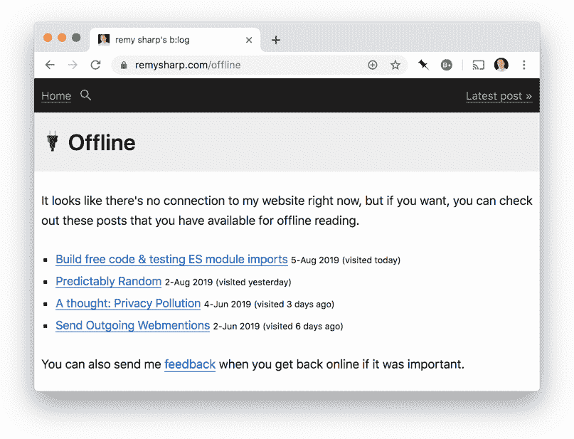

# 离线列表

> 原文:[https://dev.to/remy/offline-listings-12kk](https://dev.to/remy/offline-listings-12kk)

前几周，我终于完全关闭了我的博客。我从杰里米·基思的服务人员的博客中获得了很多灵感。

我想要支持的一个定义特性是，如果你离线并且访问了没有被缓存的页面，我想要列出你最近访问过的博客文章。

## [](#the-effect)大意

如果你是这个博客的常客，那么我的服务人员(最近几周才部署)会将你访问的帖子收集到一个专用的缓存中。如果你试图访问一个没有被缓存的 URL，比如一篇文章或一个像热门文章(等等)这样的页面，你会看到一个页面说这个页面不能离线访问，但是你可以重新访问一个现有的文章:

[T2】](https://res.cloudinary.com/practicaldev/image/fetch/s--ZJUZTk2B--/c_limit%2Cf_auto%2Cfl_progressive%2Cq_auto%2Cw_880/https://remysharp.cimg/offline.png)

在服务人员中，这由下面的 :
行[处理](https://github.com/remy/remysharp.com/blob/4e2d7f2a0710584f1cc5d5bbeca958717406dbe3/public/service-worker.js#L115)

```
self.addEventListener('fetch', event => {
  /* this logic is trimmed down for brevity */

  // only for HTML based requests
  if (request.headers.get('Accept').includes('text/html')) {
    event.respondWith(
      fetch(request) // try the network first method
        .then(response => {
          // if we have a 200 success, cache the result
          // in a cache called "v1/pages"
          if (response.status === 200) {
            caches
              .open('v1/pages')
              .then(cache => cache.put(request, response.clone()));
          }
          return response;
        }).catch(() => {
          // the catch fires if we're offline, so first we try the
          // cache for a match, and if `response` is empty (or null)
          // return the `/offline` page instead.
          return caches
            .match(request)
            .then(response => response || caches.match('/offline'));

        }) // end fetch
    ); // end event.respondWith
    return;
  }
}) 
```

然而，有趣的部分是我们如何检索最近访问过的帖子。

## [](#showing-the-history)显示历史

当我和 Jeremy 聊到他的离线/最近访问的页面时，我意识到由于缓存 API 只用于请求和响应，历史页面所需的元数据(如文章标题)必须存储在其他地方。杰瑞米(IIRC)将他的元数据存储在`localStorage`中。

当我第一次尝试实现时，我使用了 IndexedDB(以及 Jake Archibald 的 [idb keyval 脚本](https://github.com/jakearchibald/idb-keyval/))。然后你访问的每个页面都需要包含这篇文章的元数据，这就增加了问题的复杂性。

直到，我意识到我不需要储存任何东西。作为 API 的 HTML。

我的帖子本身在标记中包含了关于帖子的所有元数据，而不是捕获元数据。下面是没有任何附加存储的逻辑:

1.  获取存储在我的`v1/pages`缓存中的所有条目
2.  从`request.url`获取网址
3.  从`await cache.match(request).then(res => res.text())`获取 HTML
4.  图案匹配出`<title>(.*)</title>`文本
5.  捕捉发布日期——在我的例子中，它是 URL 的一部分，在 Jeremy 的例子中，它是`<time>`标签中的

如果您担心使用正则表达式是不可靠的，那么 HTML 可以放在 DOM 解析器中再次查询。你可以看到这个想法[在这里](https://remy.jsbin.me/twilight-feather-7ef/)(打开浏览器控制台)使用的代码如下:

```
const p = new DOMParser();
const dom = p.parseFromString(html, 'text/html');
console.log(dom.querySelector('time').getAttribute('datetime')); 
```

对于我的离线清单代码，实际代码如下:

```
async function listPages() {
  // since my cache names are versioned, look for the one that
  // includes "/posts"
  const cacheNames = await caches.keys();

  // results is recently visited blog posts
  const results = [];

  for (const name of cacheNames) {
    if (name.includes('/posts')) {
      const cache = await caches.open(name);

      // get a list of all the entries (keys are requests)
      for (const request of await cache.keys()) {
        const url = request.url;

        // this regex gets both the publish date of the post,
        // but also ensures the URL is a blog post
        const match = url.match(/\/(\d{4})\/(\d{2})\/(\d{2})\//);

        if (match) {
          const response = await cache.match(request);

          // capture the plain text HTML
          const body = await response.text();

          // regex for the title of the post
          const title = body.match(/<title>(.*)<\/title>/)[1];
          results.push({
            url,
            response,
            title,
            // published date is from the URL
            published: new Date(match.slice(1).join('-')),
            // last visited is the `date` prop in the response header
            visited: new Date(response.headers.get('date'))
          });
        }
      }
    }
  }

  // now display the results
  if (results.length) {
    // sort the results, map each result to an <li> tag and put
    // in the `ul#offline-posts` element
    document.querySelector('ul#offline-posts').innerHTML = results
      .sort((a, b) => a.published.toJSON() < b.published.toJSON() ? 1 : -1)
      .map(res => {
        // results in:
        // <li><a href="…">[Title] <small>[pubDate] (visited X days ago)</small></a></li>
        let html = `<li><a href="${res.url}">${
          res.title
        }</a> <small class="date">${formatDate(
          res.published
        )} <span title="${res.visited.toString()}">(visited ${daysAgo(
          res.visited
        )})</span></small></li>`;
        return html;
      })
      .join('\n');
  }
} 
```

`/offline`页面将执行一点 JavaScript，从缓存页面中抓取文本，向您显示最近浏览的结果。起初，我觉得这可能需要浏览器做大量的工作，但由于它只在特殊情况下发生，并且实际上只需要几毫秒，因此用户体验的改善值得这个(相对)小的打击。

哦，碰巧的是，*这个*页面现在在你的[最近访问过的](https://remysharp.com/offline)列表中:)

*原载于[雷米夏普的 b:log](https://remysharp.com/2019/09/05/offline-listings)T3】*