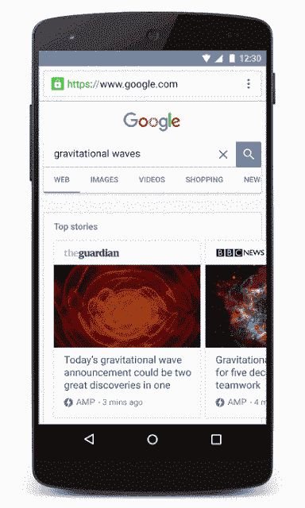

# 什么是 Next.js 以及如何用它来构建 AMP 页面？

> 原文:[https://dev . to/quickly _ react/what-next-js-and-how-you-can-build-a-amp-page-with-it-4g 12](https://dev.to/quickly_react/what-is-next-js-and-how-you-can-build-an-amp-page-with-it-4g12)

[T2】](https://res.cloudinary.com/practicaldev/image/fetch/s--KI74As1d--/c_limit%2Cf_auto%2Cfl_progressive%2Cq_auto%2Cw_880/https://images.unsplash.com/photo-1465829235810-1f912537f253%3Fixlib%3Drb-1.2.1%26ixid%3DeyJhcHBfaWQiOjEyMDd9%26auto%3Dformat%26fit%3Dcrop%26w%3D1351%26q%3D80)

在这篇文章中，我们想看看 React.js 的一个框架，名为 **Next.js** 和**加速移动页面(AMP)** ，以及如何使用 **Next.js** 构建 **AMP** 。你知道 Marvels 官方[网站](https://marvel.com)是建立在 Next.js 上的吗，很酷吧？

## [](#what-is-a-nextjs)什么是 Next.js？

> Next.js 是一个 React.js 框架。

[T2】](https://i.giphy.com/media/8mhh8Ksp30jAimkp1p/source.gif)

*大家:但是，什么是框架，React.js 框架有什么不同？*

框架是构建和部署应用程序的标准方式。换句话说，框架是一套在项目中通用的基本原则。当我们说 React.js 框架时，它是一组用于构建 React.js 应用程序的原则和约定。

每个人:如果我们在没有框架的情况下构建 React.js，为什么要使用框架呢？

1.  你不需要在每次开始一个新项目时都定义这些原则。

2.  框架的设计已经完成，这样你就不需要花很多时间去弄清楚什么是正确的方法，并且可以立即开始。

3.  一致性是关键，尤其是在大型团队中，框架减少了事后猜测，更不用说阅读、维护和开发代码更加容易和快捷。

## [](#how-to-use-nextjs)如何使用 Next.js？

现在我们知道 Next.js 是 React 的一个框架，让我们深入了解一下如何开始:

和`create-react-app`类似的还有一个`Next.js`叫`create-next-app`。

1.  让我们用这个命令开始我们的项目:

```
 npx create-next-app nextjs-prj 
```

<svg width="20px" height="20px" viewBox="0 0 24 24" class="highlight-action crayons-icon highlight-action--fullscreen-on"><title>Enter fullscreen mode</title></svg> <svg width="20px" height="20px" viewBox="0 0 24 24" class="highlight-action crayons-icon highlight-action--fullscreen-off"><title>Exit fullscreen mode</title></svg>

1.  然后我们需要在我们的项目中安装 Next.js

```
 npm install --save next react react-dom 
```

<svg width="20px" height="20px" viewBox="0 0 24 24" class="highlight-action crayons-icon highlight-action--fullscreen-on"><title>Enter fullscreen mode</title></svg> <svg width="20px" height="20px" viewBox="0 0 24 24" class="highlight-action crayons-icon highlight-action--fullscreen-off"><title>Exit fullscreen mode</title></svg>

1.  然后，您可以使用

```
 npx next dev 
```

<svg width="20px" height="20px" viewBox="0 0 24 24" class="highlight-action crayons-icon highlight-action--fullscreen-on"><title>Enter fullscreen mode</title></svg> <svg width="20px" height="20px" viewBox="0 0 24 24" class="highlight-action crayons-icon highlight-action--fullscreen-off"><title>Exit fullscreen mode</title></svg>

1.  在`pages/index.js`中已经有一个现有的欢迎模板，但是我们将替换它以了解正在发生的事情:

```
function Home() {
    return <div > Welcome to Next.js! < /div> }

export default Home 
```

<svg width="20px" height="20px" viewBox="0 0 24 24" class="highlight-action crayons-icon highlight-action--fullscreen-on"><title>Enter fullscreen mode</title></svg> <svg width="20px" height="20px" viewBox="0 0 24 24" class="highlight-action crayons-icon highlight-action--fullscreen-off"><title>Exit fullscreen mode</title></svg>

如果你没有注意到的话，很有趣的是，你不必担心`containers`和声明`routes`就像通常的`React.js`应用一样，因为你可以为 eg 添加`pages`；`pages/home.js`会自动为`/home`增加一条新路线😃。

1.  再来加点 css 吧！

```
function Home() {
  return ( 
    <div> 
      <p>Welcome to Next.js!</p>       <style jsx>{
      `
        p{
          color: white;
          font-size: 50px;
          text-align: center;
        }
      `
      }</style>
      <style global jsx>{
        `
        body {
          background: black;
        }
        `
      }
      </style>
    </div>
  )
}

export default Home 
```

<svg width="20px" height="20px" viewBox="0 0 24 24" class="highlight-action crayons-icon highlight-action--fullscreen-on"><title>Enter fullscreen mode</title></svg> <svg width="20px" height="20px" viewBox="0 0 24 24" class="highlight-action crayons-icon highlight-action--fullscreen-off"><title>Exit fullscreen mode</title></svg>

现在，

[T2】](https://i.giphy.com/media/SqmkZ5IdwzTP2/source.gif)

一些事情可能看起来有点不同寻常。所以我们一个一个来破。

```
 <style jsx>{
      `
        p{
          color: white;
          font-size: 50px;
          text-align: center;
        }
      `
      }
      </style> 
```

<svg width="20px" height="20px" viewBox="0 0 24 24" class="highlight-action crayons-icon highlight-action--fullscreen-on"><title>Enter fullscreen mode</title></svg> <svg width="20px" height="20px" viewBox="0 0 24 24" class="highlight-action crayons-icon highlight-action--fullscreen-off"><title>Exit fullscreen mode</title></svg>

*大家:这是什么风格元素？*

Next.js 与 [styled-jsx](https://github.com/zeit/styled-jsx) 捆绑在一起。风格 JSX 是一个支持 JSX CSS 的包，它允许你用`<style jsx>`为元素写 CSS。

*大家:和内联造型类似吗？*

不完全是，它是在同一个页面中为类和元素编写样式，虽然它看起来像内联样式，但它不是。

*大家:什么是全局道具，为什么要分开？*

全局样式用于设计整个页面的样式。在我们的例子中，我们不使用`body`标签，因为框架已经声明了它，但是如果我们想对`body`元素做任何改变，我们需要`global`属性。

1.  我们可以添加组件吗？

是的，我们可以。Next.js 允许你在`components/`目录下制作组件。

似乎在`components/`中已经有了一个`Nav`元素，所以我们可以重用它。

```
import Nav from '../components/nav' //imported the Nav element from components

function Home() {
  return (
    <div>
      <Nav/>
      <p>Welcome to Next.js</p>
      <a href='/home'>home page</a>
      <style jsx>{
        `
          p {
            color: white;
            font-size: 50px;
            text-align: center;
          }
          a {
            color: purple;
            font-size: 60px;
            text-decoration: none;
          }
        `
      }</style>
      <style global jsx>{
        `
          body {
            background: black;
          }
          `
      }
      </style>
    </div>
  )
}

export default Home 
```

<svg width="20px" height="20px" viewBox="0 0 24 24" class="highlight-action crayons-icon highlight-action--fullscreen-on"><title>Enter fullscreen mode</title></svg> <svg width="20px" height="20px" viewBox="0 0 24 24" class="highlight-action crayons-icon highlight-action--fullscreen-off"><title>Exit fullscreen mode</title></svg>

与大多数 React.js 应用程序相似，我们使用了`components`，在本例中，我们导入并使用了`Nav`元素。

Next.js 就是这么运作的。

*大家:好吧，但是我们已经有 React.js 了为什么还要用 Next.js？*

## [](#why-use-nextjs)为什么要用 Next.js？

在上面的例子中，我们给出了一个 Next.js 如何工作的例子，但是为什么要使用 Next.js 呢？：

1.  从上面的例子来看，路由页面肯定要容易得多。添加到`pages`目录中即可。对于 eg；`pages/home.js`会自动添加一个从`pages/home.js`呈现的页面`/home`。

2.  我们没有讨论的是 Next.js 默认使用服务器端渲染，如果你使用`create-react-app`它目前默认不使用服务器端渲染。

*大家:什么是服务器端渲染，为什么更好？*

网站的服务器端呈现是当你在服务器上托管所有资源的时候。另一种方式是客户端呈现，通过 javascript 请求资源。服务器端呈现通常更适合静态网站，因为你不想请求一个网站然后等待 JS 来呈现 HTML，而是当你请求服务器时你想要 HTML。

1.  Next.js 有模块的延迟加载，也就是说，它有自动代码分割，这使得页面加载更快。

从以上几点来看，似乎 Next.js 可能只用于静态网站，但也可以用于 web apps。

*现在我们已经掌握了 Next.js，让我们试着扩展我们的项目以用作 AMP 页面*

## [](#what-are-amp-pages)什么是 AMP 页？

AMP 页面是加速移动页面。AMP 页面针对移动应用进行了优化，速度较慢的网站跳出率很高，有了 AMP，您可以更快地为访问者提供服务。AMP 据说是谷歌移动搜索索引上的一个信号。如果你用谷歌搜索任何文章或主题，你可以在搜索索引的顶部看到这些 AMP 页面。

[T2】](https://res.cloudinary.com/practicaldev/image/fetch/s--BI2bWOef--/c_limit%2Cf_auto%2Cfl_progressive%2Cq_66%2Cw_880/https://amphtml.files.wordpress.com/2016/02/f0787-amp_v6_phone_cropped-mov.gif)

*大家:AMP 页面和普通网页有什么不同？*

```
<!doctype html>
<html amp lang="en">
  <head>
    <meta charset="utf-8">
    <script async src="https://cdn.ampproject.org/v0.js"></script>
    <title>Hello, AMP pages</title>
    <link rel="canonical" href="https://amp.dev/documentation/guides-and-tutorials/start/create/basic_markup/">
    <meta name="viewport" content="width=device-width,minimum-scale=1,initial-scale=1">
    <script type="application/ld+json">
      {
        "@context": "http://schema.org",
        "@type": "NewsArticle",
        "headline": "Open-source framework for publishing content",
        "datePublished": "2015-10-07T12:02:41Z",
        "image": [
          "logo.jpg"
        ]
      }
    </script>
    <style amp-boilerplate>body{-webkit-animation:-amp-start 8s steps(1,end) 0s 1 normal both;-moz-animation:-amp-start 8s steps(1,end) 0s 1 normal both;-ms-animation:-amp-start 8s steps(1,end) 0s 1 normal both;animation:-amp-start 8s steps(1,end) 0s 1 normal both}@-webkit-keyframes -amp-start{from{visibility:hidden}to{visibility:visible}}@-moz-keyframes -amp-start{from{visibility:hidden}to{visibility:visible}}@-ms-keyframes -amp-start{from{visibility:hidden}to{visibility:visible}}@-o-keyframes -amp-start{from{visibility:hidden}to{visibility:visible}}@keyframes -amp-start{from{visibility:hidden}to{visibility:visible}}</style><noscript><style amp-boilerplate>body{-webkit-animation:none;-moz-animation:none;-ms-animation:none;animation:none}</style></noscript>
  </head>
  <body>
    <h1>Welcome to the mobile web</h1>
  </body>
</html> 
```

<svg width="20px" height="20px" viewBox="0 0 24 24" class="highlight-action crayons-icon highlight-action--fullscreen-on"><title>Enter fullscreen mode</title></svg> <svg width="20px" height="20px" viewBox="0 0 24 24" class="highlight-action crayons-icon highlight-action--fullscreen-off"><title>Exit fullscreen mode</title></svg>

可以在这里查看示例[。](https://amp.dev/documentation/guides-and-tutorials/start/create/basic_markup/?format=websites)

有几个规则可以组成一个页面:

1.  `<html amp>`将页面识别为 AMP 内容。

2.  `<script async src="https://cdn.ampproject.org/v0.js">`需要在`<head>`标签内。

3.  在`<head>`标签中需要一个`<meta name="viewport" content="width=device-width,minimum-scale=1">`标签。

4.  页面需要以`<!doctype html>`开头。

5.  eg 的`<head>`标签中需要有一个到实际页面的链接；`<link rel="canonical" href="*actual page url*">`

6.  `amp-boilerplate` (AMP 样板代码)需要在`<head>`标签中

从我们上面的例子:

```
 <style amp-boilerplate>body{-webkit-animation:-amp-start 8s steps(1,end) 0s 1 normal both;-moz-animation:-amp-start 8s steps(1,end) 0s 1 normal both;-ms-animation:-amp-start 8s steps(1,end) 0s 1 normal both;animation:-amp-start 8s steps(1,end) 0s 1 normal both}@-webkit-keyframes -amp-start{from{visibility:hidden}to{visibility:visible}}@-moz-keyframes -amp-start{from{visibility:hidden}to{visibility:visible}}@-ms-keyframes -amp-start{from{visibility:hidden}to{visibility:visible}}@-o-keyframes -amp-start{from{visibility:hidden}to{visibility:visible}}@keyframes -amp-start{from{visibility:hidden}to{visibility:visible}}</style><noscript><style amp-boilerplate>body{-webkit-animation:none;-moz-animation:none;-ms-animation:none;animation:none}</style></noscript> 
```

<svg width="20px" height="20px" viewBox="0 0 24 24" class="highlight-action crayons-icon highlight-action--fullscreen-on"><title>Enter fullscreen mode</title></svg> <svg width="20px" height="20px" viewBox="0 0 24 24" class="highlight-action crayons-icon highlight-action--fullscreen-off"><title>Exit fullscreen mode</title></svg>

`amp-boilerplate`用于为 AMP 声明 CSS。

## [](#how-to-build-amp-pages-with-nextjs)如何用 Next.js 构建 AMP 页面？

幸运的是，另一个很酷的特性是`Next.js`也支持 AMP😊。

让我们将示例扩展为用作放大器。

*   `pages/index.js`

```
import Nav from '../components/nav'
import { useAmp } from 'next/amp'

export const config = {
  amp: true
}

export default () => {  
  const isAmp = useAmp()
  return (
    <div>
      <Nav/>
      <p>Welcome to Next.js</p>
      <a href={isAmp ? '/home?amp=1' : '/home'}>home page</a>
      <style jsx>{
        `
          p {
            color: white;
            font-size: 50px;
            text-align: center;
          }
          a {
            color: purple;
            font-size: 60px;
            text-decoration: none;
          }
        `
      }</style>
      <style global jsx>{
        `
          body {
            background: black;
          }
          `
      }
      </style>
    </div>
  )
} 
```

<svg width="20px" height="20px" viewBox="0 0 24 24" class="highlight-action crayons-icon highlight-action--fullscreen-on"><title>Enter fullscreen mode</title></svg> <svg width="20px" height="20px" viewBox="0 0 24 24" class="highlight-action crayons-icon highlight-action--fullscreen-off"><title>Exit fullscreen mode</title></svg>

`next/amp`功能中的`useAmp`功能有助于决定是否使用 AMP。

对于我们的索引页面，我们需要明确提到将页面用作 AMP，这是通过`config`完成的。用`config`你可以明确地用`amp: true`来提。

```
 export const config = {
    amp: true
  } 
```

<svg width="20px" height="20px" viewBox="0 0 24 24" class="highlight-action crayons-icon highlight-action--fullscreen-on"><title>Enter fullscreen mode</title></svg> <svg width="20px" height="20px" viewBox="0 0 24 24" class="highlight-action crayons-icon highlight-action--fullscreen-off"><title>Exit fullscreen mode</title></svg>

*   `pages/home.js`

```
import { useAmp } from 'next/amp'

export const config = {
  amp: 'hybrid'
}

export default () => {
  const isAmp = useAmp()
  return (
    <div>
      <p>{isAmp ? 'Not AMP Home Page' : 'Home Page'}</p>
      <style jsx>{
        `
        p {
            color: white;
            font-size: 50px;
            text-align: center;
          }
          a {
            color: blue;
            font-size: 60px;
          }
        `
      }</style>
      <style global jsx>{
        `
        body {
          background: black;
        }
        `
      }
      </style>
    </div>
  )
} 
```

<svg width="20px" height="20px" viewBox="0 0 24 24" class="highlight-action crayons-icon highlight-action--fullscreen-on"><title>Enter fullscreen mode</title></svg> <svg width="20px" height="20px" viewBox="0 0 24 24" class="highlight-action crayons-icon highlight-action--fullscreen-off"><title>Exit fullscreen mode</title></svg>

在我们的`index`页面中，我们明确提到使用 AMP 和`amp: true`，但是在`home`页面中我们使用的是`amp: hybrid`。我们这样做是因为，现在 AMP 需要根据主页(索引页)是否是 AMP 来决定。

如果您也查看`index`页面，您可以在这里看到

```
 <a href={isAmp ? '/home?amp=1' : '/home'}>home page</a> 
```

<svg width="20px" height="20px" viewBox="0 0 24 24" class="highlight-action crayons-icon highlight-action--fullscreen-on"><title>Enter fullscreen mode</title></svg> <svg width="20px" height="20px" viewBox="0 0 24 24" class="highlight-action crayons-icon highlight-action--fullscreen-off"><title>Exit fullscreen mode</title></svg>

如果页面`isAmp`，在参数中我们通过`amp=1`。

酷！我们还将示例扩展为用作放大器。

## [](#conclusion)结论

1.  Next.js 是一个非常酷的 React.js 框架，用于快速构建网站。它有很多有趣的特性，而且从`Next.js`开始比从头开始容易得多。

2.  Next.js 与 styled-jsx 捆绑在一起。Styled-JSX 允许你为页面/组件内部的类和元素编写样式，也可以全局地为`body`和封装元素编写样式。🤘

3.  AMP 页面针对移动应用进行了优化，速度较慢的网站跳出率很高，有了 AMP，您可以更快地为访问者提供服务。

4.  有了 Next.js 为 AMP 提供的支持，构建 AMP 页面变得容易多了。

5.  如果你想检查这个项目，你可以在这里检查我们在[工作的 Next.js 示例，对于 AMP 页面示例，你可以在这里](https://github.com/nishantrpai/nextjs-prj)检查[，在这里](https://github.com/nishantrpai/nextjs-prj/tree/amp-pages)检查官方 Next.js 示例[。](https://github.com/zeit/next.js/tree/canary/examples)

[T2】](https://i.giphy.com/media/7DzlajZNY5D0I/source.gif)

查看我们的官方博客页面:[https://blog.quicklyreact.com/](https://blog.quicklyreact.com/)