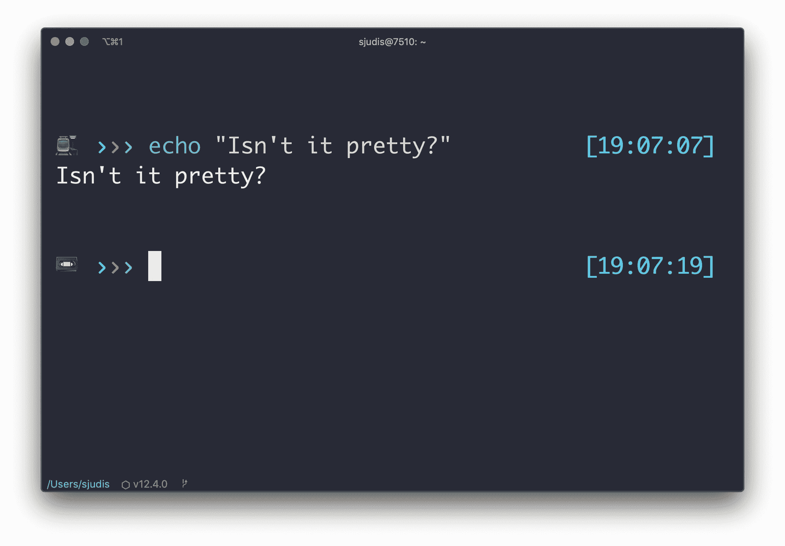

# WebDev Digest 年 8 月

> 原文:[https://dev.to/stefanjudis/webdev-digest-august-2019-njc](https://dev.to/stefanjudis/webdev-digest-august-2019-njc)

大家好！👋

我希望你有一个愉快的夏天，并抓住机会休息一下！当我们现在进入风雨交加的时代，我想送你一些可以边喝甜茶边读的文章。尽情享受吧！

## 你如何在《灯塔行》中达到完美的表演分数

也许你和我一样，在你的网站上运行 Lighthouse 来查看你的网站的评级。对于我的网站，目前是一个`98`性能分数。

虽然这仍然很好，但我总是想知道我需要做些什么才能到达`100`。Lighthouse 给了你很多有帮助的提示，但是没有告诉你它是如何计算分数的。

如果你想知道你需要改进哪些指标，你可以在这个[谷歌表单](https://docs.google.com/spreadsheets/d/1Cxzhy5ecqJCucdf1M0iOzM8mIxNc7mmx107o5nj38Eo/edit#gid=283330180)中找到答案。

## 第一次打开新安装的浏览器会发生什么

你可能会问，你的浏览器与国内的交流有多少？Jonathan Sampson 对不同浏览器(Opera、Vivaldi、Brave、Chrome 和 Firefox)第一次打开时的反应做了有益的研究。很有意思！

## iTerm 得到了一个不错的更新

在过去的几年里，我在超级项目和 T2 项目之间来回切换了几次。我喜欢 Hyper，因为它看起来很棒，可扩展性也很好，但总感觉比 iTerm 慢几毫秒。随着最新的 iTerm 更新，一个简化的外观进入了舞台，你也可以启用一个漂亮的状态栏！

[T2】](//images.ctfassets.net/f20lfrunubsq/7xFh1udKOQr9abKwcSA19I/1418c45d6aabf637cd29f29eea8afd6c/terminal.jpg)

如果你正在使用 Node.js 版本管理器，并且想知道如何在状态栏中显示当前使用的 Node.js 版本，这篇由[尼克·琼斯](https://twitter.com/nickj89)撰写的文章将会帮助你。

## 如何发现自己的未知

“危险的知识比较”在我们的行业中非常普遍。它总是关于我们知道或不知道什么。由[阿龙·基里阿蒂](https://twitter.com/akiriati)撰写的这篇文章是一本很好的读物，它建议如何处理“知道得不够多”的感觉。

## 这个月我学会了

### 如何创建您的自定义 JavaScript repl

我是一个经常在浏览器或 Node.js 控制台中制作原型的人。我了解到你可以用几行代码构建一个定制的 Node.js repl。如果您有一个复杂的 Node.js 应用程序，自定义 repl 会非常有用。您可以设置一个快速运行的入口点，为您提供所有需要的应用程序状态，以便您可以进行原型制作！

### `caption-side`控制表格标题的位置

表格中的`caption`元素在 Web 开发中很少使用。它为您提供了一种标记表格的方法，但是它有一个缺点。规范定义了`caption`必须是[表](https://developer.mozilla.org/en-US/docs/Web/HTML/Element/caption)中的第一个元素。这使得很难设计风格，也很难符合设计要求。

你知道有一个`caption-side` CSS 属性吗？[你可以使用`caption-side`来控制`caption`元素](https://www.stefanjudis.com/today-i-learned/caption-side-controls-the-position-of-a-table-caption/)的位置。如果您要为表格添加标题，此属性可能会很有用。

### 在 Chrome 和 firefox 中选择多个标签页

很短的一个问题——我了解到你可以在 Chrome 和 Firefox 中选择多个标签页。如果您想一次静音或锁定几个选项卡，此功能会非常方便。

## 每月热门话题

几个月前，我参加了 NDC 奥斯陆，并且[“剃光头让我成为一个更好的程序员”](https://www.youtube.com/watch?v=-KwQLrwXl34&list=PL03Lrmd9CiGe9QtFC8LRRqknzpKgcrWpe&index=164)是如此强烈的演讲！ [Alex Qin](https://twitter.com/alexqin) 描述了她在科技行业的历程。这是一个可怕的，情绪化的，令人大开眼界的演讲！

强烈推荐！

## 一报一想

目前，我正在读卡米尔·福涅尔的《经理之路》。这是一本极好的读物，即使你不想成为一名经理。下面这句话让我产生了深刻的共鸣。

> 作为一个内向的人并不是不努力像真正的人一样对待他人的借口。

背景:过多的人际交往后，我会很快感到疲惫，这导致我不是最好的自己。有时候我不得不努力让人们觉得这是他们应得的。

## 一首让你停止编码的歌

我在 YouTube 上发现了 Tash Sultana 的“丛林”...这是一首催眠的歌，客厅的表演简直太棒了！

就这样，朋友们。👋祝九月愉快！