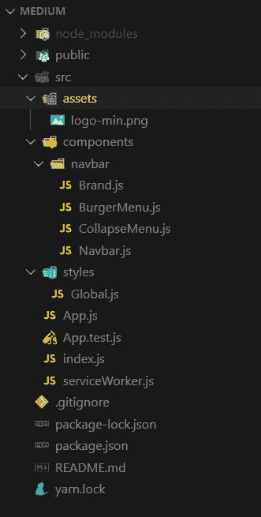

# 你的第一个反应灵敏的动画导航条

> 原文：<https://dev.to/nunocpnp/your-very-first-responsive-and-animated-navigation-bar-with-react-and-react-spring-17co>

在本教程中，你将使用 [React JS](https://reactjs.org/) 构建一个简单的、反应灵敏的动画导航条。你将为 css 使用[样式组件](https://www.styled-components.com/)，为动画使用[反应弹簧](https://www.react-spring.io/)。

*你可以在这里查看这个项目的最终结果。*

Styled components 是一个 CSS-in-JS 样式框架，它使用 JavaScript 中的标记模板文字和 CSS 的强大功能来提供一个平台，允许您编写实际的 CSS 来样式化 react 组件。从本质上说，样式化组件是易于制作的 react 组件，你可以用样式化组件库编写，你可以用 javascript 代码中的普通 CSS 来样式化组件，React-Spring 是一个基于 Spring 物理学的动画库，它应该以一种非常简单的方式覆盖你的大多数 UI 相关的动画需求。

我们开始吧！

我假设你的电脑上安装了**节点**，你可以在你的终端中输入
来检查它

```
node -v 
```

<svg width="20px" height="20px" viewBox="0 0 24 24" class="highlight-action crayons-icon highlight-action--fullscreen-on"><title>Enter fullscreen mode</title></svg> <svg width="20px" height="20px" viewBox="0 0 24 24" class="highlight-action crayons-icon highlight-action--fullscreen-off"><title>Exit fullscreen mode</title></svg>

如果没有请安装最新版本的。

好了，现在都准备好了！您将使用 **create-react-app** 启动一个新项目，因此打开您的终端并键入:

```
npx create-react-app react-navbar 
```

<svg width="20px" height="20px" viewBox="0 0 24 24" class="highlight-action crayons-icon highlight-action--fullscreen-on"><title>Enter fullscreen mode</title></svg> <svg width="20px" height="20px" viewBox="0 0 24 24" class="highlight-action crayons-icon highlight-action--fullscreen-off"><title>Exit fullscreen mode</title></svg>

并添加您在项目期间需要的依赖关系

```
npm install styled-components react-spring 
```

<svg width="20px" height="20px" viewBox="0 0 24 24" class="highlight-action crayons-icon highlight-action--fullscreen-on"><title>Enter fullscreen mode</title></svg> <svg width="20px" height="20px" viewBox="0 0 24 24" class="highlight-action crayons-icon highlight-action--fullscreen-off"><title>Exit fullscreen mode</title></svg>

现在用你最喜欢的代码编辑器打开你新创建的项目，进入 **src** 文件夹，删除 **app.css** 、 **index.css** 和 **logo.svg** 。

打开您的 **index.js** 文件并删除行:

```
import “./index.css” 
```

<svg width="20px" height="20px" viewBox="0 0 24 24" class="highlight-action crayons-icon highlight-action--fullscreen-on"><title>Enter fullscreen mode</title></svg> <svg width="20px" height="20px" viewBox="0 0 24 24" class="highlight-action crayons-icon highlight-action--fullscreen-off"><title>Exit fullscreen mode</title></svg>

同样打开你的 **app.js** ，清理成这样:

```
import React from “react”;

const App = () =>  {
  return(
    <div>

    </div>
  )
}

export default App; 
```

<svg width="20px" height="20px" viewBox="0 0 24 24" class="highlight-action crayons-icon highlight-action--fullscreen-on"><title>Enter fullscreen mode</title></svg> <svg width="20px" height="20px" viewBox="0 0 24 24" class="highlight-action crayons-icon highlight-action--fullscreen-off"><title>Exit fullscreen mode</title></svg>

在你的 **src** 文件夹中创建一个名为 **styles** 的目录，里面有一个 **Global.js** 文件，同时在你的 **src** 文件夹中创建一个 **components** 文件夹，一个名为 **navbar** 的子文件夹，在这个文件夹中创建这些文件: **Brand.js、BurgerMenu.js、CollapseMenu.js 和 Navbar.js** 。

我们还将在 **src** 文件夹中创建一个名为 **assets** 的文件夹，我们将在其中放置一个图像，您可以从[这里](https://github.com/NunoCPNP/medium-youre-first-navbar/blob/master/src/assets/logo-min.png)下载该文件。

您的项目树应该如下所示:

[](https://res.cloudinary.com/practicaldev/image/fetch/s--iQdvuxyV--/c_limit%2Cf_auto%2Cfl_progressive%2Cq_auto%2Cw_880/https://i.imgur.com/Y4DwIyX.jpg)

太好了，这将是你的起点。

首先你要使用样式化组件创建全局样式文件，打开你的 **Global.js** 文件并添加代码:

```
import { createGlobalStyle } from 'styled-components';

const GlobalStyles = createGlobalStyle`

  @import url('https://fonts.googleapis.com/css?family=Montserrat:400,600&display=swap');;

  *,
  *::after,
  *::before {
    margin: 0px;
    padding: 0px;
    box-sizing: inherit;
  }

  html {
    font-size: 62.5%;
  }

  body {
    box-sizing: border-box;
    font-family: 'Montserrat', sans-serif;
  }
`;

export default GlobalStyles; 
```

<svg width="20px" height="20px" viewBox="0 0 24 24" class="highlight-action crayons-icon highlight-action--fullscreen-on"><title>Enter fullscreen mode</title></svg> <svg width="20px" height="20px" viewBox="0 0 24 24" class="highlight-action crayons-icon highlight-action--fullscreen-off"><title>Exit fullscreen mode</title></svg>

现在，您将打开您的 **App.js** 文件，将其重构为一个类组件，添加我们将需要的依赖项，添加 **Global.js** 和 **Navbar.js** 组件以及 Navbar 的状态。

```
import React, { Component } from 'react'
import Navbar from "./components/navbar/Navbar";

import GlobalStyle from './styles/Global';

class App extends Component {
  state = {
    navbarOpen: false
  }

  handleNavbar = () => {
    this.setState({ navbarOpen: !this.state.navbarOpen });
  }

  render() {

    return (
      <>
        <Navbar 
          navbarState={this.state.navbarOpen} 
          handleNavbar={this.handleNavbar}
        />
        <GlobalStyle />
      </>
    )
  }
}

export default App 
```

<svg width="20px" height="20px" viewBox="0 0 24 24" class="highlight-action crayons-icon highlight-action--fullscreen-on"><title>Enter fullscreen mode</title></svg> <svg width="20px" height="20px" viewBox="0 0 24 24" class="highlight-action crayons-icon highlight-action--fullscreen-off"><title>Exit fullscreen mode</title></svg>

很好，在你开始处理 **Navbar.js** 组件之前，你将处理小组件，打开你的 **Brand.js** 并使它看起来像这样:

```
import React from 'react'
import styled from "styled-components";

import logo from "../../assets/logo-min.png";

const Brand = () => {
  return (
    <Image src={logo} alt="Company Logo" />
  )
}

export default Brand

const Image = styled.img`
  height: 85%;
  margin: auto 0;
`; 
```

<svg width="20px" height="20px" viewBox="0 0 24 24" class="highlight-action crayons-icon highlight-action--fullscreen-on"><title>Enter fullscreen mode</title></svg> <svg width="20px" height="20px" viewBox="0 0 24 24" class="highlight-action crayons-icon highlight-action--fullscreen-off"><title>Exit fullscreen mode</title></svg>

现在 **BurgerMenu.js** :

```
import React from 'react';
import styled from "styled-components";

const Burgermenu = (props) => {
  return (
    <Wrapper onClick={props.handleNavbar}>
      <div className={ props.navbarState ? "open" : "" }>
        <span>&nbsp;</span>
        <span>&nbsp;</span>
        <span>&nbsp;</span>
      </div>
    </Wrapper>
  );
}

export default Burgermenu;

const Wrapper = styled.div`
  position: relative;
  padding-top: .7rem;
  cursor: pointer;
  display: block;

  & span {
    background: #fdcb6e;
    display: block;
    position: relative;
    width: 3.5rem;
    height: .4rem;
    margin-bottom: .7rem;
    transition: all ease-in-out 0.2s;
  }

  .open span:nth-child(2) {
      opacity: 0;
    }

  .open span:nth-child(3) {
    transform: rotate(45deg);
    top: -11px;
  }

  .open span:nth-child(1) {
    transform: rotate(-45deg);
    top: 11px;
  }

`; 
```

<svg width="20px" height="20px" viewBox="0 0 24 24" class="highlight-action crayons-icon highlight-action--fullscreen-on"><title>Enter fullscreen mode</title></svg> <svg width="20px" height="20px" viewBox="0 0 24 24" class="highlight-action crayons-icon highlight-action--fullscreen-off"><title>Exit fullscreen mode</title></svg>

很好，现在是最后的组件，首先是 **CollapseMenu.js** :

```
import React from 'react';
import styled from 'styled-components';

import { useSpring, animated } from 'react-spring';

const CollapseMenu = (props) => {
  const { open } = useSpring({ open: props.navbarState ? 0 : 1 });

  if (props.navbarState === true) {
    return (
      <CollapseWrapper style={{
        transform: open.interpolate({
          range: [0, 0.2, 0.3, 1],
          output: [0, -20, 0, -200],
        }).interpolate(openValue => `translate3d(0, ${openValue}px, 0`),
      }}
      >
        <NavLinks>
          <li><a href="/" onClick={props.handleNavbar}>link n1</a></li>
          <li><a href="/" onClick={props.handleNavbar}>link n2</a></li>
          <li><a href="/" onClick={props.handleNavbar}>link n3</a></li>
          <li><a href="/" onClick={props.handleNavbar}>link n4</a></li>
        </NavLinks>
      </CollapseWrapper>
    );
  }
  return null;
};

export default CollapseMenu;

const CollapseWrapper = styled(animated.div)`
  background: #2d3436;
  position: fixed;
  top: 4.5rem;
  left: 0;
  right: 0;
`;

const NavLinks = styled.ul`
  list-style-type: none;
  padding: 2rem 1rem 2rem 2rem;

  & li {
    transition: all 300ms linear 0s;
  }

  & a {
    font-size: 1.4rem;
    line-height: 2;
    color: #dfe6e9;
    text-transform: uppercase;
    text-decoration: none;
    cursor: pointer;

    &:hover {
      color: #fdcb6e;
      border-bottom: 1px solid #fdcb6e;
    }
  }
`; 
```

<svg width="20px" height="20px" viewBox="0 0 24 24" class="highlight-action crayons-icon highlight-action--fullscreen-on"><title>Enter fullscreen mode</title></svg> <svg width="20px" height="20px" viewBox="0 0 24 24" class="highlight-action crayons-icon highlight-action--fullscreen-off"><title>Exit fullscreen mode</title></svg>

最后是**navbar . js**；

```
import React from 'react'
import styled from "styled-components";
import { useSpring, animated, config } from "react-spring";

import Brand from "./Brand";
import BurgerMenu from "./BurgerMenu";
import CollapseMenu from "./CollapseMenu";

const Navbar = (props) => {
  const barAnimation = useSpring({
    from: { transform: 'translate3d(0, -10rem, 0)' },
    transform: 'translate3d(0, 0, 0)',
  });

  const linkAnimation = useSpring({
    from: { transform: 'translate3d(0, 30px, 0)', opacity: 0 },
    to: { transform: 'translate3d(0, 0, 0)', opacity: 1 },
    delay: 800,
    config: config.wobbly,
  });

  return (
    <>
      <NavBar style={barAnimation}>
        <FlexContainer>
          <Brand />
          <NavLinks style={linkAnimation}>
            <a href="/">link n1</a>
            <a href="/">link n2</a>
            <a href="/">link n3</a>
            <a href="/">link n4</a>
          </NavLinks>
          <BurgerWrapper>
            <BurgerMenu
              navbarState={props.navbarState} 
              handleNavbar={props.handleNavbar}
            />
          </BurgerWrapper>
        </FlexContainer>
      </NavBar>
      <CollapseMenu 
        navbarState={props.navbarState} 
        handleNavbar={props.handleNavbar}
      />
   </>
  )
}

export default Navbar

const NavBar = styled(animated.nav)`
  position: fixed;
  width: 100%;
  top: 0;
  left: 0;
  background: #2d3436;
  z-index: 1;
  font-size: 1.4rem;
`;

const FlexContainer = styled.div`
  max-width: 120rem;
  display: flex;
  margin: auto;
  padding: 0 2rem;;
  justify-content: space-between;
  height: 5rem;
`;

const NavLinks = styled(animated.ul)`
  justify-self: end;
  list-style-type: none;
  margin: auto 0;

  & a {
    color: #dfe6e9;
    text-transform: uppercase;
    font-weight: 600;
    border-bottom: 1px solid transparent;
    margin: 0 1.5rem;
    transition: all 300ms linear 0s;
    text-decoration: none;
    cursor: pointer;

    &:hover {
      color: #fdcb6e;
      border-bottom: 1px solid #fdcb6e;
    }

    @media (max-width: 768px) {
      display: none;
    }
  }
`;

const BurgerWrapper = styled.div`
  margin: auto 0;

  @media (min-width: 769px) {
    display: none;
  }
`; 
```

<svg width="20px" height="20px" viewBox="0 0 24 24" class="highlight-action crayons-icon highlight-action--fullscreen-on"><title>Enter fullscreen mode</title></svg> <svg width="20px" height="20px" viewBox="0 0 24 24" class="highlight-action crayons-icon highlight-action--fullscreen-off"><title>Exit fullscreen mode</title></svg>

你完了！

如果你不想写所有这些代码，你可以[派生出我为这个例子做的 github repo](https://github.com/NunoCPNP/medium-youre-first-navbar) 。

*稍后见，了解更多技巧和教程！*