# 构建一个从邮政编码中获取城市名称的服务。网络核心

> 原文：<https://dev.to/pluralsight/building-a-service-to-get-a-city-name-from-a-zip-code-in-net-core-3ld5>

我在寻找对我内容的真实反馈。请评论或在 Twitter 上联系我！T3】

你见过根据你输入的邮政编码来填充城市的下拉列表吗？这是一个小而整洁的用户界面元素，可以方便地使用户输入表单更简单、更快地使用。

## 我们要建造什么

我们将构建一个应用程序，将邮政编码作为输入，并返回该邮政编码的城市信息，如下所示:

[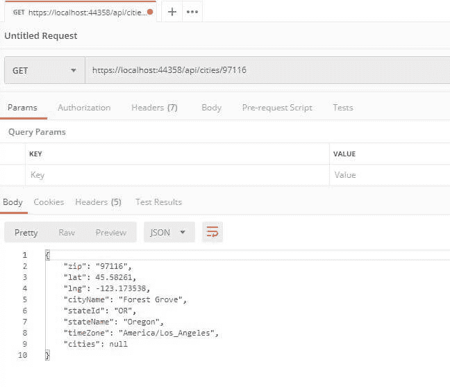](https://res.cloudinary.com/practicaldev/image/fetch/s--pu_Fp6wH--/c_limit%2Cf_auto%2Cfl_progressive%2Cq_auto%2Cw_880/https://thepracticaldev.s3.amazonaws.com/i/1z6xdbphtn8v4fwxjc8j.jpg)

它将是一个. NET 核心 Web API 应用程序，可以用于网页、移动设备等。这是一种微服务，但我不喜欢这样称呼它。这是一个简单的 RESTful 应用程序。

## 入门所需

对于我正在使用的这个教程。网芯 2.2。你需要下载[。NET 核心安装程序从这里开始](http://bit.ly/2lw4t23)。你可以用文本编辑器和 CLI 轻松完成这个项目，但我在本教程中使用了 [Visual Studio](http://bit.ly/2lwzP8K) 来展示它的易用性。

您还应该下载用于将数据导入 SQLite 数据库的 [DB 浏览器](http://bit.ly/2ks648L)。

### 第一步:新建一个项目。

加载 Visual Studio 并创建一个新项目。

[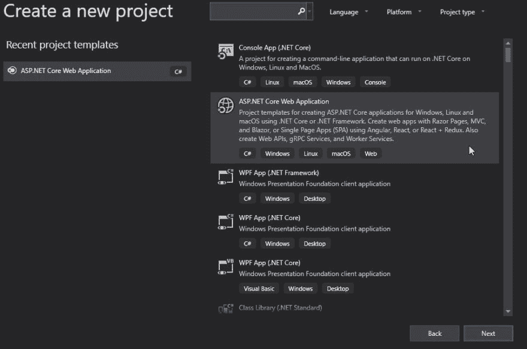](https://res.cloudinary.com/practicaldev/image/fetch/s--MYm-exIQ--/c_limit%2Cf_auto%2Cfl_progressive%2Cq_auto%2Cw_880/https://thepracticaldev.s3.amazonaws.com/i/dvlcm4qtpmp6j1j1imjs.jpg)

选择“ASP。NET Core Web 应用程序”，然后单击下一步。给这个项目起你喜欢的名字。

[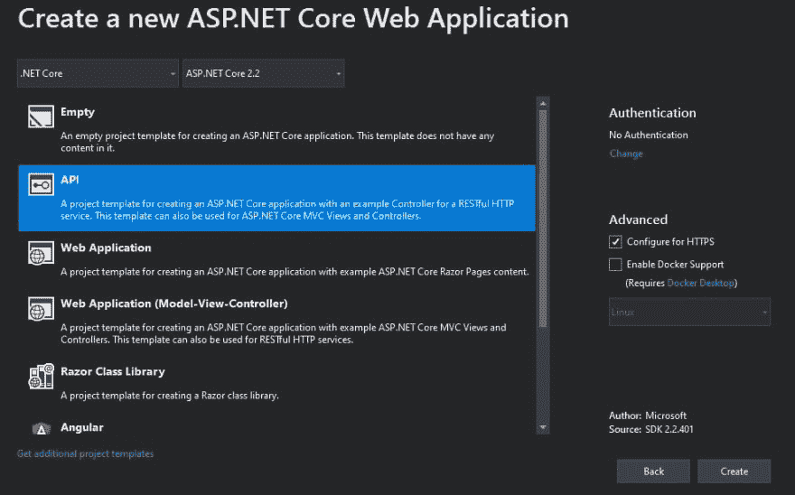](https://res.cloudinary.com/practicaldev/image/fetch/s--QDP6mmkT--/c_limit%2Cf_auto%2Cfl_progressive%2Cq_auto%2Cw_880/https://thepracticaldev.s3.amazonaws.com/i/b0yr5j0y6ektj4drr1oa.jpg)

接下来，您将看到一个类似这样的屏幕。选择“API”并点击“创建”。

[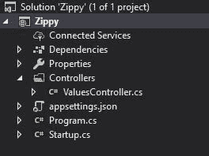](https://res.cloudinary.com/practicaldev/image/fetch/s--p6iCQ4dm--/c_limit%2Cf_auto%2Cfl_progressive%2Cq_auto%2Cw_880/https://thepracticaldev.s3.amazonaws.com/i/tu174ew6ed5xnvfks4b9.jpg)

这将搭建出一个新的 API 应用程序。我们要做的第一件事是删除“值”控制器。

然后，我们将安装一些工具，以便我们可以将 SQLite 和 Entity Framework Core 用于此应用程序:

在命令提示符或软件包管理器控制台中，运行以下命令:

```
dotnet add package Microsoft.EntityFrameworkCore.Sqlite
dotnet add package Microsoft.EntityFrameworkCore.Design 
```

Enter fullscreen mode Exit fullscreen mode

这将增加 SQLite 支持和设计名称空间，其中有一些设计组件可以帮助我们。

我们在这里使用 SQLite 的原因是，我们想要一个没有服务器的自包含数据库，并在所有三个平台上运行。SQLite 很好地满足了这个目的，至少对于像这样的小型数据库是如此。

别忘了恢复项目:

```
dotnet restore 
```

Enter fullscreen mode Exit fullscreen mode

*注意:这里根本不需要 EF 内核。直接访问或使用类似于 [Dapper](http://bit.ly/2k4vXvg) 的东西可能会更快。但为了简单起见，我们使用 EF 核心。*

### 2。创建您的模型

接下来，创建一个名为 models 的文件夹，并创建一个新类。我们的类会是这样的:

```
public class City
{
    [Key]
    public string Zip { get; set; }
    public float Lat { get; set; }
    public float Lng { get; set; }
    public string CityName { get; set; }
    public string StateId { get; set; }
    public string StateName { get; set; }
    public string TimeZone { get; set; }
    public ICollection<City> Cities { get; set; }
} 
```

Enter fullscreen mode Exit fullscreen mode

这个类表示“城市”,这将是我们要使用的数据类型。如您所见，它有邮政编码，我们将在这里使用它作为 ID。它包含城市的纬度/经度、名称、州 id(如或)、州名和时区。

我们将在这里添加一个“城市”集合，并返回一个城市集合。保存文件。

### 3。定义上下文

接下来，我们将为这些城市可以居住的数据库创建一个上下文。在模型中创建一个新类，如下所示:

```
public class CityContext : DbContext
{
    public CityContext(DbContextOptions<CityContext> options) : base(options){ }

    public DbSet<City> Cities { get; set; }

    protected override void OnConfiguring(DbContextOptionsBuilder optionsBuilder)
    {
        optionsBuilder.UseSqlite(@"Data Source=Database/zipcodes.db"); // windows      
    }
} 
```

Enter fullscreen mode Exit fullscreen mode

这是我们将用于实体框架核心的上下文，因此我们可以轻松地操作数据。

这里我们允许在类中注入选项，在配置时我们将使用 optionsbuilder 覆盖它。这是一个将指导上下文使用特定文件的地方，在本例中是 **zipcodes.db** 。这将是托管的数据库，其中包含我们的城市信息。

接下来，打开 **startup.cs** ，在顶部添加下面几行:

```
using Microsoft.EntityFrameworkCore;
using Zippy.Models; 
```

Enter fullscreen mode Exit fullscreen mode

确保第二行是模型名称空间的路径(我的项目名为 Zippy)。

然后在 Configureservices 方法中，我们将再次添加对数据库的引用，并设置 EF 选项以使用 SQLite。

```
 var connection = @"Data Source=Database\zipcodes.db";  // Windows
    services.AddDbContext<CityContext>(options => options.UseSqlite(connection)); 
```

Enter fullscreen mode Exit fullscreen mode

注意注释掉的地方写着“Windows”。如果您想在 Linux 或 OSX 中运行这个应用程序，您需要反转斜线，以便可以在文件系统中找到它:

```
 var connection = @"Data Source=Database/zipcodes.db";  // Linux 
```

Enter fullscreen mode Exit fullscreen mode

现在让我们创建数据库。

### 4。创建我们的数据库

在名为“数据库”的项目中创建一个新文件夹。

打开[数据库浏览器](http://bit.ly/2ks648L)并创建一个新的数据库。

[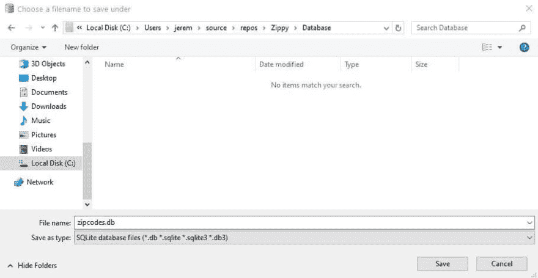](https://res.cloudinary.com/practicaldev/image/fetch/s--r9uEvgMA--/c_limit%2Cf_auto%2Cfl_progressive%2Cq_auto%2Cw_880/https://thepracticaldev.s3.amazonaws.com/i/of2kbafoye22slhqwerk.jpg)

为其创建一个文件名以另存为。此时，您不需要创建任何表或对它做任何其他事情。

### 5。创建迁移

我们的数据库中只有一个表，但是我们想在 EF Core 中为它创建一个迁移。迁移对于跟踪数据库中的历史更改并在需要时帮助恢复数据库非常重要。注意，这里我只讨论模式(布局)信息，而不是存储在其中的数据。

```
dotnet ef migrations add Initial 
```

Enter fullscreen mode Exit fullscreen mode

现在我们有了一个初始的模式设置。让我们更新实体框架核心:

```
dotnet ef database update 
```

Enter fullscreen mode Exit fullscreen mode

现在我们的数据库和表已经创建好了。

### 6。导入数据

这将由来自[简单地图](http://bit.ly/2lCEOEE)的 CSV 数据填充。如果你打算在网站上使用这个，确保给他们一个链接，链接到他们的网站。

现在您的表已经创建，我们将使用从 Simple Maps 下载的 CSV 文件中的数据填充它。对于这个项目，我去掉了一些列，如下所示:

[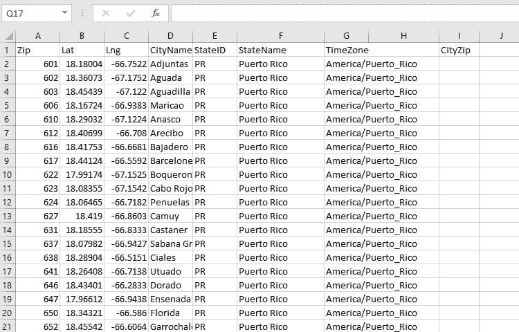](https://res.cloudinary.com/practicaldev/image/fetch/s--lKqwPzf5--/c_limit%2Cf_auto%2Cfl_progressive%2Cq_auto%2Cw_880/https://thepracticaldev.s3.amazonaws.com/i/y5ig2lbpsgql3oxgc2y7.jpg)

正如 [Derek](https://dev.to/dinsmoredesign) 所指出的，您需要在末尾添加一个空白字段，以便与 EF 生成的表中的列相匹配。

现在可以导入了。

从 CSV 文件转到文件->导入->表格:

[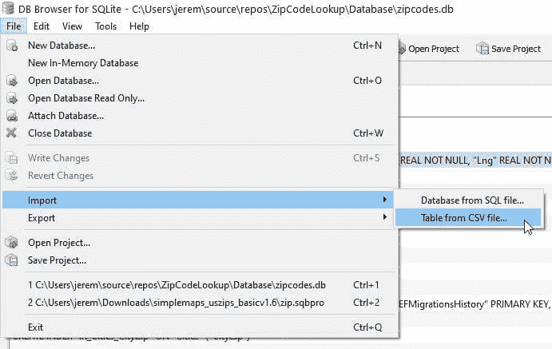](https://res.cloudinary.com/practicaldev/image/fetch/s--dOJkX7VC--/c_limit%2Cf_auto%2Cfl_progressive%2Cq_auto%2Cw_880/https://thepracticaldev.s3.amazonaws.com/i/emz42ombazw0bt4ug7u7.jpg)

加载您之前创建的 CSV 文件。它应该是这样的:

[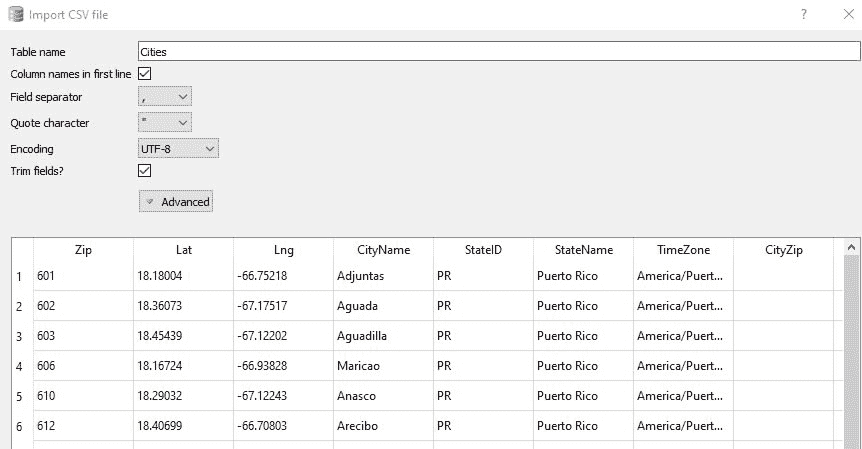](https://res.cloudinary.com/practicaldev/image/fetch/s--fBXRBeNB--/c_limit%2Cf_auto%2Cfl_progressive%2Cq_auto%2Cw_880/https://thepracticaldev.s3.amazonaws.com/i/lb0au1uywv4x92dnxiii.jpg)

并导入文件。您现在应该有一个完全填充的数据库。

[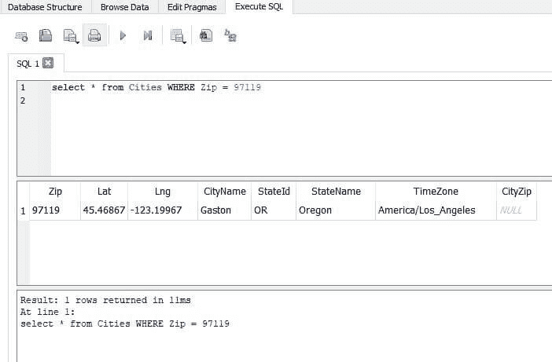](https://res.cloudinary.com/practicaldev/image/fetch/s--llNBbuW_--/c_limit%2Cf_auto%2Cfl_progressive%2Cq_auto%2Cw_880/https://thepracticaldev.s3.amazonaws.com/i/0sysgpo9l59xikf30y7n.jpg)

保存数据库文件。请确定它已设定为与项目一起拷贝。

[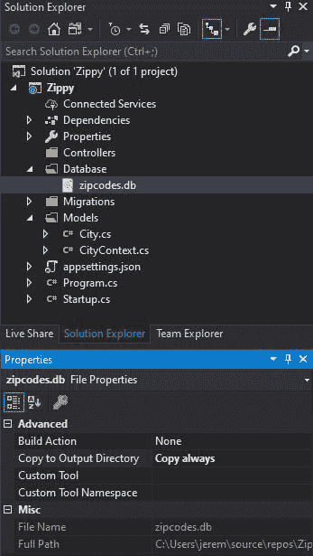](https://res.cloudinary.com/practicaldev/image/fetch/s--x0pxC1h---/c_limit%2Cf_auto%2Cfl_progressive%2Cq_auto%2Cw_880/https://thepracticaldev.s3.amazonaws.com/i/9dh4sbzt40agfvir140l.jpg)

现在让我们的应用程序与它进行交互。

### 7。创建控制器

现在我们需要创建一个城市控制器。这是一个相当简单的过程，但是 Visual Studio 使它变得更加简单。

右击你的控制器文件夹，选择**添加- >控制器**

[](https://res.cloudinary.com/practicaldev/image/fetch/s--6_uV_Am8--/c_limit%2Cf_auto%2Cfl_progressive%2Cq_auto%2Cw_880/https://thepracticaldev.s3.amazonaws.com/i/d4bdhsib1qiiihg01611.jpg)

我们希望使用实体框架选择一个带有动作的 API 控制器

[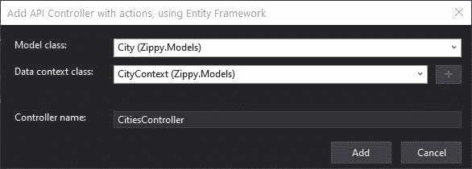](https://res.cloudinary.com/practicaldev/image/fetch/s--z2mshOIn--/c_limit%2Cf_auto%2Cfl_progressive%2Cq_auto%2Cw_880/https://thepracticaldev.s3.amazonaws.com/i/96sqen6wswnqg67py276.jpg)

选择 **City** 作为模型类，选择 **CityContext** 作为数据上下文类并生成。

Visual Studio 将自动生成一组操作来:

*   获取数据库中的城市列表
*   从 ZIP 中获取特定的城市
*   添加城市
*   移除一座城市
*   更新信息

[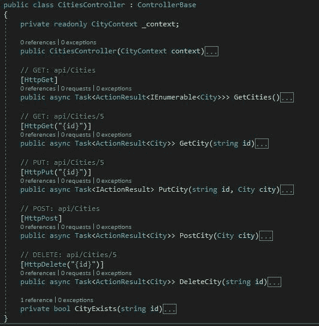](https://res.cloudinary.com/practicaldev/image/fetch/s--sn2byf9e--/c_limit%2Cf_auto%2Cfl_progressive%2Cq_auto%2Cw_880/https://thepracticaldev.s3.amazonaws.com/i/wajrntpkqqqrasynqedh.jpg)

虽然这些东西构建起来很简单，但是把它们全部搭建出来还是不错的。要使这个服务可用，您需要删除修改数据的操作，只保留 GET 功能。

### 8。设置默认路线

最后一步是设置我们的默认路线。打开 **launchSettings.json** ，修改标有“launchUrl”的两行:

改变

```
"launchUrl": "api/values", 
```

Enter fullscreen mode Exit fullscreen mode

至

```
"launchUrl": "api/cities", 
```

Enter fullscreen mode Exit fullscreen mode

保存文件并构建项目。按 F5 启动它。

### 成品

按下 F5 键后，您将看到项目出现在您的 web 浏览器中。

[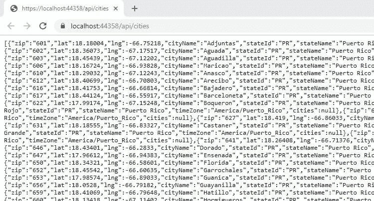](https://res.cloudinary.com/practicaldev/image/fetch/s--anNeKim---/c_limit%2Cf_auto%2Cfl_progressive%2Cq_auto%2Cw_880/https://thepracticaldev.s3.amazonaws.com/i/kucdg2hkgfp1plfol0q2.jpg)

要使该服务正常工作，它必须将邮政编码作为输入，这可以通过将邮政编码附加到 URL 的末尾来轻松完成:

[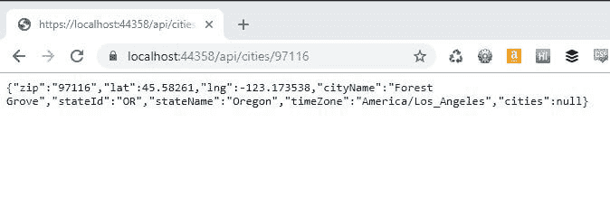](https://res.cloudinary.com/practicaldev/image/fetch/s--4_U4uRTz--/c_limit%2Cf_auto%2Cfl_progressive%2Cq_auto%2Cw_880/https://thepracticaldev.s3.amazonaws.com/i/091emf475ymdfams15b5.jpg)

当格式化为类似于 POSTMan:

[](https://res.cloudinary.com/practicaldev/image/fetch/s--pu_Fp6wH--/c_limit%2Cf_auto%2Cfl_progressive%2Cq_auto%2Cw_880/https://thepracticaldev.s3.amazonaws.com/i/1z6xdbphtn8v4fwxjc8j.jpg)

对于表单中的用户界面，您可以通过多种方式使用该服务。这是一个来自 JavaScript 应用程序或移动应用程序的简单调用。

### 结论

创建简单的微服务和应用程序真的很容易。网芯。他们很快就能组合在一起，跑得又快又瘦。另外，它们可以在任何东西上运行。如果你想了解更多。NET Core 查看一下[这些伟大的课程](http://bit.ly/2Gsr6Mq)或点击[。微软的. NET 核心帮助网站](http://bit.ly/2lE5ZyR)。

在未来的教程中，我将向您展示如何将这个应用程序部署到多个服务器和云环境中。

**注意:这个应用程序使用来自[简单地图](http://bit.ly/2lCEOEE)(免费版本)的数据。如果你打算在你的网站上使用这个，你应该给他们一个链接或者考虑专业版，因为数据会更准确和更新。**

*   杰里米

### 你叫什么。网芯智商？？

[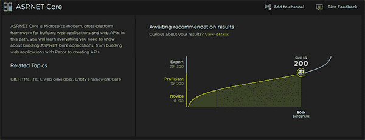](https://res.cloudinary.com/practicaldev/image/fetch/s--fxXFrxDu--/c_limit%2Cf_auto%2Cfl_progressive%2Cq_auto%2Cw_880/https://thepracticaldev.s3.amazonaws.com/i/pv5cvzxdg7qjyxzsfe71.png)

我的 ASP.NET 核心技能智商是 200。不错，你能打败它吗？点击这里试试