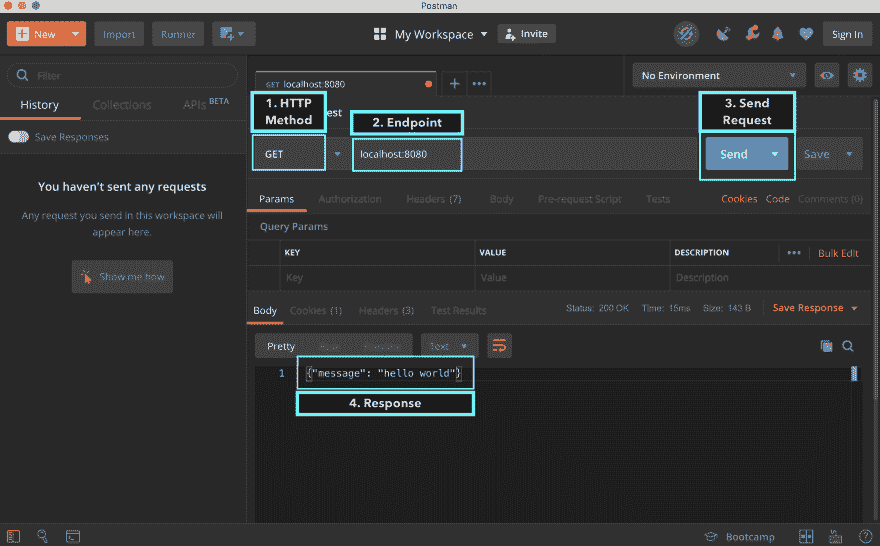
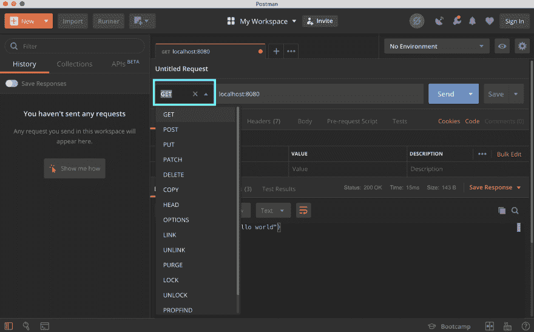

# 用 GO 构建你的第一个 Rest Api

> 原文：<https://dev.to/moficodes/build-your-first-rest-api-with-go-2gcj>

# 用 GO 构建你的第一个 Rest API

本次研讨会分为三个部分。

1.  应用程序接口
2.  Rest API
3.  带 GO 的 Rest API

## API

如果你在电脑前呆的时间够长，你可能听说过这个东西。这个 API 是什么？

API 代表应用程序接口。像计算机科学中的大多数东西一样，缩写没有多大帮助。

它实际上的意思是公开功能而不公开内部。如果你用一种支持编写函数或方法的语言编程(几乎所有的编程语言)，你会完全理解我在说什么。

```
func addNumber(a, b int) int {
    // DO AMAZING MATH HERE
    // and return the result
} 
```

<svg width="20px" height="20px" viewBox="0 0 24 24" class="highlight-action crayons-icon highlight-action--fullscreen-on"><title>Enter fullscreen mode</title></svg> <svg width="20px" height="20px" viewBox="0 0 24 24" class="highlight-action crayons-icon highlight-action--fullscreen-off"><title>Exit fullscreen mode</title></svg>

即使你是超级新手，你也能看出这个函数是关于两个数相加并返回结果的。

对于函数的用户来说，你只需要调用函数，而不必担心函数是如何工作的(不要相信每一个函数)。

这就是 API 的全部。API 可以是您编写的函数，或者是来自某个框架的库或方法的函数，或者是 http 端点。

* * *

## 休息 API

现在编写的大多数 API 都是 web apis。不要引用我的话，因为我没有做任何研究来得到一个合适的数字。😁但是考虑到网络服务和网络应用的数量，我不认为我差得太远。

### 什么是休息

REST 是代表 T2、T4、转移的缩写。它是**分布式超媒体系统**的架构风格，由 Roy Fielding 于 2000 年在其著名的[论文](https://www.ics.uci.edu/~fielding/pubs/dissertation/rest_arch_style.htm)中首次提出。

像任何其他架构风格一样，REST 也有它自己的 [6 指导约束](https://restfulapi.net/rest-architectural-constraints/)，如果一个接口需要被称为 **RESTful** ，那么必须满足这些约束。这些原则列举如下。

### 休息的指导原则

1.  **客户端–服务器**–通过将用户界面问题与数据存储问题分离，我们提高了用户界面在多个平台上的可移植性，并通过简化服务器组件提高了可扩展性。
2.  **无状态**–从客户端到服务器的每个请求必须包含理解请求所需的所有信息，并且不能利用服务器上存储的任何上下文。因此，会话状态完全保存在客户端。
3.  **可缓存**–缓存约束要求对请求的响应中的数据隐式或显式地标记为可缓存或不可缓存。如果一个响应是可缓存的，那么客户机缓存就有权为以后的等价请求重用该响应数据。
4.  **统一接口**——通过将软件工程的通用性原则应用于组件接口，简化了整体系统架构，提高了交互的可视性。为了获得统一的接口，需要多个架构约束来指导组件的行为。REST 由四个接口约束定义:资源的标识；通过表现操纵资源；自我描述的消息；超媒体是应用程序状态的引擎。
5.  **分层系统**–分层系统风格通过约束组件行为，使得每个组件不能“看到”与其交互的直接层之外，从而允许架构由分层的层组成。
6.  **按需编码(可选)**–REST 允许通过下载和执行 applets 或脚本形式的代码来扩展客户端功能。这通过减少需要预先实现的功能数量来简化客户端。

要查看我们可以使用的 REST API 的示例

### HTTP 动词

这些是 HTTP apis 遵循的一些约定。这些实际上不是 Rest 规范的一部分。但是我们需要了解这些才能充分利用 Rest API。

HTTP 定义了一组**请求方法**,以指示对给定资源要执行的期望动作。虽然它们也可以是名词，但是这些请求方法有时被称为 *HTTP 动词*。它们中的每一个都实现了不同的语义，但是它们之间有一些共同的特性:例如，一个请求方法可以是[安全的](https://developer.mozilla.org/en-US/docs/Glossary/safe)、[幂等的](https://developer.mozilla.org/en-US/docs/Glossary/idempotent)，或者[可缓存的](https://developer.mozilla.org/en-US/docs/Glossary/cacheable)。

[`GET`](https://developer.mozilla.org/en-US/docs/Web/HTTP/Methods/GET)`GET`方法请求指定资源的表示。使用`GET`的请求应该只检索数据。

[`HEAD`](https://developer.mozilla.org/en-US/docs/Web/HTTP/Methods/HEAD)`HEAD`方法要求与`GET`请求相同的响应，但是没有响应体。

[`POST`](https://developer.mozilla.org/en-US/docs/Web/HTTP/Methods/POST)`POST`方法用于将实体提交给指定的资源，通常会导致服务器上的状态变化或副作用。

[`PUT`](https://developer.mozilla.org/en-US/docs/Web/HTTP/Methods/PUT)`PUT`方法用请求负载替换目标资源的所有当前表示。

[`DELETE`](https://developer.mozilla.org/en-US/docs/Web/HTTP/Methods/DELETE)`DELETE`方法删除指定的资源。

[`CONNECT`](https://developer.mozilla.org/en-US/docs/Web/HTTP/Methods/CONNECT)`CONNECT`方法建立到由目标资源识别的服务器的隧道。

[`OPTIONS`](https://developer.mozilla.org/en-US/docs/Web/HTTP/Methods/OPTIONS)`OPTIONS`方法用于描述目标资源的通信选项。

[`TRACE`](https://developer.mozilla.org/en-US/docs/Web/HTTP/Methods/TRACE)`TRACE`方法沿着到目标资源的路径执行消息环回测试。

[`PATCH`](https://developer.mozilla.org/en-US/docs/Web/HTTP/Methods/PATCH)`PATCH`方法用于对资源进行部分修改。

这些都是谎言。

### 状态码

**1xx 信息**

*   [100 继续](https://httpstatuses.com/100)
*   [101 交换协议](https://httpstatuses.com/101)
*   [102 处理](https://httpstatuses.com/102)

**2xx 成功**

*   [200 OK](https://httpstatuses.com/200)
*   [201 创建了](https://httpstatuses.com/201)
*   [202 已接受](https://httpstatuses.com/202)
*   [203 非权威信息](https://httpstatuses.com/203)
*   [204 无内容](https://httpstatuses.com/204)
*   [205 重置内容](https://httpstatuses.com/205)
*   [206 分部分项内容](https://httpstatuses.com/206)
*   [207 多状态](https://httpstatuses.com/207)
*   [208 已经上报](https://httpstatuses.com/208)
*   [226 IM 已用](https://httpstatuses.com/226)

**3xx 重定向**

*   [300 多项选择](https://httpstatuses.com/300)
*   [301 永久移动](https://httpstatuses.com/301)
*   [302 发现](https://httpstatuses.com/302)
*   [303 参见其他](https://httpstatuses.com/303)
*   [304 未修改](https://httpstatuses.com/304)
*   [305 使用代理](https://httpstatuses.com/305)
*   [307 临时重定向](https://httpstatuses.com/307)
*   [308 永久重定向](https://httpstatuses.com/308)

**4xx 客户端错误**

*   [400 错误请求](https://httpstatuses.com/400)
*   [401 未经授权](https://httpstatuses.com/401)
*   [402 要求付款](https://httpstatuses.com/402)
*   [403 禁止](https://httpstatuses.com/403)
*   [404 未找到](https://httpstatuses.com/404)
*   [405 不允许的方法](https://httpstatuses.com/405)
*   [406 不可接受](https://httpstatuses.com/406)
*   [407 需要代理认证](https://httpstatuses.com/407)
*   [408 请求超时](https://httpstatuses.com/408)
*   [409 冲突](https://httpstatuses.com/409)
*   [410 走了](https://httpstatuses.com/410)
*   [411 所需长度](https://httpstatuses.com/411)
*   [412 前置条件失败](https://httpstatuses.com/412)
*   [413 有效负载过大](https://httpstatuses.com/413)
*   [414 请求——URI 太久](https://httpstatuses.com/414)
*   [415 不支持的媒体类型](https://httpstatuses.com/415)
*   [416 请求的范围不可满足](https://httpstatuses.com/416)
*   [417 期望失败](https://httpstatuses.com/417)
*   418 我是茶壶
*   [421 错误的请求](https://httpstatuses.com/421)
*   [422 不可处理实体](https://httpstatuses.com/422)
*   [423 锁定](https://httpstatuses.com/423)
*   [424 失败依赖](https://httpstatuses.com/424)
*   [426 需要升级](https://httpstatuses.com/426)
*   [428 需要的前提条件](https://httpstatuses.com/428)
*   [429 太多的请求](https://httpstatuses.com/429)
*   [431 请求标题字段太大](https://httpstatuses.com/431)
*   [444 连接关闭，无响应](https://httpstatuses.com/444)
*   [451 因法律原因不可用](https://httpstatuses.com/451)
*   [499 客户端关闭请求](https://httpstatuses.com/499)

**5xx 服务器错误**

*   [500 内部服务器错误](https://httpstatuses.com/500)
*   [501 未实施](https://httpstatuses.com/501)
*   [502 坏网关](https://httpstatuses.com/502)
*   [503 服务不可用](https://httpstatuses.com/503)
*   [504 网关超时](https://httpstatuses.com/504)
*   [不支持 505 HTTP 版本](https://httpstatuses.com/505)
*   [506 变型也协商](https://httpstatuses.com/506)
*   [507 存储不足](https://httpstatuses.com/507)
*   [检测到 508 回路](https://httpstatuses.com/508)
*   [510 未延长](https://httpstatuses.com/510)
*   [511 需要网络认证](https://httpstatuses.com/511)
*   [599 网络连接超时错误](https://httpstatuses.com/599)

这也没有实际意义。

### 术语

以下是与 REST APIs 相关的最重要的术语

*   **资源**是一个对象或某物的表示，它有一些与之相关的数据，可以有一组方法对其进行操作。例如动物、学校和员工都是资源，*删除、添加、更新*是对这些资源进行的操作。
*   **集合**是资源的集合，例如*公司*是*公司*资源的集合。
*   **URL** (统一**资源**定位器)是一个路径，通过它可以定位**资源**并对其执行一些操作。

### API 端点

这就是 API 端点的样子。

```
https://www.github.com/golang/go/search?q=http&type=Commits 
```

<svg width="20px" height="20px" viewBox="0 0 24 24" class="highlight-action crayons-icon highlight-action--fullscreen-on"><title>Enter fullscreen mode</title></svg> <svg width="20px" height="20px" viewBox="0 0 24 24" class="highlight-action crayons-icon highlight-action--fullscreen-off"><title>Exit fullscreen mode</title></svg>

这个 URL 可以分成以下几个部分

| **协议** | 子整环 | **域** | **路径** | 港口 | **查询** |
| --- | --- | --- | --- | --- | --- |
| *http/https* | 子整环 | 基础 url | *资源/其他资源* | 一些港口 | *键值对* |
| https | 万维网 | github.com | golang/go/搜索 | Eighty | ？q = http & type =提交 |

#### 协议

浏览器或客户端应该如何与服务器通信。

#### 子域

主域的子划分

#### 域

在互联网上识别网站的唯一参考

#### 端口

运行应用程序的服务器上的端口。默认为 80。所以大多数情况下我们看不到它

#### 路径

Rest API 中的路径参数代表资源。

```
https://jsonplaceholder.typicode.com/posts/1/comments 
```

<svg width="20px" height="20px" viewBox="0 0 24 24" class="highlight-action crayons-icon highlight-action--fullscreen-on"><title>Enter fullscreen mode</title></svg> <svg width="20px" height="20px" viewBox="0 0 24 24" class="highlight-action crayons-icon highlight-action--fullscreen-off"><title>Exit fullscreen mode</title></svg>

`posts/1/comments`

这条路径代表的是`1st` `posts`资源 c `comments`

基本结构是

```
top-level-resource/<some-identifier>/secondary-resource/<some-identifier>/... 
```

<svg width="20px" height="20px" viewBox="0 0 24 24" class="highlight-action crayons-icon highlight-action--fullscreen-on"><title>Enter fullscreen mode</title></svg> <svg width="20px" height="20px" viewBox="0 0 24 24" class="highlight-action crayons-icon highlight-action--fullscreen-off"><title>Exit fullscreen mode</title></svg>

#### 查询

查询是信息的键值对，主要用于过滤目的。

```
https://jsonplaceholder.typicode.com/posts?userId=1 
```

<svg width="20px" height="20px" viewBox="0 0 24 24" class="highlight-action crayons-icon highlight-action--fullscreen-on"><title>Enter fullscreen mode</title></svg> <svg width="20px" height="20px" viewBox="0 0 24 24" class="highlight-action crayons-icon highlight-action--fullscreen-off"><title>Exit fullscreen mode</title></svg>

`?`后的部分是查询参数。我们只有一个问题。`userId=1`

#### 标题

这不是 URL 本身的一部分，但标头是由客户端或服务器发送的网络组件的一部分。根据是谁发的。有两种标题

1.  请求头(客户端->服务器)
2.  响应头(服务器->客户端)

#### 正文

您可以向服务器的请求和服务器的响应添加额外的信息。

### 响应类型

通常是 JSON 或者 XML。

现在主要是 JSON。

* * *

## Rest API 带 GO

这就是你在这里的原因。或者我希望这就是你在这里的原因。

[服务于软件工程的语言设计](https://talks.golang.org/2012/splash.article)

上面这篇文章是 2012 年出的。但仍然与学习围棋背后的意识形态密切相关。

如果你正在编写 Rest API，为什么要选择 go？

1.  是编的。所以你会得到小的二进制文件。
2.  它很快。(比 c/c++或 rust 慢)但比大多数其他 web 编程语言快。
3.  很容易理解。
4.  这在微服务领域非常有效，原因一。

### net/http

go 中的标准库附带了`net/http`包，这是构建 RestAPIs 的绝佳起点。并且大多数其他库增加了一些额外的特性，也可以与 net/http 包互操作，所以理解 net/http 包对于使用 golang for RestAPIs 是至关重要的。

[net/http](https://golang.org/pkg/net/http)

我们可能不需要知道 net/http 包中的所有内容。但是，开始之前，我们应该知道一些事情。

### 处理程序接口

我从来都不是记忆什么东西的提议者，但正如托德·麦克劳德在他的课程中反复提到的那样。我们需要记住处理程序接口。

```
type Handler interface {
        ServeHTTP(ResponseWriter, *Request)
} 
```

<svg width="20px" height="20px" viewBox="0 0 24 24" class="highlight-action crayons-icon highlight-action--fullscreen-on"><title>Enter fullscreen mode</title></svg> <svg width="20px" height="20px" viewBox="0 0 24 24" class="highlight-action crayons-icon highlight-action--fullscreen-off"><title>Exit fullscreen mode</title></svg>

这就是了。

它有一个方法并且只有一个方法。

如果一个结构或对象有一个方法`ServeHTTP`，它采用`ResponseWriter`和指向`Request`的指针，那么它将是处理程序。

根据我们所有的知识，现在我们已经准备好做一些破坏了。

# 我们开始吧

我想现在我们可以开始了。

那是一大堆理论。我答应你会建你的第一个餐馆。

## 简单 Rest API

所以让我们直接开始吧。

在你想写 go 代码的文件夹里

```
go mod init api-test 
```

<svg width="20px" height="20px" viewBox="0 0 24 24" class="highlight-action crayons-icon highlight-action--fullscreen-on"><title>Enter fullscreen mode</title></svg> <svg width="20px" height="20px" viewBox="0 0 24 24" class="highlight-action crayons-icon highlight-action--fullscreen-off"><title>Exit fullscreen mode</title></svg>

创建一个新文件，你可以随意命名。

我叫我的`main.go`

```
package main

import (
    "log"
    "net/http"
)

type server struct{}

func (s *server) ServeHTTP(w http.ResponseWriter, r *http.Request) {
    w.Header().Set("Content-Type", "application/json")
        w.WriteHeader(http.StatusOK)
    w.Write([]byte(`{"message": "hello world"}`))
}

func main() {
    s := &server{}
    http.Handle("/", s)
    log.Fatal(http.ListenAndServe(":8080", nil))
} 
```

<svg width="20px" height="20px" viewBox="0 0 24 24" class="highlight-action crayons-icon highlight-action--fullscreen-on"><title>Enter fullscreen mode</title></svg> <svg width="20px" height="20px" viewBox="0 0 24 24" class="highlight-action crayons-icon highlight-action--fullscreen-off"><title>Exit fullscreen mode</title></svg>

让我们分解这段代码。

在顶部，我们有我们的`package main`所有去执行需要一个主包。

我们有进口货。`log`用于记录发生的错误。`net/http`因为我们写的是 rest api。

然后我们有一个叫做服务器的结构。它没有字段。我们将向这个服务器`ServeHTTP`添加一个方法，这将满足处理程序接口。在 go 中你会注意到一件事，我们不需要明确地说出我们正在实现的接口。编译器足够聪明，能够理解这一点。在`ServeHTTP`方法中，我们设置 httpStatus 200 来表示请求成功。我们将内容类型传递给`application/json`,这样当我们将 json 作为有效载荷发送回来时，客户端就明白了。最后我们写

```
{"message": "hello world"} 
```

<svg width="20px" height="20px" viewBox="0 0 24 24" class="highlight-action crayons-icon highlight-action--fullscreen-on"><title>Enter fullscreen mode</title></svg> <svg width="20px" height="20px" viewBox="0 0 24 24" class="highlight-action crayons-icon highlight-action--fullscreen-off"><title>Exit fullscreen mode</title></svg>

的回应。

让我们运行我们的服务器

```
go run main.go 
```

<svg width="20px" height="20px" viewBox="0 0 24 24" class="highlight-action crayons-icon highlight-action--fullscreen-on"><title>Enter fullscreen mode</title></svg> <svg width="20px" height="20px" viewBox="0 0 24 24" class="highlight-action crayons-icon highlight-action--fullscreen-off"><title>Exit fullscreen mode</title></svg>

如果你之前已经安装了 postman，让我们用 postman 快速测试一下我们的应用程序。

[](https://res.cloudinary.com/practicaldev/image/fetch/s--Db0MgchP--/c_limit%2Cf_auto%2Cfl_progressive%2Cq_auto%2Cw_880/https://raw.githubusercontent.com/moficodes/rest-api-with-go/master/gitbook/.gitbook/assets/screen-shot-2019-08-21-at-1.04.26-pm.png)

Get 返回我们的消息。

干得好！

但是等等。

让我们看看我们的应用程序还支持哪些 HTTP 动词。

在 postman 中，我们可以改变请求的类型。单击下拉菜单并选择其他内容。假设我们发布了。

[](https://res.cloudinary.com/practicaldev/image/fetch/s--qEExIukE--/c_limit%2Cf_auto%2Cfl_progressive%2Cq_auto%2Cw_880/https://raw.githubusercontent.com/moficodes/rest-api-with-go/master/gitbook/.gitbook/assets/screen-shot-2019-08-21-at-1.11.56-pm.png)

现在，如果我们运行请求，我们会得到相同的结果。

这本身并不是一个真正的错误。但是在大多数情况下，我们可能希望根据请求类型做不同的事情。

让我们看看如何做到这一点。

我们将用下面的代码修改我们的 ServeHTTP 方法。

```
func (s *server) ServeHTTP(w http.ResponseWriter, r *http.Request) {
    w.Header().Set("Content-Type", "application/json")
    switch r.Method {
    case "GET":
        w.WriteHeader(http.StatusOK)
        w.Write([]byte(`{"message": "get called"}`))
    case "POST":
        w.WriteHeader(http.StatusCreated)
        w.Write([]byte(`{"message": "post called"}`))
    case "PUT":
        w.WriteHeader(http.StatusAccepted)
        w.Write([]byte(`{"message": "put called"}`))
    case "DELETE":
        w.WriteHeader(http.StatusOK)
        w.Write([]byte(`{"message": "delete called"}`))
    default:
        w.WriteHeader(http.StatusNotFound)
        w.Write([]byte(`{"message": "not found"}`))
    }
} 
```

<svg width="20px" height="20px" viewBox="0 0 24 24" class="highlight-action crayons-icon highlight-action--fullscreen-on"><title>Enter fullscreen mode</title></svg> <svg width="20px" height="20px" viewBox="0 0 24 24" class="highlight-action crayons-icon highlight-action--fullscreen-off"><title>Exit fullscreen mode</title></svg>

如果我们的服务器已经在运行，让我们用`ctrl-c`停止它

再运行一次。

```
go run main.go 
```

<svg width="20px" height="20px" viewBox="0 0 24 24" class="highlight-action crayons-icon highlight-action--fullscreen-on"><title>Enter fullscreen mode</title></svg> <svg width="20px" height="20px" viewBox="0 0 24 24" class="highlight-action crayons-icon highlight-action--fullscreen-off"><title>Exit fullscreen mode</title></svg>

再用 postman 或者 curl 测试一下。

你可能已经注意到了一件事，我们正在使用我们的服务器结构来将一个方法附加到。

go 团队知道这是不方便的，并给了我们 http 包中的一个方法，允许我们传递一个函数，该函数具有与 T1 相同的签名，并可以服务于一条路线。

我们可以用这个
稍微清理一下我们的代码

```
package main

import (
    "log"
    "net/http"
)

func home(w http.ResponseWriter, r *http.Request) {
    w.Header().Set("Content-Type", "application/json")
    switch r.Method {
    case "GET":
        w.WriteHeader(http.StatusOK)
        w.Write([]byte(`{"message": "get called"}`))
    case "POST":
        w.WriteHeader(http.StatusCreated)
        w.Write([]byte(`{"message": "post called"}`))
    case "PUT":
        w.WriteHeader(http.StatusAccepted)
        w.Write([]byte(`{"message": "put called"}`))
    case "DELETE":
        w.WriteHeader(http.StatusOK)
        w.Write([]byte(`{"message": "delete called"}`))
    default:
        w.WriteHeader(http.StatusNotFound)
        w.Write([]byte(`{"message": "not found"}`))
    }
}

func main() {
    http.HandleFunc("/", home)
    log.Fatal(http.ListenAndServe(":8080", nil))
} 
```

<svg width="20px" height="20px" viewBox="0 0 24 24" class="highlight-action crayons-icon highlight-action--fullscreen-on"><title>Enter fullscreen mode</title></svg> <svg width="20px" height="20px" viewBox="0 0 24 24" class="highlight-action crayons-icon highlight-action--fullscreen-off"><title>Exit fullscreen mode</title></svg>

功能应该完全相同。

## 大猩猩 Mux

`net/http`内置方法很棒。我们可以编写一个没有外部库的服务器。但是`net/http`有它的局限性。没有直接处理路径参数的方法。就像请求方法一样，我们必须手动处理路径和查询参数。

Gorilla Mux 是一个非常受欢迎的库，它非常适合 net/http 包，并帮助我们做了一些事情，使 api 构建变得轻而易举。

### 使用 Gorilla Mux

要安装一个模块，我们可以使用`go get`

去引擎盖下取用 git。

在同一个文件夹中，你有你的`go.mod`和`main.go`文件运行

```
go get github.com/gorilla/mux 
```

<svg width="20px" height="20px" viewBox="0 0 24 24" class="highlight-action crayons-icon highlight-action--fullscreen-on"><title>Enter fullscreen mode</title></svg> <svg width="20px" height="20px" viewBox="0 0 24 24" class="highlight-action crayons-icon highlight-action--fullscreen-off"><title>Exit fullscreen mode</title></svg>

我们把代码改成这个

```
package main

import (
    "log"
    "net/http"

    "github.com/gorilla/mux"
)

func home(w http.ResponseWriter, r *http.Request) {
    w.Header().Set("Content-Type", "application/json")
    switch r.Method {
    case "GET":
        w.WriteHeader(http.StatusOK)
        w.Write([]byte(`{"message": "get called"}`))
    case "POST":
        w.WriteHeader(http.StatusCreated)
        w.Write([]byte(`{"message": "post called"}`))
    case "PUT":
        w.WriteHeader(http.StatusAccepted)
        w.Write([]byte(`{"message": "put called"}`))
    case "DELETE":
        w.WriteHeader(http.StatusOK)
        w.Write([]byte(`{"message": "delete called"}`))
    default:
        w.WriteHeader(http.StatusNotFound)
        w.Write([]byte(`{"message": "not found"}`))
    }
}

func main() {
    r := mux.NewRouter()
    r.HandleFunc("/", home)
    log.Fatal(http.ListenAndServe(":8080", r))
} 
```

<svg width="20px" height="20px" viewBox="0 0 24 24" class="highlight-action crayons-icon highlight-action--fullscreen-on"><title>Enter fullscreen mode</title></svg> <svg width="20px" height="20px" viewBox="0 0 24 24" class="highlight-action crayons-icon highlight-action--fullscreen-off"><title>Exit fullscreen mode</title></svg>

看起来除了一个新的导入和第 32 行之外，什么都没有改变。

### HandleFunc HTTP 方法

但是现在我们可以用我们的`HandleFunc`做更多的事情，比如让每个函数处理一个特定的 HTTP 方法。

它看起来像这样

```
package main

import (
    "log"
    "net/http"

    "github.com/gorilla/mux"
)

func get(w http.ResponseWriter, r *http.Request) {
    w.Header().Set("Content-Type", "application/json")
    w.WriteHeader(http.StatusOK)
    w.Write([]byte(`{"message": "get called"}`))
}

func post(w http.ResponseWriter, r *http.Request) {
    w.Header().Set("Content-Type", "application/json")
    w.WriteHeader(http.StatusCreated)
    w.Write([]byte(`{"message": "post called"}`))
}

func put(w http.ResponseWriter, r *http.Request) {
    w.Header().Set("Content-Type", "application/json")
    w.WriteHeader(http.StatusAccepted)
    w.Write([]byte(`{"message": "put called"}`))
}

func delete(w http.ResponseWriter, r *http.Request) {
    w.Header().Set("Content-Type", "application/json")
    w.WriteHeader(http.StatusOK)
    w.Write([]byte(`{"message": "delete called"}`))
}

func notFound(w http.ResponseWriter, r *http.Request) {
    w.Header().Set("Content-Type", "application/json")
    w.WriteHeader(http.StatusNotFound)
    w.Write([]byte(`{"message": "not found"}`))
}

func main() {
    r := mux.NewRouter()
    r.HandleFunc("/", get).Methods(http.MethodGet)
    r.HandleFunc("/", post).Methods(http.MethodPost)
    r.HandleFunc("/", put).Methods(http.MethodPut)
    r.HandleFunc("/", delete).Methods(http.MethodDelete)
    r.HandleFunc("/", notFound)
    log.Fatal(http.ListenAndServe(":8080", r))
} 
```

<svg width="20px" height="20px" viewBox="0 0 24 24" class="highlight-action crayons-icon highlight-action--fullscreen-on"><title>Enter fullscreen mode</title></svg> <svg width="20px" height="20px" viewBox="0 0 24 24" class="highlight-action crayons-icon highlight-action--fullscreen-off"><title>Exit fullscreen mode</title></svg>

如果你运行这个程序，它仍然会做同样的事情。此时，你可能想知道用更多的代码行做同样的事情是一件好事吗？

但是这么想吧。我们的代码变得更加清晰，可读性更好。

> ### 清晰胜于巧妙
> 
> **抢长枪**

### 子路由器

```
func main() {
    r := mux.NewRouter()
    api := r.PathPrefix("/api/v1").Subrouter()
    api.HandleFunc("", get).Methods(http.MethodGet)
    api.HandleFunc("", post).Methods(http.MethodPost)
    api.HandleFunc("", put).Methods(http.MethodPut)
    api.HandleFunc("", delete).Methods(http.MethodDelete)
    api.HandleFunc("", notFound)
    log.Fatal(http.ListenAndServe(":8080", r))
} 
```

<svg width="20px" height="20px" viewBox="0 0 24 24" class="highlight-action crayons-icon highlight-action--fullscreen-on"><title>Enter fullscreen mode</title></svg> <svg width="20px" height="20px" viewBox="0 0 24 24" class="highlight-action crayons-icon highlight-action--fullscreen-off"><title>Exit fullscreen mode</title></svg>

除了我们正在创建一个叫做子路由器的东西之外，其他一切都保持不变。当我们想要支持多种资源时，子路由器非常有用。帮助我们对内容进行分组，并避免我们重新键入相同的路径前缀。

我们将 api 转移到`api/v1`。这样，如果需要的话，我们可以创建 api 的 v2..

### 路径和查询参数

```
package main

import (
    "fmt"
    "log"
    "net/http"
    "strconv"

    "github.com/gorilla/mux"
)

func get(w http.ResponseWriter, r *http.Request) {
    w.Header().Set("Content-Type", "application/json")
    w.WriteHeader(http.StatusOK)
    w.Write([]byte(`{"message": "get called"}`))
}

func post(w http.ResponseWriter, r *http.Request) {
    w.Header().Set("Content-Type", "application/json")
    w.WriteHeader(http.StatusCreated)
    w.Write([]byte(`{"message": "post called"}`))
}

func put(w http.ResponseWriter, r *http.Request) {
    w.Header().Set("Content-Type", "application/json")
    w.WriteHeader(http.StatusAccepted)
    w.Write([]byte(`{"message": "put called"}`))
}

func delete(w http.ResponseWriter, r *http.Request) {
    w.Header().Set("Content-Type", "application/json")
    w.WriteHeader(http.StatusOK)
    w.Write([]byte(`{"message": "delete called"}`))
}

func params(w http.ResponseWriter, r *http.Request) {
    pathParams := mux.Vars(r)
    w.Header().Set("Content-Type", "application/json")

    userID := -1
    var err error
    if val, ok := pathParams["userID"]; ok {
        userID, err = strconv.Atoi(val)
        if err != nil {
            w.WriteHeader(http.StatusInternalServerError)
            w.Write([]byte(`{"message": "need a number"}`))
            return
        }
    }

    commentID := -1
    if val, ok := pathParams["commentID"]; ok {
        commentID, err = strconv.Atoi(val)
        if err != nil {
            w.WriteHeader(http.StatusInternalServerError)
            w.Write([]byte(`{"message": "need a number"}`))
            return
        }
    }

    query := r.URL.Query()
    location := query.Get("location")

    w.Write([]byte(fmt.Sprintf(`{"userID": %d, "commentID": %d, "location": "%s" }`, userID, commentID, location)))
}

func main() {
    r := mux.NewRouter()

    api := r.PathPrefix("/api/v1").Subrouter()
    api.HandleFunc("", get).Methods(http.MethodGet)
    api.HandleFunc("", post).Methods(http.MethodPost)
    api.HandleFunc("", put).Methods(http.MethodPut)
    api.HandleFunc("", delete).Methods(http.MethodDelete)

    api.HandleFunc("/user/{userID}/comment/{commentID}", params).Methods(http.MethodGet)

    log.Fatal(http.ListenAndServe(":8080", r))
} 
```

<svg width="20px" height="20px" viewBox="0 0 24 24" class="highlight-action crayons-icon highlight-action--fullscreen-on"><title>Enter fullscreen mode</title></svg> <svg width="20px" height="20px" viewBox="0 0 24 24" class="highlight-action crayons-icon highlight-action--fullscreen-off"><title>Exit fullscreen mode</title></svg>

让我们看看第 36 行的`params`函数。我们处理路径参数和查询参数。

有了这个你现在知道足够的危险。

# Bookdata API

在 Kaggle 中，有一个 bookdata 的数据集。这是一个包含大约 13000 本书的 csv 文件。我们将使用它来制作我们自己的 bookdata api。

[books.csv](https://raw.githubusercontent.com/moficodes/rest-api-with-go/master/gitbook/.gitbook/assets/books.csv)

你可以看看☝的档案🏼那里。

### 克隆回购

让我们开始吧。

在单独的文件夹中

```
git clone https://github.com/moficodes/bookdata-api.git 
```

<svg width="20px" height="20px" viewBox="0 0 24 24" class="highlight-action crayons-icon highlight-action--fullscreen-on"><title>Enter fullscreen mode</title></svg> <svg width="20px" height="20px" viewBox="0 0 24 24" class="highlight-action crayons-icon highlight-action--fullscreen-off"><title>Exit fullscreen mode</title></svg>

### 巡回代码

代码中有两个包。一个叫做数据存储，一个叫做加载器。

Loader 处理将`csv`数据转换成 bookdata 对象的数组。

数据存储处理我们如何访问数据。主要是一个有一些方法的接口。

### 运行 app

从回购的根本

运行

```
go run . 
```

<svg width="20px" height="20px" viewBox="0 0 24 24" class="highlight-action crayons-icon highlight-action--fullscreen-on"><title>Enter fullscreen mode</title></svg> <svg width="20px" height="20px" viewBox="0 0 24 24" class="highlight-action crayons-icon highlight-action--fullscreen-off"><title>Exit fullscreen mode</title></svg>

### 端点

该应用程序有几个端点

所有 api 端点都带有前缀`/api/v1`

要到达任何端点，请使用`baseurl:8080/api/v1/{endpoint}`或

```
Get Books by Author
"/books/authors/{author}" 
Optional query parameter for ratingAbove ratingBelow limit and skip

Get Books by BookName
"/books/book-name/{bookName}"
Optional query parameter for ratingAbove ratingBelow limit and skip

Get Book by ISBN
"/book/isbn/{isbn}"

Delete Book by ISBN
"/book/isbn/{isbn}"

Create New Book
"/book" 
```

<svg width="20px" height="20px" viewBox="0 0 24 24" class="highlight-action crayons-icon highlight-action--fullscreen-on"><title>Enter fullscreen mode</title></svg> <svg width="20px" height="20px" viewBox="0 0 24 24" class="highlight-action crayons-icon highlight-action--fullscreen-off"><title>Exit fullscreen mode</title></svg>

## 将应用部署到云

这一步是完全可选的。但是，如果你想在云中的某个地方运行 go 应用程序，IBM Cloud 有一个使用 Cloud Foundry 的优秀 paas 解决方案。

如果你想跟着去

*   [点击此处开始](https://cloud.ibm.com/registration?cm_mmc=Email_Events-_-Developer_Innovation-_-WW_WW-_-advocates:roger-osorio,eherrertitle:buildyourfirstapiwithgolang-newyorkcity-08212019eventid:5d48e3b2c60e6be4b7305a2edate:Aug2019type:workshopteam:global-devadvgrp-newyorkcity:newyorkcitycountry:unitedstates&cm_mmca1=000019RS&cm_mmca2=10004805&cm_mmca3=M99938765&eventid=5d48e3b2c60e6be4b7305a2e&cvosrc=email.Events.M99938765&cvo_campaign=000019RS)
*   安装 [IBM Cloud CLI](https://cloud.ibm.com/docs/cli?topic=cloud-cli-install-ibmcloud-cli#shell_install)

一旦您有了 IBM Cloud 帐户并安装了 IBM Cloud CLI，

从终端

```
ibmcloud login 
```

<svg width="20px" height="20px" viewBox="0 0 24 24" class="highlight-action crayons-icon highlight-action--fullscreen-on"><title>Enter fullscreen mode</title></svg> <svg width="20px" height="20px" viewBox="0 0 24 24" class="highlight-action crayons-icon highlight-action--fullscreen-off"><title>Exit fullscreen mode</title></svg>

```
ibmcloud target --cf 
```

<svg width="20px" height="20px" viewBox="0 0 24 24" class="highlight-action crayons-icon highlight-action--fullscreen-on"><title>Enter fullscreen mode</title></svg> <svg width="20px" height="20px" viewBox="0 0 24 24" class="highlight-action crayons-icon highlight-action--fullscreen-off"><title>Exit fullscreen mode</title></svg>

打开克隆库根目录下的`manifest.yaml`。

把应用程序的名字改成你喜欢的名字。更改后，文件应该看起来像这样

```
---
applications:
- name: <your-app-name>
  random-route: true
  memory: 256M
  env:
    GOVERSION: go1.12
    GOPACKAGENAME: bookdata-api
  buildpack: https://github.com/cloudfoundry/go-buildpack.git 
```

<svg width="20px" height="20px" viewBox="0 0 24 24" class="highlight-action crayons-icon highlight-action--fullscreen-on"><title>Enter fullscreen mode</title></svg> <svg width="20px" height="20px" viewBox="0 0 24 24" class="highlight-action crayons-icon highlight-action--fullscreen-off"><title>Exit fullscreen mode</title></svg>

然后从根回购运行

```
ibmcloud cf push 
```

<svg width="20px" height="20px" viewBox="0 0 24 24" class="highlight-action crayons-icon highlight-action--fullscreen-on"><title>Enter fullscreen mode</title></svg> <svg width="20px" height="20px" viewBox="0 0 24 24" class="highlight-action crayons-icon highlight-action--fullscreen-off"><title>Exit fullscreen mode</title></svg>

等几分钟，瞧！它应该在运行。

查找您的应用程序网址

```
ibmcloud cf apps 
```

<svg width="20px" height="20px" viewBox="0 0 24 24" class="highlight-action crayons-icon highlight-action--fullscreen-on"><title>Enter fullscreen mode</title></svg> <svg width="20px" height="20px" viewBox="0 0 24 24" class="highlight-action crayons-icon highlight-action--fullscreen-off"><title>Exit fullscreen mode</title></svg>

您应该会看到您的应用程序正在运行，并且 URL 也在那里。

从这个网址你可以测试出所有的端点仍然工作。

## 测试

可以测试我的跑步 app[mofi-golang-api-demo-appreciative-antelope.mybluemix.net](https://mofi-golang-api-demo-appreciative-antelope.mybluemix.net)(这里没有前端，试一个端点)

如果你想看 JK 罗琳写的所有书

```
https://mofi-golang-api-demo-appreciative-antelope.mybluemix.net/api/v1/books/authors/rowling 
```

<svg width="20px" height="20px" viewBox="0 0 24 24" class="highlight-action crayons-icon highlight-action--fullscreen-on"><title>Enter fullscreen mode</title></svg> <svg width="20px" height="20px" viewBox="0 0 24 24" class="highlight-action crayons-icon highlight-action--fullscreen-off"><title>Exit fullscreen mode</title></svg>

如有任何问题，欢迎随时 ping 我 [@moficodes](https://twitter.com/moficodes) 。