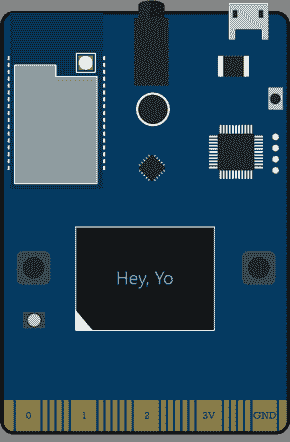
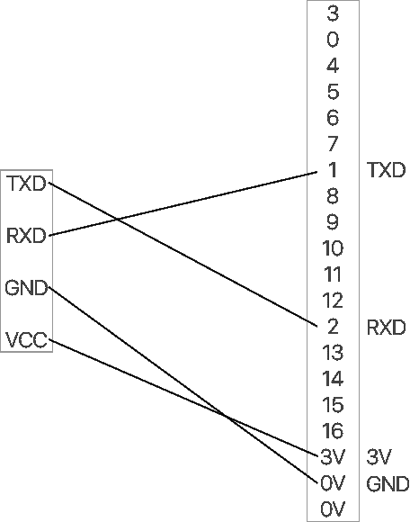

# 使用 MXChip 传输串行数据

> 原文：<https://dev.to/jimbobbennett/streaming-serial-data-using-an-mxchip-j20>

MXChip 板有两个串行端口——一个使用 USB，非常适合调试，另一个可以用来从第三方模块传输数据。这篇文章告诉你如何做！

> TL；DR -将模块上的 TXD 连接到 MXChip 上的 1，将 RXD 连接到 2，然后使用`UARTClass Serial1(UART_1);`创建一个新的序列，然后可以用与 Arduino `Serial`类相同的方式调用它。

[](https://res.cloudinary.com/practicaldev/image/fetch/s--fc8p2pkp--/c_limit%2Cf_auto%2Cfl_progressive%2Cq_auto%2Cw_880/https://www.jimbobbennett.io/conteimg/2019/09/devkit-board-vector%402x-2-1.png)

我花了很多时间使用 Azure 物联网开发套件，也就是 MXChip。这是一个很棒的原型板，可以与 Azure IoT Hub 无缝合作，并内置了一系列传感器。但是，如果您想将另一个设备连接到它，会发生什么情况呢？

我最近开始创建一个基于野生动物追踪器的演示应用程序——既可以用手机定位，也可以用真正的 GSP 项圈定位。不严重，不打算把它放在一个真正的动物身上，只是为了一个很好的端到端的场景演示。老实说，这是我要追踪的熊。

[](https://res.cloudinary.com/practicaldev/image/fetch/s--0TOpWRvi--/c_limit%2Cf_auto%2Cfl_progressive%2Cq_auto%2Cw_880/https://www.jimbobbennett.io/conteimg/2019/09/IMG_4484.JPG)

### 硬件

我为此使用的硬件是一个便宜的 [GPS 模块](https://amzn.to/2ZP03lb)(注意-我的没有安装引脚或天线)。它通过 UART 以 9600 波特发送串行数据，这些数据使用 [NMEA 语句](https://en.wikipedia.org/wiki/NMEA_0183) - ASCII 码，其中包含 GPS 信息，包括位置、速度、卫星信息和其他数据。

我将我的 GPS 传感器插入我的 [Kitronic Inventors Kit](https://amzn.to/2Lsagif) ，这是一个用于 BBC micro:bit 的分线板，使用与 MXChip 相同的手指连接器，找出哪些引脚做串行数据，并连接一些电线。

[](https://res.cloudinary.com/practicaldev/image/fetch/s--mw3ZDjvB--/c_limit%2Cf_auto%2Cfl_progressive%2Cq_auto%2Cw_880/https://www.jimbobbennett.io/conteimg/2019/09/PinMappings.png)

GPS 上的 TXD 连接到 Kitronic Inventors kit 上的引脚 1——RXD 引脚(模块上的传输连接到 MXChip 上的接收，反之亦然)，RXD 连接到引脚 2——TXD 引脚。电源和接地也来自芯片，但如果需要，也可以通过 USB 连接。

如果你想使用鳄鱼夹直接连接到 MXChip，TXD 连接到标有 **1 的大连接器，** RXD 连接到标有 **2** 的连接器，GND 连接到标有 **GND** 的连接器，VCC 连接到标有 **3V** 的连接器。

> 我不得不将引脚焊接到我的 GPS 模块上，以获得良好的连接，因为分线引脚工作不太好，并且不断丢失数据。

### 软件

然后试图找到关于访问串行数据的文档。这就是我碰壁的地方——一无所获！Arduino 文档建议使用附带的名为 SoftwareSerial 的库，但是 MXChip 库中没有这个库。唯一有效的方法是使用内置的`Serial` API 通过 USB 端口发送数据。

我进一步研究，规格确认 MXChip 上有 2 个串行端口，那么我如何访问其中一个呢？最终我找到了罗布·迈尔斯的这篇文章:

[https://www . rob miles . com/journal/2018/11/18/using-the-second-serial-port-on-the-azure-IOT-dev kit](https://www.robmiles.com/journal/2018/11/18/using-the-second-serial-port-on-the-azure-iot-devkit)

您可以创建一个处理串行通信的类`UARTClass`的新实例，并将其连接到第二个串行端口`UART_1`。一旦创建了这个实例，您就可以使用与标准的`Serial`实例相同的 API 来调用它:

```
UARTClass Serial1(UART_1);

Serial1.begin(9600);

while (Serial1.available() > 0)
{
  int byte = Serial1.read();
  ...
} 
```

<svg width="20px" height="20px" viewBox="0 0 24 24" class="highlight-action crayons-icon highlight-action--fullscreen-on"><title>Enter fullscreen mode</title></svg> <svg width="20px" height="20px" viewBox="0 0 24 24" class="highlight-action crayons-icon highlight-action--fullscreen-off"><title>Exit fullscreen mode</title></svg>

一旦完成，我就可以从 GPS 传感器读取串行数据。然后，我将它发送到 [TinyGPS++](https://github.com/mikalhart/TinyGPSPlus) ，我可以从 VSCode 中的 Android 库管理器安装它。这将数据解码成纬度和经度，然后我可以发送到物联网中心！