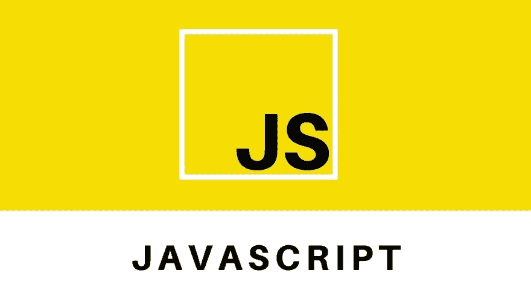
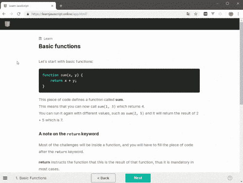
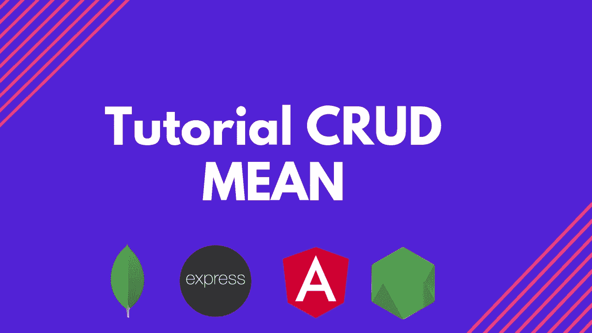

# 在 JavaScript 中成为忍者的 10 条秘诀！

> [https://dev . to/azure/10-成为忍者的技巧 javascript-1775](https://dev.to/azure/10-dicas-para-se-tornar-ninja-em-javascript-1775)

在的最后一篇文章中，我们看到 JavaScript 已经赢得了众多开发者的心，在今后几年中处于应该关注的编程语言的位置。

事实上，这并不奇怪。因为我们在不同的技术和开发领域找到 JavaScript:[【后端】](https://code.visualstudio.com/tutorials/static-website/getting-started?wt.mc_id=javascript-36257-gllemos) 、 **[【前端】](https://code.visualstudio.com/tutorials/static-website/getting-started?wt.mc_id=javascript-36257-gllemos)** 、 **[【移动】](https://docs.microsoft.com/pt-br/azure/app-service-mobile/app-service-mobile-html-how-to-use-client-library?wt.mc_id=javascript-36257-gllemos)所以我们找了这么多工作无论是在巴西还是国外总是找些懂 JavaScript 编程的人。**

但是，很快就会出现很多问题:“我怎样才能在 JavaScript 中成为忍者呢？很难学吗？我能在短时间内理解 JavaScript 吗？何处可以找到适合您的 JavaScript 开发人员的好材料？”

嗯，关于这些问题和许多其他问题，你今天会在这篇文章中得到答案，上面有 10 条不变的提示，可以帮助你在 JavaScript 中成为忍者。

我们开始吧？！

## 提示# 1:学习和学习基本概念

这个提示很有趣，因为我们都知道，要学任何东西，我们需要学习基本概念。但是，很多人最终还是跳过了这一重要的部分。

让我们比较学习一门新语言中一门新编程语言的研究。当我们学习一门新语言时，我们总是努力学习一些基本的东西，然后，从很多实践中，我们可以学到关于那种语言的更高级的东西。

当我们想学习一种新的编程语言时也是如此。如果我们不知道 JavaScript 的基础知识，学习 JavaScript 中的新/lib 框架(无论是 React、Angular 还是 vue)是没有用的。(此提示适用于您希望学习的任何其他编程语言！！页:1。如果跳过基本概念，就不会理解语言的主要范围，因此也就不会继续学习了。

什么是基本概念？其中包括学习:变量、数据类型、函数、重放结构(for、for in、while) -如何以及何时使用每个变量、决策结构、本地范围和全局范围，以及了解 ES5 和 ES6 结构等基本主题。

另一个重要方面是了解 Web 的工作原理、了解 HTTP 请求的工作原理以及了解 internet 的工作原理。怎么了？因为 JavaScript 是一种面向 WEB 的语言，实际上您也需要了解这些概念。

但是，在哪里可以找到学习这些 JavaScript 和 WEB 基础知识的材料？

学习的好地方，从基础知识到 JavaScript 和 WEB 的进步，都是 mozilla 开发人员的文档。对于不熟悉的人，我强烈建议使用以下链接:

**[JavaScript-Mozilla 文档](https://developer.mozilla.org/pt-BR/docs/Aprender/JavaScript)**

这份文件最酷的地方是全是葡萄牙语！！没办法不学习！

对于那些不喜欢阅读但喜欢通过视频学习的人，我推荐一门我们在微软设计的课程，旨在帮助那些想学习 JavaScript 的人:简单、实用、直接！此内容的范围从简单的概念到中间商。而且，这是一个很好的“脚手架”在语言中给出一个启动器！
您可以在下面的链接中找到 40 多个视频。因为在存储库中，我试图以最好的方式对您进行排序和组织:包含改进 JS 世界的下一步步骤！

## [glaucia 86](https://github.com/glaucia86)/[js-101-初学者-ms](https://github.com/glaucia86/js-101-beginners-ms)

### 负责在该系列中为 JavaScript 初学者编写的所有代码的存储库

<article class="markdown-body entry-content container-lg" itemprop="text">

# JavaScript 初学者视频系列

一系列视频，向中间商传授地球上最常用的语言:JavaScript！

如果你从来没有接触过语言，想学习的话，这个系列是给你的！而且，如果你是一个已经懂得语言的开发者，但想复习一些点概念的话，这一系列也是给你的！

我们的目标是帮助您显示足够的 JavaScript 概念，以便为您开始使用 JavaScript 进行框架和 SDK 方面的指导提供必要的基础。

在这里，我们将教你所有 JavaScript 相关的语法！例如:函数、循环、布尔逻辑变量以及其他许多主题！

在本系列中，我们将使用 Node.js 来执行在该系列中创建的代码，而不是使用浏览器。虽然我们使用的几乎所有代码都可以在两个位置使用，但所有代码…

</article>

[View on GitHub](https://github.com/glaucia86/js-101-beginners-ms)

[https://www.youtube.com/embed/SXBNpzjusgY](https://www.youtube.com/embed/SXBNpzjusgY)

最后，我在我的[【Twitter】](https://twitter.com/glaucia_lemos86)上得到了一个很酷的提示，这是一个网站，你可以在其中动态地更好地学习 JavaScript:在线。酷的是，随着你上课，有很多练习要给你做。看看这有多酷：

👉 **[链接做网站](https://learnjavascript.online/)**

## 提示# 2:练习、练习、练习！

这是不可能的。你变得好的最好方法，不管你学什么语言，都是练习。再做一次学习新语言的类比，只有开始练习，你才会开始觉得和外国人交谈更舒适、更自信，对吧？

同样，当我们学习一种新的编程语言时。JavaScript 也没什么不同。

我在第二个提示中推荐什么？了解 JavaScript 的语法和基本概念后，现在是学习算法和数据结构的时候了。

也许你会说:“青光眼…”，但很多人说得对，我得确认一下。但是，就像学习一门新语言一样，你需要耐心，就像学习一门新语言一样。

我建议大家做的是:花 1 小时/天时间研究或做一些 JavaScript 算法难题。看起来不像，但你可以放心，最终会对你有所帮助。

记住，质量胜于数量。所以在 JavaScript 里连续学习八个小时然后再不去研究这个话题就没什么用了 so，it doesn ' t have any more to study like one day，eight hours in JavaScript and then don ' t take it any more .真正值得的是他学习的质量。每天学习几个小时。但是，尽量保持规律！*#提示*
但是，在哪里可以找到学习 JavaScript 算法和数据结构的资源？

建议播放下面的视频:JavaScript 中的数据结构和算法:

[https://www.youtube.com/embed/t2CEgPsws3U](https://www.youtube.com/embed/t2CEgPsws3U)

我强烈推荐的两个网站也是:

*   **[CodeWars](https://www.codewars.com/)T3】**
*   **[黑客排名](https://www.hackerrank.com/)**

他们都用不同的语言(包括 JavaScript)处理日常挑战。值得一看！

## 提示 3:用书学习 Javascript

对许多人来说，看书可能看起来很无聊。但总有一天我们会需要他的。就像我们学习一门新语言时需要用到那种语言的词典或语法书一样。

同样的事情也发生在我们学习一种新的编程语言的时候。我们必须走出□，开始更多的事情□这些加起来会是什么？是书！对于学习 JavaScript 的人来说，有无数本书是极其推荐的。这里引用几个例子:

## [braziljs](https://github.com/braziljs)/[eloquente-JavaScript](https://github.com/braziljs/eloquente-javascript)

### 《JavaScript 雄辩》一书译本-∞版。

<article class="markdown-body entry-content container-lg" itemprop="text">

# JavaScript 雄辩-∞版

**JavaScript、编程和数字奇迹的现代介绍。**

## 书的内容

简介

1.  [价值观、类型和经营者](https://github.com/braziljs/eloquente-javascript/blob/master/chapters/01-valores-tipos-operadores.md) - ( **第 1 部分:语言**
2.  程序结构
3.  功能
4.  [数据结构:对象和数组](https://github.com/braziljs/eloquente-javascript/blob/master/chapters/04-estruturas-de-dados.md)
5.  [高阶函数](https://github.com/braziljs/eloquente-javascript/blob/master/chapters/05-funcoes-de-ordem-superior.md)
6.  一个生活秘书
7.  [实践:电子生活](https://github.com/braziljs/eloquente-javascript/blob/master/chapters/07-pratica-vida-eletronica.md)
8.  [错误和错误处理](https://github.com/braziljs/eloquente-javascript/blob/master/chapters/08-erros-e-manipulacao-de-erros.md)
9.  正则表达式
10.  [Módulos](https://github.com/braziljs/eloquente-javascript/blob/master/chapters/10-modulos.md)
11.  实践:编程语言
12.  Navegador-(**part 2:Navegador**)
13.  [O *文档对象模型*T3】](https://github.com/braziljs/eloquente-javascript/blob/master/chapters/13-document-object-model.md)
14.  [操纵事件](https://github.com/braziljs/eloquente-javascript/blob/master/chapters/14-manipulando-eventos.md)
15.  项目:游戏平台
16.  在画布上画画
17.  [HTTP](https://github.com/braziljs/eloquente-javascript/blob/master/chapters/17-http.md)
18.  表格和表格栏位
19.  [项目:绘画程序](https://github.com/braziljs/eloquente-javascript/blob/master/chapters/19-projeto-um-programa-de-pintura.md)
20.  [node . js](https://github.com/braziljs/eloquente-javascript/blob/master/chapters/20-nodejs.md)-(**part 3:node . js**)
21.  [项目:技能共享网站](https://github.com/braziljs/eloquente-javascript/blob/master/chapters/21-projeto-website-de-compartilhamento-de-habilidades.md)

## 整体项目状态

各章的状态和日志信息按此问题排列。

目前，我们正在改进已翻译的内容，重点是翻译的质量和准确性，并将文本理解为…

</article>

[View on GitHub](https://github.com/braziljs/eloquente-javascript)

👉 **[你不知道 JS](https://github.com/getify/You-Dont-Know-JS)**

**[【忍者 JavaScript(付费)秘密】](https://www.amazon.com.br/Segredos-Ninja-Javascript-John-Resig/dp/8575223283)**

读完这本书，只有做完练习，真正了解自己所学的东西后，才前进到下一章。如果你不明白，不要往前走。试着理解、研究，一旦理解，那么是的，继续下一章。*#提示*

## 提示 4:了解 JS & DOM 中的异步编程

了解异步编程非常重要，因为 JavaScript 使用异步函数并滥用异步函数。

对于这类主题，我建议使用以下三个链接:

**[异步函数](https://developer.mozilla.org/pt-BR/docs/Web/JavaScript/Reference/Statements/funcoes_assincronas?source=post_page-----31a963ad17a1----------------------)**

[https://www.youtube.com/embed/7Bs4-rqbCQc](https://www.youtube.com/embed/7Bs4-rqbCQc)

[https://www.youtube.com/embed/PoRJizFvM7s](https://www.youtube.com/embed/PoRJizFvM7s)

它们是简单的材料，不需要太多时间。但这对大家都有很大帮助！

那天赋呢？！要想在 JavaScript 中成为忍者，掌握天赋也很重要。怎么了？因为文档对象模型(DOM)是处理 HTML 页面的最佳方法，特别是对于前端用户来说，了解 DOM 非常重要。

一些学习天赋的有趣材料:

[https://www.youtube.com/embed/0ik6X4DJKCc](https://www.youtube.com/embed/0ik6X4DJKCc)

👉**[JavaScript HTML DOM](https://www.w3schools.com/js/js_htmldom.asp?source=post_page-----31a963ad17a1----------------------)T3】**

## 提示 5:群众之手——制定项目

通过以上提示，您现在可以更好地开发与 JavaScript 相关的个人项目。

我在演讲中总是建议每个开发者在上创建一个账户。怎么了？有些公司，主要是海外公司，一看到他们的简历，就已经在 GitHub 上查看了他们的产品组合。他们这样做的目的是什么？看看你已经开发了什么，你在开发一个项目时需要注意什么，以及你是否支持任何开源项目。

如果你在这里读这篇文章，你在 GitHub 上还没有账户。没关系的。今天就创造她！下面我将留给你们一个链接:

👉**[【github page】](https://github.com/)**

你最好在 GitHub 上托管你的个人项目。但是，也许你会说:∞青光眼，但我对□也没关系。有一些关于 Git 和 GitHub 的优秀免费课程你可以做。下面我推荐一些非常好的！

**[git-微软免费课程学习](https://docs.microsoft.com/learn/paths/intro-to-vc-git/?WT.mc_id=javascript-36257-gllemos)**

**[github 免费课程:完成-微软学习](https://docs.microsoft.com/learn/paths/manage-project-lifecycle-github/?WT.mc_id=javascript-36257-gllemos)**

**[课程:Git &初学者 github ~ William juste](https://www.udemy.com/git-e-github-para-iniciantes/)**

**[使用 HTML、CSS 和 JavaScript](https://docs.microsoft.com/learn/modules/build-simple-website/?WT.mc_id=javascript-36257-gllemos)** 创建简单网站

开发项目是向世界展示所学知识的最好方法，也将帮助您越来越熟练地使用 JavaScript。更不用说这是最好的练习方式了。

所以，手放在群众上，开始开发许多项目。

## 迪卡#6: Aprenda POO para JavaScript

另一个非常重要的问题是，在使用 JavaScript 进行编程时，您可能会遇到使用 JavaScript 进行面向对象编程的问题。

试着了解它是什么，它是如何工作的，以及如何做。怎么了？因为 JavaScript 中的 POO 与 POO 概念完全不同，例如在 C#、Java、PHP、Python 以及其他具有 POO 概念的语言中。因为 JavaScript 是一种多种语言(功能+强制+脚本)，所以它最终与我们熟悉的其他语言大不相同。

但是，如果它支持功能编程，那么我为什么要学习 poo para javascript？问得好。但由于现代 JavaScript，更不用说是 5/6 之后，我们开始看到在 JavaScript 中采用 POO 模式。

哪里可以用 JavaScript 学习 POO？以下链接可以帮助您完成此研究:

**[【面向对象 JavaScript 简介】](https://developer.mozilla.org/pt-BR/docs/Web/JavaScript/Introduction_to_Object-Oriented_JavaScript?source=post_page-----31a963ad17a1----------------------)**

[https://www.youtube.com/embed/vDJpGenyHaA](https://www.youtube.com/embed/vDJpGenyHaA)

以上视频非常出色，仅 1 小时的视频说明了如何使用 JavaScript 学习 POO，以及如何更好地使用 ES5 & ES6 概念。

## 提示 7:学习功能编程

如提示 6 中所述，JavaScript 是一种多种编程语言，支持功能编程。不久，学习功能编程也是极其重要的。

学习功能编程时，您将学会编码和更好地理解语言的主要概念，因为功能编程有助于避免使用状态更改和可变数据。此外，功能编程强调数学函数，在需要开发需要大量计算和内存分配的特定项目时，它最终会非常有用。

下面列出了学习 JavaScript 功能编程的一些重要链接

👉**[JavaScript 函数式编程简介](https://flaviocopes.com/javascript-functional-programming/?source=post_page-----31a963ad17a1----------------------)**

[https://www.youtube.com/embed/FYXpOjwYzcs](https://www.youtube.com/embed/FYXpOjwYzcs)

[https://www.youtube.com/embed/bRlvGoWz6Ig](https://www.youtube.com/embed/bRlvGoWz6Ig)

我们已经到了名单的最后一位了。前三名是什么？！让我们看看！

## 提示#8:学习 JavaScript 项目模式

你之所以来到这里，是因为你要完成你的训练，即将成为 JavaScript 上的忍者。

“设计模式”(Design Patterns)对于您正在专业或工作的任何语言环境都非常重要。

因为，一旦您已经建立了项目标准的主要概念，就可以为特定情况定义最佳的项目体系结构。

想学习 JavaScript 中的设计模式吗？下面是一些非常有趣的链接，值得一看:

[https://www.youtube.com/embed/MqddY6Ochkc](https://www.youtube.com/embed/MqddY6Ochkc)

👉 **[立面图案](https://addyosmani.com/resources/essentialjsdesignpatterns/book/?source=post_page-----31a963ad17a1----------------------#facadepatternjavascript)**

👉 **[JavaScript 设计模式](https://www.udacity.com/course/javascript-design-patterns--ud989?source=post_page-----31a963ad17a1----------------------)**

👉 **[用 MVC 方式搭建一个简单的 Javascript App](https://www.awwwards.com/build-a-simple-javascript-app-the-mvc-way.html?source=post_page-----31a963ad17a1----------------------)**

## Dica # 9:Aprenda um Framework/Lib JavaScript

现在你已经到了尽头，已经学会了在 JavaScript 中成为忍者确实需要的一切，现在是的，你可以在 JavaScript 中学习/lib 框架。

市场上有多个/lib 框架。其中有:Angular，react & vue . js。不要做想一次性学习大家的蠢事！尝试学习并熟练掌握 frame wrk/lib！通过研究市场上前三名中的一名，您可以轻松地学习或迁移(如果适用)到另一个框架或 lib。

下面列出了主要课程:Angular、react & vue . js

### 棱角分明的光标

[https://www.youtube.com/embed/tPOMG0D57S0](https://www.youtube.com/embed/tPOMG0D57S0)

##  [ glaucia86 ](https://github.com/glaucia86) / [教程-crud-mean](https://github.com/glaucia86/tutorial-crud-mean)

### 负责 youtube 频道教程的存储库

<article class="markdown-body entry-content container-lg" itemprop="text">

# 教程 CRUD 平均 com 角 8 com 天蓝色由格劳基亚莱默斯

负责在我的频道[【YouTube】](https://www.youtube.com/user/l32759)上进行的教程的存储库

## 我会学到什么？！

在本教程中，您将学习如何开发一个应用程序，该应用程序包括对 XYZ 公司的员工进行注册。其中，我们将使用 Create、Read、Update 和 Delete 操作。该应用程序将与后端(Node.js)集成，并将托管在 Microsoft - Azure 云平台上。

员工数据包括:

**分类:Funcionario**

*   idFuncionario:(号码- guid gerado pelo MongoDb)
*   nomeFuncionario:字符串
*   货物:细绳
*   识别码:number

## 应用开发中使用的资源

*   Visual Studio 代码 **[下载 AQUI](http://bit.ly/2IfNp9F)**
*   node . js**T1】下载 AQUIT3】**
*   Angular CLI ~ 7.2.2 **[下载 AQUI](https://angular.io/)**
*   Mongodb 社区服务器 **[下载 AQUI](https://www.mongodb.com/download-center/community)T3】**
*   MongodB 罗盘 GUI **[下载 AQUI](https://www.mongodb.com/download-center/compass)T3】**
*   自举 3/4**t1】下载 aquiT3】**
*   蓝皮书网站[这里](http://bit.ly/2WP5hMJ)
*   邮递员 **[下载 AQUI](https://www.getpostman.com/)**

## 讲习班菜单:

*   很好的介绍
*   哦…

</article>

[View on GitHub](https://github.com/glaucia86/tutorial-crud-mean)

**[【角文件】](https://angular.io/?source=post_page-----31a963ad17a1----------------------)**

**[学习调试 Vs 代码](https://code.visualstudio.com/docs/nodejs/angular-tutorial?WT.mc_id=javascript-36257-gllemos)** 中的角度应用

### 反应课程

**[试剂文献](https://reactjs.org/docs/getting-started.html?source=post_page-----31a963ad17a1----------------------)**

**[学习调试反应物在 Vs 代码](https://code.visualstudio.com/docs/nodejs/angular-tutorial?WT.mc_id=javascript-36257-gllemos)** 中的应用

👉 **[Curso Grátis de React -微软学习](https://docs.microsoft.com/learn/paths/react/?WT.mc_id=javascript-36257-gllemos)**

[https://www.youtube.com/embed/iHqa6ojKnHI](https://www.youtube.com/embed/iHqa6ojKnHI)

### Cursos de Vue.js

👉 **[Curso Grátis Vue。Js -微软学习](https://docs.microsoft.com/learn/paths/vue-first-steps/?WT.mc_id=javascript-36257-gllemos)T3】**

## [glaucia 86](https://github.com/glaucia86)/[vue js-workshop](https://github.com/glaucia86/vuejs-workshop)

### 负责 vue . js 与 Azure App Service 研讨会的存储库

<article class="markdown-body entry-content container-lg" itemprop="text">

# Workshop - Vue.js com Azure

负责 vue . js 的蓝色研讨会的存储库。

## 递归工具<g-emoji class="g-emoji" alias="rocket" fallback-src="https://github.githubassets.cimg/icons/emoji/unicode/1f680.png">🚀</g-emoji>

*   **[Visual Studio 代码](https://code.visualstudio.com/?WT.mc_id=javascript-0000-gllemos)**
*   **[Node.js](https://nodejs.org/en/)**
*   **[vista . js](https://vuejs.org/)**
*   **[【vista-CLI】](https://cli.vuejs.org/)**
*   **[MongoDb 社区服务器](https://www.mongodb.com/download-center/community)**
*   **[MongoDb 罗盘 GUI](https://www.mongodb.com/download-center/compass)**
*   **[邮递员](https://www.getpostman.com/)**
*   **[Azure Web App 服务](https://azure.microsoft.com/services/app-service/?WT.mc_id=javascript-0000-gllemos)**
*   **[天蓝色存储账号](https://azure.microsoft.com/services/storage/?WT.mc_id=javascript-0000-gllemos)**
*   **[Azure cosmos db](https://azure.microsoft.com/services/cosmos-db/?WT.mc_id=javascript-0000-gllemos)T3】**

## 学生的蔚蓝海岸 <g-emoji class="g-emoji" alias="star" fallback-src="https://github.githubassets.cimg/icons/emoji/unicode/2b50.png">⭐️</g-emoji>

如果您是某高校某教育机构或大学的学生，可以在[学生蓝色](https://azure.microsoft.com/free/students/?WT.mc_id=javascript-0000-gllemos) 开立账户。此帐户将为您提供 100.00 美元的信用，让您无需信用卡即可免费使用服务。要激活此帐户，只需访问旁边的链接:

## 先决条件<g-emoji class="g-emoji" alias="pushpin" fallback-src="https://github.githubassets.cimg/icons/emoji/unicode/1f4cc.png">📌</g-emoji>

为了举办 vista . js 研讨会，需要具备以下概念: **HTML、CSS & JavaScript** 。考虑到这一点，我在下面提供了两个免费课程:

*   **[Crie um site simples usando HTML，CSS e JavaScript](https://docs.microsoft.com/learn/modules/build-simple-website/?WT.mc_id=javascript-0000-gllemos)T3】**

*   **[使用](https://docs.microsoft.com/learn/modules/develop-web-apps-with-vs-code/?WT.mc_id=javascript-0000-gllemos)** 开发 Web 应用程序……

</article>

[View on GitHub](https://github.com/glaucia86/vuejs-workshop)

[https://www.youtube.com/embed/78tNYZUS-ps](https://www.youtube.com/embed/78tNYZUS-ps)

👉**[documentao do vue . js](https://br.vuejs.org/v2/guide/?source=post_page-----31a963ad17a1----------------------)**

**[学习调试 vista . js 中的应用程序与代码](https://code.visualstudio.com/docs/nodejs/vuejs-tutorial?WT.mc_id=javascript-36257-gllemos)**

在后端(甚至前端)我强烈建议您也学习 TypeScript。如果您愿意，我将创建一个有关 TypeScript 的超级播放列表，该列表是由 TypeScript 团队共同开发和帮助的！下面请大家注意:

## [glaucia 86](https://github.com/glaucia86)/[curso-typescript-zero-to-hero](https://github.com/glaucia86/curso-typescript-zero-to-hero)

### 负责 TypeScript - Zero to Hero 课程的储存库

<article class="markdown-body entry-content container-lg" itemprop="text">

# 光标打字稿-零到英雄

负责 TypeScript - Zero to Hero 课程的储存库！

所有的训练都是社区为社区设计的！因此，向所有开发人员免费提供知识。

整个训练修正，都是以型脚本的正式文件为基础的！是啊，在正式文件的帮助下，没有更好的地方可以学习和理解特定的堆栈或语言！

## <g-emoji class="g-emoji" alias="pushpin" fallback-src="https://github.githubassets.cimg/icons/emoji/unicode/1f4cc.png">📌</g-emoji>先决条件

要完成本课程，您必须已熟悉 JavaScript 和 Node.Js

如果您没有，在您开始学习 TypeScript - Zero to Hero 课程之前，我们会在下面提供一些预先训练

*   <g-emoji class="g-emoji" alias="white_check_mark" fallback-src="https://github.githubassets.cimg/icons/emoji/unicode/2705.png">✅</g-emoji> **[Curso Grátis 打字稿-微软学习](https://docs.microsoft.com/learn/paths/build-javascript-applications-typescript/?WT.mc_id=javascript-23355-gllemos)**
*   <g-emoji class="g-emoji" alias="white_check_mark" fallback-src="https://github.githubassets.cimg/icons/emoji/unicode/2705.png">**[免费 JavaScript 课程-面向初学者](https://github.com/glaucia86/js-101-beginners-ms)**</g-emoji>
*   <g-emoji class="g-emoji" alias="white_check_mark" fallback-src="https://github.githubassets.cimg/icons/emoji/unicode/2705.png">✅</g-emoji>**[curso grátis node。Js -微软学习](https://docs.microsoft.com/learn/paths/build-javascript-applications-nodejs/?WT.mc_id=javascript-14034-gllemos)T5】**
*   <g-emoji class="g-emoji" alias="white_check_mark" fallback-src="https://github.githubassets.cimg/icons/emoji/unicode/2705.png">**[免费课程 Node.Js【视频】](https://channel9.msdn.com/Series/Beginners-Series-to-NodeJS?WT.mc_id=javascript-14034-gllemos)**</g-emoji>

## <g-emoji class="g-emoji" alias="runner" fallback-src="https://github.githubassets.cimg/icons/emoji/unicode/1f3c3.png">🏃</g-emoji>可乐博多

在我们为整个技术社区开发的项目中…

</article>

[View on GitHub](https://github.com/glaucia86/curso-typescript-zero-to-hero)

[https://www.youtube.com/embed/u7K1sdnCv5Y](https://www.youtube.com/embed/u7K1sdnCv5Y)

## 提示#10:支持开源项目

保持连续性而不是停滞不前的最好方法就是尝试支持开源项目。
除此之外，您还会与世界上最大的 JavaScript 野兽保持联系，更好的是:您可以通过发送一些功能来帮助一些拉请求。你会从他们身上学到，你会学到自己和更好的:它会帮助技术界。

这里要提到的另一点是:您不需要成为一个天才，就可以帮助或支持开源项目。例如，我一直在帮助翻译 Nodejs.org 和 reactjs . org。当然，如果您愿意并希望发送一些需要从 lib 改进的功能的 PR，那就太好了！但如果不是这样，请随时帮忙！

但是，我在哪里可以支持 JavaScript 开源项目？下面我将介绍如何帮助 JavaScript 中的特定开源库以及您可以帮助的各种开源项目的列表:

👉**[2018 年 GitHub 上流行的 50 个 JavaScript 开源项目](https://hackernoon.com/50-popular-javascript-open-source-projects-on-github-in-2018-469c11b48b8d?source=post_page-----31a963ad17a1----------------------)**

## 结语

哇哦！我们的名单到此为止！记住:质量胜于数量。我知道这里有很多东西需要学习。但是，如果你像每天花 1 小时研究我在这里张贴的材料，在**15 ~ 18 个月**内，你肯定会成为 JavaScript 中的忍者。

最后一次警告:我正在准备一系列关于 JavaScript 算法和数据结构的文章。在那里，我将每周详细地，举例来说，解释每一个例子。你们想加入这个新系列吗？！如果是的话，他们在 twitter 上跟踪我，因为今年会有很多新闻，我会通过我的 twitter 更新你们所有人。你们不想错过任何新的通知吗？所以…跟着我上 twitter，好吗？！😃

啊！啊！我差点忘了在这里说话！继续订阅我的 Youtube 频道！我在我的频道上创作了无数精彩的连续剧！

就像扰流板一样：

*   😃 **Uma série incrível de Vs Code**
*   😃**Curso gratuto de TypeScript**
*   😃**Tutoriais semanais de node . js&JavaScript**
*   **和许多 Live 编码**

如果是您喜欢的内容，请登录并激活叮当当我们有新视频时就知道了！这周我们将为大家做一个很棒的教程！

下次见！❤️ ❤️ ❤️