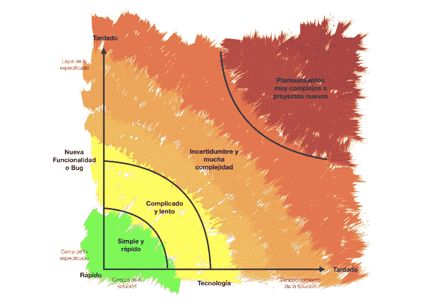

# 估算软件时间和工作量的指南

> [https://dev . to/omarcarpinyro/guide-to-estimated-El-time-y-effort-del-396 a](https://dev.to/omarcarpinteyro/guia-para-estimar-el-tiempo-y-esfuerzo-del-software-396a)软件

在软件开发过程中，我们的团队或合作伙伴需要花费多长时间才能提交申请。这一数据很有意义，因为它基本上帮助企业编制预算和评估利润。也就是说，开发时间越长，支付开发人员或执行任务的设备的费用或投资就越高。我们要记住，每一个小时的编程都要花钱。

估计开发时间的另一个有利因素是帮助业务部门了解何时交付给产品带来价值，从而为业务本身建立一个一致的管道。

因此，每一个要求你作出任务估计的人，我们都不得不提到数据。

## El problema

但是，虽然我们已经看到估计是合理的，但计算这一数值却是一个需要花费大量时间的现实。日？时间？冲刺？∞我会去的，是在交货时间问题上经常使用的短语。

## 问题的原因

变数太多，难以估计开发时间，而且每个工作流程都不同。最常见的原因包括:

*   **缺乏要求的定义。**要求要么不完整，要么存在模棱两可之处。并非所有使用案例或接受标准都存在。
*   **第三方设备组。**为了满足一项要求，不同的团队参与是很常见的，而这些系列工作使估计变得最复杂。
*   **不知道解决办法。**有时，要求是这样的，即如何给出一个解决方案并不完全肯定，这使得估计为什么涉及分析以及在某些情况下(通常是自学式的)培训，以便能够理解和整合解决方案变得复杂。

## 解决方案

因此，为了避免估算被推掉，我们提供了一个图表，让团队、所有人都能看到需求所在的位置，而不要让他们的解决方案成为一种信念行为。图表如下:

<figure>

[T2】](https://res.cloudinary.com/practicaldev/image/fetch/s--WC86rDLR--/c_limit%2Cf_auto%2Cfl_progressive%2Cq_auto%2Cw_880/https://thepracticaldev.s3.amazonaws.com/i/rtonevtns96kmx05mcee.png)

<figcaption>Gráfica de Nivel de Esfuerzo y Tiempo en Software</figcaption>

</figure>

## 图:软件中的努力水平和时间

图形是一种快速查看开发时间和工作量估计值的工具。这些基本上可以是:

*   新要求
*   软件维护

**y 轴**(左侧)指示我们**新的要求或保持其原有功能的距离有多近或多远**。东越靠近**【x 轴】**(向下)就会越接近最初开发的东西。

**x 轴**(底部)告诉我们**我们对解决方案了解多少，无论是在我们使用的技术上，还是在提供解决方案所需的知识上都是如此。**。东越靠近**轴和**(左)将使我们对我们应该使用的解决方案有更大的把握。

## 实例

让我们想想一辆车。我们有一辆红色的汽车，它使用汽油，它有四个轮胎，引擎，门等。一辆普通的车。现在，让我们以用户历史记录的形式思考一个要求:

> ***作为用户，我想让车为黑色，以便符合我收藏的深色车。***

在这种情况下，我们可以假设改变汽车的颜色并不需要那么多的工作，而且我们也知道如何做到这一点。因此，时间和精力的估计水平可大致如下:

<figure>

[T2】](https://res.cloudinary.com/practicaldev/image/fetch/s--svUW2-o6--/c_limit%2Cf_auto%2Cfl_progressive%2Cq_auto%2Cw_880/https://thepracticaldev.s3.amazonaws.com/i/m8n8qfe7l9iy6w1gpjpm.png)

<figcaption>La estrella representa el nivel de esfuerzo y tiempo</figcaption>

</figure>

让我们再举另一个例子，在用户历史中同样引用:

> ***作为用户，我希望汽车可以转换，以便在开车时享受空气和视力。***

∞天啊！使汽车可转换？这听起来与最初的要求有很大的不同□是这样吗？但假设我们会派最好的人员去做改变。我们的要求如下:

<figure>

[T2】](https://res.cloudinary.com/practicaldev/image/fetch/s--X1zo-6rq--/c_limit%2Cf_auto%2Cfl_progressive%2Cq_auto%2Cw_880/https://thepracticaldev.s3.amazonaws.com/i/laxfz4qhyhz7hbw0lhvn.png)

<figcaption>La estrella representa el nivel de esfuerzo y tiempo</figcaption>

</figure>

什么是这样的位置？我们可以争辩说，虽然我们分配了最好的工作人员，并且知道如何进行变革，但这一要求与目前的运作相去甚远，这使得开发时间更晚。如果一个没有经验的团队帮助我们制造一辆可转换的汽车，那么估计的时间和精力会是什么样子呢？

让我们再举一个例子来补充这个想法:

> ***作为用户，我希望汽车混合使用，这样就可以不用汽油了。***

这就是我们面临的挑战。把汽油使用车换成混合动力车。

肯定是新的东西。我们可以很快地说，它并不接近最初的规格，而且我们也没有工作人员知道如何进行这一调整，因此我们的图表将如下所示:

<figure>

[T2】](https://res.cloudinary.com/practicaldev/image/fetch/s--kvq-cxM2--/c_limit%2Cf_auto%2Cfl_progressive%2Cq_auto%2Cw_880/https://thepracticaldev.s3.amazonaws.com/i/50eveiamgp2fkgi1wgh9.png)

<figcaption>La estrella representa el nivel de esfuerzo y tiempo</figcaption>

</figure>

我们现在都同意，这项要求将需要很长的发展时间，我们在哪里作出努力是很清楚的。

## 结论

有一个工具可以帮助我们传达我们的估计，并帮助我们了解团队的情况，这对我们作为开发人员的信誉至关重要。

你用什么工具来估计你的发展时间和努力？

###### (*Foto de Cover por[neon brand](https://unsplash.com/@neonbrand)de[Unsplash](https://unsplash.com/search/photos/project-planning)T7)*