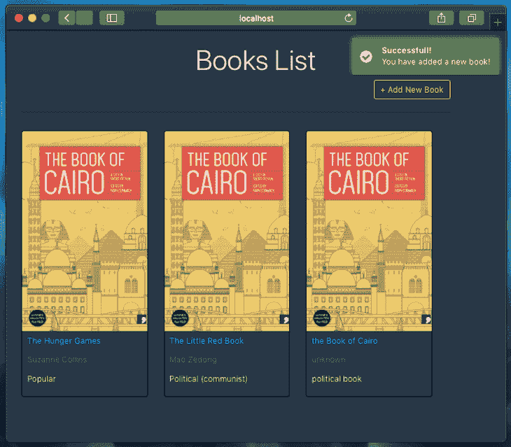
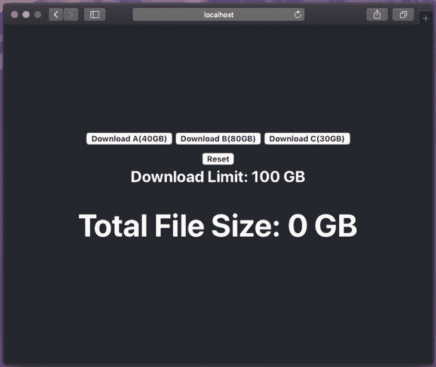
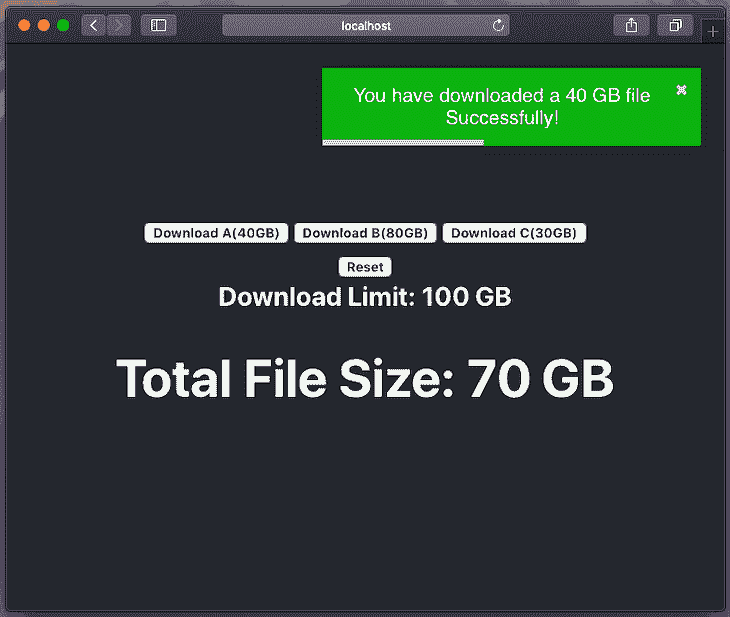
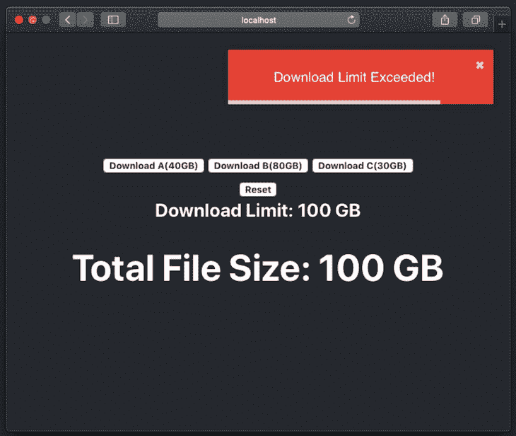
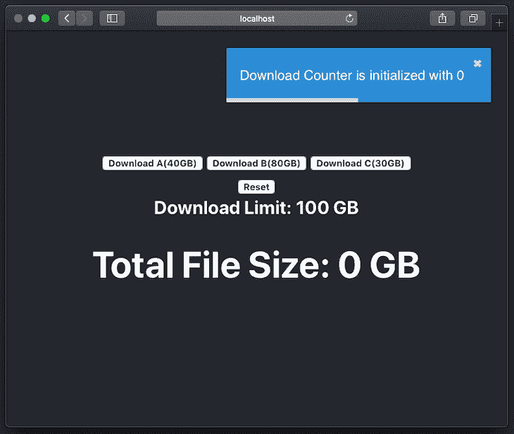

# 向 React 应用程序添加微调器和通知

> 原文：<https://dev.to/bnevilleoneill/adding-spinners-and-notifications-to-your-react-app-35pc>

**由[努尔伊斯拉姆](https://blog.logrocket.com/author/nurislam/)✏️**撰写

为了使您的 web 项目更具交互性和用户友好性，您可能希望添加一些额外的功能，如通知或显示加载状态的微调器。

今天，我们将探讨如何实现这些功能。我们不会简单地展示一些例子，而是将重点放在如何将它们集成到一个全栈项目中。

## 开始之前…

那么我们到底要讨论什么呢？

1.  我们将回顾向我们的项目添加一个微调器(例如，指示装载)所需的所有必要步骤。
2.  我们将在项目中只使用一个“通知容器”来管理通知，并学习如何使用它们来显示正确的消息。为此，我们将讨论两个不同的 npm 包，以便对它们进行一些比较。

在这里，我将使用一个现有的 MERN 项目，我们可以添加这些功能，看看结果。我不打算深入讨论这个现有的项目，因为我们在这里的目的只是展示上述功能的实现和集成。

事实上，我们已经有了一个关于这个项目的很好的教程，分为两部分，它解释了你需要理解的一切。如果你愿意，你可以在这里阅读第一部分。[第二部在这里](https://dev.to/bnevilleoneill/mern-stack-a-to-z-part-2-26pi)有。

[](https://logrocket.com/signup/)

### 资源

[这里的](https://github.com/nurislam03/MERN_A_to_Z)是项目服务端的 GitHub 回购，[这里是客户端的回购](https://github.com/nurislam03/MERN_A_to_Z_Client)。只要克隆或下载它们，无论你喜欢什么，然后按照`README.md`文件中提供的说明或下面提供的说明运行它们。

要开始运行服务器，请确保您位于`MERN_A_to_Z/`目录中，并键入以下命令:

```
$ npm install
$ npm run app 
```

<svg width="20px" height="20px" viewBox="0 0 24 24" class="highlight-action crayons-icon highlight-action--fullscreen-on"><title>Enter fullscreen mode</title></svg> <svg width="20px" height="20px" viewBox="0 0 24 24" class="highlight-action crayons-icon highlight-action--fullscreen-off"><title>Exit fullscreen mode</title></svg>

> 注意:我们只需要运行的服务器。之后，我们不需要在那里做任何改变。

要启动客户端服务器，请确保您位于`MERN_A_to_Z_Client/mern_a_to_z_client/`目录中，并键入以下命令:

```
$ npm install
$ npm start 
```

<svg width="20px" height="20px" viewBox="0 0 24 24" class="highlight-action crayons-icon highlight-action--fullscreen-on"><title>Enter fullscreen mode</title></svg> <svg width="20px" height="20px" viewBox="0 0 24 24" class="highlight-action crayons-icon highlight-action--fullscreen-off"><title>Exit fullscreen mode</title></svg>

> 注意:我们将严格按照我们的客户项目工作；所有的变化都将发生在那里。

现在项目的服务器端和客户端都已经运行了，请访问 [http://localhost://3000](http://localhost://3000) 查看项目实况。

## 微调器设置

在这里，我将为我们现有的 MERN 项目添加一个装载旋转器。我们将更新我们的`ShowBookList.js`文件，在`ShowBookList`组件中添加一个加载微调器。

因此，在组件文件夹中创建一个名为`common`的文件夹。路径应该是这样的:`MERN_A_to_Z_Client/mern_a_to_z_client/src/components/common`。现在，在`common`文件夹中，创建一个名为`Spinner.js`的文件，并为加载微调器添加一个. gif 文件。

你可以找到不同种类的。gif 文件在互联网上到处都是免费的，或者你也可以使用随源代码提供的 gif 文件。

现在，用下面的代码更新您的`Spinner.js`:

```
import React from 'react';
import spinner from './spinner.gif';

export default () => {
  return (
    <div>
      
    </div>
  );
}; 
```

<svg width="20px" height="20px" viewBox="0 0 24 24" class="highlight-action crayons-icon highlight-action--fullscreen-on"><title>Enter fullscreen mode</title></svg> <svg width="20px" height="20px" viewBox="0 0 24 24" class="highlight-action crayons-icon highlight-action--fullscreen-off"><title>Exit fullscreen mode</title></svg>

> 注意:这里我们导入。gif 文件(`import spinner from './spinner.gif';`)。如果你正在使用你自己的，不同的微调文件，用你想要添加的文件名替换`spinner.gif`。

现在，用这个:
更新你的`ShowBookList.js`文件

```
import React, { Component } from 'react';
import '../App.css';
import axios from 'axios';
import { Link } from 'react-router-dom';
import BookCard from './BookCard';

// spinner file
import Spinner from './common/Spinner';

class ShowBookList extends Component {
  constructor(props) {
    super(props);
    this.state = {
      loading: true,
      books: []
    };
  } 
```

<svg width="20px" height="20px" viewBox="0 0 24 24" class="highlight-action crayons-icon highlight-action--fullscreen-on"><title>Enter fullscreen mode</title></svg> <svg width="20px" height="20px" viewBox="0 0 24 24" class="highlight-action crayons-icon highlight-action--fullscreen-off"><title>Exit fullscreen mode</title></svg>

在这里，我们从`common/Spinner.js`导入我们的`Spinner`组件，并在渲染函数中使用一些逻辑为`bookList`赋值。我们还在构造函数中添加了一个初始设置为`false`的加载状态。

你不需要遵循同样的逻辑；你可以用自己的方式写，很明显，根据你的项目类型会有所不同。

现在，运行项目并访问: [http://localhost:3000/](http://localhost:3000/)

在很短的时间内，您将会看到如下所示的装载微调器。这是通过 API 获取数据的延迟时间。这意味着该微调器将一直显示，直到`books` ( `this.state.books`)的状态值为`null`或`loading` ( `this.state.loading`)为`true`。

[](https://res.cloudinary.com/practicaldev/image/fetch/s--dqK6uFyS--/c_limit%2Cf_auto%2Cfl_progressive%2Cq_auto%2Cw_880/https://i2.wp.com/blog.logrocket.com/wp-content/uploads/2019/08/books-list-spinner-notification.png%3Fresize%3D730%252C612%26ssl%3D1)

您可以调整微调器的背景颜色，当然也可以使用定制的微调器。在这里，我的目标只是展示何时何地可以使用微调器，以及如何设置微调器。

## 用 react-notifications 配置通知

现在我将展示如何在 React 项目中处理通知。首先我们将使用 [react-notifications](https://www.npmjs.com/package/react-notifications) ，顾名思义，它是 react 的通知组件。

### 包安装

转到客户端项目目录(`MERN_A_to_Z_Client/mern_a_to_z_client/`)并安装以下 npm 包:

```
$ npm install --save react-notifications 
```

<svg width="20px" height="20px" viewBox="0 0 24 24" class="highlight-action crayons-icon highlight-action--fullscreen-on"><title>Enter fullscreen mode</title></svg> <svg width="20px" height="20px" viewBox="0 0 24 24" class="highlight-action crayons-icon highlight-action--fullscreen-off"><title>Exit fullscreen mode</title></svg>

再次运行该项目。

### 设置通知容器

现在更新`App.js`文件。从 react-notifications 和`notifications.css`文件导入`NotificationContainer`。

```
import React, { Component } from 'react';
import { BrowserRouter as Router, Route } from 'react-router-dom';
import './App.css';

import CreateBook from './components/CreateBook';
import ShowBookList from './components/ShowBookList';
import ShowBookDetails from './components/ShowBookDetails';
import UpdateBookInfo from './components/UpdateBookInfo';

// React Notification
import 'react-notifications/lib/notifications.css';
import { NotificationContainer } from 'react-notifications';

class App extends Component {
  render() {
    return (
      <Router>
        <div>
          <Route exact path='/' component={ShowBookList} />
          <Route path='/create-book' component={CreateBook} />
          <Route path='/edit-book/:id' component={UpdateBookInfo} />
          <Route path='/show-book/:id' component={ShowBookDetails} />
          <NotificationContainer />
        </div>
      </Router>
    );
  }
}

export default App; 
```

<svg width="20px" height="20px" viewBox="0 0 24 24" class="highlight-action crayons-icon highlight-action--fullscreen-on"><title>Enter fullscreen mode</title></svg> <svg width="20px" height="20px" viewBox="0 0 24 24" class="highlight-action crayons-icon highlight-action--fullscreen-off"><title>Exit fullscreen mode</title></svg>

到目前为止，一切顺利——我们已经完成了对`NotificationContainer`的设置。

> 注意:在应用程序中只使用一个`NotificationContainer`组件。

现在是时候传递来自不同组件的通知来显示它们的消息了。

### 设置来自组件的通知

在这里，您只需从 react-notifications 导入`NotificationManager`。之后，您就可以通过`NotificationManager`传递通知了。

看看我在`CreateBook.js`文件中所做的更改，以传递来自`CreateBook`组件的通知。

打开`CreateBook.js`并用下面的代码更新它:

```
import React, { Component } from 'react';
import { Link } from 'react-router-dom';
import '../App.css';
import axios from 'axios';

// React Notification
import { NotificationManager } from 'react-notifications';

class CreateBook extends Component {
  constructor() {
    super();
    this.state = {
      title: '',
      isbn:'',
      author:'',
      description:'',
      published_date:'',
      publisher:''
    };
  }

  onChange = e => {
    this.setState({ [e.target.name]: e.target.value });
  };

  onSubmit = e => {
    e.preventDefault();

    const data = {
      title: this.state.title,
      isbn: this.state.isbn,
      author: this.state.author,
      description: this.state.description,
      published_date: this.state.published_date,
      publisher: this.state.publisher
    };

    axios
      .post('http://localhost:8082/api/books', data)
      .then(res => {
        this.setState({
          title: '',
          isbn:'',
          author:'',
          description:'',
          published_date:'',
          publisher:''
        })
        this.props.history.push('/');
        NotificationManager.success('You have added a new book!', 'Successful!', 2000);
      })
      .catch(err => {
        // console.log("Error in CreateBook!");
        NotificationManager.error('Error while Creating new book!', 'Error!');
      })
  };

  render() {
    return (
      <div className="CreateBook">
        <div className="container">
          <div className="row">
            <div className="col-md-8 m-auto">
              <br />
              <Link to="/" className="btn btn-outline-warning float-left">
                  Show BooK List
              </Link>
            </div>
            <div className="col-md-8 m-auto">
              <h1 className="display-4 text-center">Add Book</h1>
              <p className="lead text-center">
                  Create new book
              </p>

              <form noValidate onSubmit={this.onSubmit}>
                <div className='form-group'>
                  <input
                    type='text'
                    placeholder='Title of the Book'
                    name='title'
                    className='form-control'
                    value={this.state.title}
                    onChange={this.onChange}
                  />
                </div>
                <br />

                <div className='form-group'>
                  <input
                    type='text'
                    placeholder='ISBN'
                    name='isbn'
                    className='form-control'
                    value={this.state.isbn}
                    onChange={this.onChange}
                  />
                </div>

                <div className='form-group'>
                  <input
                    type='text'
                    placeholder='Author'
                    name='author'
                    className='form-control'
                    value={this.state.author}
                    onChange={this.onChange}
                  />
                </div>

                <div className='form-group'>
                  <input
                    type='text'
                    placeholder='Describe this book'
                    name='description'
                    className='form-control'
                    value={this.state.description}
                    onChange={this.onChange}
                  />
                </div>

                <div className='form-group'>
                  <input
                    type='date'
                    placeholder='published_date'
                    name='published_date'
                    className='form-control'
                    value={this.state.published_date}
                    onChange={this.onChange}
                  />
                </div>
                <div className='form-group'>
                  <input
                    type='text'
                    placeholder='Publisher of this Book'
                    name='publisher'
                    className='form-control'
                    value={this.state.publisher}
                    onChange={this.onChange}
                  />
                </div>

                <input
                    type="submit"
                    className="btn btn-outline-warning btn-block mt-4"
                />
              </form>
          </div>
          </div>
        </div>
      </div>
    );
  }
}

export default CreateBook; 
```

<svg width="20px" height="20px" viewBox="0 0 24 24" class="highlight-action crayons-icon highlight-action--fullscreen-on"><title>Enter fullscreen mode</title></svg> <svg width="20px" height="20px" viewBox="0 0 24 24" class="highlight-action crayons-icon highlight-action--fullscreen-off"><title>Exit fullscreen mode</title></svg>

运行项目并访问[http://localhost:3000/create-book](http://localhost:3000/create-book)。现在，在创建一本新书后，您将看到如下消息。如果系统未能添加新书，您也会收到一条错误消息。

[](https://res.cloudinary.com/practicaldev/image/fetch/s---JEm39ea--/c_limit%2Cf_auto%2Cfl_progressive%2Cq_auto%2Cw_880/https://i2.wp.com/blog.logrocket.com/wp-content/uploads/2019/08/books-list-notification.png%3Fresize%3D730%252C639%26ssl%3D1)

您可以在项目的不同组件中应用相同的方法。根据通知类型，通知将以不同的颜色显示:信息、成功、警告和错误。

您还可以随消息传递五个不同的参数:`message`、`title`、`timeOut`、`callback`和`priority`。

### 可用的`NotificationManager`原料药

对于这个包，有以下四种不同类型的 API 可供我们使用:

*   `info`
*   `success`
*   `warning`
*   `error`

这里有一个关于`success`类型的例子——对于给定的场景，只需将`success`替换为合适的通知类型:

```
NotificationManager.success(message, title, timeOut, callback, priority); 
```

<svg width="20px" height="20px" viewBox="0 0 24 24" class="highlight-action crayons-icon highlight-action--fullscreen-on"><title>Enter fullscreen mode</title></svg> <svg width="20px" height="20px" viewBox="0 0 24 24" class="highlight-action crayons-icon highlight-action--fullscreen-off"><title>Exit fullscreen mode</title></svg>

通知类型后面的参数描述如下:

*   `message`:我们要传递的信息。它必须是字符串。
*   `title`:通知的标题。同样，它的类型是 string。
*   `timeOut`:弹出超时，单位毫秒。这一定是个整数。
*   `callback`:我们可以通过一个函数(type 功能)通过通知。它在弹出窗口被调用后执行。
*   `priority`:这是一个布尔型参数。通过将优先级设置为 true，我们可以在任何时候将任何通知推到顶部。

## 用 react-toastify 配置通知

既然我们已经讨论了反应通知，让我们继续讨论[反应通知](https://www.npmjs.com/package/react-toastify)。这两个包的目的相似，但是 react-toastify 比 react-notifications 有更多的内置特性，而且它对定制也更开放。

现在在版本 5.3.2 中，很明显 react-toastify 团队对维护有很好的眼光。此外，根据撰写本文时的每周下载记录，react-toastify 的受欢迎程度几乎是 react-notifications 的 16 倍。

react-toastify 具有许多特性，其中包括:

*   易于集成
*   可定制的
*   允许用户通过滑动关闭显示的通知
*   一个别致的进度条，显示通知的剩余时间

对于这一部分，我想创建一个新项目来展示整个设置。让我们使用 create-react-app 来获得 react 项目的初始设置。

```
$ npx create-react-app react-notification-example 
```

<svg width="20px" height="20px" viewBox="0 0 24 24" class="highlight-action crayons-icon highlight-action--fullscreen-on"><title>Enter fullscreen mode</title></svg> <svg width="20px" height="20px" viewBox="0 0 24 24" class="highlight-action crayons-icon highlight-action--fullscreen-off"><title>Exit fullscreen mode</title></svg>

从项目目录(`react-notification-example`)，运行项目:

`$ npm start`

现在，打开`App.js`文件，用这个文件更新它:

```
import React from 'react';
import './App.css';

class App extends React.Component {

  constructor(props) {
    super(props);
    this.state = {
      total_file_size: 0,
      download_limit: 100
    };
  }

  add_to_download_card = size => {
    if(this.state.total_file_size + size <= this.state.download_limit) {
      this.setState({
        total_file_size: this.state.total_file_size + size
      });
    }
  };

  reset = e => {
    this.setState({
      total_file_size: 0
    });
  }

  render() {
    return (
      <div className="App">
          <header className="App-header">
            <div>
              <button className='inc' onClick={() => this.add_to_download_card(40)}>
                Download A(40GB)
              </button>

              <button className='inc' onClick={() => this.add_to_download_card(80)}>
                Download B(80GB)
              </button>

              <button className='inc' onClick={() => this.add_to_download_card(30)}>
                Download C(30GB)
              </button>
            </div>

            <div>
              <button className='reset' onClick={this.reset}>
                Reset
              </button>
            </div>

            <b>
              Download Limit: {this.state.download_limit} GB
            </b>

            <h1>
              Total File Size: {this.state.total_file_size} GB
            </h1>
          </header>
      </div>
    );
  }
};

export default App; 
```

<svg width="20px" height="20px" viewBox="0 0 24 24" class="highlight-action crayons-icon highlight-action--fullscreen-on"><title>Enter fullscreen mode</title></svg> <svg width="20px" height="20px" viewBox="0 0 24 24" class="highlight-action crayons-icon highlight-action--fullscreen-off"><title>Exit fullscreen mode</title></svg>

此更新将更改您的 [http://localhost:3000/](http://localhost:3000/) 的视图，您应该会在浏览器上看到以下页面:

[](https://res.cloudinary.com/practicaldev/image/fetch/s--33Tt5vD_--/c_limit%2Cf_auto%2Cfl_progressive%2Cq_auto%2Cw_880/https://i1.wp.com/blog.logrocket.com/wp-content/uploads/2019/08/web-app-browser.png%3Fresize%3D730%252C614%26ssl%3D1)

在这里，您有三个选项可以通过点击下载三个不同的文件。点击其中任何一项，**总文件大小**将显示更新后的数字(您已下载的总 GB 数)。我们将下载限制设置为 100。当然，你可以更改它们，还有一个**重置**按钮来重置总下载大小。

> 注意:这个应用没有任何服务器功能，那些**下载**按钮不会下载任何文件。它只是一个计算总下载文件大小的计数器。这足以说明 react-toastify 的用途。

### 反应-烘烤安装

从您的项目文件夹(`react-notification-example`)中，运行您的首选包管理器的命令来安装 react-toastify:

```
$ npm install --save react-toastify
$ yarn add react-toastify 
```

<svg width="20px" height="20px" viewBox="0 0 24 24" class="highlight-action crayons-icon highlight-action--fullscreen-on"><title>Enter fullscreen mode</title></svg> <svg width="20px" height="20px" viewBox="0 0 24 24" class="highlight-action crayons-icon highlight-action--fullscreen-off"><title>Exit fullscreen mode</title></svg>

现在，用这两行代码更新`App.js`来导入 react-toastify 所需的内容:

```
import { ToastContainer, toast } from 'react-toastify';
import 'react-toastify/dist/ReactToastify.css'; 
```

<svg width="20px" height="20px" viewBox="0 0 24 24" class="highlight-action crayons-icon highlight-action--fullscreen-on"><title>Enter fullscreen mode</title></svg> <svg width="20px" height="20px" viewBox="0 0 24 24" class="highlight-action crayons-icon highlight-action--fullscreen-off"><title>Exit fullscreen mode</title></svg>

之后，在你的应用程序树中，在渲染函数*中添加一次*。如果您不确定将它放在哪里，那么在应用程序根目录中呈现它将是最好的选择。

```
<ToastContainer position={toast.POSITION.TOP_RIGHT}/> 
```

<svg width="20px" height="20px" viewBox="0 0 24 24" class="highlight-action crayons-icon highlight-action--fullscreen-on"><title>Enter fullscreen mode</title></svg> <svg width="20px" height="20px" viewBox="0 0 24 24" class="highlight-action crayons-icon highlight-action--fullscreen-off"><title>Exit fullscreen mode</title></svg>

位置在这里是可选的，但是默认的位置值是浏览器的右上角。如果需要，您可以用以下任一项替换位置值:

*   `TOP_LEFT`
*   `TOP_CENTER`
*   `TOP_RIGHT`
*   `BOTTOM_LEFT`
*   `BOTTOM_CENTER`
*   `BOTTOM_RIGHT`

现在你可以设置通知通过`ToastContainer`。我在`add_to_download_card`和`reset`函数中添加了三种不同类型的通知——`success`、`error`和`info`。

我们最终的`App.js`文件应该是这样的:

```
import React from 'react';
import './App.css';

// React-Toastify
import { ToastContainer, toast } from 'react-toastify';
import 'react-toastify/dist/ReactToastify.css';

class App extends React.Component {

  constructor(props) {
    super(props);
    this.state = {
      total_file_size: 0,
      download_limit: 100
    };
  }

  add_to_download_card = size => {
    if(this.state.total_file_size + size <= this.state.download_limit) {
      this.setState({
        total_file_size: this.state.total_file_size + size
      });
      toast.success("You have downloaded a "+ size + " GB file Successfully!");
    } else {
      // notification
      toast.error("Download Limit Exceeded!");
    }
  };

  reset = e => {
    this.setState({
      total_file_size: 0
    });
    toast.info("Download Counter is initialized with 0");
  }

  render() {
    return (
      <div className="App">
          <header className="App-header">
            <div>
              <button className='inc' onClick={() => this.add_to_download_card(40)}>
                <b>Download A(40GB)</b>
              </button>

              <button className='inc' onClick={() => this.add_to_download_card(80)}>
                <b>Download B(80GB)</b>
              </button>

              <button className='inc' onClick={() => this.add_to_download_card(30)}>
                <b>Download C(30GB)</b>
              </button>
            </div>

            <div>
              <button className='reset' onClick={this.reset}>
                <b>Reset</b>
              </button>
            </div>

            <b>
              Download Limit: {this.state.download_limit} GB
            </b>

            <h1>
              Total File Size: {this.state.total_file_size} GB
            </h1>
          </header>
          <ToastContainer position={toast.POSITION.TOP_RIGHT}/>
      </div>
    );
  }
};

export default App; 
```

<svg width="20px" height="20px" viewBox="0 0 24 24" class="highlight-action crayons-icon highlight-action--fullscreen-on"><title>Enter fullscreen mode</title></svg> <svg width="20px" height="20px" viewBox="0 0 24 24" class="highlight-action crayons-icon highlight-action--fullscreen-off"><title>Exit fullscreen mode</title></svg>

每次成功下载后，您都会收到以下`success`通知:

[](https://res.cloudinary.com/practicaldev/image/fetch/s--9_VHQd9r--/c_limit%2Cf_auto%2Cfl_progressive%2Cq_auto%2Cw_880/https://i2.wp.com/blog.logrocket.com/wp-content/uploads/2019/08/success-notification.png%3Fresize%3D730%252C617%26ssl%3D1)

如果您仔细查看通知，您会看到通知中有一个进度条。这表示通知的剩余显示时间。

当您在超过或达到下载限制后尝试执行下载时，您会收到以下`error`通知:

[](https://res.cloudinary.com/practicaldev/image/fetch/s--LemP2t9Z--/c_limit%2Cf_auto%2Cfl_progressive%2Cq_auto%2Cw_880/https://i1.wp.com/blog.logrocket.com/wp-content/uploads/2019/08/error-notification.png%3Fresize%3D730%252C616%26ssl%3D1)

当您按下**复位**按钮时，会显示`info`通知:

[](https://res.cloudinary.com/practicaldev/image/fetch/s--YPUUJvEw--/c_limit%2Cf_auto%2Cfl_progressive%2Cq_auto%2Cw_880/https://i0.wp.com/blog.logrocket.com/wp-content/uploads/2019/08/info-notification.png%3Fresize%3D730%252C617%26ssl%3D1)

您也可以通过简单地点按它来消除任何通知，或者您可以向左或向右滑动它们。

react-toastify 是完全可定制的，还有许多更令人兴奋的功能来满足您的所有需求。你可以在这里查看 react-toastify [的完整文档，你也可以在这里](https://github.com/fkhadra/react-toastify)找到整个项目[的 GitHub repo。](https://github.com/nurislam03/Notification_and_Spinner)

## 结论

今天我们已经讨论了添加一个微调器和两个不同的包来管理 React 项目中的通知。这两个通知包都很受欢迎并且可以定制。

react-notifications 比 react-toasty 简单，但我会推荐 react-toasty 而不是 react-notifications，因为前者更受欢迎，并且有更多可定制的选项来支持 react-notifications 的所有相同功能。

* * *

**编者按:**看到这个帖子有问题？你可以在这里找到正确的版本。

## Plug: [LogRocket](https://logrocket.com/signup/) ，一款适用于网络应用的 DVR

[](https://res.cloudinary.com/practicaldev/image/fetch/s--6FG5kvEL--/c_limit%2Cf_auto%2Cfl_progressive%2Cq_auto%2Cw_880/https://i2.wp.com/blog.logrocket.com/wp-content/uploads/2017/03/1d0cd-1s_rmyo6nbrasp-xtvbaxfg.png%3Fresize%3D1200%252C677%26ssl%3D1)

[log rocket](https://logrocket.com/signup/)是一个前端日志工具，让你重放问题，就像它们发生在你自己的浏览器中一样。LogRocket 不需要猜测错误发生的原因，也不需要向用户询问截图和日志转储，而是让您重放会话以快速了解哪里出错了。它可以与任何应用程序完美配合，不管是什么框架，并且有插件可以记录来自 Redux、Vuex 和@ngrx/store 的额外上下文。

除了记录 Redux 动作和状态，LogRocket 还记录控制台日志、JavaScript 错误、stacktraces、带有头+体的网络请求/响应、浏览器元数据、自定义日志。它还使用 DOM 来记录页面上的 HTML 和 CSS，甚至为最复杂的单页面应用程序重新创建像素级完美视频。

[免费试用](https://logrocket.com/signup/)。

* * *

向你的 React 应用程序添加微调器和通知的帖子[首先出现在](https://blog.logrocket.com/spinners-notifications-react-app/)[博客](https://blog.logrocket.com)上。