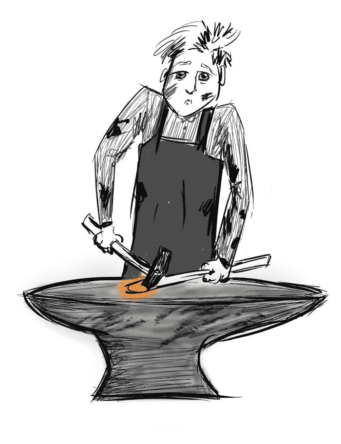
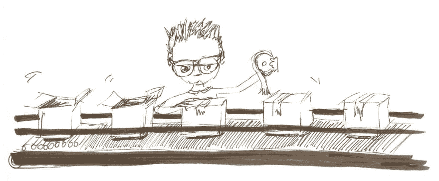
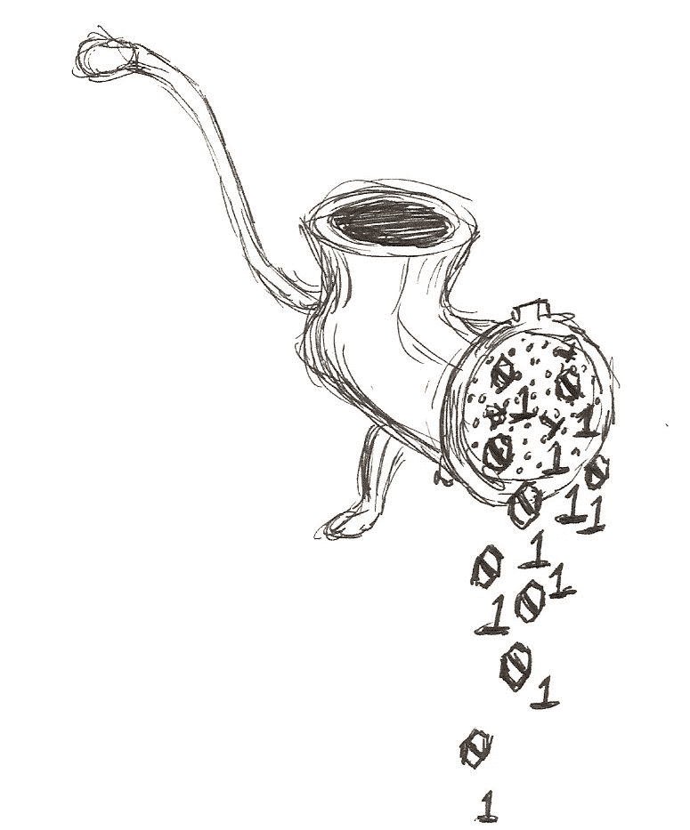

# 作为一种隐喻，软件工艺是职业生涯的玻璃天花板

> 原文：<https://dev.to/daedtech/software-craftsmanship-as-a-metaphor-is-a-career-glass-ceiling-3828>

软件开发是一门手艺吗？

我认为这可能是一个相当长的帖子，所以让我们回到那个话题，回到熟练的理想主义者，以及稍后被认为是“软件工艺”的一些更好的观点。在那之前，请给我讲故事的时间。或者说，可以说是背景故事。

大约 7 年前，我用数字方式“签署”了一份叫做软件工艺宣言的东西。如果你愿意，去搜索一下。

我是第 6662 号签名人。我记得在提交那份表格的时候，我内心有一种平静但强烈的愤怒。

## 作为关怀和职业骄傲的软件工艺

根据网站上的说法，那是 2010 年，我周围都是专家初学者。这些人主要根据资历做出架构决策。你在公司待得越久，你“赢得”的概念性投票就越多，因为“赚”这个词的定义有些可疑。

结果呢？

一个充斥着全球状态、意大利面条、复制粘贴代码的滩头阵地和扭曲曲折的神类的代码库。就像一颗炸弹在代码库中爆炸。

如果你想尝试用新奇的概念来解决它，比如编写单元测试或者关注方法的复杂性，你会听到可预见的专家初学者的费用。“我已经这样做了很多年，我一直在发布没有任何这种东西的软件。”

在那个角色中，我慢慢地获得了有影响力的职位，然后在离开之前做了决策。在我最终离开的时候，构建执行了一个不断增长的单元测试套件，接口存在于代码库中，我为我所做的感到自豪。

但这是一场艰苦的战斗，每一步都让人筋疲力尽。

如果没有软件工艺宣言的激励，我可能不会坚持那么久。它对我说，“不仅关心和有标准是可以的——这是你的职业义务。”

## 我对软件工艺的进化观点

就在去年四月，我写了一篇关于[软件工艺成就好生意](https://www.daedtech.com/software-craftsmanship-is-good-business/)的文章。作为一名受薪软件开发人员(同时也是 ala Developer heritage 公司的一员)，你通过采用像 TDD 这样的实践来取悦自己，而不是通过参加没有人能够裁判的算法琐事竞赛。

你开始在紧密的反馈循环中交易，可预测的交付，以及让你的“客户”真正开心的东西。作为应用程序开发专家，你会变得更有市场。

在那之前的几年，我为软件工艺运动辩护，反对诋毁者。在那篇文章中，我认为这场运动背后的真正推动力是确立软件开发不是一个无法解决的相对主义的泥潭。一些实践比其他的更有效，假装那不是真的就相当于骗术，我们不应该容忍骗术。

总的来说，如果你在这个博客上追溯得足够远，你会发现一堆关于软件工艺的参考资料。在这些参考资料中，你会发现一些主题:

*   我一直尊重运动背后的关怀，我一直重视实践:TDD、持续集成、持续重构等等。
*   而且，每当我用赞美的语言谈论软件工艺时，我总是在谈论那些实践和驱动它们的关怀(包括在关于软件工艺是好生意的帖子中)。

但是，说实话，我从来没有太多使用“工艺”这个词本身。从历史上看，我并没有以这种或那种方式给予它太多的思考——它只是品牌，就像“敏捷”或“精益”

但是这些年来，人们已经开始盲目崇拜行业协会的隐喻，将其融入到标题和实践中，甚至融入到看待软件的哲学方式中。

如果你落入这个陷阱，你的职业生涯就危险了。

## 隐喻，手工艺实践和手工艺生活方式

所以让我在这里说清楚。在这篇文章的其余部分，当我谈到工艺时，我明确地谈到了软件开发是一种工艺，我们应该试图接近中世纪的工艺协会。

*是职业生涯的限制因素，而不是这场运动重新标榜的基本极限编程原则。测试驱动您的代码或频繁地部署到产品中对您的职业生涯来说不是问题。*

 *所以，为了清楚起见，我会试着记住在博客上做一个区分。我将谈论 XP 原则来描述关怀和技术上的优点，以及软件工艺来指代与工艺协会隐喻的密切关系。

说到隐喻，我还应该澄清一些其他的事情。隐喻非常有用，但是如果用得太过，所有的隐喻都会失效，即使是那些几乎完全相关的，比如技术债务。

而真正的信徒*总是*带他们走得太远，迟早的事。

我在这里的意图不是试图让每个人都放弃这个比喻，或者提出一个更好的比喻。见鬼，作为软件开发的隐喻，它肯定比工程或建筑施工好。相反，我在这里的意图是警告你，当你把自己变成[一个熟练的理想主义者](https://www.daedtech.com/journeyman-idealist-architect-programmer-paycuts/)时，你会骄傲地犯下糟糕的职业副作用。

这个博客越来越关注于帮助你成为顾问和 T2 的效率者。换句话说，我希望你成为软件行业的专家，你不要带着自我毁灭的定位去做，就像试图作为一个“工匠”去竞争一样

## 真空中的理想软件工艺

让我们看一下这个术语——软件工艺——引起的图像。换句话说，如果你真的相信软件开发是一门手艺，把语言、栈和测试驱动作为你的交易工具，你可能会有如下的展望。

> 漠不关心的开发人员是商品开发人员，他们九点上班，五点下班，复制粘贴到错误的版本中。他们兜售廉价商品。而我，则是一个工匠。我在晚上和周末的聚会上练习手艺，在工作中运用我的高超技能。因此，我以质量为基础，在精英的供求世界中脱颖而出。我这样做就像一个用木头手工雕刻椅子的人和沃尔玛竞争一样。在一个大规模生产垃圾的世界里，我的客户找我是因为我比竞争对手更好，因为我在乎，因为我如何做我的工作和开展我的业务。

这是一种相当浪漫的情绪。

除此之外，它提供了与霍雷肖·阿尔吉尔的故事一样的内啡肽。埋头苦干，保持谦逊，努力工作，产出高质量的产品，看着宇宙回报你。

但是生活要比这复杂一点。

如果你采取这种策略，你将永远也不会成为一名顾问或高效率的人。无论你进步多少，你都将与最高的个人贡献者工资级别发生冲突，最终只能得到可乐作为奖励。

## 工艺史

我不会过多地讨论这个问题，因为我在我的新书《开发者霸权》中已经对它进行了广泛的讨论。但它值得一游，通过工艺行会和工艺的历史。在那里我们可以看到，它实际上从来没有像上述概念。

最初，手工业行会是中世纪的劳工卡特尔。它们反射性地出现，允许商人在地方政府层面集体讨价还价，反对苛捐杂税。

通过威胁扣留关键服务，他们有一些杠杆，他们小心翼翼地控制价格，供应和公会成员。他们确实也控制质量，但那是行会的次要问题，更多的是当地政府监管的问题。如果他们不能提供一些最起码的质量，那么政府就不需要他们了。

因此，在最早的手工艺行会中，没有类似于质量或其他方面的竞争。对于你现在感觉到的任何认知失调，提前向自由意志主义者协会的倡导者道歉。

最终，伴随着资本主义和市场的出现，手工艺行会衰落了。正是在行会的衰落和工业革命的兴起之间，你拥有了最接近上述理想的东西。

人们手工制作东西，因为那是唯一的选择。他们会在价格或质量上竞争，有点像 RPG 游戏中镇上的两个不同的武器商店:有几把剑的贵商店或有许多蹩脚剑的便宜商店。

然而，这并没有持续太久，因为工业革命的到来几乎把所有这些都抛到了九霄云外。

## 工艺和手艺在现代世界中的作用

工业革命始于机械自动化，从那以后，在商业上，工业革命让世界陷入了剧变。一个拥有足够技术的资本家可能会出现，并创造出一个比高质量的剑匠更好的剑的蓝图。然后，他可以拿着这个蓝图，利用大规模生产和规模经济，以比廉价宝剑制造商更低的成本制造它。

“大盒子”剑匠可以同时在质量和价格上胜过我们两个工匠。或者，随着全球制造业的崛起，它可以去其他地方廉价制造高质量的产品，并利用地理套利来竞争。

或者，它可以做几十件在过去 200 年里已经成为可能的事情。实际上，个体手工艺人作为经济的一个重要组成部分已经死亡。

今天，工艺在工艺美术的意义上更合适。手工制品占据了一个微小的、准艺术的位置。

人们不买它们是因为它们在价格、质量或其他方面竞争激烈。一些消费者可能会以质量为由，但事实要复杂得多。手工制作的商品大多属于文卡特·拉奥所说的“T2”的“优质普通”商品的信号领域。

例如，我非常喜欢 IPAs 和精酿啤酒。我喜欢认为我的调色板可以区分微酿啤酒和大规模生产的鹅岛 IPA，但我不会在盲品测试中打赌太多。

老实说，这种“手工制作”的啤酒购买不仅仅是对快乐或质量的客观评价。

## 工艺品的生产、营销和销售

所以现代工艺在经济中的主要作用是迎合那些想成为拥有工艺的人。当你为 Lois 阿姨购买美食甜椒面包或纪念品时，生产方法胜过一切。

这就是工艺品市场的运作方式。软件市场根本不是这样运作的。

假设我成为了一名现代工匠——一名工艺品供应商。也许我真的喜欢奶酪，我开始在家里自制花式奶酪，并带到派对上。

朋友和家人告诉我，这是有史以来最好的奶酪。嘿，如果你心中有首歌...另外，我有点讨厌自己在 Soul Crushers Inc .做杂务生意的死路一条，所以我存了钱，辞了工作，开始在当地的农贸市场卖奶酪。

如果运气好的话，它会起飞，我开始勉强度日，或者甚至可以过上体面的生活。我专注于我的奶酪:配料，方法，诸如此类的东西。我做不寻常的奶酪，人们会买。

如果我建造了它，他们就会来。

他们为什么买这种奶酪？他们从中提取了什么价值？它挠他们生活中的什么痒？

我不知道，伙计。我看起来像什么，心理学家？你想知道答案，去问别人吧。我是一个艺术家-所有关于工艺。

我只是做奶酪。

## 软件工匠对软件生产、营销和销售的看法

软件工艺模型模糊地未能在所有化身中着陆。中世纪的行会是通过垄断和保证质量来“竞争”的劳工卡特尔，因为他们别无选择。

现代工艺提升了*你如何*建造东西，而不是你建造什么，为什么建造，为谁建造。这些都不像软件开发的实际业务。

哦，就软件开发人员这些天的表现而言，有一种表面上的相似，特别是那些在手工艺行会运动中投资手工艺的人。我们表现得像艺术家风格的工匠，我们吹捧“如何”高于一切。我们相信，我们的与众不同之处和我们的定位，就像我们的奶酪工匠一样，完全取决于我们如何接近我们的“工艺”

但与手工奶酪制造商不同，我们不能向潜在买家分发少量软件。我们没有办法向非开发人员展示他们购买的迄今尚未写成的软件的“如何”。所以，我们用其他方式发出信号。

我们穿着 Github T 恤衫和休闲装(工匠都是为了手艺——而不是取悦男人的肤浅的东西)。我们强调技术官僚的细枝末节，向购买者讲述其重要性，并展示花哨的技术和对它们的强烈看法。我们告诉他们我们是工匠，以防其他信号不知何故错过了标记。

## 软件的实际生产、营销和销售

问题是，正如我之前所说的，软件开发的购买者并不关心这些东西。坦白说，我们的老板也不知道。但是我们的买家和老板都不是目标市场，可以这么说，所有这些文化工艺/行会的东西。

我们是。这是软件开发人员的剧场。

软件开发人员很贵，很难找，很难留住，也很难让人开心。所以当我们去工作，告诉人们我们想被称为工匠，我们的工作是一种艺术形式，他们会想，“好吧，鲍勃是你的叔叔，伙计。”

当我们告诉他们，我们对细节不感兴趣——我们只想专注于制作软件的艺术，让他们来解决剩下的问题时，他们会想，“哇，好吧，那是...甚至更好。”

当我们想要建立秘密的手艺和学徒制度等等，并减缓晋升的速度，直到人们掌握了所有的东西，他们开始想，“好吧，好吧，这是怎么回事？”

他们幽默我们，即使他们认为这些东西很傻。

“当然，是的，我明白。你必须坚持原则。SDD 或 TDD 或 UDD，无论你说什么都非常重要。是的，还有变化的反转。你是一个真正的软件工匠大师，或者不管你现在怎么称呼自己。”

除了找到和留住你有多难之外，他们会让你穿你想穿的衣服，叫你想叫的名字，做你想做的事情，只要你把他们的规范变成代码。考虑到那些足够关心将他们的工作提升到一种艺术形式的有才华的人往往在将这些规范转化为代码方面真的很有效率，这一点更是如此。

## 熟练工理想主义者的玻璃天花板

我通常认为熟练工理想主义者是算法琐事爱好者，兴高采烈地玩着难倒傻瓜的游戏。但它也可以采取某种形式，将编写 web 服务粘合代码视为等同于创作某种雕塑，其他人可能会沉浸在它的美学之美中。

熟练工理想主义发生在我们接受精英主义的伟大错觉时，让人们把我们自己的控制欲望武器化来对抗我们。

假设你发现自己处于这种情况。你认为手工艺行会不是劳工卡特尔，手工艺也不是出售手工编织的篮子。

相反，你认为手艺是你在比周围的人拥有更好的技术的基础上与世界其他人竞争(并取得胜利)。你以为你是手工制作的艺术品。

即使严格来说不是这样，当人们对你的工作感到满意时，这对你的职业生涯又有什么坏处呢？为什么这样不好？

不好是因为你从根本上误解了自己的价值主张和定位。这对任何专业人士来说都是糟糕的，更不用说那些想把自己推销成顾问、专家、效率专家或了解商业世界的人了。这很糟糕，因为购买你的劳动力的人和你的上司在公司里与你交谈。

## XP 原则的实际定位(以及软件工艺)

如果你开始挖掘这些方法的基本原理，你会开始注意到一个不同的主题。说到这些做法，我们为什么要做，为什么要告诉别人我们做？

您出于很多原因实践 TDD，但是其中包括避免镀金(最小化浪费)、及早捕捉缺陷(效率)、防范回归缺陷(保存未来的工作)。这保持了代码的整洁，从而保持了特性速度的恒定(可预测性)和代码的可维护性(低风险)。

随着你经历更多的“工艺”实践，你会开始看到一个模式。当然，你可以谈论软件质量和其他一些事情，但所有这些都是为了降低软件的总拥有成本。这一切都证明了“唯一比一个好的软件开发团队更昂贵的是一个坏的团队”这一智慧。

当你实践这些原则时，你相对于竞争对手的优势和价值主张是你的*成本更低*。你不是一个在农贸市场卖 20 美元奶酪的人。你是沃尔玛。

你越早意识到这一点，你就越早不再像沃尔玛员工那样，向更广阔的世界展示沃尔玛手工制作的折叠椅的优点。*