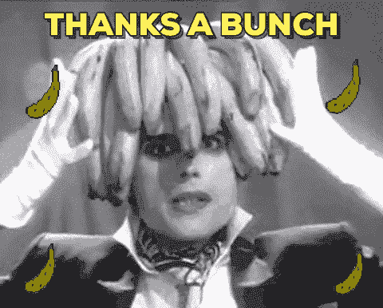

# 设计师可以释放你作为前端开发人员的潜力

> 原文:[https://dev . to/olly/designers-as-a-frontend-developer-3kd 4](https://dev.to/olly/designers-can-unleash-your-potentials-as-a-frontend-developer-3kd4)

学习成为一名前端开发人员和网页设计师对我来说并不容易，而创建优秀的网站就更难了。事实上，我认为我不是创意天才，并决定学习 Django 成为一名后端开发人员，但我真的想编写看起来很棒的网站。

几个月前，我加入了自由职业网站 Fiverr，因为我需要一些现金。于是我注册了一个 Django 的人，然后一个荷兰买家联系我，说他有一些 Figma 的设计，希望我能转换成代码。

我本应该拒绝这份工作，因为我还没有经验，但我需要 5 星评级，因此，在很短的期限(7 天)和 13 页设计要转换的情况下，我接受了这份工作。

一旦我开始，我很快就迷失在页面的标题。设计是如此怪异，以至于 CSS 技巧和堆栈溢出成了我的朋友。在事情变得太复杂的时候，我差点取消订单，但我仍然不知道为什么我没有(剧透:我最终失去了这份工作)。我设法坚持到第 7 天，13 页中只有 6 页完成了。客户生气了，结果我不得不取消了工作，还有其他一些原因。有趣的是，我并不难过；我很高兴，因为我刚刚把一个很棒的 UI 转换成了代码！！！

[T2】](https://i.giphy.com/media/5GoVLqeAOo6PK/giphy.gif)

从那以后，我一直在不断改进，越来越适应设计。

现在，我对想成为下一个克里斯·科伊尔或莎拉·德拉斯纳的初学者的建议是:

1)在 Dribbble.com 或 Behance.com 注册，获得令人惊叹的设计，并尝试转换成代码。在 frontendmentor.io 上注册，因为那里有一些令人敬畏的挑战。查看 codepen.io，尝试逆向工程一些很棒的东西。

哈哈哈哈。谢谢你

[T2】](https://i.giphy.com/media/3oEjHWXddcCOGZNmFO/giphy.gif)

抄送校对
[塞缪尔·丹尼尔斯](https://twitter.com/samuelodan)