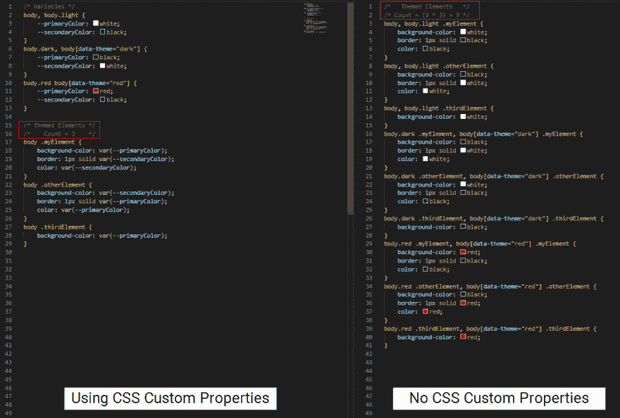

# 编码一个 CSS 主题切换器-如此多的选择！

> 原文:[https://dev . to/Joshua tz/coding-a-CSS-theme-switcher-so-many-options-1cmn](https://dev.to/joshuatz/coding-a-css-theme-switcher-so-many-options-1cmn)

# [](#table-of-contents)目录:

*   简介和“什么是主题化？”
*   选项:
    *   [方法 A: CSS 自定义属性](#method-a-using-css-custom-properties-variables)
        *   [方法 A-1:使用特异性修改变量继承](#method-a1-using-specificity-to-change-variable-inheritance)
        *   [方法 A-2:用 Javascript 重新分配变量值](#method-a2-reassign-variable-values-with-js)
    *   [方法 B:使用萨斯/SCSS](#method-b-using-sass-sassscss)
        *   [方法 B-1:主题作为嵌套地图](#method-b1-themes-as-nested-maps)
        *   [方法 B-2:混合倾倒](#method-b2-simple-mixin-dump)
        *   [方法 B-3:将 CSS 变量拉入 SASS](#method-b3-css-custom-properties-to-sass)
    *   [方法 C:突变状态(React，Vue 等。)](#method-c-mutating-state)
    *   方法 D:疯狂的老派
*   [总结/总结笔记](#wrapup-final-thoughts)

# [](#introduction)简介:

前端 web 主题似乎是当前的热门话题，我不得不承认，我很想赶时髦，给我正在开发的单页面应用程序添加一个黑暗的主题。但是从哪里开始呢？有这么多的指南，但我找不到很多，我觉得以一种涵盖许多不同方法的通用方式充分讨论了 CSS 主题化，而不是本质上是“复制并粘贴到您的代码中”的教程。

所以我开始着手做一个(这篇文章)，一个以宽泛的方式简要讨论了许多可用选项中的每一个的指南，并附有一些简短的示例代码片段。

不过首先…

# [](#what-is-theming)什么是主题化？

在这种情况下，CSS 主题化或 CSS 主题切换是指一组共享的样式(颜色等)，这些样式被分组为一个主题，并且能够在网页上或 SPA 中的主题之间即时切换，而无需刷新页面。

我在这篇文章中使用的一个非常简单的主题示例如下:

*   黑暗主题:
    *   原色:黑色
    *   次要颜色:白色
*   灯光主题:
    *   原色白色
    *   次要颜色:黑色

好了，现在让我们看看不同的实施选项:

# [](#method-a-using-css-custom-properties-variables)方法一:使用 CSS 自定义属性/变量

这很快成为实现可切换主题的最常见的方法之一，并使用了一个较新的 CSS 功能，称为“[自定义属性](https://developer.mozilla.org/en-US/docs/Web/CSS/Using_CSS_custom_properties)”，通常被称为“CSS 变量”。简而言之，CSS 自定义属性允许你定义一个变量，比如“primaryColor ”,这个变量可以在你的 CSS 的其他地方被引用。

这对于主题化至关重要，因为这意味着您可以在数千个元素之间共享一个属性，并且要更改它，您只需要更新一个变量值，而不需要单独更新每个元素的 CSS。

为了深入了解如何使用 CSS 变量来交付可切换的 CSS 主题的细节，让我们将这种方法分成几种不同的方法:

## [](#method-a1-using-specificity-to-change-variable-inheritance)方法 A-1:利用特异性改变变量遗传

好吧，长标题，但我向你保证，这个方法其实挺简单的。事实上，这是最常见的方法之一，并且可以在几个主要的网站上看到。基本上，您将默认主题定义为一组变量，然后通过另一个 CSS 块覆盖完全相同的变量。覆盖将会起作用，因为我们将添加一些特定的东西(类或属性)到一个顶级节点(比如`<body>`)来触发更特定的规则。

下面是一些不使用自定义属性的 CSS 示例:

```
body .myElement {
    background-color: white;
}
body.dark .myElement, body[data-theme="dark"] .myElement {
    background-color: black;
} 
```

这是相同的输出，但是使用了 CSS 变量:

```
body {
    --primaryColor: white;
    --secondaryColor: black;
}
body .myElement {
    background-color: var(--primaryColor);
}
body.dark, body[data-theme="dark"] {
    --primaryColor: black;
    --secondaryColor: white;
} 
```

然后，您可以简单地用 JS 切换类或属性，或者直接用类似于`.setAttribute(‘data-theme’,’dark’)`的东西，或者用类似于 React 或 Vue 的东西中的反应式绑定。

下面是一个在`<body>`上使用 setAttribute 切换主题的快速演示:
[https://codepen.io/joshuatz/embed/xxKOZVr?height=600&default-tab=css,result&embed-version=2](https://codepen.io/joshuatz/embed/xxKOZVr?height=600&default-tab=css,result&embed-version=2)

从技术上讲，您可以不使用 CSS 自定义变量来实现这一点，但是您最终会得到大量手工编码和重复的规则。对于每个特定主题有不同样式的规则/元素，如果使用变量，只需编写一次代码块，如果不使用变量，则需要编写 1 倍的主题。在下面的示例中，您可以看到，对于三个元素和三个主题，没有自定义属性的 CSS 块的最小数量是 9 (3×3)，而对于变量，我们只需要 3(每个元素一个):

[T2】](https://res.cloudinary.com/practicaldev/image/fetch/s--VIgNyu1_--/c_limit%2Cf_auto%2Cfl_progressive%2Cq_auto%2Cw_880/https://thepracticaldev.s3.amazonaws.com/i/8mh80wjt5kyejy095n0d.png)

## [](#method-a2-reassign-variable-values-with-js)方法 A-2 用 JS 重新赋值变量值

这种方法通常用在不仅仅是主题切换，还允许用户通过颜色选择器改变主题属性的时候。让我们假设用户刚刚为他们的主题选择了一个新的自定义原色，他们想要预览它的外观。下面是初始 CSS:

```
:root {
    --primaryColor: red;
    --secondaryColor: blue;
} 
```

只需一点点 JavaScript，我们就可以轻松地修改这些值。现在我们来改变原色:

```
// This will target :root variables
document.querySelector(':root').style.setProperty('--primaryColor',newColor);
// Or, same thing...
document.documentElement.style.setProperty('--primaryColor',newColor); 
```

你可以更进一步，轻松实现主题逻辑来替换整个主题，并在多个主题之间切换:

```
const themes = {
    light: {
        '--primaryColor': 'white',
        '--secondaryColor': 'black'
    },
    dark: {
        '--primaryColor': 'black',
        '--secondaryColor': 'white'
    },
    red: {
        '--primaryColor': 'red',
        '--secondaryColor': 'white'
    }
}
function activateTheme(theme){
    for (let prop in theme){
        document.querySelector(':root').style.setProperty(prop, theme[prop]);
    }
}
// Switch to the dark theme:
activateTheme(themes.dark); 
```

演示:

[https://codepen.io/joshuatz/embed/yLBJeJY?height=600&default-tab=js,result&embed-version=2](https://codepen.io/joshuatz/embed/yLBJeJY?height=600&default-tab=js,result&embed-version=2)

默认情况下，当您通过 Javascript 更改 CSS 属性时，当用户重新加载页面时，更改不会持续。要保存他们对主题的更改，您有一堆不同的选项，这超出了本文的范围。但是，这里有一些通用选项:

*   在值改变时，也 AJAX 到服务器并保存用户数据
    *   然后，当用户登录时，将主题数据作为动态生成的 CSS 或 JSON 发送回来，JSON 将被解析并映射回 CSS 自定义变量
*   将主题保存到本地存储并在页面加载时映射回来
    *   如果你正在使用一个状态管理系统并在那里存储用户的主题配置，这应该很容易用类似[“redux-persist”](https://github.com/rt2zz/redux-persist)的东西来完成
    *   你也可以在页面中注入一个`<style>`标签，覆盖变量值；这就是 dev.to 目前处理主题化页面加载的方式，它通过一个`<style>`标签注入一组不同的变量值，这取决于一个 localStorage 值的值

# [](#method-b-using-sass-sassscss)方法 B:使用 SASS (Sass/Scss)

从技术上讲，你可以使用 Sass 来完成这两种方法 A & B，因为 Sass 转换成 CSS，你也可以把这两种方法，作为 CSS，粘贴到 Sass 中，它应该是有效的。

然而，有一些特定于 Sass 的主题切换方法，我在下面做了概述。

> 旁注:在这篇文章中，我的演示都使用了 SCSS 风格的 Sass，但所有这些都应该可以使用缩进式 Sass；你只需要重新格式化。

## [](#method-b1-themes-as-nested-maps)方法 B-1:主题作为嵌套地图

在 Sass 中实现这一点的一种方法是使用嵌套映射。这段代码的灵感，以及这种方法的最佳指南之一是[这篇文章](https://medium.com/@dmitriy.borodiy/easy-color-theming-with-scss-bc38fd5734d1)。

Sass 中的嵌套映射类似于 JSON，允许嵌套可以保存任何有效 Sass 值的键对映射。这使它们成为保存多个命名主题和每个主题的子属性的好方法。下面是我的两个示例主题，作为嵌套地图保存到$themes:

```
$themes: (
    'dark': (
        'primary': black,
        'secondary': white
    ),
    'light': (
        'primary': white,
        'secondary': black
    )
); 
```

这本身不会生成任何 CSS，所以您必须编写自己的函数/代码来遍历您的主题并生成您想要的 CSS。最好定义可重用的助手函数来处理这个问题，使用 mixins:

```
/**
* Mixin to use to generate blocks for each theme
* Automatically takes @content
*/
$scopedTheme: null;
@mixin themeGen($allThemesMap: $themes) {
    @each $themeName, $themeMap in $allThemesMap {
        .theme-#{$themeName} & {
            // Creating a map that contains values specific to theme.
            // Global is necessary since in mixin
            $scopedTheme: () !global;
            @each $variableName, $variableValue in $themeMap {
                // Merge each key-value pair into the theme specific map
                $scopedTheme: map-merge($scopedTheme, ($variableName: $variableValue)) !global;
            }
            // The original content passed
            @content;
            // Unset
            $scopedTheme: null !global;
        }
    }
}
/**
* Function to call within themeGen mixin, to get value from the current theme in the iterator
*/
@function getThemeVal($themeVar){
    @return map-get($scopedTheme,$themeVar);
} 
```

最后，使用元素:

```
/**
* Actually using theme values to generate CSS
*/
.myComponent {
    @include themeGen() {
        background-color: getThemeVal('primary');
        color: getThemeVal('secondary');
    }
} 
```

下面是一个演示程序，展示了最终生成的 CSS:
[https://codepen.io/joshuatz/embed/aboNPLV?height=600&default-tab=css,result&embed-version=2](https://codepen.io/joshuatz/embed/aboNPLV?height=600&default-tab=css,result&embed-version=2)

从技术上讲，您可以手工编写由此生成的 CSS 代码(一些老派开发人员也这样做)，但是没有很好的理由这样做，如果有什么不同的话，您更有可能编写错误百出的 CSS。

一个相关的，但略有不同的方法(避免全局变量)可以在这里找到。还有[这是](https://stackoverflow.com/a/47873911/11447682)的另一个变体。

## [](#method-b2-simple-mixin-dump)方法 B-2:简单 Mixin“转储”

这种方法不如 C-1 优雅，但也没那么复杂。本质上，您将一大块 CSS 转储到 mixin 中，然后 mixin 重复它，但是使用一个命名的父主题类。

```
@mixin scopeToTheme($themeName,$prop,$val){
    .#{$themeName} & {
        #{$prop}: #{$val}
    }
}

button {
  background-color: red;
  padding: 20px;
  margin-bottom: 4px;
  border-radius: 10px;
  @include scopeToTheme(
    'dark-theme',
    'background-color',
    'black'
  );
  @include scopeToTheme(
    'light-theme',
    'background-color',
    'white'
  )
} 
```

这是生成的 CSS:

```
button {
  background-color: red;
  padding: 20px;
  margin-bottom: 4px;
  border-radius: 10px;
}
.dark-theme button {
  background-color: black;
}
.light-theme button {
  background-color: white;
} 
```

## [](#method-b3-css-custom-properties-to-sass)方法 B-3: CSS 自定义属性到 Sass

我不确定我在哪里见过这样做，但是一个有趣的方法是通过将 CSS 变量拉进 Sass 来将方法 B 和 Sass 结合起来。像这样——CSS:

```
:root {
    --primaryColor: red;
    --secondaryColor: blue;
} 
```

萨斯:

```
$primaryColor: var(--primaryColor);
$secondaryColor: var(--secondaryColor); 
```

# [](#method-c-mutating-state)方法 C:变异状态

我不会详细说明如何将它编码出来，但是从概念上来说，这很容易理解。在反应式框架中，您可以将 CSS 属性(如颜色)作为`state`的一部分。然后，使用 css-in-JS 框架，甚至只是在内联 CSS 中粘贴 state，就可以将 state 中的值插入到作用域 CSS 中。

*   反应演示:
    *   [简单的内嵌样式绑定](https://codepen.io/elainehuang/pen/yPWxRX)
    *   [样式组件+主题提供者](https://codesandbox.io/s/x26q7l9vyq)
*   反应本地 Web
    *   [与“原子”CSS 类的内联样式绑定](https://github.com/necolas/react-native-web/blob/master/docs/guides/style.md)
*   演示视图:
    *   [简单的内嵌样式绑定](https://codesandbox.io/s/3no663nv6)

看起来 Twitter 使用了这种方法，React Native Web。

# [](#method-d-crazy-oldschool)方法 D:疯狂守旧派

有太多的理由不这样做，但我觉得有义务分享这个想法。如果你真的想坚持使用 CSS，但不使用任何变量或接触`<body>`类或属性，你可以手工编码不同的主题作为完全独立的 CSS 文件。像`dark-theme.css`和`light-theme.css`。然后，为了切换主题，您可以使用 AJAX 获取新的主题文件。或者，如果您想支持没有 Javascript 的浏览器，您甚至可以使用服务器端代码来更改包含的主题并强制页面刷新。

顺便提一下，这种方法的效果实际上是更好地利用带宽，因为您只发送需要的主题。

# [](#wrapup-final-thoughts)总结/最终想法:

首先，尽管这是对主题化选项的一个广泛的观察，但它不应该被认为是完全全面的；有无数种方法可以实现自定义主题。

第二，如果你已经完成了这篇文章，你可能还在想“好吧，哪个选项是最好的？”。事实是，你的目标是什么真的很重要。如果你的目标是支持尽可能多的浏览器和/或在样式中有功能(比如将十六进制转换成 RGBA，然后变暗)，那么 SASS 可能是前进的方向(方法 B)。或者，如果您想要最小的 CSS 文件大小和/或将 CSS 值绑定到 JS 值，那么 CSS 自定义属性可能是最合适的(方法 A 和方法 C，或者具有特殊设置的方法 B)。

简而言之，就是使用最适合你的网站/SPA/App 的框架或现有结构的东西。祝主题化愉快！

* * *

本文首次发表于:[https://Joshua tz . com/posts/2019/coding-a-CSS-theme-switcher-a-multi-of-web-dev-options/](https://joshuatz.com/posts/2019/coding-a-css-theme-switcher-a-multitude-of-web-dev-options/)