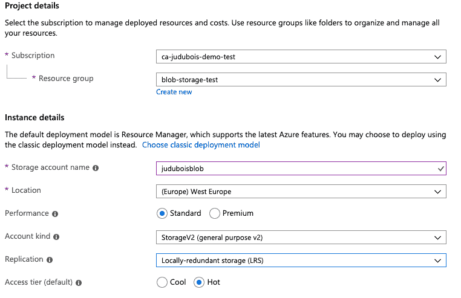
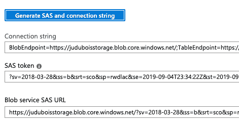

# 使用新的 Azure SDK for Java 异步上传图像，使用 Spring Reactor

> 原文：<https://dev.to/azure/using-the-new-azure-sdk-for-java-to-upload-images-asynchronously-using-spring-reactor-20ha>

## 面向 Java 的全新 Azure SDK

这篇博客文章使用了即将发布的 Azure SDK for Java:在撰写本文时，这仍然是一个预览版，但许多人已经开始使用它了。

更准确地说，我们在这里说的是[Azure SDK for Java(2019 年 8 月预览版)](https://azure.github.io/azure-sdk/posts/2019-08-06/java-preview2.html)，在 Maven Central 上也称为“1.0.0-preview.2”。

这个新版本很重要，因为它使用了一些新的、现代的 API 指南，还因为它的异步特性是由 T2 的 Spring Reactor 支持的。

这些新的反应式 API 非常有趣，因为它们提供了更好的可伸缩性，并且与 Spring 配合得非常好。不幸的是，它们是以使用一个理解起来更复杂、调试起来更复杂的 API 为代价的:这就是我们写这篇博文的原因！

## 上传数据的问题

上传数据需要时间，并且通常需要良好的连接:如果你使用移动设备，这肯定是一个问题！如果我们使用基于线程的模型，这意味着发送几个文件将阻塞几个线程，并且不具有很好的可伸缩性。或者，您可以将所有文件放在一个队列中，由您自己管理:这可能对代码来说相当复杂，并且这将阻止您并行上传这些文件，因此性能不会很好。这就是弹簧反应堆发挥作用的地方！

这里的想法是以异步、非阻塞的方式上传数据，因此我们可以并行上传许多文件，而不会阻塞系统。

## Spring Reactor 和 Spring Webflux

请注意，这里的例子适用于 Spring Webflux:这是 Spring 的反应式版本，由于它的工作方式与传统的 Spring MVC(基于线程)完全不同，所以这段代码不适用于 Spring MVC。这是进行反应式编程时的一个问题:混合反应式代码和基于线程的代码是不可能的，所以你的所有项目都需要使用反应式 API。在我看来，这最适合微服务架构，在微服务架构中，您将使用反应式 API 编写一些特定的服务，使用传统的基于线程的 API 编写一些特定的服务。反应式微服务的开发和调试可能会更复杂一些，但会提供更好的可伸缩性、启动时间和内存消耗，因此它们将用于一些特定的资源密集型任务。

## 创建存储账户

在[Azure 门户](https://portal.azure.com/?WT.mc_id=devto-blog-judubois)中，创建一个新的存储帐户:

[](https://res.cloudinary.com/practicaldev/image/fetch/s--hbV9qnK_--/c_limit%2Cf_auto%2Cfl_progressive%2Cq_auto%2Cw_880/https://thepracticaldev.s3.amazonaws.com/i/2s9225pemizk8rqy7ays.png)

创建后，转到该存储帐户并选择“共享访问签名”，即 SAS。SAS 是一种允许在有限的时间内访问一些资源的签名:它非常适合在特定位置上传数据，而不会损害安全性。

单击“生成 SAS 和连接字符串”后，复制最后生成的文本字段，命名为“Blob 服务 SAS URL”。这是我们将与 Azure SDK for Java 一起使用的。

[](https://res.cloudinary.com/practicaldev/image/fetch/s--x9t8hdeq--/c_limit%2Cf_auto%2Cfl_progressive%2Cq_auto%2Cw_880/https://thepracticaldev.s3.amazonaws.com/i/plc0vr5x7kmde65fwdgc.png)

## 将 Azure SDK for Java 添加到 pom.xml

由于 Azure SDK for Java preview 在 Maven Central 上，这只是将依赖项添加到项目的 pom.xml:

```
<dependency>
    <groupId>com.azure</groupId>
    <artifactId>azure-storage-blob</artifactId>
    <version>12.0.0-preview.2</version>
</dependency> 
```

## 使用新的异步 API

我们先来看看最终的代码，可以在[https://github . com/jdubois/jhipster-azure-blob-storage/blob/master/src/main/Java/com/example/demo/picture resource . Java](https://github.com/jdubois/jhipster-azure-blob-storage/blob/master/src/main/java/com/example/demo/PictureResource.java):
上找到

```
@RestController
@RequestMapping("/api")
public class PictureResource {

    Logger log = LoggerFactory.getLogger(PictureResource.class);

    @Value("${AZURE_BLOB_ENDPOINT}")
    private String endpoint;

    @PostMapping("/picture")
    public void uploadPicture() throws IOException {
        log.debug("Configuring storage client");
        BlobServiceAsyncClient client =  new BlobServiceClientBuilder()
            .endpoint(endpoint)
            .buildAsyncClient();

        client.createContainer("pictures")
            .doOnError((e) -> {
                log.info("Container already exists");
            })
            .flatMap(
                (clientResponse) -> {
                    log.info("Uploading picture");
                    return clientResponse
                        .value()
                        .getBlockBlobAsyncClient("picture.png")
                        .uploadFromFile("src/main/resources/image.png");
                })
            .subscribe();
    }
} 
```

**警告**该 API 仅在使用 Spring Reactive 时有效，因此请注意您需要在 Spring Webflux 项目中使用它，而不是在 Spring MVC 项目中。

使用我们在上面复制的“Blob 服务 SAS URL”完成身份验证，在本例中使用`AZURE_BLOB_ENDPOINT`环境变量提供该 URL:请注意，SAS 包含在 URL 中，因此不需要在其他地方进行身份验证(API 中有一个`credentials()`方法，这可能会引起误解，但在我们的例子中没有用)。因此，这个 URL 应该被安全地存储，而不是与您的代码一起提交。

发送图像使用 Spring Reactor API:

*   我们创建一个特定的`pictures`容器来存储一些数据
*   然后我们使用 Spring Reactor 的 API 上传一张图片
*   我们通过使用`subscribe()`方法来完成，这使得我们的代码异步运行

因此，该方法将很快返回，然后在另一个线程中创建容器并上传图像。这使得调试更加困难，但是允许我们的应用程序接受更多的请求，并且异步处理它们。

## 提高无功代码

这个提示是由 Christophe Bornet 提供的，非常感谢他！

前面的代码是我们通常在项目中看到的，但可以改进，以便让 Spring Webflux 处理`.subscribe()`部分:这将保持 Spring Webflux 和 Azure SDK 之间的背压。同样，这意味着错误将由 Spring Webflux 管理，而不是丢失:在使用 Azure SDK 上传文件时出错的情况下，有了这个新代码，您将有一个干净的 500 错误。

这种变化可以在[这个提交](https://github.com/jdubois/jhipster-azure-blob-storage/commit/17dfd0ea13e582b889b4e54534fdd098ecc3ab96)中看到，这里我们用一个`.then()`代替了`.subscribe()`，我们返回了一个`Mono<Void>`，而不是什么都不返回。处理那个`Mono`并调用`.subscribe()`将是 Spring Webflux 的责任。

结果代码如下:

```
 @PostMapping("/picture")
    public Mono<Void> uploadPicture() throws IOException {
        log.debug("Configuring storage client");
        BlobServiceAsyncClient client =  new BlobServiceClientBuilder()
            .endpoint(endpoint)
            .buildAsyncClient();

        return client.createContainer("pictures")
            .doOnError((e) -> {
                log.info("Container already exists");
            })
            .flatMap(
                (clientResponse) -> {
                    log.info("Uploading picture");
                    return clientResponse
                        .value()
                        .getBlockBlobAsyncClient("picture.png")
                        .uploadFromFile("src/main/resources/image.png");
                })
            .then();
    } 
```

这是反应式 API 的一种更高级的用法，但是结果应该是值得的。

## 结论和反馈

我们目前缺乏 Azure SDK for Java 中这种新的异步 API 的文档和示例。我相信这在一些特定的场景中是非常重要的，比如我们这里，因为如果你想要一个可伸缩的应用程序，通常你不应该在当前线程中上传或下载数据。

这个 SDK 仍然在预览中，所以如果你对这个 API 有反馈，请在这个帖子上发表评论！

例如，当前的 API 允许您创建一个容器(如果容器已经存在，这将失败)或获取一个现有的容器(如果它还不存在，这将失败)。你认为应该有一个类似于`getOrCreateContainer("name")`的选项，如果被请求，它会自动创建一个容器吗？