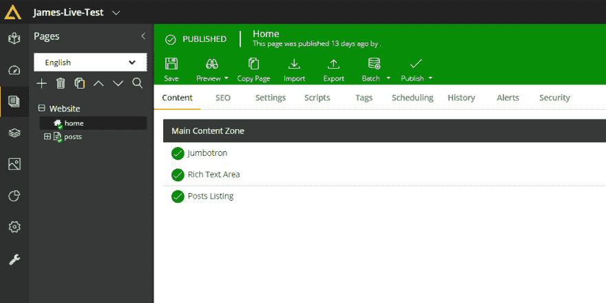
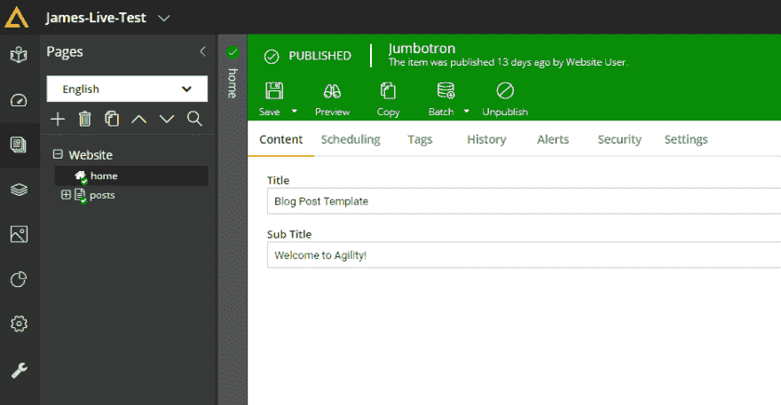
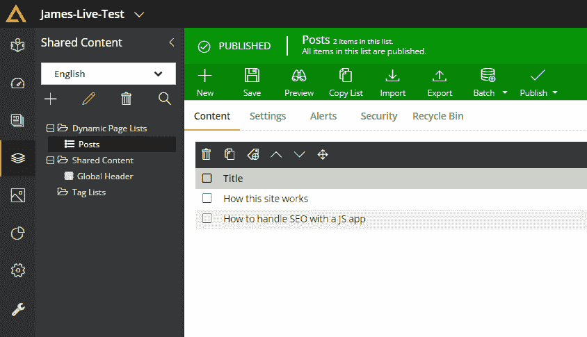
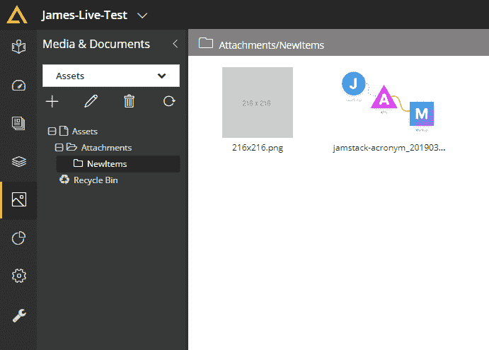
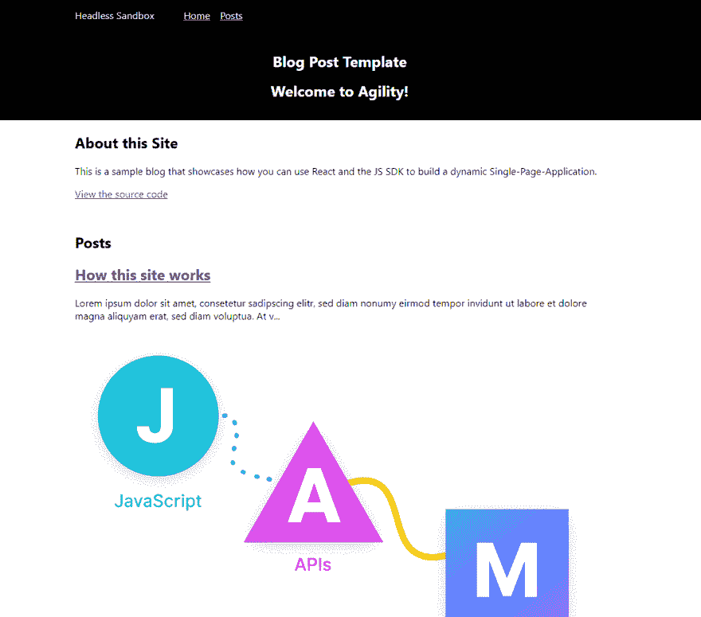

# 将 ReactJS 与 Agility CMS 一起使用

> 原文：<https://dev.to/agilitycms/using-reactjs-with-agility-cms-gl7>

本教程最初由詹姆斯·维德勒撰写，发表在 [Agility CMS 帮助页面](https://help.agilitycms.com/hc/en-us/articles/360031121692--Get-Started-with-the-Content-Fetch-API-React-Blog)上。

*本教程要求您已经使用**博客**模板注册了 Agility 订阅。没有吗？[现在就免费报名](https://account.agilitycms.com/sign-up)(永远)！*

## 简介

[创建 React App](https://create-react-app.dev/) 是 React JS 最简单的入门方式。它的流行性、简单性和易用性使它成为构建现代 web 应用程序的理想候选。这正是我们选择开源一个[Agility CMS Create React App](https://github.com/agility/agility-create-react-app)web App 的原因，以展示您可以将[Agility CMS Content Fetch JS SDK](https://github.com/agility/agility-content-fetch-js-sdk)整合到 React web apps 中的各种方式。

探索 CMS，获取源代码，在本地运行它，并在几分钟内部署您的站点。

## 探索 CMS

Agility 有三个核心组件来管理你的内容，它们是*页面*、*共享内容*和*媒体&文档*。

### 页面

在这里您可以管理和创建您的页面。它们是网站结构的主要表现形式。

[](https://res.cloudinary.com/practicaldev/image/fetch/s--XHKmlO3L--/c_limit%2Cf_auto%2Cfl_progressive%2Cq_auto%2Cw_880/https://help.agilitycms.com/hc/article_attachments/360034672212/mceclip0.png)

在 CMS 中添加页面将允许您的 web 应用程序使用动态路由自动呈现该页面。

一个*页面*使用一个*页面模板*来定义*内容区域*，编辑可以在其中添加内容。一个*内容区域*可以添加一个或多个*模块*。

*模块*是页面的功能组件。它们有相关联的字段，允许编辑输入内容。

[](https://res.cloudinary.com/practicaldev/image/fetch/s--JCwmaJyz--/c_limit%2Cf_auto%2Cfl_progressive%2Cq_auto%2Cw_880/https://help.agilitycms.com/hc/article_attachments/360034676552/mceclip1.png)

在这个 React 站点中，每个*模块*对应一个 React 组件:

也就是我们在浏览器中看到的:

[](https://res.cloudinary.com/practicaldev/image/fetch/s--kH3_TlI9--/c_limit%2Cf_auto%2Cfl_progressive%2Cq_auto%2Cw_880/https://help.agilitycms.com/hc/article_attachments/360034677252/mceclip1.png)

### 共享内容

这是您存储非特定于页面的结构化内容的地方。在这个例子中，我们有一个*帖子*的列表，以及一个代表我们的*全局标题*内容的项目。

[](https://res.cloudinary.com/practicaldev/image/fetch/s--0k05SD_U--/c_limit%2Cf_auto%2Cfl_progressive%2Cq_auto%2Cw_880/https://help.agilitycms.com/hc/article_attachments/360034677632/mceclip2.png)

## 媒体&文档

这是您为 web 应用程序存储静态资产的地方。通常这是用于图像，视频和 pdf，但也可以存储任何你想包括字体资产等。存储在这里的一切都是通过高可用性 CDN 提供的。

[](https://res.cloudinary.com/practicaldev/image/fetch/s--d1WDBP1O--/c_limit%2Cf_auto%2Cfl_progressive%2Cq_auto%2Cw_880/https://help.agilitycms.com/hc/article_attachments/360034735412/mceclip3.png)

## 获取代码

从 GitHub 下载该站点的源代码副本:

```
 git clone https://github.com/agility/agility-create-react-app 
```

<svg width="20px" height="20px" viewBox="0 0 24 24" class="highlight-action crayons-icon highlight-action--fullscreen-on"><title>Enter fullscreen mode</title></svg> <svg width="20px" height="20px" viewBox="0 0 24 24" class="highlight-action crayons-icon highlight-action--fullscreen-off"><title>Exit fullscreen mode</title></svg>

## 项目设置

你应该可以运行这个网站，但是它没有使用你的 *API 键*和 *Guid* 。让我们改变一下，让它使用您的 *API key _and _Guid* ，这样您就可以修改 CMS 中的内容，并查看反映在您的 web 应用程序中的更改。

我们已经创建了两个您可以使用的 *API 键*(您可以创建更多):

1.  **defaultlive** -使用此 *API 键*时，内容获取 API 将只返回*发布的*内容。

2.  **default preview**——使用此 *API Key* 时，内容获取 API 将返回所有最新内容，无论是在*暂存*还是*发布*

请参见[验证您的内容获取 API 调用](https://help.agilitycms.com/hc/en-us/articles/360032225191)，了解有关验证如何工作的更多详细信息。

### 检索您的获取 API 密钥和预览 API 密钥

这个 React SPA 接受一个*fetchAPIKey _ 和一个 _ previewakiey*，所以你可以使用同一个应用程序来预览 T2 和查看*直播/发布的*内容。

请参见[检索您的 API 密钥、Guid 和 API Url](https://help.agilitycms.com/hc/en-us/articles/360031919212) 以检索这些值。实况和预览版的 *Guid* 将是相同的，但是它们将具有不同的 *API Key* 值。请务必记下 **defaultlive** 和 **defaultpreview** *的 API 键值。*

打开文件 **src/agility.config.js** ，用您的值替换 *guid* 和*fetchAPIKey/previewakiey*属性。

## 本地运行

一旦你设置了你的 **agility-config.js** 值，使用 NPM:
安装依赖项

```
npm install 
```

<svg width="20px" height="20px" viewBox="0 0 24 24" class="highlight-action crayons-icon highlight-action--fullscreen-on"><title>Enter fullscreen mode</title></svg> <svg width="20px" height="20px" viewBox="0 0 24 24" class="highlight-action crayons-icon highlight-action--fullscreen-off"><title>Exit fullscreen mode</title></svg>

为了在本地运行站点，因为这是一个 Create React 应用程序(CRA)，我们使用:

```
npm start 
```

<svg width="20px" height="20px" viewBox="0 0 24 24" class="highlight-action crayons-icon highlight-action--fullscreen-on"><title>Enter fullscreen mode</title></svg> <svg width="20px" height="20px" viewBox="0 0 24 24" class="highlight-action crayons-icon highlight-action--fullscreen-off"><title>Exit fullscreen mode</title></svg>

如果一切正常，您应该看到以下内容:

[](https://res.cloudinary.com/practicaldev/image/fetch/s--mlcLKnS---/c_limit%2Cf_auto%2Cfl_progressive%2Cq_auto%2Cw_880/https://help.agilitycms.com/hc/article_attachments/360034762232/mceclip1.png)

## 部署您的网络应用

请参见[部署您的 Agility CMS Create React App Web App](https://help.agilitycms.com/hc/en-us/articles/360032203552)，了解如何将您的网站部署到**静态** web 主机上。

## 了解更多

想了解更多关于 Create React App 的信息吗？查看 Create React App 的[入门文档](https://create-react-app.dev/docs/getting-started)。