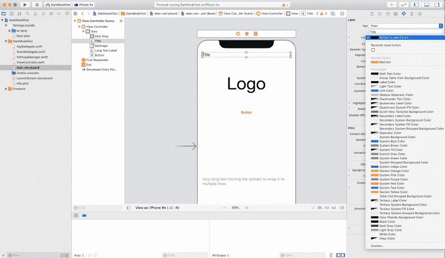
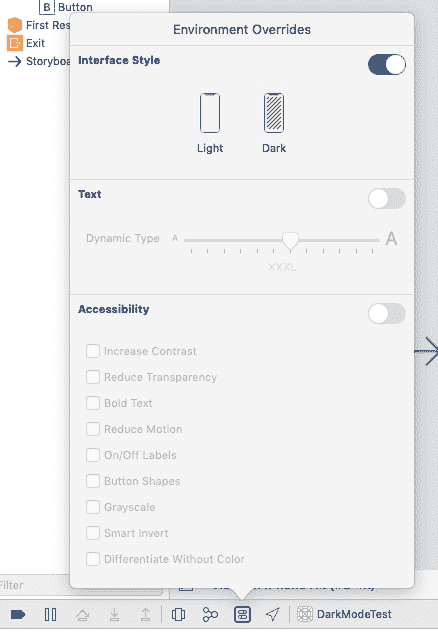
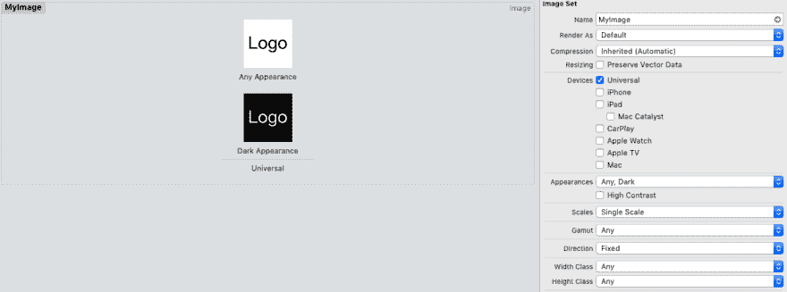

# iOS 中的黑暗模式

> 原文:[https://dev.to/gualtierofr/dark-mode-in-ios-4jkl](https://dev.to/gualtierofr/dark-mode-in-ios-4jkl)

原帖[http://www.gfrigerio.com/supporting-dark-mode/](http://www.gfrigerio.com/supporting-dark-mode/)

如果你是注册开发者，苹果会给你发一封电子邮件，提醒你更新你的应用程序以实现黑暗模式。有一个 [WWDC 会议](https://developer.apple.com/videos/play/wwdc2019/214/)致力于此，这篇文章是对这个主题的快速介绍，并举例说明如何在你的应用中实现主题管理器。
我认为给用户一个选择是很棒的，所以我们可以让他们选择浅色主题、深色主题或适应系统设置，而不是仅仅采用系统默认设置。通过这种方式，你将能够为不愿意为整个系统选择黑暗模式的用户提供黑暗主题，或者也许你的应用程序在光明模式下看起来很棒，即使你喜欢黑暗模式，也最好让它保持白色。Twitter 现在提供了一种基于时间的黑暗模式，所以我可以让它在晚上变暗，在白天变亮。
说够了，你来这里是为了了解如何采用黑暗模式，所以让我们看看如何在 Swift 和 Xcode 中实现它。
和往常一样，我在 [GitHub](https://github.com/gualtierofrigerio/DarkModeTest) 上有这篇文章的所有代码

## [](#system-colors)系统颜色

如果你在应用程序中使用系统颜色，你很有可能已经准备好进入黑暗模式了。UIKit 会自动做正确的事情，SwiftUI 也是如此。

[T2】](https://res.cloudinary.com/practicaldev/image/fetch/s--Ca1Y6Jvp--/c_limit%2Cf_auto%2Cfl_progressive%2Cq_auto%2Cw_880/https://thepracticaldev.s3.amazonaws.com/i/xosczehwh9k36i2660jw.png)

有许多颜色可供你选择，其中一些被标记为二级色或三级色，这样你就可以把它们用在 UI 中不太重要的部分，而原色是用来显示你需要清晰可见的标题或重要信息的。正如我所说的，如果你使用这些颜色，你就可以了，因为 iOS 会为你处理好一切。这也适用于 NSAttributedString，如果你设置前景色或背景色为系统颜色，你会自动看到正确的颜色。这里有一个提示，如果你想在亮暗模式下测试你的应用程序，使用环境覆盖在它们之间切换。这也是测试可访问性的好方法，因为你可以改变字体大小，选择粗体文本等等。

[T2】](https://res.cloudinary.com/practicaldev/image/fetch/s--rUT6ayC3--/c_limit%2Cf_auto%2Cfl_progressive%2Cq_auto%2Cw_880/https://thepracticaldev.s3.amazonaws.com/i/l36s2xfss0dlvx0av4h3.png)

## [](#asset-catalog)资产目录

只要你能使用系统颜色，就没有必要定制任何东西。但是，如果你有一个自定义的颜色，或者如果你有图像，你想显示一个不同的黑暗模式呢？
资产目录现在允许您为亮、暗和任何外观指定不同的图像或不同的颜色。

[T2】](https://res.cloudinary.com/practicaldev/image/fetch/s--EvzGlRHP--/c_limit%2Cf_auto%2Cfl_progressive%2Cq_auto%2Cw_880/https://thepracticaldev.s3.amazonaws.com/i/wrg4jhcqfw1jal40shs8.png)

要为黑暗模式添加新的图像或颜色，只需将外观值更改为任何颜色，这样您就可以为黑暗模式设置不同的图像。
如果您使用资产目录，系统将为您选择正确的颜色/图像，就像选择系统颜色一样。

## [](#dark-mode-in-code)暗码模式

到目前为止，Xcode 在黑暗模式下帮了我们很多，这很好。但是如果我们想要有更多的控制权呢？我们的目标是给用户一个选择，所以让我们看看如何通过强制我们的应用程序变亮或变暗来覆盖系统设置。
我创建了一个 SettingsManager 类，作为用户默认值的包装器，可以很容易地适应自定义设置屏幕。设置为亮、暗和系统，以强制亮模式、暗模式或执行系统默认设置。

```
class SettingsManager {

    var delegate:SettingsManagerDelegate?

    init(withDelegate delegate:SettingsManagerDelegate) {
        self.delegate = delegate
        let appDefaults = [String:AnyObject]()
        UserDefaults.standard.register(defaults: appDefaults)

        NotificationCenter.default.addObserver(self, selector: #selector( self.defaultsChanged), name: UserDefaults.didChangeNotification, object: nil)

    }

    func getCurrentTheme() -> Theme {
        let defaults = UserDefaults.standard
        let themeInt = defaults.integer(forKey: "theme")
        return Theme(rawValue: themeInt) ?? Theme.System
    }
}

extension SettingsManager {
    @objc private func defaultsChanged(notification:NSNotification) {
        delegate?.updateTheme(newTheme: getCurrentTheme())
    }
} 
```

正如您所看到的，我在 NotificationCenter 中添加了一个观察者，这样每当设置发生变化时，我就可以获得通知并将其传递给代理，即我的主视图控制器。

```
extension ViewController: SettingsManagerDelegate {
    func updateTheme(newTheme: Theme) {
        switch newTheme {
        case .Dark:
            overrideUserInterfaceStyle = .dark
        case .Light:
            overrideUserInterfaceStyle = .light
        case .System:
            overrideUserInterfaceStyle = .unspecified
        }
    }
} 
```

overrideUserInterfaceStyle 是一个新属性，它允许我们覆盖系统默认值。将其设置为未指定禁用覆盖，并给我们系统设置。
观察者通知我们应用程序设置发生了变化，但是系统呢？如果您需要知道系统何时变暗(或变亮),您可以实现 traitCollectionDidChange

```
override func traitCollectionDidChange(_ previousTraitCollection: UITraitCollection?) {
    let isDarkMode = traitCollection.userInterfaceStyle == .dark
    print("traitCollectionDidChange: isDark = \(isDarkMode)")
} 
```

推荐看我之前链接的视频，有更高级的例子。这是一个快速的概述，希望足以帮助你支持黑暗模式。编码快乐！