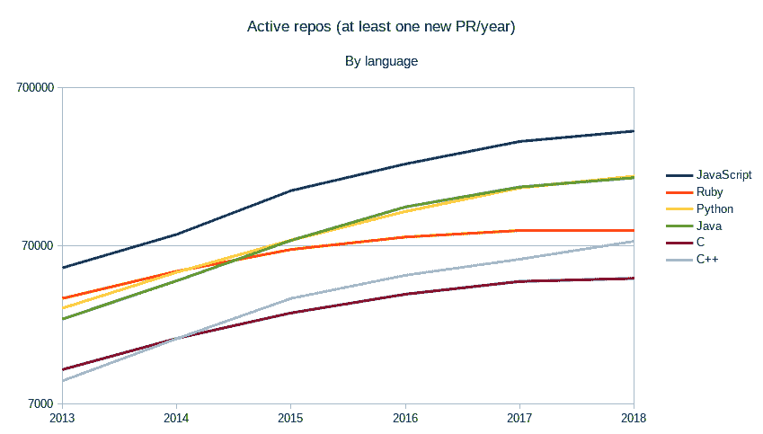

# 对 Dropbox 的反应:跨平台 C++开发的另一个视角

> 原文:[https://dev . to/tanker/reacting-to-Dropbox-another-take-on-cross-platform-c-development-42o 0](https://dev.to/tanker/reacting-to-dropbox-another-take-on-cross-platform-c-development-42o0)

几周前，Dropbox 在一篇博客中宣布，他们已经决定从代码库中删除 C++。这篇文章引发了许多反应，尤其是在 C++ subreddit 上。

建议你先看[那个](https://blogs.dropbox.com/tech/2019/08/the-not-so-hidden-cost-of-sharing-code-between-ios-and-android/)，但是这里有一个 TL；博士:

2013 年，Dropbox 开始使用 C++在 iOS 和 Android 之间共享移动代码，目的是避免重复编写代码。6 年后，他们因为以下开销而掉头:

*   自定义框架和库

*   定制的开发环境

*   移动平台之间的差异

*   寻找并留住有经验的 C++开发人员

这些都是有根据的观点。在 [Tanker](https://tanker.io/) 时，我们不得不面对我们跨平台端到端加密 SDK 的类似挑战。然而，我们采取了不同的方法在多个平台之间高效地共享 C++代码，包括 iOS 和 Android 这对我们很有效。

我将分享我对 Dropbox 发布的想法，然后介绍我们采用的解决方案。

## 残存的障碍

不可否认的是，拥有跨平台的 C++代码并不是一件容易的事情，这意味着多种开销。

招聘可能是一件非常痛苦的事情，尤其是当需要 C++、交叉构建和移动开发方面的专业知识时。此外，内部培训成本很高，而且让受过培训的人在培训几个月后离开是你可能不想冒的风险。

编写和维护特定于语言的绑定具有挑战性，拥有 N 个目标平台通常意味着拥有 N 个绑定，通过 Java 调试 C++代码可能是一场噩梦，更不用说交叉构建的复杂性了。

这些问题在 Dropbox 于 2013 年开始其 C++移动之旅时就已存在，并一直持续到今天。

## 一个不断发展的环境

幸运的是，此后许多其他事情都有所改善。活跃的开源 Github 项目的数量在全球范围内有所增加。2013 年至 2018 年，用 C++编写的项目数量增加了 7.64 倍:

[T2】](https://res.cloudinary.com/practicaldev/image/fetch/s--mregRmfG--/c_limit%2Cf_auto%2Cfl_progressive%2Cq_auto%2Cw_880/https://cdn-images-1.medium.com/max/2000/1%2Ag223aORumUEmQQazXKpmVw.png)

当 Dropbox 声称使用 C++最容易预测的开销是构建框架和库的需求时，我不同意他们的观点。

我不知道当他们决定写[JSON 11](https://github.com/dropbox/json11)时有多少 C++ JSON 库，但是目前大约有 15 个被[isocpp](https://en.cppreference.com/w/cpp/links/libs)列出。任何最近的项目都应该考虑使用其中一个，而不是[手摇一个](https://xkcd.com/927/)。

C++生态系统已经有了很大的发展，我们开始有更多的开源库来解决通常的开发问题。

自 2013 年以来，C++交叉构建支持也有所改善，当时公司经常不得不自己编写工具:

我们需要一个定制的构建系统，创建包含 C++代码、Java 和 Objective-C 包装器的库，并生成 Xcodebuild 和 Gradle 都能理解的目标。

如今，Android NDK 和 Xcode 都搭载了最新的 C++编译器(尤其是前者)。像 CMake 这样的工具可以生成 Xcode 项目，可以从 Gradle 直接[调用。当然，仍然有一些样板文件要写，但仍然比创建一个完整的构建系统要少。](https://developer.android.com/ndk/guides/cmake#usage)

## 油轮跨平台开发

正如我之前提到的， [Tanker](https://tanker.io/) 构建了一个端到端的加密 SDK，我们的其他产品都基于它。有两个版本，第一个是 JavaScript，第二个是 C++。后者用在我们的 iOS/Android SDK 上，也运行在 Linux/Windows/macOS 上。从一开始，我们就和 Dropbox 有着相同的目标:在平台之间共享尽可能多的 C++代码。

拥有一个小的工程师团队，我们不能花时间自己重新实现库(HTTP、加密、格式化等等)，除非我们真的不得不这样做。这就是为什么我们尽可能多地使用和贡献开源项目(例如 [JSON for Modern C++](https://github.com/nlohmann/json) 、 [fmt](https://github.com/fmtlib/fmt/) 、 [sqlpp11](https://github.com/rbock/sqlpp11) )。依赖外部项目伴随着令人畏惧的依赖性管理的阴影，这是 C++的主要挑战之一。

现在不那么真实了，这要归功于 C++包管理器的出现(柯南、亨特、Vcpkg 是最有名的)。我们选择柯南有各种原因，主要是因为它的灵活性。它已经成为我们开发环境的核心元素，允许我们使交叉构建非常简单(你可以观看我的[swamp 2018](https://youtu.be/Gm2h8ZWCEH4?t=58)谈论这个主题)，并提供了一种为多平台构建和打包我们的库和 SDK 的好方法。使用柯南也让我们帮助库作者使他们的项目可打包。

我们架构设计的一个关键点是允许为多个平台构建我们的 SDK，而不仅仅是为移动设备。这意味着用几种编程语言编写绑定。这就是为什么我们选择了一个瘦 C 接口，包装我们的 C++ API。c 是一种简单得多的语言，许多其他语言都可以原生绑定。我们尽可能保持这个接口简单，因为编写绑定仍然很麻烦。阿迪·沙维特称之为[萨拉米香肠法](http://videocortex.io/2017/salami-method/)

由于这一点，我们可以很容易地编写一个 iOS 绑定，因为 Objective-C 可以直接调用 C 代码。Android 仍然需要一些工作，但是我们使用了 JNA 来避免我们自己写 JNI 代码。如果将来需要 Go、Rust 或 C#绑定，这将比我们只有 C++更容易绑定。

## 总之

使用各种开源库并通过柯南管理它们极大地帮助了我们将 SDK 带到 Linux、macOS、Windows、iOS 和 Android 上。Dropbox 的选择在他们制造产品的时候可能是合理的；然而，如今，C++似乎是跨多个平台共享代码的一种非常可行的方式。

我们计划写更多的文章来涵盖依赖管理和使用 Conan 和 CI 脚本在 Tanker 上的交叉构建过程。

* * *

PS:本文由 [Théo Delrieu](https://dev.to/theodelrieu) 原创，发表在[油轮的媒介](https://medium.com/tanker-blog/reacting-to-dropbox-another-take-on-cross-platform-c-development-32dd703252d1)上。由于您自己可能不在 Medium 上，我们在这里复制了它，以便您有机会在您的通知源中看到它。