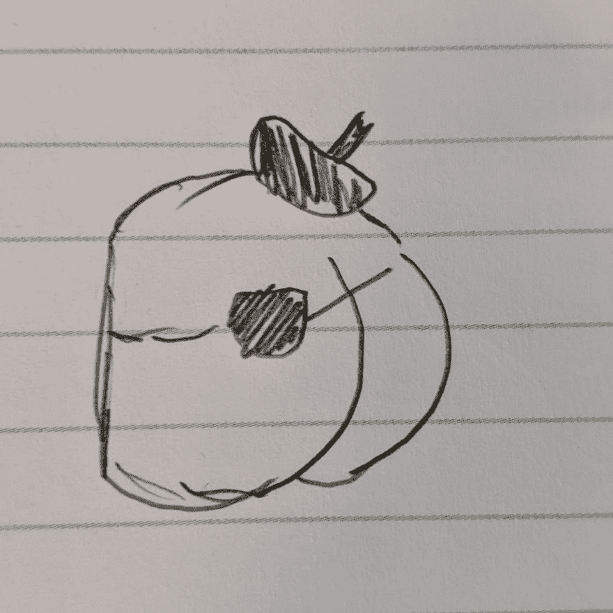

# JS Minute——JavaScript 中的 6-8 种语言类型

> 原文:[https://dev . to/MC espo/js-minute-the-6-8 ish-language-types-in-JavaScript-252g](https://dev.to/mcespo/js-minute-the-6-8ish-language-types-in-javascript-252g)

所以 JavaScript 很奇怪。目前 JavaScript 中有八种 ECMAScript 语言类型(在本文发表时)。我们倾向于说 JavaScript 中的一切都是对象，事实并非如此。实际上，大多数东西的行为都像 JavaScript 中的对象，但这并不意味着它们是真实的对象。因此，深入研究 JavaScript 中存在的有效类型是一件非常好的事情。

在我继续之前，我想澄清一下:我指的是*通用值类型*而不是*基本类型*的概念——如果我指的是基本类型，那么对象就不是讨论的一部分，不幸的是，这是另外一天的另一个 JS 分钟。

现在，为了深入八种类型和“某种”的本质，我们需要一个有帮助的朋友的指导...

[T2】](https://res.cloudinary.com/practicaldev/image/fetch/s--i0UA-YFa--/c_limit%2Cf_auto%2Cfl_progressive%2Cq_auto%2Cw_880/https://thepracticaldev.s3.amazonaws.com/i/u9nrwmyd6r092lufrd4q.jpg)

**遇见了`BUNNSBOS`！**

`BUNNSBOS`将帮助我们理解这些类型，它们是:

*   布尔代数学体系的
*   不明确的
*   数字
*   空(某种程度上)
*   线
*   BigInt(非正式)
*   目标
*   标志

你可能会问是否还有其他类型属于这里。这就是短语“行为像对象”发挥作用的地方——像数组或函数，等等。正如我的朋友所说，这些东西可以被归类为“奢侈品”，值得一文。我只关注 ECMAScript 规范中可识别的类型。😬

那么让我们来快速浏览一下这八个独特可爱的孩子吧。**警告:**这些将会是极度简化的定义。

*   **布尔**:只能输出真或假值。
*   **未定义**:没有值；(或者在变量的情况下)当前没有值的变量容器。
*   **Number** :可以进行数学运算的数值(使用浮点格式)。
*   空(Null):把这想成故意写“这里什么都没有”的另一种方式——这和零或空是不一样的。😬😬😬
*   **字符串**:只是简单的文本。
*   **BigInt** :非常大的数字系统。最高可达计算机中分配的内存。
*   **对象**:数据的容器。
*   **符号**:可以动态产生匿名唯一值的函数。

现在我知道你在想，“难道`BUNNSSOB`不比`BUNNSBOS`更有意义吗？这个缩写里没有两个 S。”-对此我会说，“是啊，但是，看看那个可爱的贝雷帽！”

所以我们粗略地定义了八岁左右的类型。我想开始挖掘这些类型中奇怪的部分——主要是`BigInt`和
`Null`。我们从最简单的开始:`BigInt`

`BigInt`是 JavaScript 中某种程度上有效的类型，或者更恰当地说，它存在于 Node 和 Chrome 的 V8 JavaScript 引擎，以及 Firefox 的 SpiderMonkey 引擎中。`BigInt`很好奇，因为它可以被使用和测试，但不是 [ECMAScript 规范](https://www.ecma-international.org/ecma-262/10.0/index.html#sec-ecmascript-language-types)的正式部分。因此，使用和检查是有效的，但不是规范的正式部分。**注意:**根据 Node 或浏览器的版本，您可能无法测试`BigInt`，这巩固了对该类型上星号的需要。

```
> typeof 143
'number'

> typeof 143n
'bigint' 
```

现在超级诡异的来了:`Null`。所以在 if 语句中可以检查`Null`，但是测试`Null`的类型会有各种各样的问题。

```
> typeof null
'object' 
```

引用 frontend dev extraordinaire 的一句话:

> 在 JavaScript 的第一个实现中，值由两部分表示——类型标签和实际值。有 5 个类型标签可以使用，用于引用对象的标签是 0。然而，空值被表示为空指针，对于大多数平台来说是 0x00。由于这种相似性，null 具有 0 类型标记，它对应于一个对象。

不幸的是，这里更重要的一点是，`Null`输出`Object`的类型是一个 bug。这是一个我们必须忍受的错误，否则我们作为一个社会会乐于打破如此多的应用程序和网站，我们应该决定修复它。

所以我们现在带着`Null`的十字架——有了这个十字架，我们必须面对这样一个事实:我们至少可以检查 BigInt 的类型，但是不能用`Null`进行这样的类型检查。我们的新朋友，`BUNNSBOS`去世了。`BUNSBOS`万岁

[T2】](https://res.cloudinary.com/practicaldev/image/fetch/s--IVmBO5UP--/c_limit%2Cf_auto%2Cfl_progressive%2Cq_auto%2Cw_880/https://thepracticaldev.s3.amazonaws.com/i/cblt014uim72zovkhcqu.jpg)

*   布尔代数学体系的
*   不明确的
*   数字
*   线
*   BigInt(非正式)
*   目标
*   标志

现在，我们对着这些面包哭泣。

😭

* * *

来源、学分:

*   [深厚的 JavaScript 基础](https://frontendmasters.com/courses/deep-javascript-v3/)，凯尔·辛普森
*   [位代码](%5Bhttps://bitsofco.de/%5D)，Ire Aderinokun
*   [ECMAScript 规范](https://www.ecma-international.org/ecma-262/10.0/index.html)
*   还要特别感谢网友✊