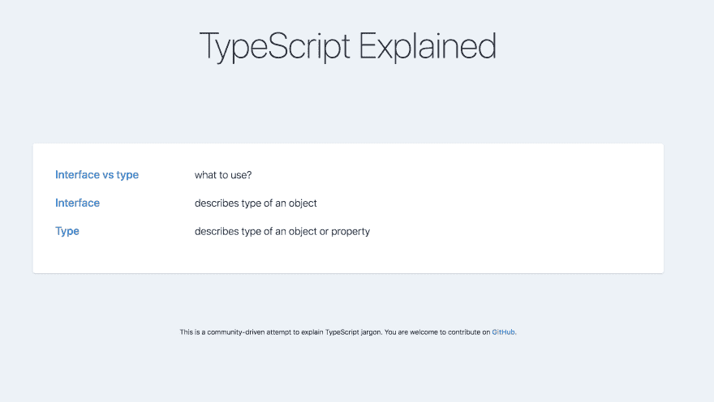
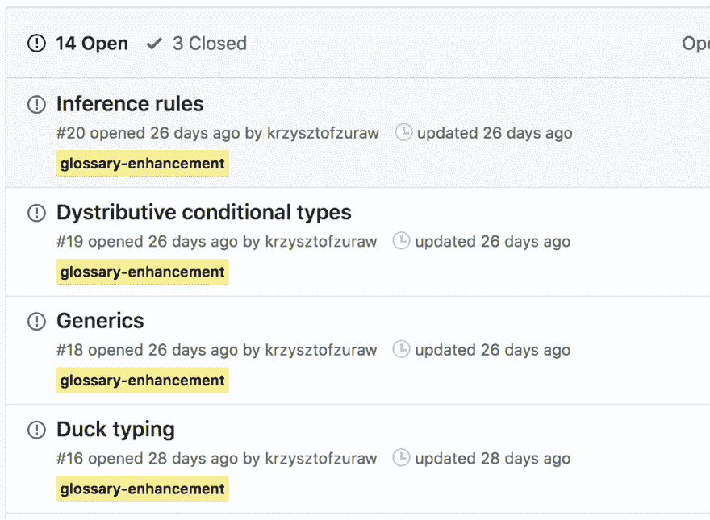

# 给我解释一下打字稿

> 原文:[https://dev.to/krzysztofzuraw/explain-typescript-to-me-1bd3](https://dev.to/krzysztofzuraw/explain-typescript-to-me-1bd3)

你好👋🏻

今天我将描述我的新副业- [ExplainTypeScript](https://explaintypescript.com/) 。

## [](#why)为什么

“给我解释一下 TypeScript”——这句话我听过很多遍了。人们在问使用`type`或`interface`哪个更好，如何使用`generics`或者那些`conditional types`到底是什么。为了帮助他们一点点
我创造了[ExplainTypeScript.com](https://explaintypescript.com/)。

[T2】](https://res.cloudinary.com/practicaldev/image/fetch/s--UIKEZaDP--/c_limit%2Cf_auto%2Cfl_progressive%2Cq_auto%2Cw_880/https://i.imgur.com/VcjnsTr.png)

这个网站背后的想法很简单——你想从 TypeScript 解释一些术语(就像前面提到的`type`)，所以
你通过搜索条目来获得关于这个主题的简明信息。
你还可以找到一些更详细解释的链接。

我喜欢把 ExplainTypeScript 看作是一个术语表，比如[dictionary.com](https://www.dictionary.com/)。

[T2】](https://res.cloudinary.com/practicaldev/image/fetch/s--EebfDF12--/c_limit%2Cf_auto%2Cfl_progressive%2Cq_auto%2Cw_880/https://i.imgur.com/XGyDQz3.png)

## [](#contributions-are-welcome)欢迎投稿！

如果你有足够的勇气进入 https://explaintypescript.com/，你可能会注意到那里没有那么多的条目。

这是真的-我刚刚开始这个项目。但是如果你想帮助项目开发，你可以在这里添加、修复或建议一个条目[。](https://github.com/krzysztofzuraw/explain-typescript/issues?q=is%3Aissue+is%3Aopen+sort%3Aupdated-desc)

## [](#plans-for-the-future)对未来的计划

[T2】](https://res.cloudinary.com/practicaldev/image/fetch/s--t8kVkLBP--/c_limit%2Cf_auto%2Cfl_progressive%2Cq_auto%2Cw_880/https://i.imgur.com/3MWlbXw.png)

如您所见，待办事项列表中充满了将要添加的术语——未来几个月的计划是什么。当词汇表变大时，我会增加搜索功能。如果您想添加任何内容，请通过此[链接](https://github.com/krzysztofzuraw/explain-typescript/issues/new/choose)添加。

## [](#inspiration-amp-tech-stack)灵感&科技栈

我的主要灵感来源是[简化的 JavaScript 行话](http://jargon.js.org/)。我查看了源代码，注意到他们正在使用[杰基尔](https://jekyllrb.com)。

我走了相似的路线，但我选择了 [Gatsby.js](https://www.gatsbyjs.org/) 。为了设计我的页面，我使用了 [TailwindCSS](https://tailwindcss.com/) 。

事实证明，它不能很好地处理动态生成的 html。为什么？

要设计页面上某个元素的样式，你需要先给它们添加类。然而`Gatsby`是动态生成 html 的(它是通过`dangerouslySetInnerHTML`插入的)，所以没有办法(或者至少我不知道)如何动态添加那些`classNames`。

这就是为什么我必须通过`@apply` :
包含全局样式

```
h2 {
  @apply text-xl font-medium mt-6 mb-2;
}

a {
  @apply font-light text-blue-600;
} 
```

<svg width="20px" height="20px" viewBox="0 0 24 24" class="highlight-action crayons-icon highlight-action--fullscreen-on"><title>Enter fullscreen mode</title></svg> <svg width="20px" height="20px" viewBox="0 0 24 24" class="highlight-action crayons-icon highlight-action--fullscreen-off"><title>Exit fullscreen mode</title></svg>

这很好，但是如果我只想针对其中一个条目的第三段呢？目前我不会有这样的可能性。

这是我需要花一些时间去做的事情。如果你知道这个问题的解决方案，请不要犹豫，与我联系。

## [](#summary-amp-tldr)总结&TL；速度三角形定位法(dead reckoning)

我已经创建了 [ExplainTypeScript](https://explaintypescript.com/) 来解释 TypeScript 术语。访问它
，并通过 [github](https://github.com/krzysztofzuraw/explain-typescript) 告诉我我需要改进的地方👨🏻‍💻。