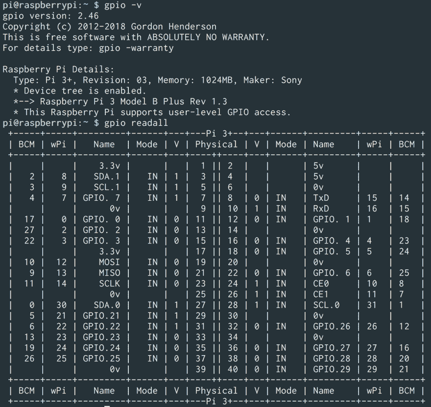
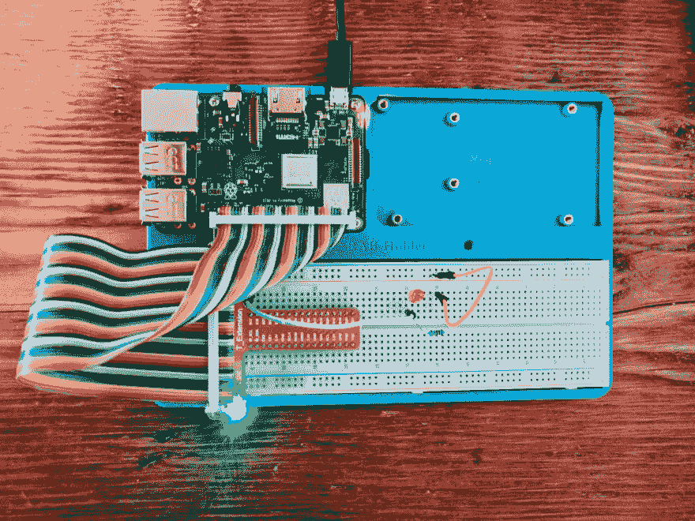

# 为 Ruby 设置树莓 Pi

> 原文:[https://dev . to/codenamev/setting-up-a-raspberry-pi-for-ruby-8 J1](https://dev.to/codenamev/setting-up-a-raspberry-pi-for-ruby-8j1)

> **更新** 9/6/19:这是我的 [Sunfounder Superkit 系列](https://blog.codenamev.com/tag/sunfounder-super-kit/)的*第一部*。

[T2】](https://res.cloudinary.com/practicaldev/image/fetch/s--E3xhJq9c--/c_limit%2Cf_auto%2Cfl_progressive%2Cq_auto%2Cw_880/https://blog.codenamev.com/conteimg/2019/08/raspberry-pi-sunfounder-kit--1-.jpeg)

Ruby 预装在 Raspbian 上，可惜不是最新版本。经过一段时间的头痛之后，以下是我学到的东西以及如何弥补。

我的梦想是做一个分体式显示器，但由于我对微控制器几乎没有经验，所以我决定选择 Sunfounder 的 Superkit (v3)。老实说，它很便宜，但也有很多不同的组件可以玩。让我们看看我们能建立什么样的 lit 实验。

# [](#flashing-the-sd-card)闪烁的 SD 卡

我决定使用 Raspbian 操作系统(带桌面客户端)，只是为了让学习曲线更容易。下载完最新的图像后，我安装了 T2 蚀刻机，这非常容易将图像刻录到微型 SD 上。

# [](#booting-up-amp-configuration)开机&配置

启动树莓派再简单不过了。小心地插入微型 SD 卡，插上电源线和 HDMI 接口，大约 1 分钟后，我准备好了。

第一件事的第一，改变系统密码(因为安全)。

```
passwd 
```

B+的一个好处是你可以远程控制 GPIO(稍后会详细介绍)。不幸的是，这个特性和 ssh 在默认情况下都是关闭的。所以，让我们在那些坏女孩上翻转桌子。

1.  从`Preferences`菜单启动`Raspberry Pi Configuration`
2.  导航至`Interfaces`选项卡
3.  选择`SSH`旁边的`Enabled`

> **更新**:我已经为我所有的实验启动了一个[小回购，其中包括一个](https://github.com/codenamev/ruby-pi)[方便的脚本来自动完成剩下的设置](https://github.com/codenamev/ruby-pi/blob/master/bin/setup)。

对我来说，最新的`gpio`软件已经过时，简直是在制造麻烦。让我们重新开始吧:

```
sudo apt-get update && sudo apt-get upgrade 
```

嘣。系统已配置，依赖关系已更新，GPIO 已正确配置。查看我们在 B+上的 GPIO 中获得的所有精彩引脚！

<figure>[](https://res.cloudinary.com/practicaldev/image/fetch/s--Jp5YQAjl--/c_limit%2Cf_auto%2Cfl_progressive%2Cq_auto%2Cw_880/https://blog.codenamev.com/conteimg/2019/08/raspberry-pi-b-plus-gpio-table--1-.png) 

<figcaption>树莓派 B+ GPIO 表</figcaption>

</figure>

好了，现在是红宝石时间！

# [](#setting-up-ruby)设置红宝石

截止到今天(2018 年 6 月)，Raspbian 预装了 Ruby！为了让一些带有原生扩展的宝石正确构建，我只需要*让*得到`ruby-dev`

```
sudo apt-get install ruby-dev 
```

# [](#finally-blinking-a-damn-led)一个该死的 LED 终于闪烁了

在经历了所有这些之后，你应该准备好使用那个已经尘封了这么多年的 Pi 了。只是为了好玩，让我们用你闪亮的新微控制器来执行主要任务:*闪烁 LED* 。

利用一对跳线、一个 LED 和一个 220ω电阻，我们可以安全地控制 LED 的状态:

<figure>[](https://res.cloudinary.com/practicaldev/image/fetch/s--oTVocIrR--/c_limit%2Cf_auto%2Cfl_progressive%2Cq_auto%2Cw_880/https://blog.codenamev.com/conteimg/2019/08/raspberry-pi-blinking-led--1-.jpeg) 

<figcaption>树莓派 B+闪烁 LED 配红宝石！</figcaption>

</figure>

# [](#wrapping-it-up)包装完毕

[T2】](https://res.cloudinary.com/practicaldev/image/fetch/s--056ZcGo6--/c_limit%2Cf_auto%2Cfl_progressive%2Cq_66%2Cw_880/https://blog.codenamev.com/conteimg/2019/08/wrap-it-up.gif)

好吧，我明白了，不要太激动人心。但是，嘿，通过同样的设置，我可以看到修改代码，比如说，当我的测试失败时点亮 LED。

请继续关注我记录的关于微控司法的毒品讨伐。