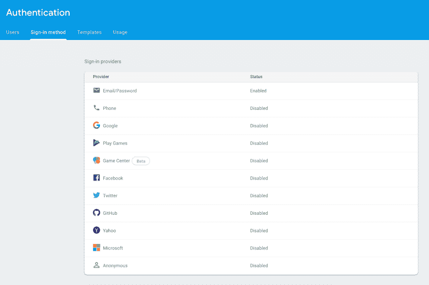

# 使用 GraphQL、Hasura 和事件驱动的无服务器构建可伸缩的 Flutter 应用程序，第 2 部分——设置 Auth

> 原文：<https://dev.to/hasurahq/building-scalable-flutter-apps-using-graphql-hasura-and-event-driven-serverless-part-2-setting-up-auth-24a2>

[](https://res.cloudinary.com/practicaldev/image/fetch/s--afPRdcKc--/c_limit%2Cf_auto%2Cfl_progressive%2Cq_auto%2Cw_880/https://blog.hasura.io/conteimg/2019/09/hasura-flutter-wo-border-7.png)

*本教程由*[*Can tap NAR*](https://twitter.com/cntaspinar)*编写，并作为 [Hasura 技术作者计划](https://blog.hasura.io/the-hasura-technical-writer-program/)的一部分发布，该计划旨在支持为开源 Hasura GraphQL 引擎编写指南和教程的作者。*

## 简介

这是“**使用 Hasura、GraphQL 和事件驱动的无服务器应用**构建可伸缩的 Flutter 应用”系列的第二部分。这一部分将介绍 Hasura 如何使用 Firebase 服务来提供认证和业务逻辑。

> **[第 1 部分](https://blog.hasura.io/build-flutter-app-graphql-hasura-serverless-part1/)** 讲述了如何部署 Hasura 以及如何用权限对关系数据进行建模。 **[第 3 部分](https://blog.hasura.io/build-flutter-app-hasura-firebase-part3/)** 讲述了如何创建颤振前端。

## 认证

到目前为止，我们使用了 Hasura 的权限系统来限制对某些角色的访问。Hasura 检查`X-Hasura-User-Id`头以识别哪个用户发出了请求。然而，现在任何人都可以发送此邮件头并充当其他用户。为了防止这种情况，我们将在 JWT 模式下使用 Hasura。在 JWT 模式下，Hasura 将期待一个带有令牌的授权头。不允许发送像 X-Hasura-User-Id 这样的直接标头。我们将通过使用自定义声明在 Firebase 令牌中存储`X-Hasura-User-Id`和用户角色。

### 火基

创建一个新的 Firebase 项目，并前往**认证>登录方法**。在提供商中启用电子邮件/密码。

[](https://res.cloudinary.com/practicaldev/image/fetch/s--0BI5REm0--/c_limit%2Cf_auto%2Cfl_progressive%2Cq_auto%2Cw_880/https://lh5.googleusercontent.com/pGdK2W0ugv1j0KC-DC_054D1NWKm2CUx95rszmtWMHnWXT_bXkmjOiXsmTT7Ds0p8y6FYAbuAA_wf5iuctb57XtgCWCH8fsu9i-W7MEgT8NHPBUKDGIsXYkzJ7GXGXADPZM1ZngdxjzRJLB57A)

为了在 Firebase 令牌中存储`X-Hasura-User-Id`和`X-Hasura-User-Role`，我们将使用 Firebase Admin SDK 的自定义声明特性。有几种方法可以在注册过程中为用户设置必需的声明。我们将利用 Firebase 云功能，并创建一个自定义注册功能。通过此功能，我们将确保用户在注册过程完成时拥有所需的声明。如果您还没有初始化 Firebase 项目，请初始化它。

```
$ npm install -g firebase-tools // Install Firebase CLI
$ firebase login // Login to your Firebase account
$ firebase init // Initialize a Firebase project 
```

<svg width="20px" height="20px" viewBox="0 0 24 24" class="highlight-action crayons-icon highlight-action--fullscreen-on"><title>Enter fullscreen mode</title></svg> <svg width="20px" height="20px" viewBox="0 0 24 24" class="highlight-action crayons-icon highlight-action--fullscreen-off"><title>Exit fullscreen mode</title></svg>

从列表和设置功能中选择您的项目。一旦设置完成，将目录切换到**功能**文件夹。

```
$ npm install –save graphql-request 
```

<svg width="20px" height="20px" viewBox="0 0 24 24" class="highlight-action crayons-icon highlight-action--fullscreen-on"><title>Enter fullscreen mode</title></svg> <svg width="20px" height="20px" viewBox="0 0 24 24" class="highlight-action crayons-icon highlight-action--fullscreen-off"><title>Exit fullscreen mode</title></svg>

打开 index.js 并添加以下几行。不要忘记用自己的值替换**<your-graph QL-endpoint>**和**<your-admin-secret>**。