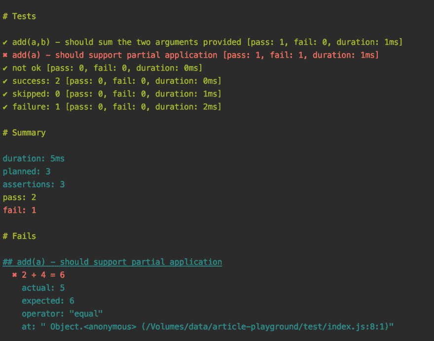

# 工具和测试体验的设计

> 原文:[https://dev . to/Lorenzo fox 3/tools-and-the-design-of-a-testing-experience-2mdc](https://dev.to/lorenzofox3/tools-and-the-design-of-a-testing-experience-2mdc)

工具在开发人员的工作流程中无处不在。NPM:JavaScript 包管理器确实充满了旨在提高软件质量和开发者效率的生产力工具。然而，这不是我们将在本文后面看到的唯一来源。

一些工具可以直接改善面向用户的产品，比如代码精简器( [terser](https://github.com/terser-js/terser) )，它有助于减少生产 web 应用程序中的代码量。但是大多数时候，工具更有助于开发人员改善他们自己的体验，使代码更容易维护、调试和发布。在这个意义上，你可以说它也间接帮助了最终用户。例如，打包器( [rollup](http://rollupjs.org/guide/en/) 或打包器( [webpack](https://webpack.js.org/) )将允许开发人员将代码库分割成更小的块，以便于推理。

工具的范围也可能不同。有些人非常专注于一个特定的问题( [mkdirp](https://www.npmjs.com/package/mkdirp) )，而其他人则试图围绕广泛的问题建立一个完整的用户体验( [create-react-app](https://github.com/facebook/create-react-app) )。
在第二种情况下，我们可能没有意识到，但工具真的变成了**关于如何解决一组问题的观点或过程的表达**。因此，这种工具通常必须做出一些权衡，并且根据需求可能会损害用户体验。

在本文中，我们将根据软件开发周期中出现的实际问题和需求来定制我们自己的测试体验，而不是使用现有的充满特性的测试框架。

## [](#tailoring-a-test-experience)量身定制测试体验

我选择测试体验作为主题*是因为它相当具有挑战性，因为它可能涉及许多不同的主题(代码转换、报告、不同的运行环境、性能等),并且可能在两个不同的用例之间*变化很大*。这可能是 JavaScript 生态系统中已经有许多测试框架的原因。*

### [](#monolithic-design-vs-the-unix-philosophy)单片设计 vs[UNIX 哲学](https://en.wikipedia.org/wiki/Unix_philosophy)

流行的 JavaScript 测试框架通常带有很多特性。如前所述，这些特性在某种程度上是对您可能遇到的问题以及如何解决它们的看法，因此您不必考虑它，可以专注于您的测试。它们通常提供配置设置和编程扩展点，因此您可以根据自己的需要调整您的测试体验，并为工作流带来一些灵活性。

另一方面，如果您的需求有点超出框架，它们可能不够灵活或引入额外的复杂性。例如， [AvA](https://github.com/avajs/ava) 在你的测试文件中自动传输 ESM 语法。如果您以某种方式编写您的测试，这可能会非常有用(您不必配置任何东西来完成 transpilation！)但是如果你用另一种方式编写你的测试，它可能很难绕过或者让困惑。这是一个意见如何违背灵活性的例子。

另一种方法是 [UNIX 哲学](https://en.wikipedia.org/wiki/Unix_philosophy)，它

> 支持可组合性，而不是整体设计

这个想法是将小的有重点的程序组合在一起以实现一个更大的目标。

与我们的 AvA 示例相比，您可以使用三个组件来构建测试体验。

```
transpiler -> test runner -> reporter 
```

如果你不需要 transpiler，你可以把它从管道中移除。

只要每个组件都被设计成使用一个公共接口(文本流)，这就非常灵活。

## [](#a-simple-node-program)一个简单的节点程序

老板过来问你:

> 我要你写一个函数节点数学库。

您同意第一个扩展来实现一个 *add* 函数来执行两个数的求和，并且它将支持[部分应用](https://en.wikipedia.org/wiki/Partial_application)。你带来了下面的实现(这里的实现实际上是一个细节)。

```
//src/index.js

module.exports = (a, b) => {
    if(b === void 0){
        return x => a + x;
    }

    return a + b;
}; 
```

您编写以下测试程序。

```
//test/index.js
const add = require('../src/index.js');
const {test} = require('zora');

test(`add(a,b) - should sum the two arguments provided`, t => {
    t.eq(add(2,4), 6, `2 + 4 = 6`);
});

test(`add(a) - should support partial application`, t => {
    const add_two = add(2);
    t.eq(add_two(3), 6, `2 + 4 = 6`); // let's make that one fail
    t.eq(add_two(11), 13, `2 + 11 = 13`);
}); 
```

你会注意到我们正在使用的测试程序是 [zora](https://github.com/lorenzofox3/zora) 。遵循 UNIX 哲学，这是我写的一个小库，专门用于编写 JavaScript 测试程序:**而不是**运行它们，**而不是**转换源代码，**而不是**在控制台中打印颜色，等等。当然，它有自己的观点，但对这篇短文特别有用，因为与其他全功能框架相比，它非常专注于一个单一的问题。

您可以使用 Node 运行测试程序，这要感谢命令:

```
node ./test/index.js 
```

您将在控制台中看到以下输出

```
TAP version 13 # add(a,b) - should sum the two arguments provided ok 1 - 2 + 4 = 6
# add(a) - should support partial application not ok 2 - 2 + 4 = 6
  ---
    actual: 5
    expected: 6
    operator: "equal"
    at: " Object.<anonymous> (/Volumes/data/article-playground/test/index.js:8:1)"
  ...
ok 3 - 2 + 11 = 13
1..3  
# not ok
# success: 2
# skipped: 0
# failure: 1 
```

输出是一个名为 TAP 的文本格式( [Test Anything Protocol](https://testanything.org/) )。它给你程序的每个测试的状态，在失败的情况下，你会有失败的位置和失败的原因，这样你就可以修复你的测试/源代码。毕竟，这是你从测试程序中所能期待的。

### [](#composing-with-a-pipeline)用管道排版

可以说，输出不是很人性化(没有颜色，通过测试可能被认为是噪音，等等)。大多数测试框架都附带了一组报告器，您可以根据自己的喜好从中进行选择。在 UNIX 哲学中，你会要求另一个程序来处理这个输出流。TAP 是一种广泛传播的文本协议，不仅仅是在 JavaScript 社区中，因此您会发现很多工具能够解析和处理 TAP 流。
例如，你可以从 NPM 注册表安装 [tap-summary](https://github.com/zoubin/tap-summary) ，现在输入命令:

```
node ./test/index.js | tap-summary 
```

您将获得以下输出

[T2】](https://res.cloudinary.com/practicaldev/image/fetch/s--lYKD2wGP--/c_limit%2Cf_auto%2Cfl_progressive%2Cq_auto%2Cw_880/https://thepracticaldev.s3.amazonaws.com/i/baz56t27prskk0korovb.png)

如果你需要不同的东西，没有问题。只需在 NPM 搜索 tap reporters 或安装一个来自不同技术的二进制文件。这就是将报告任务委派给不同流程的好处。

### [](#exit-codes)退出代码

仿植物怪兽佐拉本身是平台不可知的:它不负责运行你的测试程序。你应该可以在任何支持 Ecmascript 规范(2018 版)的 JavaScript 运行时做到这一点:节点> = 10，现代浏览器等。然而，在节点环境中，如果测试失败，执行测试程序的进程会以不同于 0 的代码退出。这实际上是许多持续集成平台中的一个需求，用来将一个构建标记为失败并避免误报。然而，如果你打印测试程序的退出代码，你将得到 0。

```
node ./test/index.js; echo $?; 
# > 0 
```

幸运的是，通过将报告部分委托给一个更“平台敏感”的不同进程，我们可以解决这个最终的问题，因为退出代码将是管道中最后一个进程返回的代码:

```
node ./test/index.js | tap-summary; echo $?; 
# > 1 
```

## [](#more-advanced-program)更高级的程序

接下来的一周，您同意交付乘法运算符。随着代码库的增长，您的团队决定将代码分成不同的文件，以便更好地组织代码并简化维护。您现在有了下面的实现。

```
// src/util.js
exports.curry = fn => (a, b) => b === void 0 ? x => fn(a, x) : fn(a, b); 
```

```
// src/addition.js
const {curry} = require('./util');

module.exports = curry((a, b) => a + b); 
```

```
// src/multiplication.js
const {curry} = require('./util');

module.exports = curry((a, b) => a * b); 
```

```
// src/index.js (the entry point of the library)
exports.add = require('./addition');
exports.multiply = require('./multiplication'); 
```

项目的测试部分也将反映新的组织。

```
// ./test/addition.spec.js
const {add} = require('../src/index.js');
const {test} = require('zora');

test(`add(a,b) - should sum the two arguments provided`, t => {
    t.eq(add(2, 4), 6, `2 + 4 = 6`);
});

test(`add(a) - should support partial application`, t => {
    const add_two = add(2);
    t.eq(add_two(3), 6, `2 + 4 = 6`); // let's make that one fails
    t.eq(add_two(11), 13, `2 + 11 = 13`);
}); 
```

和

```
// test/multiplication.spec.js
const {multiply} = require('../src/index.js');
const {test} = require('zora');

test(`multiply(a,b) - should multiply the two arguments provided`, t => {
    t.eq(multiply(3, 4), 12, `3 * 4 = 12`);
});

test(`multiply(a) - should support partial application`, t => {
    const time_three = multiply(3);
    t.eq(time_three(4), 12, `3 * 4 = 12`);
    t.eq(time_three(10), 30, `3 * 10 = 30`);
}); 
```

整洁！但是新问题出现了。如果我们继续使用 Node 作为 runner，我们现在需要运行几个测试程序(每个*.spec.js 文件一个)。一种简单的方法是简单地运行每个文件:

```
node ./test/multiplication.spec.js && node ./test/addition.spec.js 
```

然而，这种解决方案不是很有效，我们可能想把所有的测试作为一个整体来考虑。

### [](#the-simple-solution)简单的解决方法

我们可以为我们的测试程序创建一个入口点，就像我们已经为我们的库做的一样

```
// ./test/index.js
require('./addition.spec.js');
require('./multiplication.spec.js'); 
```

就这样，我们现在可以用一个命令运行所有的测试，并且仍然将输出传送到另一个进程。

```
node ./test/index.js | tap-summary 
```

另一个优点是许多执行代码转换的工具需要一个单一的入口点。因此，如果我们的测试程序需要额外的构建步骤，我们都很好。

我们也可以决定运行一个单独的测试文件，它通常将功能相似的测试收集在一起。同样，我们可以很容易地决定注释掉一些文件。

然而，小的缺点是我们必须维护这个入口点:例如，在我们添加了一个新的测试文件之后，我们不能忘记添加 require 语句。

### [](#the-funny-solution)搞笑的解决办法

前面的解决方案向我们展示了我们所需要的是一个动态要求文件的程序。有趣的是， [tape](https://github.com/substack/tape) 另一个流行的测试库(和 zora 有很多共同之处——zora 的灵感来自 tape)带有一个命令行界面，它基本上可以完成我们需要的功能。因此，如果我们安装磁带，我们基本上可以使用它的测试运行如下:

```
tape ./test/*.spec.js 
```

根据软件包恐惧症([磁带度量](https://packagephobia.now.sh/result?p=tape)和 [zora 度量](https://packagephobia.now.sh/result?p=zora))的说法，这两个库都非常小，然而安装这两个库可能没有意义。

### [](#the-scripting-solution)脚本解决方案

可以访问系统 API 的解释语言，如 JavaScript 或 Python，是非常强大的自动化工具:它们提供了许多已经构建好的包(在我们的例子中，这要感谢 NPM)。此外，一旦您
习惯了核心模块(fs、path 等)，您就可以快速生成定制工具和命令行界面。

然而，操作系统本身(至少在 UNIX 系统中)通过 shell、默认的 Bash 解释器及其内置组件提供了丰富的脚本功能。我目前正在更彻底地学习 Bash，因为从长远来看，它为短脚本提供了更多可能性。Node 不一定在任何地方都可用，但是您可以在 CI 脚本中、在远程服务器上使用 Bash，使用 Docker 映像，并且您已经在使用您的终端，至少可以运行简单的命令。

因此，在这一节中，我们将在 Bash 中创建该文件，它将动态地要求 spec 文件来展示 Bash 能够提供的一些可能性。

考虑下面的文件(。/scripts/tester.sh)

```
#!/usr/bin/env bash

# fail on first failing pipeline
set -e;

# set the debug file path in the project based on an environment variable (or use the default)
debug_file=${DEBUG_FILE:-$PWD/test-debug.js}

# clean existing debug file if any
rm -f $debug_file;

# use passed arguments for spec files definition or use default glob ./test/*.spec.js
spec_files=${@:-$PWD/test/*.spec.js};

# generate the debug file depending on the input parameter
for f in $spec_files;
  do echo "require('$f');" >> $debug_file;
done

# run the debug file with node
node $debug_file; 
```

您可以通过命令
使其可执行

```
chmod +x ./scripts/tester.sh 
```

并运行它

```
./test/tester.sh 
```

它们是使最新脚本在您的日常工作流程中更加用户友好和更加可移植的不同方法。例如，您可以为当前会话创建一个别名

```
alias t="./scripts/tester.sh" 
```

所以现在你只需在终端中输入`t`就可以运行你的测试了。

该脚本本身或多或少是不言自明的:它创建了一个新的调试文件(test-debug.js ),该文件需要基于参数的规范文件。如果没有提供参数，它将要求所有的
文件匹配模式*。/test/*.spec.js* 。最后，它将使用 Node 运行调试文件。

由于有一个环境变量，您可以覆盖调试文件名，并且通过向脚本传递一个参数列表，您可以需要 spec 文件的子集。

```
export DEBUG_FILE="test.js";
t ./test/{addition,multiplication}.spec.js 
```

如果您希望一个最小化的报告器只在控制台中打印失败的测试及其诊断，那么您可以将输出通过管道传输到一个`grep`命令

```
t | grep '^not ok\|^\s' 
```

将输出

```
not ok 2 - 2 + 4 = 6
  ---
    actual: 5
    expected: 6
    operator: "equal"
    at: " Object.<anonymous> (/Volumes/data/article-playground/test/addition.spec.js:8:1)"
  ... 
```

### [](#the-smart-solution)智能解决方案

它不太为人所知，但是当你调用节点可执行文件时，你可以传递一些选项。对我们来说特别方便的是 **require** 选项，它允许在实际脚本运行之前加载一些模块。并且它支持 glob 模式！所以如果你输入下面的命令:

```
echo "process.exit(0);" | node -r ./test/*.spec.js 
```

这有点像你运行下面的节点程序

```
require('./test/addition.spec.js');
require('./test/multiplication.spec.js');
// and other *.spec.js files if any
process.exit(0); 
```

它将基本上运行所有的规范文件，如果程序设法运行到完成，它将以状态码 0 退出进程。如果您想要运行测试文件的子集，您当然可以改变模式。如果您希望在测试失败时有不同的退出代码，同样，只需将输出通过管道传输到专门的报告流程。

```
echo "process.exit(0);" | node -r ./test/*.spec.js | tap-summary 
```

## [](#the-icing-on-the-cake-code-coverage)锦上添花:代码覆盖

知道源代码的哪一部分被测试了，更重要的是哪一部分没有被测试，这有时是很有用的。JavaScript 世界中有各种各样的库能够做到这一点。有些需要*代码插装*:这个过程转换你的代码，在每一行添加“计数器”，以便知道一行被遍历了多少次。[纽约市](https://www.npmjs.com/package/nyc)(还有伊斯坦堡)最有名。由于这些库需要一个初始的构建步骤，它们可能会在过程中增加一层复杂性。

最近，V8 (Chrome 在 Node 中提供的 JavaScript 引擎)已经与代码覆盖功能捆绑在一起。由于有了 [c8](https://www.npmjs.com/package/c8) 模块，你可以以某种方式依靠引擎的这个“原生”特性来测量你的代码覆盖率。

```
echo "process.exit(0);" | c8 node -r ./test/*.spec.js | tap-summary 
```

## [](#conclusion)结论

用一个简单的命令行，通过将不同的小而集中的软件组合在一起，我们已经成功地建立了我们自己的灵活的测试体验。它包括我们需要的一切，仅此而已:一个断言库(zora)，一个自由灵活的测试运行器(Nodejs)，代码覆盖率(c8)，定制报告(tap-summary)和退出代码处理(tap-summary)，同时它保持我们的依赖树完全符合我们的预期。
此外，如果在任何时候我们想改变一个组件或简单地删除它，这是简单的，不依赖于任何复杂的配置文件。同样，当需要时，你可以添加其他组件(babel、typescript 等)。

在下一集，我们将会看到它在浏览器中是如何运行的...