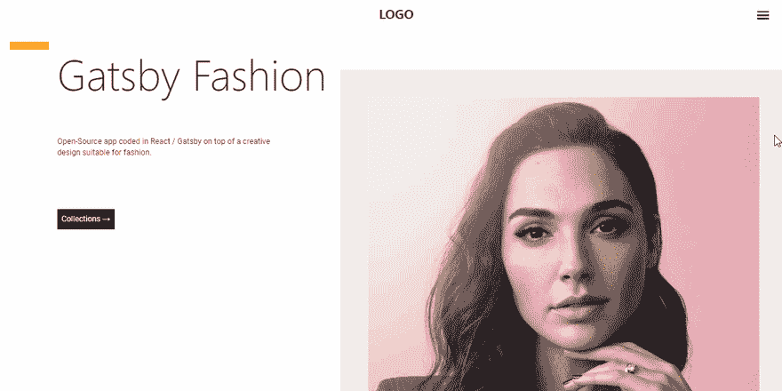
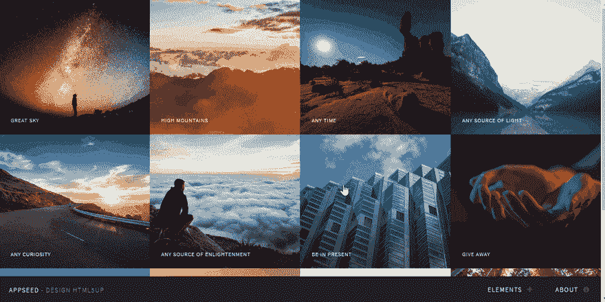
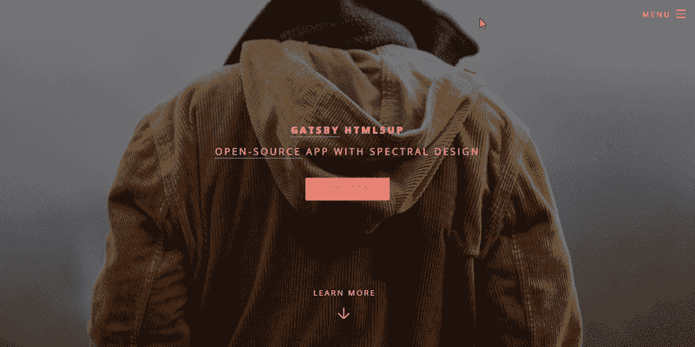
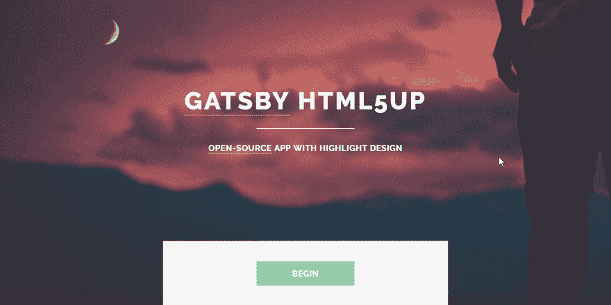

# 盖茨比-主题和开篇

> 原文:[https://dev.to/sm0ke/gatsby-themes-and-starters-8ha](https://dev.to/sm0ke/gatsby-themes-and-starters-8ha)

各位编码员好，

在本文中，我将展示一个集合，其中包含 GatsbyJS starters 和适合简单项目的主题:单页网站、markdown / MDX 博客和简单的即将推出的页面。

* * *

## [](#what-is-gatsbyjs)什么是[盖茨比](https://www.gatsbyjs.org)

GatsbyJS 是我在过去几年中见过的最令人印象深刻的应用程序生成器，原因有几个:

*   开箱即用的现代工具。
*   几乎任何东西的插件
*   所有用盖茨比构建的应用在 Lighthouse 上的评分都会超过 90 分
*   适用于多种类型的应用和技术:单页、电子商务、博客
*   综合文档
*   现场支持[上](https://spectrum.chat/gatsby-js)谱&不和

* * *

## [](#get-started-with-gatsby)上手**盖茨比**

为了开始用 Gatsby 构建应用程序，我们需要在工作站中安装几套工具:

*   节点和 Npm
*   盖茨比 CLI -盖茨比控制台
*   GIT——如果我们想克隆一些启动器

官方文档有一个关于这个初始设置的综合章节，请随意访问并遵循适用于您的操作系统的说明。

```
# install Gatsby globally 
$ npm install -g gatsby-cli
$
# test the installation
$ gatsby --help 
```

<svg width="20px" height="20px" viewBox="0 0 24 24" class="highlight-action crayons-icon highlight-action--fullscreen-on"><title>Enter fullscreen mode</title></svg> <svg width="20px" height="20px" viewBox="0 0 24 24" class="highlight-action crayons-icon highlight-action--fullscreen-off"><title>Exit fullscreen mode</title></svg>

* * *

## [](#licensing-info)许可信息

所有的启动程序和主题都是在从设计提供商那里继承的许可协议(麻省理工学院或 CCY 30)下发布的。在使用启动器之前，请阅读许可文件。谢谢大家！

* * *

## [](#gatsbyjs-paradigm)[盖茨比范式](https://appseed.us/apps/gatsbyjs/gatsby-html5up-paradigm)

一个漂亮的 [GatsbyJS](https://appseed.us/apps/gatsbyjs) starter，使用 Html5UP agency 制作的简单设计。

[T2】](https://res.cloudinary.com/practicaldev/image/fetch/s--lX5nQ2w3--/c_limit%2Cf_auto%2Cfl_progressive%2Cq_66%2Cw_880/https://raw.githubusercontent.com/app-generator/static/master/products/gatsby-html5up-paradigm-intro.gif)

> 如何使用启动器

```
$ git clone https://github.com/app-generator/gatsby-html5up-paradigm.git
$ cd gatsby-html5up-paradigm
$ yarn # install modules
$ yarn start # start in development mode
$ yarn deploy # live FTP deployment ( Edit FTP credentials in deploy.js first) 
```

<svg width="20px" height="20px" viewBox="0 0 24 24" class="highlight-action crayons-icon highlight-action--fullscreen-on"><title>Enter fullscreen mode</title></svg> <svg width="20px" height="20px" viewBox="0 0 24 24" class="highlight-action crayons-icon highlight-action--fullscreen-off"><title>Exit fullscreen mode</title></svg>

* * *

## [](#gatsbyjs-fashion)[盖茨比时尚](https://appseed.us/apps/gatsbyjs/gatsby-fashion-portfolio)

简单的 [GatsbyJS](https://appseed.us/apps/gatsbyjs) starter 具有在 MIT 许可下发布的创造性布局。

[T2】](https://res.cloudinary.com/practicaldev/image/fetch/s--f8DqQj3M--/c_limit%2Cf_auto%2Cfl_progressive%2Cq_66%2Cw_880/https://github.com/app-generator/static/blob/master/products/gatsby-fashion-portfolio-intro.gif%3Fraw%3Dtrue)

* * *

## [](#gatsbyjs-multiverse)[盖茨比多元宇宙](https://appseed.us/apps/gatsbyjs/gatsby-html5up-multiverse)

一款适合摄影师和*视觉*项目的 [GatsbyJS](https://appseed.us/apps/gatsbyjs) 入门。

[T2】](https://res.cloudinary.com/practicaldev/image/fetch/s--wk56OvbA--/c_limit%2Cf_auto%2Cfl_progressive%2Cq_66%2Cw_880/https://github.com/app-generator/static/blob/master/products/gatsby-html5up-multiverse-intro.gif%3Fraw%3Dtrue)

> 要构建这个应用程序，请在您的终端中键入

```
$ git clone https://github.com/app-generator/gatsby-html5up-multiverse.git
$ cd gatsby-html5up-multiverse
$ yarn # install modules
$ yarn start # start in development mode 
```

<svg width="20px" height="20px" viewBox="0 0 24 24" class="highlight-action crayons-icon highlight-action--fullscreen-on"><title>Enter fullscreen mode</title></svg> <svg width="20px" height="20px" viewBox="0 0 24 24" class="highlight-action crayons-icon highlight-action--fullscreen-off"><title>Exit fullscreen mode</title></svg>

* * *

## [](#gatsbyjs-spectral)[盖茨比光谱](https://appseed.us/apps/gatsbyjs/gatsby-html5up-spectral)

由 Html5 Up agency 提供设计的单页 [GatsbyJS](https://appseed.us/apps/gatsbyjs) web 应用程序。

[T2】](https://res.cloudinary.com/practicaldev/image/fetch/s--_Ylez_Od--/c_limit%2Cf_auto%2Cfl_progressive%2Cq_66%2Cw_880/https://github.com/app-generator/static/blob/master/products/gatsby-html5up-spectral-intro.gif%3Fraw%3Dtrue)

* * *

## [](#gatsbyjs-aerial)[盖茨比天线](https://appseed.us/apps/gatsbyjs/gatsby-html5up-aerial)

一个简单的即将推出的应用程序与 Html5 Up 提供的设计滚动背景。

[T2】](https://res.cloudinary.com/practicaldev/image/fetch/s--ZeJNDyAJ--/c_limit%2Cf_auto%2Cfl_progressive%2Cq_66%2Cw_880/https://github.com/app-generator/static/blob/master/products/gatsby-html5up-aerial-intro.gif%3Fraw%3Dtrue)

* * *

## [](#gatsbyjs-highlights)[盖茨比集锦](https://appseed.us/apps/gatsbyjs/gatsby-html5up-highlights)

在 HTML5Up 之上用 GatsbyJS 构建的一个开源应用，突出了设计。

[T2】](https://res.cloudinary.com/practicaldev/image/fetch/s--lDYRAFYH--/c_limit%2Cf_auto%2Cfl_progressive%2Cq_66%2Cw_880/https://raw.githubusercontent.com/app-generator/static/master/products/gatsby-html5up-highlights-intro.gif)

* * *

## [](#gatsby-resources)[盖茨比](https://www.gatsbyjs.org)资源

*   [Gatsby Apps](https://github.com/app-generator/gatsbyjs)-Github 上发布的完整索引
*   盖茨比文件 -官方文件
*   盖茨比启动器 -官方列表，启动器按技术和用途分类
*   [盖茨比应用](https://appseed.us/apps/gatsbyjs)—**应用种子**支持的盖茨比应用

* * *

谢谢大家！