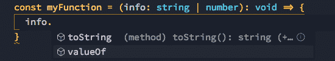
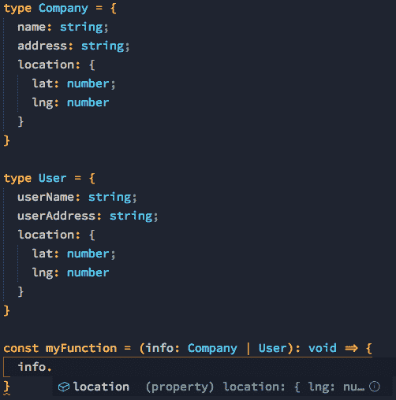
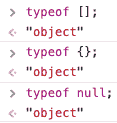

# TypeScript 中联合和类型保护的威力🤯

> 原文:[https://dev . to/pauloedurezende/the-power of-union-and-type-guard-in-typescript-1 AMG](https://dev.to/pauloedurezende/the-power-of-union-and-type-guard-in-typescript-1amg)

在 TypeScript 的世界里，我们有两个比你想象的更聪明的属性，这两个属性是`Union Types`和`Type Guards`,我会稍微谈一下下面的内容

## [](#union-types)**工会类型**

在 javascript 开发中，有些时候您必须处理参数或变量中的两种或多种信息，这就是`union types`发挥作用的地方。顾名思义，这个家伙将执行我们传递给他的类型的理论合并，为了声明一个类型联合，我们使用管道字符，如下例所示

```
// Variable
let myWonderfulVariable: number | string;

// Function
const myFunction = (info: string | number): void => {} 
```

<svg width="20px" height="20px" viewBox="0 0 24 24" class="highlight-action crayons-icon highlight-action--fullscreen-on"><title>Enter fullscreen mode</title></svg> <svg width="20px" height="20px" viewBox="0 0 24 24" class="highlight-action crayons-icon highlight-action--fullscreen-off"><title>Exit fullscreen mode</title></svg>

但是如果你认为你只是定义了你想要的类型，然后就不用了，那你就错了。在幕后，TypeScript 将对您输入的类型进行验证，并且只提供**已知类型中常见的**方法，让我们以上面的函数为例...

[T2】](https://res.cloudinary.com/practicaldev/image/fetch/s--Zg9hMtf3--/c_limit%2Cf_auto%2Cfl_progressive%2Cq_auto%2Cw_880/https://thepracticaldev.s3.amazonaws.com/i/9f84ghd7i94e17xg937r.png)

这同样适用于您可能拥有的任何接口或类型...

[T2】](https://res.cloudinary.com/practicaldev/image/fetch/s--wsTxJbSz--/c_limit%2Cf_auto%2Cfl_progressive%2Cq_auto%2Cw_880/https://thepracticaldev.s3.amazonaws.com/i/6yqd35sslna4biv9omog.png)

## [](#type-guards)**型近卫**

直接来说，我们可以说`type guards`允许您将内容的类型限制到一个条件块，在这里我们可以使用一些操作符来执行这些检查，我将在下面进行评论

### [](#typeof)**类型**

它允许您根据我们拥有的原始类型进行验证，即:数字、字符串、布尔和符号

```
const myFunction = (x: number | string): void => {
  if (typeof x === 'number') {
    console.log('The variable X it\'s like a number')
  }

  if (typeof x === 'string') {
    console.log('The variable X it\'s like a string')
  }
} 
```

<svg width="20px" height="20px" viewBox="0 0 24 24" class="highlight-action crayons-icon highlight-action--fullscreen-on"><title>Enter fullscreen mode</title></svg> <svg width="20px" height="20px" viewBox="0 0 24 24" class="highlight-action crayons-icon highlight-action--fullscreen-off"><title>Exit fullscreen mode</title></svg>

但是现在你可能想知道，为什么 typeof 只适用于我上面提到的原始值？看看这个...

[T2】](https://res.cloudinary.com/practicaldev/image/fetch/s--KC47oQgl--/c_limit%2Cf_auto%2Cfl_progressive%2Cq_auto%2Cw_880/https://thepracticaldev.s3.amazonaws.com/i/sc1nf4ot6h7yybidygxf.png)

当您尝试比较数字、字符串、布尔值或符号之外的东西时，JavaScript 最终会将其作为对象返回🙃

### [](#instanceof)**实例**

它允许你对通过构造函数
创建的任何变量进行检查

```
class Company {
  companyName: string;
  companyAddress: string;
  location: {
    lat: number;
    lng: number
  }
}

class User {
  userName: string;
  userAddress: string;
  location: {
    lat: number;
    lng: number
  }
}

const myFunction = (x: Company | User): void => {
  if (x instanceof Company) {
    console.log('The variable X it\'s a instance of Company')
  }

  if (x instanceof User) {
    console.log('The variable X it\'s a instance of Company')
  }
} 
```

<svg width="20px" height="20px" viewBox="0 0 24 24" class="highlight-action crayons-icon highlight-action--fullscreen-on"><title>Enter fullscreen mode</title></svg> <svg width="20px" height="20px" viewBox="0 0 24 24" class="highlight-action crayons-icon highlight-action--fullscreen-off"><title>Exit fullscreen mode</title></svg>

### [](#in)**中的**

检查给定上下文
中是否存在属性

```
interface Company {
  companyName: string;
}

interface User {
  userName: string;
}

const myFunction = (x: Company | User): void => {
  if ('companyName' in x) {
    console.log('The `companyName` exists on variable X')
  }

  if ('userName' in x) {
    console.log('The `userName` exists on variable X')
  }
} 
```

<svg width="20px" height="20px" viewBox="0 0 24 24" class="highlight-action crayons-icon highlight-action--fullscreen-on"><title>Enter fullscreen mode</title></svg> <svg width="20px" height="20px" viewBox="0 0 24 24" class="highlight-action crayons-icon highlight-action--fullscreen-off"><title>Exit fullscreen mode</title></svg>

## [](#references)**参考文献**

如果您喜欢这个主题并想更深入地研究，我推荐一些资源，不仅可以更深入地研究这里的主题，还可以从整体上研究 TypeScript:

*   [打字稿深度驱动](https://basarat.gitbooks.io/typescript/content/)
*   [打字稿:完整的开发者指南](https://www.udemy.com/typescript-the-complete-developers-guide/)
*   [打字稿文档:高级类型](https://www.typescriptlang.org/docs/handbook/advanced-types.html)

* * *

今天的内容基于我学习 TypeScript 的历程，也是我在这里的第一篇文章🎉，如果你想给我反馈，请在 twitter 上关注我( [@pauloedurezende](https://dev.to/pauloedurezende) )🤗)