# 利用这些工具提高工作效率！🍇九月为你挑选

> 原文:[https://dev . to/PaCO _ ita/be-more-productive-with these-tools-June-picks-for-you-2efm](https://dev.to/paco_ita/be-more-productive-with-these-tools-september-picks-for-you-2efm)

夏天马上就要结束了😞因此，让我们看看一些新的 JS 库，不要失去好心情！🎉🎉

[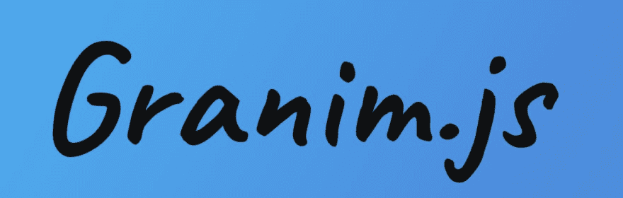T2】](https://res.cloudinary.com/practicaldev/image/fetch/s--BBcp-mt_--/c_limit%2Cf_auto%2Cfl_progressive%2Cq_auto%2Cw_880/https://thepracticaldev.s3.amazonaws.com/i/2czkmvllu0tb9y7zv5br.png)

Granim.js 是一个简单的轻量级 javascript 库，允许配置渐变动画。

```
<canvas id="canvas-basic"></canvas> 
var granimInstance = new Granim({
    element: '#canvas-basic',
    direction: 'left-right',
    isPausedWhenNotInView: true,
    states : {
        "default-state": {
            gradients: [
                ['#ff9966', '#ff5e62'],
                ['#00F260', '#0575E6'],
                ['#e1eec3', '#f05053']
            ]
        }
    }
}); 
```

<svg width="20px" height="20px" viewBox="0 0 24 24" class="highlight-action crayons-icon highlight-action--fullscreen-on"><title>Enter fullscreen mode</title></svg> <svg width="20px" height="20px" viewBox="0 0 24 24" class="highlight-action crayons-icon highlight-action--fullscreen-off"><title>Exit fullscreen mode</title></svg>

在该网站上，您可以找到不同的示例,展示基本和更高级的功能。
例如，我们可以将一幅图像与渐变动画融合在一起，创造出真正有启发性的效果。然后，这可以与根据一天中的时间显示不同颜色的自定义逻辑相结合:

[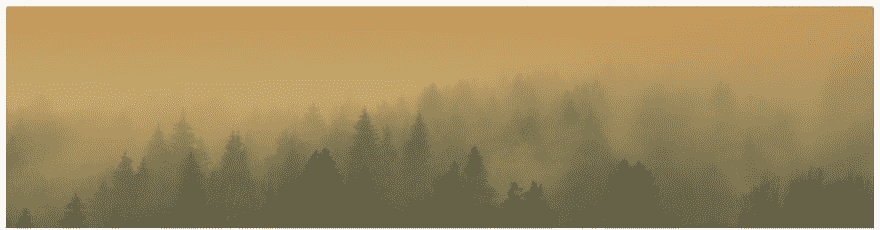T2】](https://res.cloudinary.com/practicaldev/image/fetch/s--0V6dgjaR--/c_limit%2Cf_auto%2Cfl_progressive%2Cq_auto%2Cw_880/https://thepracticaldev.s3.amazonaws.com/i/pba7h9ijvdgqj71cbhyp.png)

[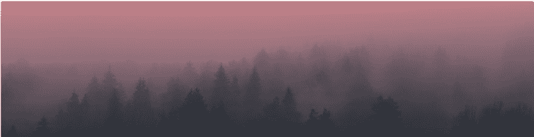T2】](https://res.cloudinary.com/practicaldev/image/fetch/s--Mv9VOOBW--/c_limit%2Cf_auto%2Cfl_progressive%2Cq_auto%2Cw_880/https://thepracticaldev.s3.amazonaws.com/i/rrn7acdqk6obhj43i4gf.png)

[](https://res.cloudinary.com/practicaldev/image/fetch/s--Dxwb8Sxd--/c_limit%2Cf_auto%2Cfl_progressive%2Cq_auto%2Cw_880/https://thepracticaldev.s3.amazonaws.com/i/bnt1eguiaqrp8ungvd55.png)
T4】

* * *

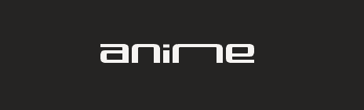

Anime.js 是一个轻量级的 JavaScript 动画库，有一个简单而强大的 API。
它可以处理 CSS 属性、SVG、DOM 属性和 JavaScript 对象。

我们可以立即导入并开始使用它:

```
import anime from 'animejs/lib/anime.es.js';

anime({
  targets: 'div',
  translateX: 250,
  rotate: '1turn',
  backgroundColor: '#FFF',
  duration: 800
}); 
```

<svg width="20px" height="20px" viewBox="0 0 24 24" class="highlight-action crayons-icon highlight-action--fullscreen-on"><title>Enter fullscreen mode</title></svg> <svg width="20px" height="20px" viewBox="0 0 24 24" class="highlight-action crayons-icon highlight-action--fullscreen-off"><title>Exit fullscreen mode</title></svg>

有一组丰富的示例可以用来试验库的功能:

#### [](#animated-hand-written-text)动画手写文字

[https://codepen.io/mellis84/embed/JpVZNw?height=600&default-tab=result&embed-version=2](https://codepen.io/mellis84/embed/JpVZNw?height=600&default-tab=result&embed-version=2)

#### [](#snake-highlight-animation)蛇高亮动画

(只需从一个登录字段切换到下一个字段即可查看效果)

[https://codepen.io/ainalem/embed/EQXjOR?height=600&default-tab=result&embed-version=2](https://codepen.io/ainalem/embed/EQXjOR?height=600&default-tab=result&embed-version=2)

#### [](#animated-submit-button)动画提交按钮

(点击按钮观看直播)

[https://codepen.io/andrewmillen/embed/MoKLob?height=600&default-tab=result&embed-version=2](https://codepen.io/andrewmillen/embed/MoKLob?height=600&default-tab=result&embed-version=2)

支持主要的浏览器(🔥即使是 IE 8+🔥)

[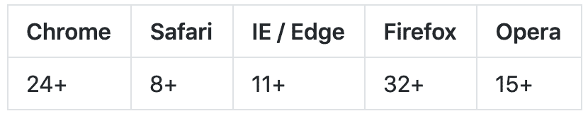](https://res.cloudinary.com/practicaldev/image/fetch/s--hNyavUC1--/c_limit%2Cf_auto%2Cfl_progressive%2Cq_auto%2Cw_880/https://thepracticaldev.s3.amazonaws.com/i/onxjn6zpsuj9bx0sp07o.png)
T4】

* * *

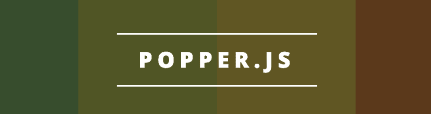

[Popper.js](https://popper.js.org/) 是一个 JS ES2015 库，用于在 web 应用中定位“Popper”。

> 弹出器是屏幕上的一个元素，它从应用程序的自然流程中“弹出”。

弹出窗口的常见例子有工具提示、弹出窗口和下拉菜单。
它是一个*定位引擎*，其目的是计算一个元素的位置，并使其有可能放置在一个给定的参照物附近。

使用下面的代码，我们可以指示目标“popper”元素根据其位置显示在其引用元素的左侧/底部/顶部。这可以很容易地解决工具提示应该根据它们在父容器中的位置在不同点动态显示的问题。

```
var popper = new Popper(referenceElement, onLeftPopper, {
    placement: 'left',
    modifiers: {
        flip: {
            behavior: ['left', 'bottom', 'top']
        },
        preventOverflow: {
            boundariesElement: container,
        },
    },
}); 
```

<svg width="20px" height="20px" viewBox="0 0 24 24" class="highlight-action crayons-icon highlight-action--fullscreen-on"><title>Enter fullscreen mode</title></svg> <svg width="20px" height="20px" viewBox="0 0 24 24" class="highlight-action crayons-icon highlight-action--fullscreen-off"><title>Exit fullscreen mode</title></svg>

当我们在容器的左上角时:

[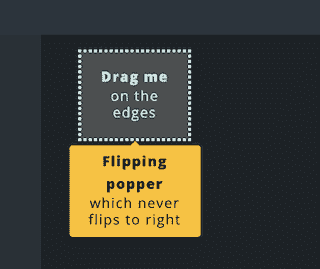T2】](https://res.cloudinary.com/practicaldev/image/fetch/s--tca0bEP9--/c_limit%2Cf_auto%2Cfl_progressive%2Cq_auto%2Cw_880/https://thepracticaldev.s3.amazonaws.com/i/uz6w0i8mcj4zdm25sztf.png)

一次在左下角:

[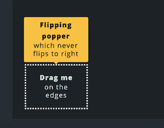T2】](https://res.cloudinary.com/practicaldev/image/fetch/s--EbvqE2Oc--/c_limit%2Cf_auto%2Cfl_progressive%2Cq_auto%2Cw_880/https://thepracticaldev.s3.amazonaws.com/i/yrrj7wvoob9gti9r0kxc.png)

* * *


我们需要编辑多少次图片并设置透明背景？事实上，我们可以通过几个项目来实现这个目标，比如 Paint.Net 女士。然而，当背景由多种颜色或图案组成时，它们是否仍能提供良好的效果？从某种程度上来说，可能是这样的，但是这需要付出与背景复杂性成比例的努力。

在这些情况下 [RemoveBG](https://www.remove.bg/) 前来救援！

这是一个在线工具，能够从上传的照片中移除背景，还可以用新的背景来替换它。
如果我们使用 Photoshop，我们可以[集成](https://www.remove.bg/photoshop) removeBg 作为扩展，或者我们甚至可以通过 [API](https://www.remove.bg/api) 在我们的应用程序中使用它:

[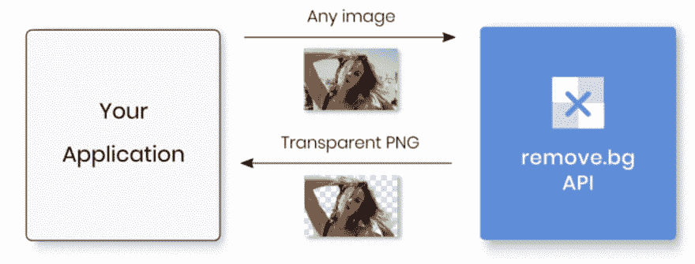](https://res.cloudinary.com/practicaldev/image/fetch/s--o93Ai8S---/c_limit%2Cf_auto%2Cfl_progressive%2Cq_auto%2Cw_880/https://thepracticaldev.s3.amazonaws.com/i/iiupqzdewo6sypr4m0qs.png)T3】

```
// Requires "request" to be installed (see https://www.npmjs.com/package/request)
var request = require('request');
var fs = require('fs');

request.post({
  url: 'https://api.remove.bg/v1.0/removebg',
  formData: {
    image_file: fs.createReadStream('/path/to/file.jpg'),
    size: 'auto',
  },
  headers: {
    'X-Api-Key': 'INSERT_YOUR_API_KEY_HERE'
  },
  encoding: null
}, function(error, response, body) {
  if(error) {
   return console.error('Request failed:', error);
  }
  else if(response.statusCode != 200) {
    return console.error('Error:', response.statusCode, body.toString('utf8'));
  }

  fs.writeFileSync("no-bg.png", body);
}); 
```

<svg width="20px" height="20px" viewBox="0 0 24 24" class="highlight-action crayons-icon highlight-action--fullscreen-on"><title>Enter fullscreen mode</title></svg> <svg width="20px" height="20px" viewBox="0 0 24 24" class="highlight-action crayons-icon highlight-action--fullscreen-off"><title>Exit fullscreen mode</title></svg>

我试了一下，输出的准确性让我印象深刻。
在保存最终图像之前，我们甚至可以优化中间版本以获得更精确的结果。

原图:

[](https://res.cloudinary.com/practicaldev/image/fetch/s--uktcTRyn--/c_limit%2Cf_auto%2Cfl_progressive%2Cq_auto%2Cw_880/https://thepracticaldev.s3.amazonaws.com/i/bc70zbf3nq9dftm7er54.jpeg) 下图

而最后的结果:
[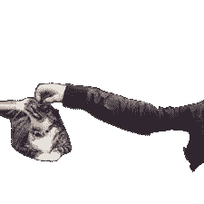](https://res.cloudinary.com/practicaldev/image/fetch/s--m-iYwohe--/c_limit%2Cf_auto%2Cfl_progressive%2Cq_auto%2Cw_880/https://thepracticaldev.s3.amazonaws.com/i/8its1w0drd54r5nc4zyb.png)

* * *


[CSS Wand](https://www.csswand.dev/) collects a set of common CSS effects (like: rotate, shrink, ripple, etc.) that we can copy and use in our project.

用于以下旋转效果:

[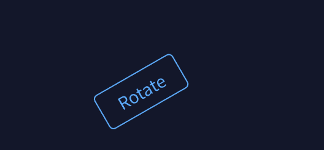](https://res.cloudinary.com/practicaldev/image/fetch/s--j5gZYOMM--/c_limit%2Cf_auto%2Cfl_progressive%2Cq_auto%2Cw_880/https://thepracticaldev.s3.amazonaws.com/i/kglgrvyraftu2zqd0w1u.png)

本片段提供:

[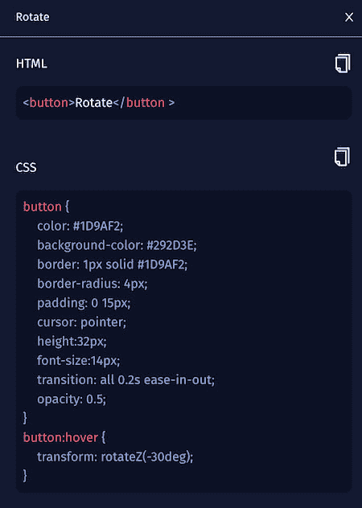](https://res.cloudinary.com/practicaldev/image/fetch/s--dtjFrf0u--/c_limit%2Cf_auto%2Cfl_progressive%2Cq_auto%2Cw_880/https://thepracticaldev.s3.amazonaws.com/i/x7gpxigvwwdy54iac738.png)

在可复制版本中的相同片段下面:

```
 button {
  color: #1D9AF2;
  background-color: #292D3E;
  border: 1px solid #1D9AF2;
  border-radius: 4px;
  padding: 0 15px;
  cursor: pointer;
  height: 32px;
  font-size: 14px;
  transition: all 0.2s ease-in-out;
}
button:hover{
  transform: rotateZ(-30deg);
} 
```

<svg width="20px" height="20px" viewBox="0 0 24 24" class="highlight-action crayons-icon highlight-action--fullscreen-on"><title>Enter fullscreen mode</title></svg> <svg width="20px" height="20px" viewBox="0 0 24 24" class="highlight-action crayons-icon highlight-action--fullscreen-off"><title>Exit fullscreen mode</title></svg>

因此，我们可以将 CSS Wand 视为一个规则库，当我们需要快速设计 web 应用程序中的一些元素时，我们可以访问它，或者只是作为一个参考。

* * *

这些是九月的发现！下个月再来买一套新的。

[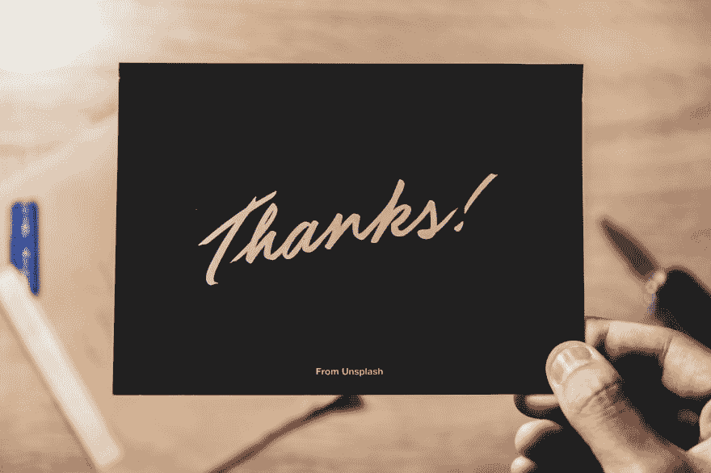T3】](https://res.cloudinary.com/practicaldev/image/fetch/s--Wb9XdC1o--/c_limit%2Cf_auto%2Cfl_progressive%2Cq_auto%2Cw_880/https://thepracticaldev.s3.amazonaws.com/i/rmc01kvqpn36wu1ajiwx.jpg)