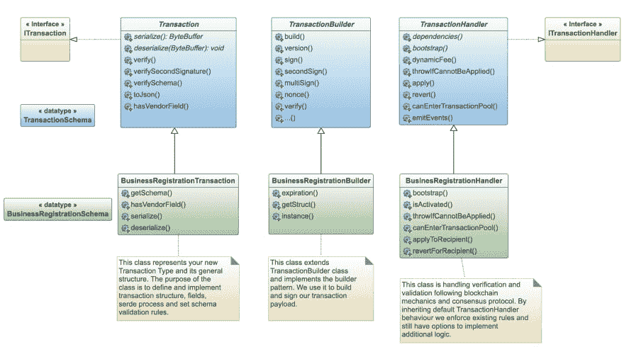

# 区块链应用开发简介—第二部分

> 原文:[https://dev . to/kristjank/an-区块链简介-应用-开发-部分-2-2-2k6](https://dev.to/kristjank/an-introduction-to-blockchain-application-development-part-2-2-2k6)

在本帖中，我们将深入探讨使用我们的核心 GTI(通用事务接口)技术开发定制事务类型。

我们将学习如何通过引入根据您的应用程序需求定制的事务类型，将新的业务逻辑添加到区块链中。您将学习如何:

1.  实施新的交易类型结构并引入自定义字段
2.  实现新的自定义事务生成器类
3.  实现一个通用的事务处理程序，它将我们新创建的事务类型与区块链协议挂钩
4.  使用现有的 API 接口与核心区块链和新的事务类型进行交互。

#### [](#related-posts)相关岗位:

在上一篇文章中，[第 1 部分 ARK 区块链开发简介](https://blog.ark.io/an-introduction-to-blockchain-application-development-part-2-2-909b4984bae),我们讨论了分布式区块链应用程序的一般开发，并展示了如何应用推荐的架构最佳实践。

*你可以在我们最近的一篇关于 ARK Core GTI 及其背后原因的博文中了解更多关于通用事务接口的愿景。
本次深入探讨的所有步骤都有工作代码示例和示例实现的支持。在下面的代码片段中寻找`// source-link:`注释行。*

这篇文章之后将会有单独的教程和实践研讨会，在那里我们将构建一个完整的区块链应用程序(后端和前端)。

* * *

# [](#a-short-introduction-to-custom-transactions-the-core-gti-engine)定制交易简介——核心 GTI 引擎

GTI 的基本前提是提供一种简单的方法来实现并在核心中包含新的事务类型，而不需要繁琐地修改更复杂的部分。

> 通过将一些逻辑放在自定义交易类型的后面，我们认为这是一种比传统智能合约更好、更强大的开发更强大用例的方法。

GTI 最初的设计是为了帮助我们的开发人员使新事务类型的实现更加容易、可维护和标准化。

[T2】](https://res.cloudinary.com/practicaldev/image/fetch/s--rvJHqYpn--/c_limit%2Cf_auto%2Cfl_progressive%2Cq_auto%2Cw_880/https://cdn.hashnode.com/res/hashnode/image/upload/v1567587487435/zUJA6z6g2.png)

## [](#what-can-be-built-with-custom-transactions)自定义事务可以构建什么？

你可能在想:

> “我可以开发一个自定义交易，引入新的字段，然后将它们添加到区块链中。好吧，听起来很酷，但这如何帮助我开发更好的应用程序和服务？”

让我来回答这个问题:

> “大多数现实世界的交互都是基于事务/基于事件的。能够在现有分布式账本技术的基础上轻松添加您的定制功能，并重复利用其优势——可能性是无限的。”

**例如，我们可以构建:**

*   审计日志、跟踪功能(默认支持 GDPR、ISO27001)，
*   供应链管理交易，例如在整个产品生命周期中跟踪特定零件的接收、制造、质量保证、包装、分销、维护和处置。
*   医疗保健，例如事件跟踪，结合通过 IPFS 网络存储大型医疗数据集，
*   物联网网络支持，例如设备注册的定制交易和附加传感器数据的存储，
*   游戏支持，
*   基于角色的管理系统由区块链管理，

> 智能合约完成的任何事情，没有诸如 Solidity 或 Move 等复杂语言的麻烦

…还有更多——不胜枚举。

上面列出的所有例子都是真实世界中的事务，可以用我们的核心 GTI 引擎来实现。

> 这意味着，作为开发人员，您可以通过引入针对应用程序定制的额外的自定义事务类型，将新的业务逻辑添加到区块链中。因此，接下来您需要实现的是一个出色的前端来支持您的业务。默认情况下，您的新应用程序成为一个轻客户端，在后台利用区块链平台的功能。

通过使用 GTI，您将能够遵循一个创建和保护新的定制交易类型的简化流程，该交易类型可以部署到任何基于 ARK 的桥链上，并在一个单独的核心模块(插件)中进行管理。

支持自定义事务开发的重要类的概述可以在下面的类图中看到。类图中的抽象类和方法用斜体文本表示。

要开发一个定制的事务类型，我们需要实现由 GTI 接口和抽象类定义的`code-contracts`(上面类图中蓝色的项目)。实现非常简单。我们通过实现 transaction、Builder 和 Handler 类型类(上图中绿色的项目)来覆盖默认的事务行为并添加定制的业务逻辑。我们将实现以下三个类:

1.  {交易名称} `Transaction` —介绍您的新交易类型结构
2.  {TransactionName} `Builder` —实现有效负载构建和签名
3.  {交易名称} `Handler` —处理区块链协议并使您的新交易成为正式成员

我们将在接下来的章节中解释这三个类的每一个，它们的机制和目的。本文件中使用的术语`serde`是指交易`serialization`和`deserialization`的过程。

* * *

# [](#1implement-raw-businessregistrationtransaction-endraw-class)1。实现`BusinessRegistrationTransaction`类

该类的目的是定义和实现事务结构、字段、`serde`流程(事务**序列化**和**反序列化**)并设置模式验证规则。我们需要继承(扩展)基本事务类来遵循 GTI 规则。

## [](#a-build-your-new-transaction-structure)a .)建立你的新交易结构

您的自定义事务字段必须在`BusinessRegistration`事务类中定义。它们遵循继承的`Transaction`类的规则。你可以引入任何数量的新领域和它们的尊重类型。所有新字段都将存储在名为 transaction.assets 的基本事务字段中。
T3】

```
export interface IBusinessRegistrationAsset {
  name: string;
  website: string;
}
// source-link: https://github.com/kovaczan/custom-transaction/blob/167bcbd5201282a6d679d9d571eed00bbc1df57c/src/interfaces.ts#L1 
```

<svg viewBox="0 0 448 512" class="highlight-action highlight-action--fullscreen-on"><title>Enter fullscreen mode</title></svg> <svg viewBox="0 0 448 512" class="highlight-action highlight-action--fullscreen-off"><title>Exit fullscreen mode</title></svg>

定义的接口更严格地使用新的定制事务字段，并且是 **serde** 流程的一部分。我们的公共 API 支持通过设计使用新的定制字段来搜索事务(不需要修改 API，就可以在新的事务类型中进行搜索)。

## [](#b-implement-the-serde-process)b .)实现 serde 过程

我们需要实现定制的 **serde** 方法，为我们新引入的事务字段处理 serde 过程。抽象方法`serialize()`和`deserialize()`由基类`Transaction`定义，并在 serde 过程中自动调用。

```
export class BusinessRegistrationTransaction extends Transactions.Transaction {
  public serialize(): ByteBuffer {
    const { data } = this;

    const businessRegistration = data.asset.businessRegistration as IBusinessRegistrationAsset;

    const nameBytes = Buffer.from(businessRegistration.name, "utf8");
    const websiteBytes = Buffer.from(businessRegistration.website, "utf8");

    const buffer = new ByteBuffer(nameBytes.length + websiteBytes.length + 2, true);

    buffer.writeUint8(nameBytes.length);
    buffer.append(nameBytes, "hex");

    buffer.writeUint8(websiteBytes.length);
    buffer.append(websiteBytes, "hex");

    return buffer;
  }

  public deserialize(buf: ByteBuffer): void {
    const { data } = this;
    const businessRegistration = {} as IBusinessRegistrationAsset;
    const nameLength = buf.readUint8();
    businessRegistration.name = buf.readString(nameLength);

    const websiteLength = buf.readUint8();
    businessRegistration.website = buf.readString(websiteLength);

    data.asset = {
      businessRegistration
    };
  }
}
// source-link: https://github.com/kovaczan/custom-transaction/blob/167bcbd5201282a6d679d9d571eed00bbc1df57c/src/transactions/BusinessRegistrationTransaction.ts#L48 
```

<svg viewBox="0 0 448 512" class="highlight-action highlight-action--fullscreen-on"><title>Enter fullscreen mode</title></svg> <svg viewBox="0 0 448 512" class="highlight-action highlight-action--fullscreen-off"><title>Exit fullscreen mode</title></svg>

## [](#c-define-schema-validation-for-the-new-transaction-fields)c .)为新的事务字段定义模式验证

每个自定义事务都伴随着强制模式验证。为了实现这一点，我们必须扩展 base `TransactionSchema`并为定制字段验证提供规则(在上面的`IBusinessRegistrationAsset`中介绍的字段)。模式是用 [AJV](https://ajv.js.org/) 定义的，我们通过调用新事务类中的`getSchema()`方法来访问它，在我们的例子中是`BusinessRegistrationTransaction`。

```
export class BusinessRegistrationTransaction extends Transactions.Transaction {
  public static getSchema(): Transactions.schemas.TransactionSchema {
    return schemas.extend(schemas.transactionBaseSchema, {
      $id: "businessRegistration",
      required: ["asset"],
      properties: {
        type: { transactionType: BUSINESS_REGISTRATION_TYPE },
        amount: { bignumber: { minimum: 0, maximum: 0 } },
        asset: {
          type: "object",
          required: ["businessRegistration"],
          properties: {
            businessRegistration: {
              type: "object",
              required: ["name", "website"],
              properties: {
                name: {
                  type: "string",
                  minLength: 3,
                  maxLength: 20
                },
                website: {
                  type: "string",
                  minLength: 3,
                  maxLength: 20
                },
              }
            }
          },
        },
      },
    });
  }
}
// source-link: https://github.com/kovaczan/custom-transaction/blob/167bcbd5201282a6d679d9d571eed00bbc1df57c/src/transactions/BusinessRegistrationTransaction.ts#L15 
```

<svg viewBox="0 0 448 512" class="highlight-action highlight-action--fullscreen-on"><title>Enter fullscreen mode</title></svg> <svg viewBox="0 0 448 512" class="highlight-action highlight-action--fullscreen-off"><title>Exit fullscreen mode</title></svg>

## [](#d-define-businessregistration-transaction-typegroup-and-type)d .)定义 BusinessRegistration 交易类型组和类型

内核在内部使用`typeGroup + type`来注册交易。非核心事务必须定义 typeGroup，否则核心事务将无法对它们进行分类。所有事务(来自 core v2.6 版)都将用 typeGroup 和 type 签名。通过省略 typeGroup 值，core 将退回到 typeGroup: 1，这是默认的核心组。我们在 BusinessRegistration 类中定义了 typeGroup + type，就像这样:

```
export class BusinessRegistrationTransaction extends Transactions.Transaction {
  public static typeGroup = 1;
  public static type = BUSINESS_REGISTRATION_TYPE;
  // other code ...
}
// source-link: https://github.com/kovaczan/custom-transaction/blob/167bcbd5201282a6d679d9d571eed00bbc1df57c/src/transactions/BusinessRegistrationTransaction.ts#L10-L11 
```

<svg viewBox="0 0 448 512" class="highlight-action highlight-action--fullscreen-on"><title>Enter fullscreen mode</title></svg> <svg viewBox="0 0 448 512" class="highlight-action highlight-action--fullscreen-off"><title>Exit fullscreen mode</title></svg>

* * *

# [](#2implement-the-raw-businessregistrationbuilder-endraw-class)2。实现`BusinessRegistrationBuilder`类

这个类实现了`builder`模式。**我们用它来构建和签署我们的事务负载**。Builder 类处理版本控制、serde 进程、里程碑、动态费用逻辑和所有与加密相关的项目(签名、多重签名、二次签名、带或不带 WIF 的签名、随机数逻辑)。下面的代码片段显示了 Builder 类的实际实现。

```
export class BusinessRegistrationBuilder extends Transactions.TransactionBuilder<BusinessRegistrationBuilder> {
  constructor() {
    super();
    this.data.type = 100;
    this.data.typeGroup = 1;
    this.data.version = 2;
    this.data.fee = Utils.BigNumber.make("5000000000");
    this.data.amount = Utils.BigNumber.ZERO;
    this.data.asset = { businessRegistration: {} };
  }

  public businessAsset(name: string, website: string): BusinessRegistrationBuilder {
    this.data.asset.businessRegistration = {
      name,
      website,
    };

    return this;
  }

  public getStruct(): Interfaces.ITransactionData {
    const struct: Interfaces.ITransactionData = super.getStruct();
    struct.amount = this.data.amount;
    struct.asset = this.data.asset;
    return struct;
  }

  protected instance(): BusinessRegistrationBuilder {
    return this;
  }
}
// source-link: https://github.com/kovaczan/custom-transaction/blob/167bcbd5201282a6d679d9d571eed00bbc1df57c/src/builders/BusinessRegistrationBuilder.ts#L3-L33 
```

<svg viewBox="0 0 448 512" class="highlight-action highlight-action--fullscreen-on"><title>Enter fullscreen mode</title></svg> <svg viewBox="0 0 448 512" class="highlight-action highlight-action--fullscreen-off"><title>Exit fullscreen mode</title></svg>

现在我们已经实现了我们的构建器类，我们可以用它来构建新的定制事务负载:

```
describe("Test builder",()=>{
    Managers.configManager.setFromPreset("testnet");
    Handlers.Registry.registerTransactionHandler(BusinessRegistrationTransactionHandler);

    it("Should verify correctly", ()=> {
        const builder = new BusinessRegistrationBuilder();
        const actual = builder
            .nonce("3")
            .fee("100")
            .businessAsset("google","www.google.com")
            .sign("clay harbor enemy utility margin pretty hub comic piece aerobic umbrella acquire");
        console.log(actual.build().toJson());
        expect(actual.build().verified).toBeTrue();
        expect(actual.verify()).toBeTrue();
    });
});
// source-link: https://github.com/kovaczan/custom-transaction/blob/167bcbd5201282a6d679d9d571eed00bbc1df57c/__tests__/test.test.ts#L7-L22 
```

<svg viewBox="0 0 448 512" class="highlight-action highlight-action--fullscreen-on"><title>Enter fullscreen mode</title></svg> <svg viewBox="0 0 448 512" class="highlight-action highlight-action--fullscreen-off"><title>Exit fullscreen mode</title></svg>

* * *

# [](#3implement-the-raw-businessregistrationhandler-endraw-class)3。实现`BusinessRegistrationHandler`类

前面的两个类`Builder`和`Transaction`引入了一种新的事务类型，实现了 serde 过程，并创建了签名事务有效负载。

在自定义事务实现的这一部分，我们将按照严格的区块链机制(共识规则、事务和块处理)来处理验证和确认。

通过继承默认的`TransactionHandler`行为，我们执行现有的 GTI 规则，并提供选项来实现额外的交易应用逻辑。

```
export class BusinessRegistrationTransactionHandler extends Handlers.TransactionHandler {
  public getConstructor(): Transactions.TransactionConstructor {
    return BusinessRegistrationTransaction;
  }
//...
} 
```

<svg viewBox="0 0 448 512" class="highlight-action highlight-action--fullscreen-on"><title>Enter fullscreen mode</title></svg> <svg viewBox="0 0 448 512" class="highlight-action highlight-action--fullscreen-off"><title>Exit fullscreen mode</title></svg>

**应用逻辑由基本规则组成，例如，I .)检查钱包中是否有足够的资金，ii .)检查重复交易，iii .)如果接收到的事务在正确的网络上(正确的桥链)，等等。**

我们将在以下部分解释 GTI TransactionHandler 及其在区块链协议中的作用:

## [](#a-how-to-define-your-custom-transaction-dependencies)a .)如何定义你的自定义事务依赖关系

如果我们的自定义交易(如`BusinessRegistrationTransaction`)依赖于其他交易(如多签名)，我们必须定义交易类型注册顺序——简而言之，多签名交易必须在我们的交易之前注册。我们通过使用`dependencies()`方法调用来定义事务依赖，其中我们返回一个依赖类的数组。
T3】

```
export class BusinessRegistrationTransactionHandler extends Handlers.TransactionHandler {
  public getConstructor(): Transactions.TransactionConstructor {
    return BusinessRegistrationTransaction;
  }
    public dependencies(): ReadonlyArray<any> {
        return [MultiSignatureTransaction];
    }
  ...
}
// source-link: https://github.com/kovaczan/custom-transaction/blob/167bcbd5201282a6d679d9d571eed00bbc1df57c/src/handlers/BusinessRegistrationTransactionHandler.ts#L12-L14 
```

<svg viewBox="0 0 448 512" class="highlight-action highlight-action--fullscreen-on"><title>Enter fullscreen mode</title></svg> <svg viewBox="0 0 448 512" class="highlight-action highlight-action--fullscreen-off"><title>Exit fullscreen mode</title></svg>

## [](#b-how-to-add-attributes-to-global-wallets)b .)如何给全局钱包添加属性

我们在第 1 部分中定义了定制事务字段和结构。实现本文的 BusinessRegistrationTransaction 类(见上文)。

通常，我们希望将自定义属性添加到我们的全局状态中(`walletManager`类)。这些属性需要能够快速访问(`memoization`)和搜索(`indexed`)。

我们将通过`walletAttributes()`方法来实现这一点，在这里我们为我们的钱包属性定义键。可以在运行时通过调用`wallet.setAttribute(key, value)`方法来设置密钥。

下面的源代码显示了用`key=business`注册一个新的 wallet 属性。我们在`bootstrap()`方法调用期间设置属性值。当我们完成自定义 wallet 属性值的更改时，建议在`walletManager.reindex(wallet)`上进行一次 reindex 调用。

```
export class BusinessRegistrationTransactionHandler extends Handlers.TransactionHandler {
    public walletAttributes(): ReadonlyArray<string> {
        return ["business"];
    }

    public async bootstrap(connection: Database.IConnection, walletManager: State.IWalletManager): Promise<void> {
      const transactions = await connection.transactionsRepository.getAssetsByType(this.getConstructor().type);
     for (const transaction of transactions) {
      const wallet = walletManager.findByPublicKey(transaction.senderPublicKey);
      wallet.setAttribute<IBusinessRegistrationAsset>("business", transaction.asset.businessRegistration);
      walletManager.reindex(wallet);
    }
  }
}
// source-link: https://github.com/kovaczan/custom-transaction/blob/167bcbd5201282a6d679d9d571eed00bbc1df57c/src/handlers/BusinessRegistrationTransactionHandler.ts#L25-L29 
```

<svg viewBox="0 0 448 512" class="highlight-action highlight-action--fullscreen-on"><title>Enter fullscreen mode</title></svg> <svg viewBox="0 0 448 512" class="highlight-action highlight-action--fullscreen-off"><title>Exit fullscreen mode</title></svg>

## [](#c-tapping-into-the-transaction-bootstrap-process)c .)进入交易引导流程

* *每次启动核心节点时都会运行引导程序。** 该过程评估本地数据库中的所有交易，并将它们应用于相应的钱包。所有的金额、投票和其他定制属性都被计算并应用于全局状态— `walletManager`。由于我们新的定制事务`BusinessRegistrationTransaction`遵循相同的区块链机制，我们只需要实现由`TransactionHandler`接口定义的相关(参见下面的代码片段)应用方法。

```
export class BusinessRegistrationTransactionHandler extends Handlers.TransactionHandler {
  // ...

  public async applyToSender(transaction: Interfaces.ITransaction, walletManager: State.IWalletManager): Promise<void> {
    await super.applyToSender(transaction, walletManager);
    const sender: State.IWallet = walletManager.findByPublicKey(transaction.data.senderPublicKey);
    sender.setAttribute<IBusinessRegistrationAsset>("business", transaction.data.asset.businessRegistration);
    walletManager.reindex(sender);
  }

  public async revertForSender(transaction: Interfaces.ITransaction, walletManager: State.IWalletManager): Promise<void> {
    await super.revertForSender(transaction, walletManager);
    const sender: State.IWallet = walletManager.findByPublicKey(transaction.data.senderPublicKey);
    sender.forgetAttribute("business");
    walletManager.reindex(sender);
  }

  public async applyToRecipient(transaction: Interfaces.ITransaction, walletManager: State.IWalletManager): Promise<void> {
    return;
  }

  public async revertForRecipient(transaction: Interfaces.ITransaction, walletManager: State.IWalletManager): Promise<void> {
    return;
  }
}
// source-link: https://github.com/kovaczan/custom-transaction/blob/167bcbd5201282a6d679d9d571eed00bbc1df57c/src/handlers/BusinessRegistrationTransactionHandler.ts#L92-L113 
```

<svg viewBox="0 0 448 512" class="highlight-action highlight-action--fullscreen-on"><title>Enter fullscreen mode</title></svg> <svg viewBox="0 0 448 512" class="highlight-action highlight-action--fullscreen-off"><title>Exit fullscreen mode</title></svg>

## [](#d-how-to-implement-transactionpool-validation)d .)如何实现事务池验证

> 事务池充当一个临时层，有效的和经过验证的事务存储在本地，直到轮到它们被包括在新伪造(创建)的块中。

每个新的定制交易类型都需要通过同样严格的限制规则进行验证和接受，这些规则是针对我们的核心交易而实施的。我们需要实现 canEnterTransactionPool()方法(参见下面的源代码片段)来遵循规则和执行结构。从核心调用该方法。

```
export class BusinessRegistrationTransactionHandler extends Handlers.TransactionHandler {
  // ...
  public async canEnterTransactionPool(
    data: Interfaces.ITransactionData,
    pool: TransactionPool.IConnection,
    processor: TransactionPool.IProcessor,
  ): Promise<boolean> {
    if (this.typeFromSenderAlreadyInPool(data, pool, processor)) {
      return false;
    }

    // TODO: check the link for more validation options
    return true;
  }
}
// source-link: https://github.com/kovaczan/custom-transaction/blob/167bcbd5201282a6d679d9d571eed00bbc1df57c/src/handlers/BusinessRegistrationTransactionHandler.ts#L55-L91 
```

<svg viewBox="0 0 448 512" class="highlight-action highlight-action--fullscreen-on"><title>Enter fullscreen mode</title></svg> <svg viewBox="0 0 448 512" class="highlight-action highlight-action--fullscreen-off"><title>Exit fullscreen mode</title></svg>

* * *

## [](#4registration-of-a-newly-implemented-transaction-type-within-core)4。在核心内注册新实施的交易类型

* *你做到了。* *等待着最后一步，这也是最简单的一步:注册新实现的 BusinessRegistrationTransaction 类型。为此，我们需要访问核心事务处理程序并调用`registerTransactionHandler()`方法(参见下面的代码)。

```
async register(container: Container.IContainer, options) {
    container.resolvePlugin<Logger.ILogger>("logger").info("Registering custom transaction");
    Handlers.Registry.registerTransactionHandler(BusinessRegistrationTransactionHandler);

  }
// source-link: https://github.com/KovacZan/custom-transaction/blob/master/src/plugin.ts#L11-L12 
```

<svg viewBox="0 0 448 512" class="highlight-action highlight-action--fullscreen-on"><title>Enter fullscreen mode</title></svg> <svg viewBox="0 0 448 512" class="highlight-action highlight-action--fullscreen-off"><title>Exit fullscreen mode</title></svg>

您的自定义事务类型实现现在已经完成。[这里有一个完整的工作示例供您检查、学习和下载](https://github.com/KovacZan/custom-transaction)。

这个例子是作为一个核心模块(插件)实现的。你可以在[https://docs . ark . io/tutorials/Core/plugins/how-to-write-a-Core-plugin . html](https://docs.ark.io/tutorials/core/plugins/how-to-write-a-core-plugin.html)了解更多关于核心模块的信息，并且正在使用核心的 develop 分支来实现上述结果(即将推出的 v2.6 核心)。

* * *

# [](#how-to-access-new-transaction-types-via-our-public-interfaces)如何通过我们的公共接口访问新的交易类型

在注册调用之后，我们新实现的事务类型成为核心节点的正式成员——这意味着在插件部署在区块链上之后，我们可以通过现有的公共 API 接口查询它。

你可以在这里阅读更多关于我们的公共 API:[https://API . ark . dev .](https://api.ark.dev.)

## [](#seamless-integration-with-ark-core)与方舟核心无缝集成:

我们为我们的 API 提供了十二(12+)种不同的编程语言实现，所有实现都伴随着完整的加密协议实现。只需安装您选择的 SDK，并开始与区块链互动。

有关我们的 SDK(REST API 和 crypto)的更多信息，请参考 [https://sdk.ark.dev](https://sdk.ark.dev) 。

## [](#secure-jsonrpc-client)安全 JSON-RPC 客户端:

我们还提供了一个 JSON-RPC 兼容包，目标是交换和其他可信的执行环境。JSON-RPC 客户端应该在可信的环境中运行。

有关安全 JSON-RPC 客户端的更多信息，请参考[https://exchange.ark.dev/json-rpc/getting-started/](https://exchange.ark.dev/json-rpc/getting-started/)。

* * *

# [](#conclusion)结论

在学习了本系列第 1 部分中的最佳实践和架构方法之后，我们用我们的核心 GTI 技术深入研究了定制事务类型开发。我们学习了如何:

*   实施新的事务处理类型结构
*   实现新的自定义事务生成器类
*   实现一个通用的事务处理程序，它将我们新创建的事务类型与区块链协议挂钩
*   使用现有的 API 接口与核心区块链和新的事务类型进行交互。

> 您新实现的事务类型现在可以打包到一个核心模块中，并分发到任何基于 ARK 技术的桥链(符合 API 和协议)。

本系列之后将会有单独的教程和实践研讨会，我们将构建一个完整的区块链应用程序——后端和前端。敬请关注确切日期和网上研讨会注册链接，并积极参与！

* * *

# [](#get-involved)卷入其中

以下是一个快速列表，列出了您参与 ARK 的后续步骤:

*   在 [Slack](https://ark.io/slack) 或 [Reddit](https://www.reddit.com/r/ArkEcosystem/) 上加入我们的社区。你会在我们的公共 slack 上得到很多开发者的支持。
*   [贡献我们的代码库，赢取方舟](https://bounty.ark.io)。我们的`core`回购可以在这里进行:[https://github.com/arkecosystem/core](https://github.com/arkecosystem/core)
*   使用我们的[部署人员](https://deployer.ark.io)通过三个简单的步骤创建区块链和您自己的加密货币

* * *