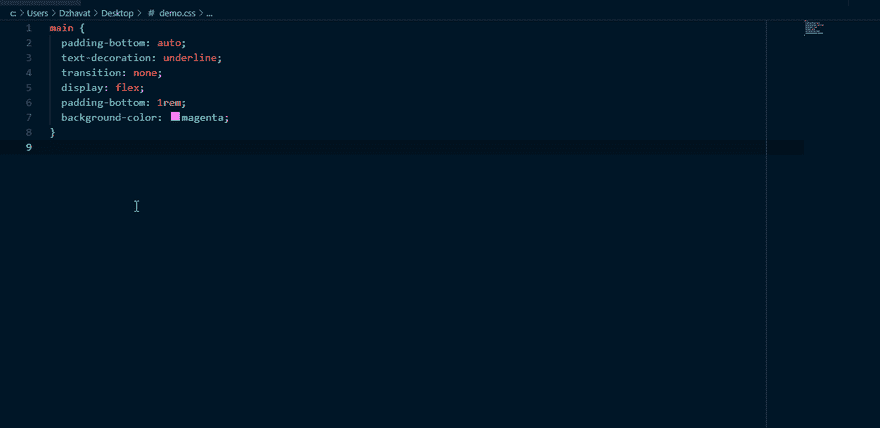

# VS 代码中的 Flexbox 备忘单

> 原文：<https://dev.to/dzhavat/flexbox-cheatsheet-inside-vs-code-4d61>

这篇文章最初发表在我的博客上。

* * *

又是一周，又是一个 VS 代码扩展。到目前为止，我已经发表了两篇文章，这是我一个月内的第三篇。我不会参加任何“30 对代码扩展”的挑战😂。只是这些想法不断在我的脑海中冒出来，我无法控制自己，而是试图从中做出点什么来。

不用说，我非常喜欢这样做，因为这些扩展是我在工作中一直缺少的。因此，通过构建它们，我直接受益，并且它们使我作为前端开发人员的工作变得更加容易。

在过去的几年里，flexbox 越来越受欢迎。的确如此，因为它帮助我们更快地构建一维布局。你试过用 flexbox 在元素中间放置东西吗？很好玩吧？

但是只有一个问题！记住所有 flexbox 属性可能很难。我知道这对我来说很难！应该用`justify-content`还是`align-items`做 X？`justify-content`接受什么价值观？它们有很多，我们并不总是确定哪一个做什么。这就是为什么我们有自己喜欢的文章、指南、备忘单等。，在那段时间进行咨询。但是它们都“活”在代码编辑器之外，这迫使我们切换上下文。

一周前，我问自己“为什么不在 VS 代码中放一个 flexbox 备忘单，这样我就可以快速找到我需要的东西并继续我的工作？为什么我需要切换上下文？为什么没有一个工具能让我做到这一点？”。那太好了，对吧？

我也是这么想的，所以就造了！🚀

我很高兴分享我的新扩展[“CSS Flexbox cheat sheet”](https://marketplace.visualstudio.com/items?itemName=dzhavat.css-flexbox-cheatsheet)。这里有一个小演示:

目前有两种方法可以打开备忘单:

*   通过按下`Ctrl+Shift+P` (Win) / `Cmd+Shift+P` (Mac)并搜索`Open Flexbox Cheatsheet`命令。
*   将鼠标悬停在任何`display: flex`声明上，并单击弹出窗口中的`Open Flexbox Cheatsheet`链接(如演示所示)。

我有一些未来改进的想法，但我想与世界分享，以便获得反馈。所以如果你使用 CSS，请[试一试](https://marketplace.visualstudio.com/items?itemName=dzhavat.css-flexbox-cheatsheet)。希望你觉得有用。