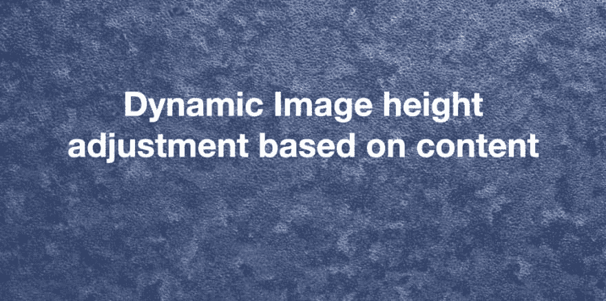
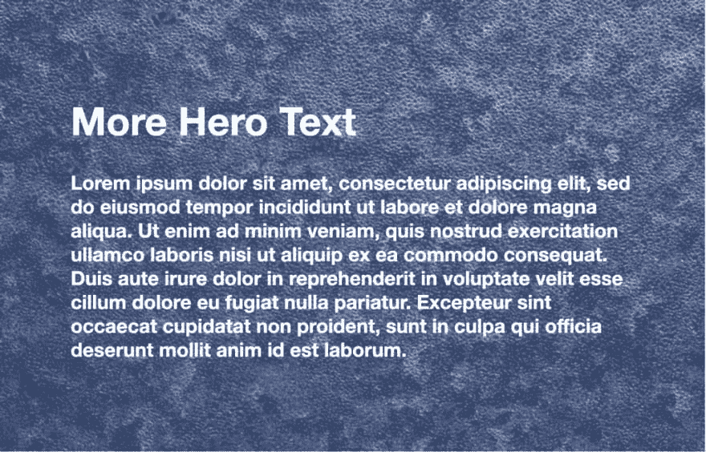

# 基于内容的 CSS 中动态图像高度调整

> 原文:[https://dev . to/saran Raj _ shekar/dynamic-image-height-adjustment-in-CSS-based-on-content-28 F6](https://dev.to/saranraj_shekar/dynamic-image-height-adjustment-in-css-based-on-content-28f6)

<figure>[](https://res.cloudinary.com/practicaldev/image/fetch/s--gk0qHPc9--/c_limit%2Cf_auto%2Cfl_progressive%2Cq_auto%2Cw_880/https://cdn-images-1.medium.com/max/1024/1%2ADB7TZBkQBqixzUywOyubIA.png) 

<figcaption>带文字内容的英雄横幅</figcaption>

</figure>

比方说，我们需要一个图像和文本内容。文本必须覆盖在图像上。如果文本内容增加，图像高度也应该增加。最常见的方法是将图像作为背景图像放入 CSS 中。

类似于这个

```
.banner {
  background-image: url(‘path/to/img’);
} 
```

但是，如果这是页面的英雄旗帜，并且出于 SEO 和可访问性的原因，业务需求是使用图像标签而不是 CSS 背景图像，该怎么办呢？

为此，我们可以通过使其位置绝对并与图像重叠来实现文本容器。类似于这个

```
<div class=”banner”>
  <div class=”banner-content”>
    <h1>Lorem ipsum dolor sit amet, consectetur</h1>
  </div>
  
</div> 
```

```
.banner {
  position: relative;
  width: 100%;
}

.banner-text {
  position: absolute;
  left: 50%;
  top: 50%;
  transform: translate(-50%, -50%);
}

.banner-image {
  width: 100%;
} 
```

但是，如果要求是，如果横幅内容正在增长，图像高度也应该增加，并匹配正确的比例。上面的解决方案不能解决这个需求，因为我们设置了 banner-content 有`position: absolute`，它的位置在 DOM 树结构之外。

为了达到上述目的，我们可以用 javascript 编写代码，并设置图像标签的高度。

没有 javascript，我们如何实现这一功能？

下面是方法，我们可以通过使用 **CSS 网格**功能来实现。这是一个基于二维网格的布局系统。Grid 是第一个专门为解决布局问题而创建的 CSS 模块，自从我们创建网站以来，我们一直在破解这个问题。

> 在 CSS 网格中，我们可以给出`grid-area`和`grid-template-areas`。`grid-area`给一个项目命名，这样它就可以被用`grid-template-areas`属性创建的模板引用。
> 
> `grid-template-areas`通过引用由 grid-area 属性指定的网格区域的名称来定义网格模板。 ***重复网格区域的名称会导致内容跨越那些单元格*** 。语法本身提供了网格结构的可视化。

示例:

```
header {
  grid-area: header;
}
main {
  grid-area: main;
}
aside {
  grid-area: aside;
}
footer {
  grid-area: footer;
}

body {
  display: grid;
  grid-template-columns: 100px 100px 100px;
  grid-template-rows: auto;
  grid-template-areas: 
   “header header header”
   “main main aside”
   “footer footer footer”;
} 
```

在上面你可以看到`grid-template-columns`有三个`100px`值，这意味着它将创建一个三列布局。在`grid-template-areas`展示的页面布局中，页眉和页脚占全幅，主页面占 2/3 宽度，副页面占 1/3 宽度。

类似地，我们可以在图像和文本重叠中实现相同的效果。

示例:

```
<div class=”hero_container”>
  <div class=”hero_image”>
    
  </div>
  <div class=”hero_text”> 
    <h2>Hero Text</h2>
    <p>Lorem ipsum dolor sit</p>
  </div>
</div> 
```

```
.hero_container {
  display: grid;
  grid-template-areas: “overlap-content”;
}

img {
  width: 100%;
  height: 100%;
  object-fit: cover;
}

.hero_image {
  grid-area: overlap-content;
}

.hero_text {
  grid-area: overlap-content;
} 
```

在上面的例子中，`grid-template-areas`值是一个单独的名字。图像和文本中使用了相同的名称。因此，每个 div 上的内容会相互重叠。我们给图像宽度和高度 100%，所以它会占据整个屏幕的宽度。对于这种重叠，如果英雄文本内容增加，图像高度也增加。

<figure>[](https://res.cloudinary.com/practicaldev/image/fetch/s--Q77uNEvP--/c_limit%2Cf_auto%2Cfl_progressive%2Cq_auto%2Cw_880/https://cdn-images-1.medium.com/max/1024/1%2A07mPMFHCVWM3hath76WB2A.png) 

<figcaption>英雄横幅带更多文字内容</figcaption>

</figure>

Tada! 👋

在这里，我们可以使用纯 CSS 实现基于内容的图像的动态高度调整功能，完全不需要 javascript。

这里是[演示](https://codepen.io/saranraj/pen/BaBLMOj)。

感谢阅读。我也在 [hashnode](https://saranraj.hashnode.dev/dynamic-image-height-adjustment-in-css-based-on-content-ck054ht17000882s12ed3xvp0) 和 [medium](https://medium.com/@saranraj_sekar/dynamic-image-height-adjustment-in-css-based-on-content-87b670ada56c) 上发表了同样的文章。

欢迎提出建议和意见🙏