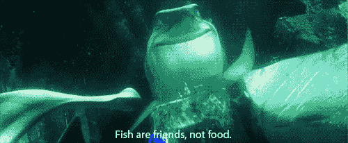
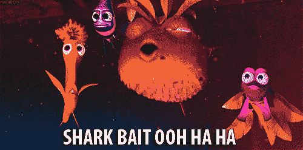

# 自动化测试 101 -与鲨鱼共泳

> 原文：<https://dev.to/scriptmunkee/test-automation-swimming-with-sharks-3e1n>

### 序言

我正在开始一个名为**自动化测试 101** 的新系列，在这里我将讨论如何让测试自动化工作顺利进行的话题&。这是我很久以来一直想写的东西，它是基于我对 [Steven Lemon 在 Medium 上关于他的开发团队](https://medium.com/@steven.lemon182)[测试自动化问题](https://medium.com/@steven.lemon182/our-teams-troubles-with-hand-written-automated-ui-tests-cb189cbbff90)的帖子的评论而开始的。

### 水里有鲨鱼

假设你为遭遇鲨鱼建造笼子...您和您的工程团队了解“感知到的”危险。笼子的所有制作步骤都是手工完成的。保持架耐用性的测试也是手工进行的。你已经听到顾客抱怨你的笼子不够耐用，但是据你所知，没有人被鲨鱼伤害过。但与此同时，你的企业领导告诉你，你的工程团队/组织需要更快、更高质量地建造更多的鲨鱼遭遇笼子。然后有人大声说我们应该*自动化*我们的工程流程。

你可能会说，这和软件开发有什么关系？就像我的假鲨鱼笼工程公司一样，我们为人们构建软件产品，并对产品应该如何使用有一个想法。我们从来不完全知道我们的产品实际上是如何被使用的。有人抱怨产品的质量(缺陷或缺失的特性)，我们的业务领导总是想要一些新的东西或更快修复的东西。

[快进]为了满足更快交付的需求，您的软件工程团队已经围绕开发流程实现了自动化层，如持续构建/部署和基础架构扩展。现在，企业转向 QA 团队，说测试工作花费了太长时间，减缓了交付。我们需要更快更准确的测试。所以让我们实现自动化测试。

### 测试自动化入门

**时间**。QA/工程团队实现自动化测试的首要原因。#2 是测试执行的**一致性**。这两者都归结于一个信念，即软件开发的瓶颈在于 QA 团队&他们完成必要验证工作的能力*这是另一篇文章的主题。我们现在就用它*。

因此，这就是将一个团队从手工测试转移到自动化测试的过程，业务或工程团队需要理解这一点。

1.  手工测试永远不会被自动化测试完全取代。

2.  在自动化测试通过预防和/或发现问题赢得信任之前，工程团队不能长时间依赖自动化测试而不是手工测试。

3.  要知道，当前所有的手动测试都不会转化为自动化测试。将需要重写或丢弃一些测试。

4.  自动化测试不应该只是 UI 测试。这可能会成为灾难的收据。

5.  自动化测试不仅仅属于 QA 团队。整个开发团队有同样多的责任，使平台开发一致，并可用于自动化测试。

6.  UI 测试可能是易变的或脆弱的，因此它们必须集中于测试 UI 交互，并使用必要的业务逻辑来驱动 UI 行为。

7.  测试自动化项目的开始应该从定义工程& QA 团队将创建的测试自动化项目的范围开始[单元测试、集成测试、API 测试、UI 测试等等]。如果你还没有谷歌测试自动化金字塔的话。

8.  UI 自动化测试的最初关注点应该是在你挑选自动化框架/平台的时候，去掉那些容易摘到的果子[BVT，通用 UI 交互，等等]。然后瞄准更高级的场景/测试。

9.  最后，您必须找出一种方法来显示自动化测试的执行一致性，这样您就可以向业务/团队展示项目背后所有努力的价值。

### 关闭本章

最终在软件开发中，客户和商业领袖是鲨鱼。对每个人来说，你必须设计和开发你的产品和测试方法，以保证你的工程团队不被生吞活剥，同时取悦每个物种中最饥饿的人。

那么，现在我已经用信息和理论武装了你，你准备好跳进你的测试自动化的鲨鱼遭遇笼子了吗？哈哈，不，你不是！现在我给你做了鲨鱼饵。你必须等到第二部分，这样我才能开始把你变成一个渔夫&而不是鲨鱼的食物。

奖励:10。我不做 10 个提示或前 10 名

*学分*:

*   横幅图片:[isango.com](https://www.isango.com/theguidebook/swim-with-sharks/)
*   鲨鱼 gif:[海底总动员](https://www.imdb.com/title/tt0266543/)