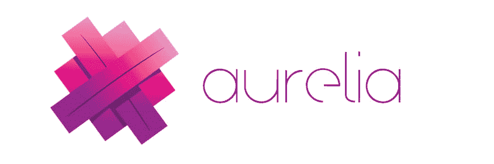
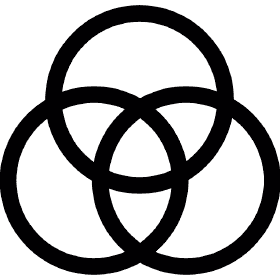

# 你应该知道的最佳角度选择是什么

> 原文:[https://dev . to/Lena Charles/what-the-best-angularjs-alternatives-you-should-know 29mi](https://dev.to/lenacharles/what-are-the-best-angularjs-alternatives-you-should-know-29mi)

Angular 的受欢迎程度在整个开发人员社区中已经确立。它提供的好处和保证远远超出想象。Paypal、Upwork、耐克、谷歌、索尼、HBO 等公司已经体验到了它的真正潜力。

Angular 是由谷歌开发的——早在 2009 年就以 AngularJS 的名字开发出来了。在后期阶段，发布的框架的第二个版本被重命名为 Angular，进入不同的预览，以便在 2016 年完全发布。

Angular 的最新版本定于今年 10 月或 11 月发布；角度 9.0。尽管我们在这里分享了一些更受欢迎的角度选择，但这并不意味着 Angular 有很多缺陷。然而，有一些缺点可能会限制发展，这些替代品可能会派上用场。

当你想雇佣 AngularJs 开发人员时，这绝对不会妨碍你，但这是为了让你了解这些 AngularJs 替代品的潜力。

## 首选角度列表

*   [奥雷利亚](https://aurelia.io/) 

Aurelia 的创造者认为它是“下一代 UI 框架”。由于它的一些特性，它在开发人员社区中受到了好评。有了 Aurelia，你会发现它包含了大量的库，这些库与定义良好的接口协同工作，使它模块化和灵活，这是 Angular 所没有的特性，因为它被理想地构建为一个整体框架；所有必要的组件都打包在一个包中。

*   [秘银](https://mithril.js.org/) 

Mithril 很小，只有 9.5Kb，是一个非常容易学习的 JavaScript 库。它于 2014 年首次发布，作为一个小型 API，用户只需学习几个功能即可上手。这就是许多开发者首选 Mithril 的原因。Mithril 有一个简单的学习曲线，与 Angular 相比非常快，因为它使用较低数量的代码来运行。通过定期更新和推送，Mithril 现在变得更快了，新的插件使编辑和格式化变得更容易。

*   [淘汰赛](https://knockoutjs.com/) 

Knockout 可以被称为一个以数据为中心的 JavaScript 库，它使用户能够将数据绑定到他们的 DOM。Knockout 揭示了一个简单的发布/订阅概念，称为“可观察的”。通过利用可观察对象，它使您能够以最小的努力构建反应式客户端应用程序。通过使用 Knockout，你手中拥有了决策权，你将构建这一切，从而理解这一切。这很简单，就像一个木匠用原木建造一件巨大的家具，而一个人将几块宜家家具组装成最终产品。

当你开始像一个“击倒”程序员一样思考时，你将能够实现视图逻辑、事件处理程序、组件和数据绑定的精细分离。

*   [Polymer.js 为 AngularJS 的替代品](https://www.polymer-project.org/) 

Polymer.js 是 Google 开发的开源 JavaScript 库。开发 Polymer 项目是为了在构建组件的同时重用 HTML 元素。2015 年 5 月 27 日首次上线。2017 年 9 月 29 日发布了 Polymer 首个稳定版 1.7.0。这个框架能够提供一种最简单的方法来创建定制的 HTML 元素，因为它的库是建立在 web 标准 API 之上的。

你会看到 Polymer.js 为了开发混合移动应用，使用了 Google material design。这使得开发移动应用程序变得又快又容易。使用 Polymer.js，您可以借助 polyfills web components 规范创建自己的自定义和可重用元素。它使您能够创建可重用的小部件。Polymer.js 有一些自定义元素分布在网络上，它们有助于用户在 HTML 导入的帮助下使用这些元素。

*   [Sencha Ext Js](https://www.sencha.com/products/extjs/)T2】

Sencha Ext JS 是一个纯粹的应用程序框架，为多平台设计交互式 web 应用程序而构建。Sencha Ext Js 是构建单页面应用程序的完整框架。然而，它也可以被用作最小组件框架，帮助在静态页面上创建动态网格。

该框架最初是在 2007 年作为附加库扩展创建的。随着时间的推移，新版本已经帮助减少了对外部库的依赖，使它们的使用不是强制性的。

结论

虽然 Angular 仍然处于其竞争对手的顶端，但寻找更好的 Angular 替代品是一个好的做法。一方面，你永远不会对一家知名的 AngularJS 开发公司失望，因为你的网站开发，你可以随时考虑最适合你的业务需求的选项。