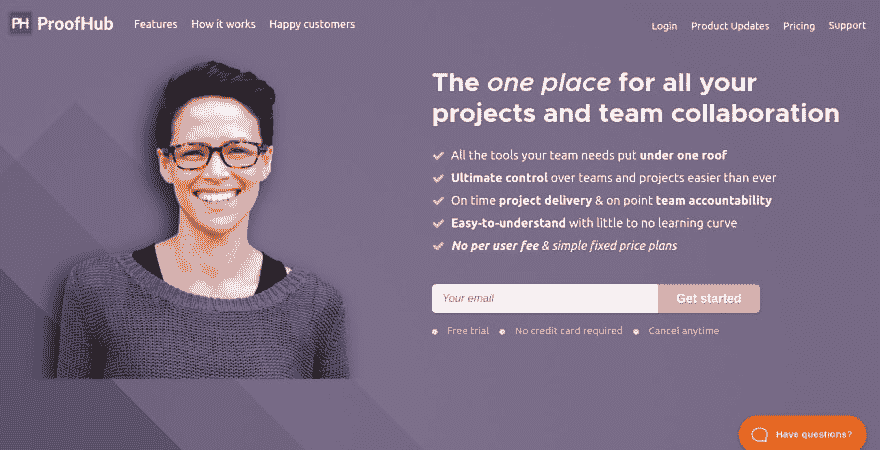
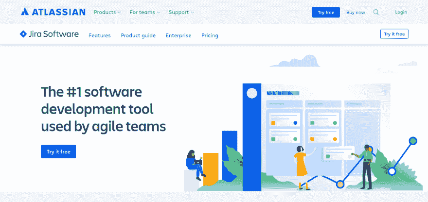
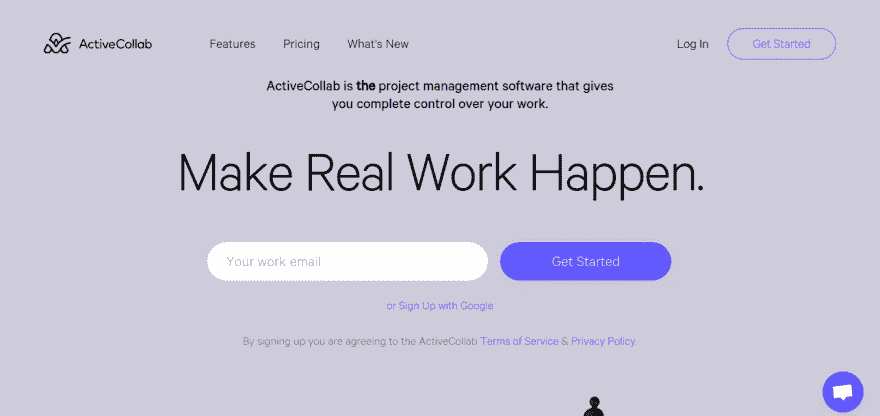
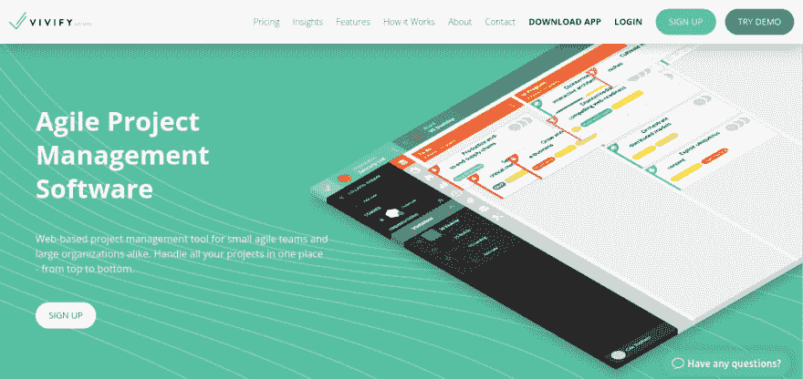
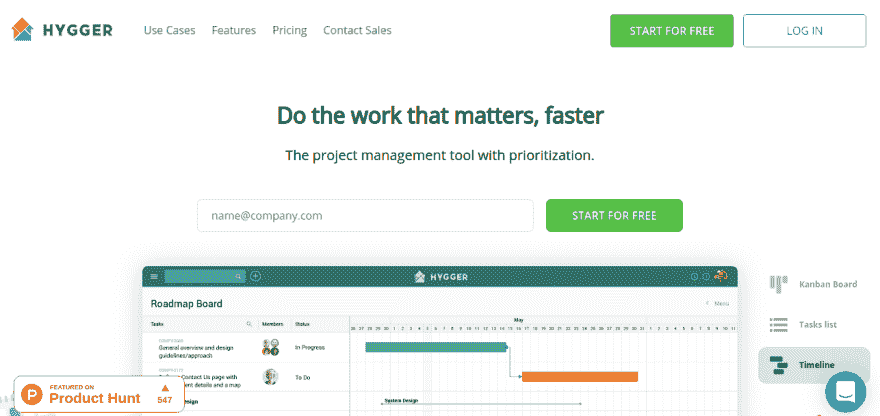
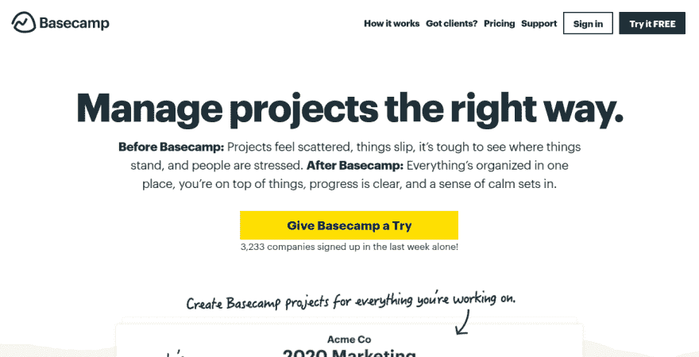
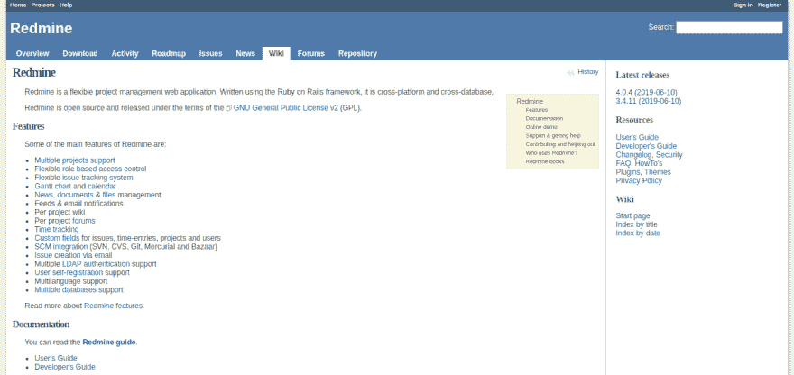
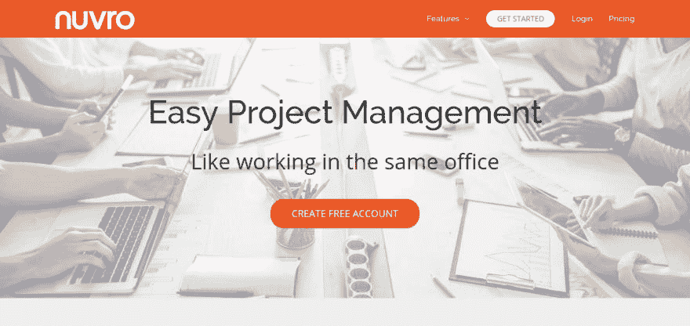

# 管理项目的 8 个最佳敏捷工具[快速比较]

> 原文:[https://dev . to/sharmanandini 4/the-8-best-agile-tools-for-managing-projects-quick-comparison-4i 00](https://dev.to/sharmanandini4/the-8-best-agile-tools-for-managing-projects-quick-comparison-4i00)

你可能听说过敏捷——一种关注团队按时完成项目的价值最大化的项目管理方法。敏捷过程促进可持续发展。项目管理的敏捷方法已经成为趋势，然而许多公司和管理者在管理项目时正面临着从传统向敏捷转变的艰难时期。如果你仍然有困难，这篇文章绝对适合你。本文进一步列出了最新的、最有效的敏捷项目管理工具，您应该努力在项目中保持正直。

让我们开始吧。

1)**[proof hub](https://www.proofhub.com/)**

ProofHub 使项目处理更容易、更快、更好。这个项目管理工具是一个管理和运行项目的中心，将项目、远程团队和客户集中在一起。

**一些关键特征:**

*   快速与团队和客户协作
*   看板和工作流程将项目任务划分为多个阶段
*   创建路线图以规划任务和资源的甘特图
*   用于计划和安排事件、里程碑和任务的日历
*   时间表有每分钟花费时间的细节

**定价:**基本计划定价为每月 45 美元，按年计费，包括最多 40 个项目和 15 GB 存储空间。

2)**[【jira】](https://www.atlassian.com/software/jira)**

[T2】](https://res.cloudinary.com/practicaldev/image/fetch/s--2LPWT-AO--/c_limit%2Cf_auto%2Cfl_progressive%2Cq_auto%2Cw_880/https://thepracticaldev.s3.amazonaws.com/i/nf4jaqmwgkjk0pl8j1gt.png)

Atlassian 著名的项目管理工具 JIRA 包含了许多优先考虑生产率和进度的特性。尽管它对于软件开发人员来说是理想的，但是任何部门都可以有效地使用它的项目管理能力。

**一些关键特征:**

*   自定义项目、问题和子任务的工作流
*   为整个团队获取准确的时间表
*   项目总结和敏捷报告
*   可定制的 Scrum 板，用于可视化显示进度
*   在完全可见的情况下优先考虑和讨论团队的工作

**定价:**吉拉提供 7 天免费试用，费用为 5 美元/用户/月(基于 15 个用户)。

3)**[ActiveCollab](https://activecollab.com/)T3】**

 
ActiveCollab 是项目管理工具，让你完全掌控自己的工作。它有一套合适的功能，让您专注于工作。

**一些关键特征:**

*   借助一体化日历、@提及和协作写作等功能，实现出色的团队协作
*   记录项目时间，计时器应用程序，时间跟踪报告
*   从头到尾计划和组织你的整个工作
*   提醒提醒人们某项任务
*   拖放多个文件，一次快速上传所有文件

**定价:**每位会员每月 7 美元

4)**[vivifyscrum](https://www.vivifyscrum.com/)T3**

[T2】](https://res.cloudinary.com/practicaldev/image/fetch/s--7V5_tvlp--/c_limit%2Cf_auto%2Cfl_progressive%2Cq_auto%2Cw_880/https://thepracticaldev.s3.amazonaws.com/i/eovg55v77e0au6de2o0j.png)

VivifyScrum 是一个敏捷的项目管理工具，可以在一个地方处理项目。适用于小型敏捷团队和多个行业的大型组织。

**一些关键特征:**

*   连接所有板以跟踪您的工作并与团队成员协作
*   为客户创建可以直接发送的发票
*   应用内的消息和评论，与聊天应用(Slack)的集成，等等
*   在敏捷板上可视化您的工作流程
*   有价值的报告和统计数据，了解您的团队表现如何

**定价:**10 人以下团队每月 10 美元起。

5) **[娱乐](https://hygger.io/)**

[T2】](https://res.cloudinary.com/practicaldev/image/fetch/s--0pGdyFNz--/c_limit%2Cf_auto%2Cfl_progressive%2Cq_auto%2Cw_880/https://thepracticaldev.s3.amazonaws.com/i/4qqkwhu94iixnhjbvt2c.png)

Hygger 是一个为敏捷团队提供的项目管理解决方案，具有内置的优先级。它是软件开发、产品管理、市场营销、创意机构等的完美工具。

**一些关键特征:**

*   创建并分享美丽的路线图
*   在看板板上分配任务，并明智地对它们进行优先排序
*   将属于某个版本的一组任务组合在一起
*   将你的任务转移到 sprint 板中，以持续改进项目
*   跟踪团队表现并生成详细报告

**定价:**企业计划，每用户每月 14 美元。

6)

Basecamp 是一个协作项目管理工具，适合从中小型企业到大型企业的所有规模的团队使用。该工具使用简单的可视化界面来帮助个人管理他们的个人项目和任务。仪表板提供了所有讨论、待办事项、文件和事件的概览，一目了然。

**一些关键特征:**

*   为你需要做的所有工作创建一个待办事项列表
*   将客户电子邮件直接转发到 Basecamp
*   进行私人一对一或小组对话
*   查看过期或即将到期内容的报告
*   每个项目中的实时群聊

**定价:** Basecamp 每月 99 美元，全包。

7)**[Redmine](https://www.redmine.org/)**

Redmine 旨在帮助项目管理团队掌握每个项目。它能满足您的所有需求，与团队规模无关。

**一些关键特征:**

*   与[甘特图](https://www.proofhub.com/articles/gantt-charts)和报告整合
*   bug、功能更新或任何需要跟踪的重要内容的跟踪工具
*   每个项目都可以声明为公有或私有
*   每个用户在每个项目中可以有不同的角色
*   查看每个用户时间的简单报告

**定价:**提供免费试用。请访问网站了解定价详情。

8) **[努夫罗](https://nuvro.com/)T3】**

[T2】](https://res.cloudinary.com/practicaldev/image/fetch/s--rIeioDGq--/c_limit%2Cf_auto%2Cfl_progressive%2Cq_auto%2Cw_880/https://thepracticaldev.s3.amazonaws.com/i/dvf7g9kt2cnel1ei6qbb.png)

Nuvro 是一个全功能的项目管理解决方案，使在线项目管理变得容易。它促进了队友之间的顺畅协作。在 Nuvro，一切都是透明的，每个人都对自己的项目负责。

**一些关键特征:**

*   所有项目、客户和目标的概述
*   不需要日程安排的任务的快速待办事项列表
*   协作将所有信息和讨论分类
*   单页视图，处理任何任务，无论大小

**定价:**每年 4 美元/月，不限项目，不限工作空间。

如果你计划在项目管理中采用敏捷工具，这些工具可以证明是快速项目管理实践的支柱。此外，如果你有一些喜欢的工具，请在下面的评论中告诉我们。