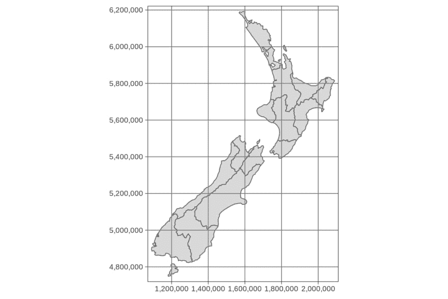
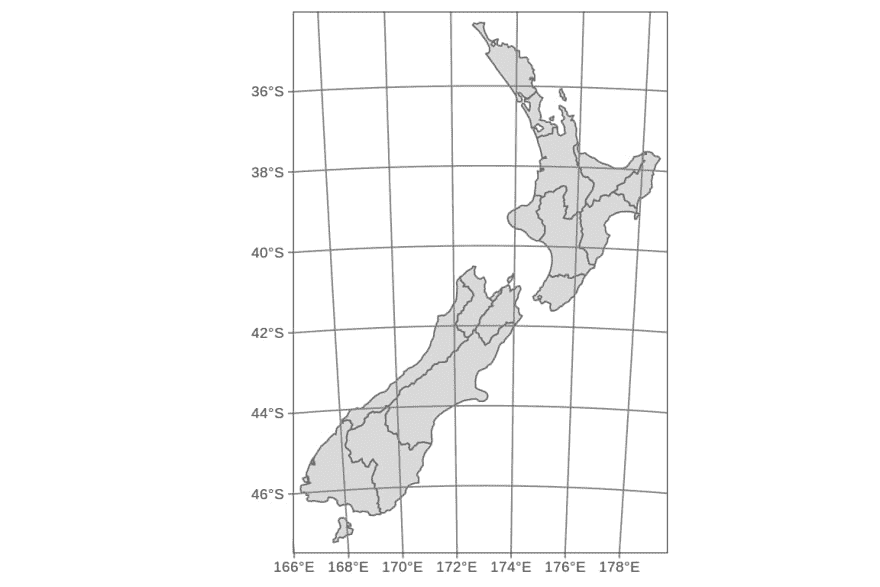
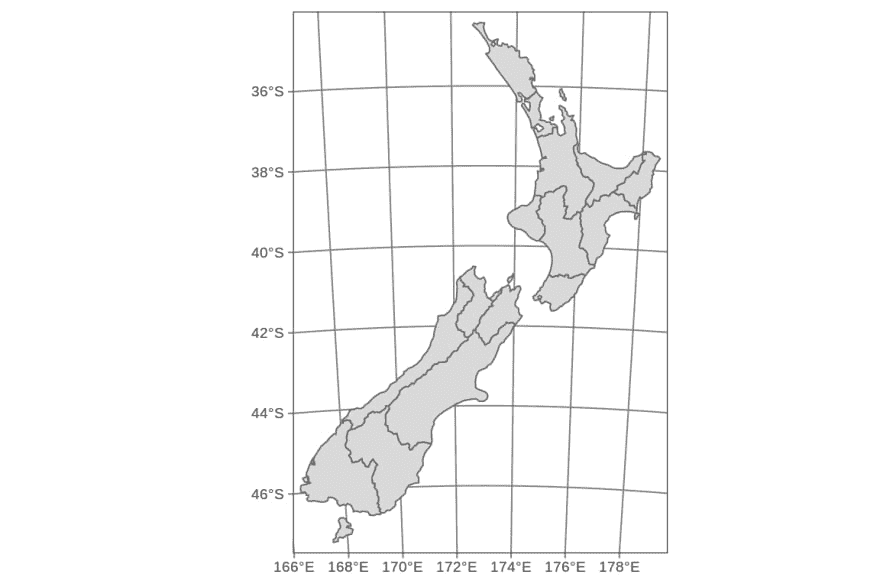
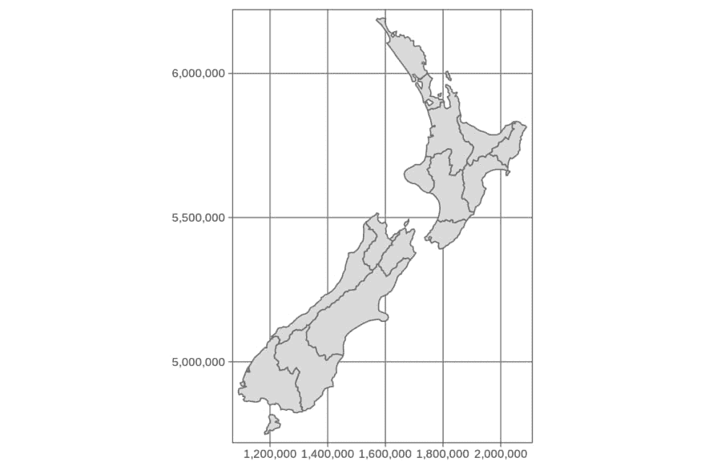
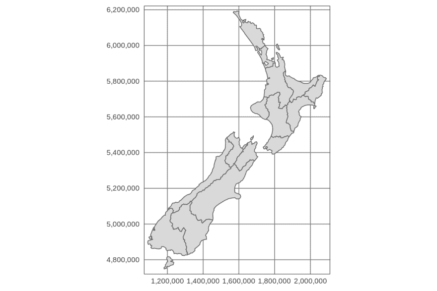
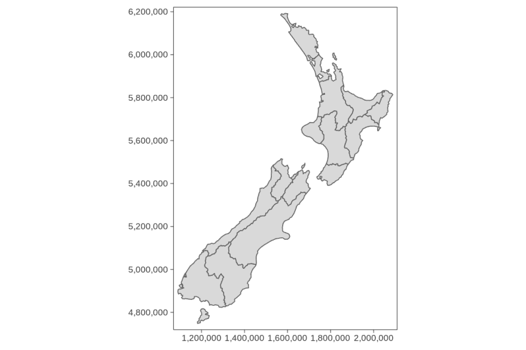
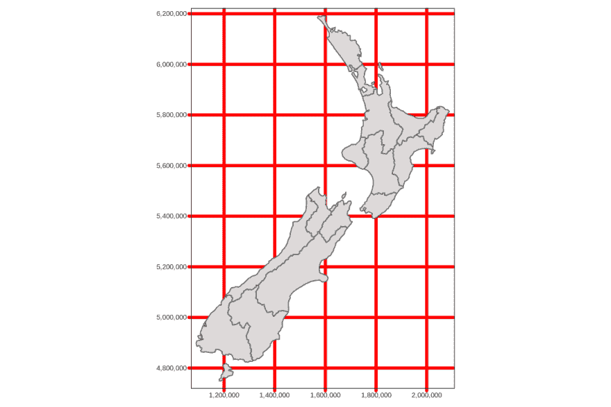
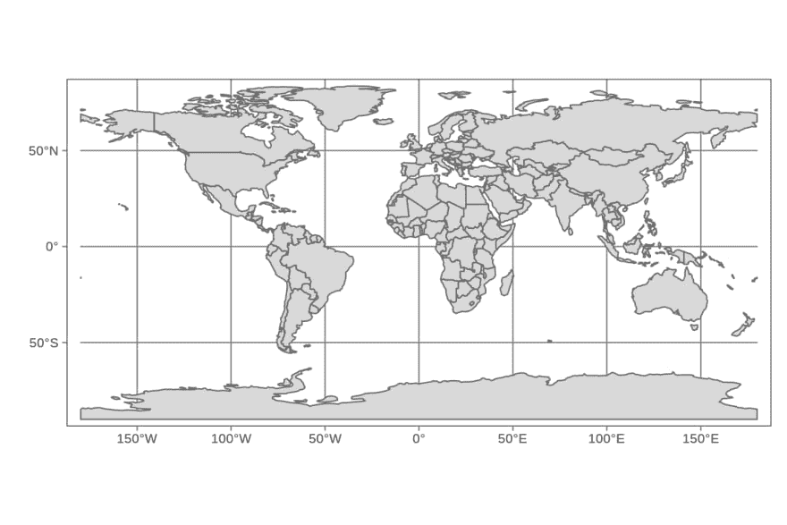
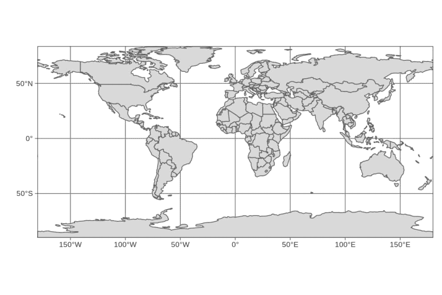

# tmap 包中的格网和经纬网

> 原文：<https://dev.to/jakub_nowosad/grids-and-graticules-in-the-tmap-package-2kif>

这张插图建立在[的](https://geocompr.github.io/)[制作地图章节](https://geocompr.robinlovelace.net/adv-map.html)和 R 书的地理计算之上。它的目标是演示如何在 **tmap** 包中设置和修改网格和经纬网。

## 先决条件

以下示例假设附加了以下包:

```
library(spData) # example datasets
library(tmap) # map creation (>=2.3)
library(sf) # spatial data classes 
```

# 网格和经纬网

**tmap** 包提供了两种绘制坐标线的方法- `tm_grid()`和`tm_graticules()`。`tm_grid()`的作用是表示输入数据的坐标。例如，`nz`对象使用新西兰横轴墨卡托投影，单位为米。

```
tm_shape(nz) + 
  tm_polygons() +
  tm_grid() 
```

[](https://res.cloudinary.com/practicaldev/image/fetch/s--L4iQp-6P--/c_limit%2Cf_auto%2Cfl_progressive%2Cq_auto%2Cw_880/https://geocompr.github.io/post/2019/tmap-grid_files/figure-html/unnamed-chunk-3-1.png)

`tm_graticules()`显示经线(经线)和纬线(纬线)，以度数为单位(注意下面例子中的度数符号)。

```
tm_shape(nz) + 
  tm_polygons() +
  tm_graticules() 
```

[](https://res.cloudinary.com/practicaldev/image/fetch/s--xzTo_l8o--/c_limit%2Cf_auto%2Cfl_progressive%2Cq_auto%2Cw_880/https://geocompr.github.io/post/2019/tmap-grid_files/figure-html/unnamed-chunk-4-1.png)

# 图层顺序

`tm_grid()`和`tm_graticules()`都可以放在主空间数据的上面或下面。它在地图上的位置取决于它在代码中的位置。当`tm_grid()`或`tm_graticules()`被放置在代码绘制几何图形(如`tm_polygons()`)后，网格或经纬网被绘制在地图的顶部。另一方面，当`tm_grid()`或`tm_graticules()`被放置在代码绘制几何图形(例如`tm_polygons()`)之前时，网格或网格被绘制在空间数据之后。

```
tm_shape(nz) +
  tm_graticules() + 
  tm_polygons() 
```

[](https://res.cloudinary.com/practicaldev/image/fetch/s--iADnVcc8--/c_limit%2Cf_auto%2Cfl_progressive%2Cq_auto%2Cw_880/https://geocompr.github.io/post/2019/tmap-grid_files/figure-html/unnamed-chunk-6-1.png)

# 定制

使用几个参数可以在 **tmap** 中轻松定制格网和经纬网。第一个，`labels.inside.frame`在地图网格内移动标签(默认设置为`FALSE`)。

```
tm_shape(nz) +
  tm_grid(labels.inside.frame = TRUE) + 
  tm_polygons() 
```

[](https://res.cloudinary.com/practicaldev/image/fetch/s--ECHjIyz_--/c_limit%2Cf_auto%2Cfl_progressive%2Cq_auto%2Cw_880/https://geocompr.github.io/post/2019/tmap-grid_files/figure-html/unnamed-chunk-7-1.png)

可以使用`n.x`和`n.y`参数设置水平线(`x`)和垂直线(`y`)的数量。重要的是， **tmap** 将坐标值四舍五入为等间距的“四舍五入”值，因此实际标签的数量可能与用`n.x`和`n.y`设置的略有不同。

```
tm_shape(nz) +
  tm_grid(n.x = 4, n.y = 3) + 
  tm_polygons() 
```

[](https://res.cloudinary.com/practicaldev/image/fetch/s--Xd6600QF--/c_limit%2Cf_auto%2Cfl_progressive%2Cq_auto%2Cw_880/https://geocompr.github.io/post/2019/tmap-grid_files/figure-html/unnamed-chunk-8-1.png)

默认情况下，`tm_grid()`和`tm_graticules()`显示刻度和线条。可以使用`ticks = FALSE`和`lines = FALSE`禁用它们。

```
tm_shape(nz) +
  tm_grid(ticks = FALSE) +
  tm_polygons() 
```

[](https://res.cloudinary.com/practicaldev/image/fetch/s--nlXZ6Rzt--/c_limit%2Cf_auto%2Cfl_progressive%2Cq_auto%2Cw_880/https://geocompr.github.io/post/2019/tmap-grid_files/figure-html/unnamed-chunk-9-1.png)

尤其是，`lines = FALSE`在显示栅格数据时非常有用。

```
tm_shape(nz) +
  tm_grid(lines = FALSE) +
  tm_polygons() 
```

[](https://res.cloudinary.com/practicaldev/image/fetch/s--Ak1CWcM3--/c_limit%2Cf_auto%2Cfl_progressive%2Cq_auto%2Cw_880/https://geocompr.github.io/post/2019/tmap-grid_files/figure-html/unnamed-chunk-10-1.png)

也可以定制`tm_grid()`和`tm_graticules()`外观，例如通过改变线条颜色(`col`)、宽度(`lwd`或标签尺寸(`labels.size`)。

```
tm_shape(nz) +
  tm_grid(col = "red", lwd = 3, labels.size = 0.4) +
  tm_polygons() 
```

[](https://res.cloudinary.com/practicaldev/image/fetch/s--1jLZmgQi--/c_limit%2Cf_auto%2Cfl_progressive%2Cq_auto%2Cw_880/https://geocompr.github.io/post/2019/tmap-grid_files/figure-html/unnamed-chunk-11-1.png)

上面的例子使用了`tm_grid()`，但是同样的参数也适用于`tm_graticules()`。

# 布局设置

默认情况下， **tmap** 会在显示的数据和地图框之间添加较小的内边距。它在许多情况下工作良好，例如，见上面的新西兰地图。然而，它对于世界地图来说看起来并不完美。

```
tm_shape(world) + 
  tm_graticules() + 
  tm_polygons() 
```

[](https://res.cloudinary.com/practicaldev/image/fetch/s--Y4J_mLOF--/c_limit%2Cf_auto%2Cfl_progressive%2Cq_auto%2Cw_880/https://geocompr.github.io/post/2019/tmap-grid_files/figure-html/unnamed-chunk-12-1.png)

解决这个问题的方法是使用`tm_layout()`函数，并将其`inner.margins`参数设置为`0`。

```
tm_shape(world) + 
  tm_graticules() + 
  tm_polygons() +
  tm_layout(inner.margins = 0) 
```

[](https://res.cloudinary.com/practicaldev/image/fetch/s--EUr4LFJP--/c_limit%2Cf_auto%2Cfl_progressive%2Cq_auto%2Cw_880/https://geocompr.github.io/post/2019/tmap-grid_files/figure-html/unnamed-chunk-13-1.png)