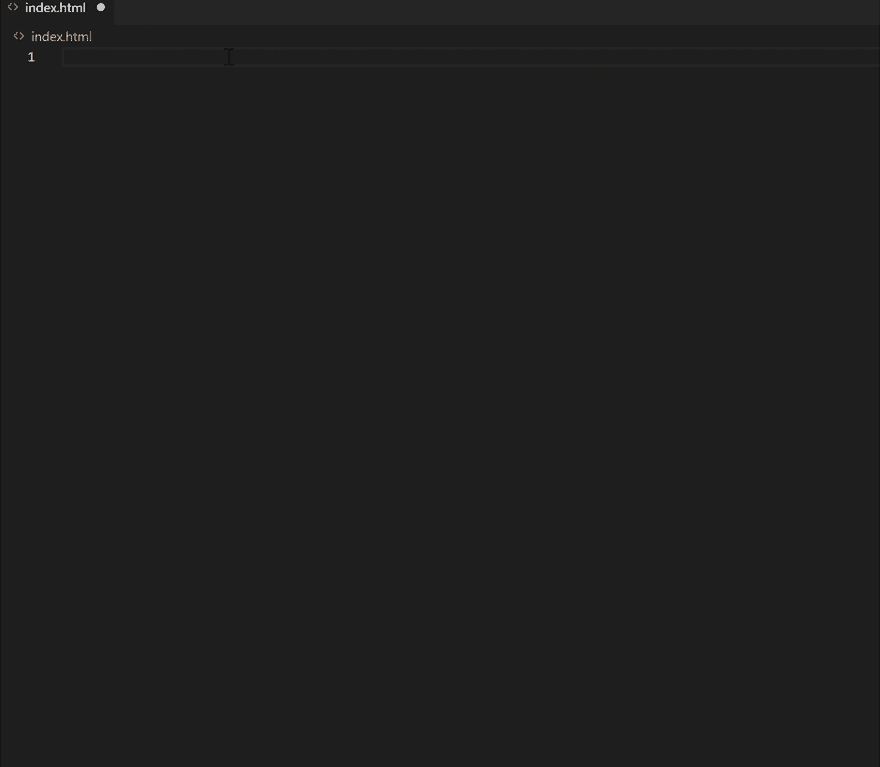

# 让我们像专家一样编写 HTML😎

> 原文：<https://dev.to/yashints/let-s-write-html-like-a-pro-28h5>

你有多少次写了一段 HTML 代码却没有意识到你写的代码可能并不理想？

## 这个为什么

`HTML`总是那个躲在角落里没人说话的孩子，因为`JavaScript`和`CSS`总是抢走别人的注意力。

现在，请记住这个画面，因为我将介绍一些简单的技巧，这些技巧结合在一起，会有所不同，并有助于让孩子重新回到中心😁。

这些是创建一个干净的、可维护的和可伸缩的代码的一部分，它将很好地利用语义标记元素`HTML5`，并且将在支持的浏览器中正确呈现。

为了让我不再没完没了地问为什么，让我们来看看是什么。

## DOCTYPE

从你的`index.html`的顶部开始，确保你正在声明一个`DOCTYPE`。这将在所有浏览器中激活标准模式，并让它们知道应该如何解释文档。请记住，`DOCTYPE`不是一个 HTML 元素。

对于`HTML5`，它看起来像:

```
<!DOCTYPE html> 
```

Enter fullscreen mode Exit fullscreen mode

**注意:**如果您使用的是框架，这是为您预先填充的。如果没有，我强烈推荐使用像[埃米特](https://code.visualstudio.com/docs/editor/emmet)这样的代码片段，它在 [VS 代码](https://code.visualstudio.com)中可用。

[](https://res.cloudinary.com/practicaldev/image/fetch/s--ykBI07L7--/c_limit%2Cf_auto%2Cfl_progressive%2Cq_66%2Cw_880/https://thepracticaldev.s3.amazonaws.com/i/mdprvimfdfxuzk8r1hvz.gif)

想了解更多关于其他文档类型的信息吗？[看看这份参考文件](https://html.com/tags/doctype/)。

## 可选标签

有些标签在 HTML5 中是可选的，主要是因为元素是隐式存在的。信不信由你，你可以省略`<html>`标签，页面会呈现得很好。

```
<!DOCTYPE HTML>

  <head>
    Hello
  </head>
  <body>
    <p>Welcome to this example.</p>
  </body>
</html> 
```

Enter fullscreen mode Exit fullscreen mode

上面是一个有效的`HTML`，但是，有些情况下你不能这样做，比如标签后面跟注释:

```
<!DOCTYPE HTML>
<!-- where is this comment in the DOM? -->

  <head>
    Hello
  </head>
  <body>
    <p>Welcome to this example.</p>
  </body>
</html> 
```

Enter fullscreen mode Exit fullscreen mode

以上无效，因为解析树由于注释在`<html>`标记之外而改变。

## 结束标签

你应该总是考虑关闭你的标签，因为有些浏览器会在呈现你的页面时出现问题。但是，出于可读性和其他原因(我将在后面介绍),建议保留这些内容。

```
<div id="example">
  
  <a href="#" title="test">example</a>
  <p>example</p>
</div> 
```

Enter fullscreen mode Exit fullscreen mode

以上都是有效标签。但是也有一些例外👇🏼这个规则。

自结束标记是有效的，但不是必需的。这些元素包括:

```
<br>, <hr>, , <input>, <link>, <meta>,
<area>, <base>, <col>, <command>, <embed>, <keygen>, <param>, <source>, <track>, <wbr> 
```

Enter fullscreen mode Exit fullscreen mode

**注意:**普通元素永远不能有自结束标签。

```
 
```

Enter fullscreen mode Exit fullscreen mode

以上明显无效。

## 字符集

预先定义你的字符集。最佳实践是将它放在`<head>`元素的顶部。

```
<head>
  This is a super duper cool title, right 😥?
  <meta charset="utf-8">
</head> 
```

Enter fullscreen mode Exit fullscreen mode

以上无效，标题无法正确呈现。相反，将角色集减速移动到顶部。

```
<head>
  <meta charset="utf-8">
  This is a super duper cool title, right 😃?  
</head> 
```

Enter fullscreen mode Exit fullscreen mode

## 语言

不省略可选标签的另一个原因是在使用属性时。在这种情况下，你可以也应该定义你的网页语言。这对可访问性和搜索非常重要。

```
<html lang="fr-CA">
  ...
</html> 
```

Enter fullscreen mode Exit fullscreen mode

## Title

永远，永远，永远不要省略标题标签。这对可访问性非常不好，我个人永远不会使用你的网站，因为我打开它 2 秒钟后就找不到了，20 多个标签之后也找不到了😁(浏览器选项卡不会显示任何内容)。

## `base`标签

这是一个非常有用的标签，应该谨慎使用。这将设置应用程序的基本 URL。一旦设置，所有的链接都将相对于这个基本 URL，这可能会导致一些不必要的行为:

```
<base href="http://www.example.com/" /> 
```

Enter fullscreen mode Exit fullscreen mode

通过以上设置，`href="#internal"`将被解释为`href="http://www.example.com/#internal"`。

否则`href="example.org"`会被解释为`href="http://www.example.com/example.org"`。

## 描述

这个 meta 标记非常有用，尽管严格来说它不是最佳实践的一部分。这对于搜索引擎抓取你的网站非常有用。

```
<meta name="description" content="HTML best practices"> 
```

Enter fullscreen mode Exit fullscreen mode

我有一个关于 SEO 的[帖子，你可以看看，这个帖子已经非常流行了](https://yashints.dev/blog/2019/06/11/seo-tips)。

## 语义标签

虽然你可以只用`div` s 创建你的 UX 工程师的线框，但这并不意味着你应该这样做。语义 HTML 赋予你的页面意义，而不仅仅是表现。像`p`、`section`、`h` {1-6}、`main`、`nav`等标签都是语义标签。如果你使用一个`p`标签，用户会知道这代表了一段文字，浏览器知道如何表示它们。

语义 HTML 远远超出了本文的范围。但是你应该在写作的时候把它们拿出来使用，就像它们是你的笔一样。没有钢笔❓(或鼠标)你能写字吗😁)?

## `hr`不应该用于格式化

`<hr>`不是一个格式化元素，因此停止使用它来格式化您的内容。在 HTML5 中，这个标签代表了你的内容的主题。正确的用法可能是这样的:

```
<p>Paragraph about puppies</p>
<p>Paragraph about puppies' favourite foods</p>
<p>Paragraph about puppies' breeds</p>
<hr>
<p>Paragraph about why I am shaving my head 😂</p> 
```

Enter fullscreen mode Exit fullscreen mode

## 使用`title`属性时要小心

属性是一个强大的工具，它可以像工具提示一样帮助阐明页面上某个元素的动作或用途。然而，它不能与图像上的其他属性如`alt`互换。

根据 HTML5 规范:

> 目前不鼓励依赖`title`属性，因为许多用户代理没有按照本规范的要求以可访问的方式公开该属性(例如，需要鼠标等定点设备来显示工具提示，这排除了只使用键盘的用户和只使用触摸的用户，例如任何拥有现代手机或平板电脑的人)。

[阅读更多关于如何正确使用该属性](https://html.spec.whatwg.org/multipage/dom.html#the-title-attribute)的信息。

## 单引号或双引号

我遇到过许多在标记中混合了两者的代码库。这是不好的，尤其是如果你使用的框架依赖于单引号，比如`php`以及当 *`you're`* 在一个句子中使用单引号，就像我现在做的。另一个原因是保持一致性，这总是好的。
不做

```
 
```

Enter fullscreen mode Exit fullscreen mode

相反:

```
 
```

Enter fullscreen mode Exit fullscreen mode

## 省略布尔值

当谈到属性的布尔值时，建议忽略它们，因为它们不会增加任何值，还会增加标记的权重。

```
<audio autoplay="autoplay" src="podcast.mp3">

<!-- instead 👇🏼 -->

<audio autoplay src="podcast.mp3"> 
```

Enter fullscreen mode Exit fullscreen mode

## 省略类型属性

不需要给`script`和`style`标签添加`type`属性。你还会从一些服务中得到一个验证错误，比如 W3C 的标记验证工具。

## 验证您的标记

你可以使用像 W3C 的标记验证这样的服务来确保你有一个有效的标记😍。

## 对内联式☢说不

你在 HTML 文件中写的是内容，它看起来像什么是表现。将演示留给 CSS，不要使用内嵌样式。这将有利于你的开发者和浏览器来消化你的标记。

## 总结

这些只是编写标记时要记住的小事情的冰山一角。有很多很好的资源可以让你看得更深入，我强烈建议你至少浏览一次。

*   [GitHub 上的 HTML 最佳实践](https://github.com/hail2u/html-best-practices)
*   [W3C 学校 HTML 风格指南](https://www.w3schools.com/html/html5_syntax.asp)

希望你喜欢这本书。保持优雅😊，使用您的标记😁。