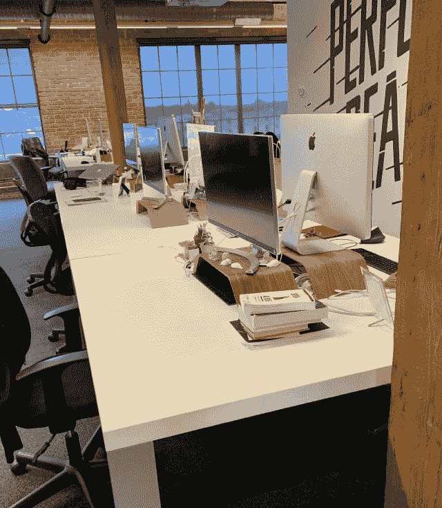
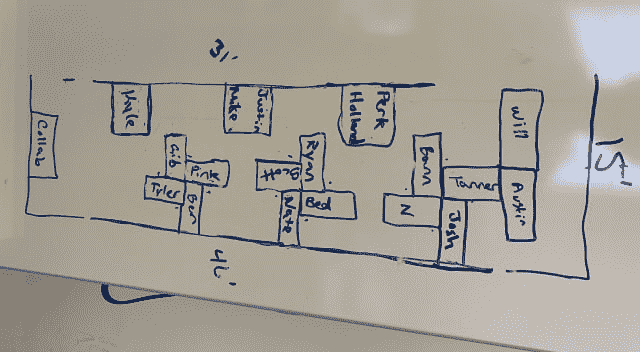
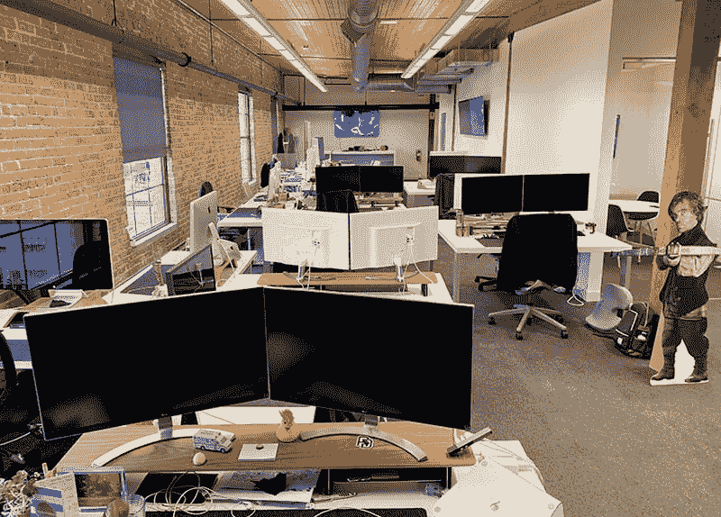

# 开发团队中的针轮式办公桌布局

> 原文:[https://dev . to/team hive/pin-wheel-desk-layout-in-a-development-team-2 oji](https://dev.to/teamhive/pin-wheel-desk-layout-in-a-development-team-2oji)

# 背故事

我们的团队采用开放式办公室布局，营造高度协作的工作环境。没有员工有自己的个人办公室，相反，我们有足够的会议空间来满足客户、个人或私人会议的需求。

每个团队由 8-20 人组成，整个公司大约有 5 个不同的团队。随着团队规模逐年扩大，我们在持续协作以及合理利用物理空间以发挥其最大潜力方面遇到了问题。当新的团队成员被雇佣时，他们被安排在一排的末端，桌子开始环绕办公室。此外，电源线和电涌保护器以菊花链形式连接在一起，以提供所有必要的交流电源——这可不好！

[T2】](https://res.cloudinary.com/practicaldev/image/fetch/s--YgWtUkom--/c_limit%2Cf_auto%2Cfl_progressive%2Cq_auto%2Cw_880/https://i.ibb.co/2KBsDpV/old-desk.png)

> 这张照片是一个简单的 6 人配置。想象一下这样连续重复 4 次。

## 初步研究

我们研究了各种可以解决我们空间挑战的解决方案:

*   彻底改变传统的办公桌布置
*   租用额外的办公空间(租用我们当前工作空间下面的空间)
*   最小化个人桌面空间，在更小的空间里容纳更多的人
*   减少开放的协作空间，开始用新桌子来占据它们

每个解决方案似乎都比前一个有更多的缺点。为什么我们需要牺牲工作环境来容纳更多的人？或者更确切地说，为什么我们需要增加一些额外的雇员来增加我们的开支呢？或者团队的规模不足以保证目前有那么大的办公空间。

我们的团队对工作空间中对我们重要的事情进行了重新分组和优先排序。

**协作**
我们是一群工程师和设计师，一起工作并保持持续的沟通至关重要。像 Slack 这样的工具作为工作环境中的拐杖非常有用，但不能取代面对面工作的协同作用。

隐私
有时候你只需要埋头工作。噪音、行人交通等。都会影响你对工作的专注程度。我们的团队重视插入到他们的利基市场并迅速走到一起进行协作的能力。

**团队半径**
随着团队的成长，团队的不同职能开始形成。我们最初是一个全栈工程师团队，并意识到专门的前端/后端团队更有利可图，并产生更多的吞吐量。当这个团队成长时，让这些人最大程度地在一起工作是很有价值的，是在对话范围内。我们重视让我们的运营团队尽可能靠近，而不必使用会议空间。

感觉霍米兹
在办公室呆的时间越长，办公室就开始成为你的延伸。你想要一个既舒适又安全的环境。我们想要一个环境，在那里你不会面对一堵墙，而是看着你的同伴。我们还重视开放式办公室布局，不希望我们的团队中出现额外的墙壁/筒仓。

# 我们的方法

在对可以满足这些目标的不同桌子配置进行深入研究后，我们最终确定了针轮桌子配置的变体。由于空间限制，我们无法在 15 英尺宽、46 英尺长的走廊中完成完全展开的针轮书桌配置。在移动任何桌子之前，我们计划好我们的攻击(就像工程师一样！).

[T2】](https://res.cloudinary.com/practicaldev/image/fetch/s--uDLUPlDs--/c_limit%2Cf_auto%2Cfl_progressive%2Cq_auto%2Cw_880/https://i.ibb.co/dW2Vt80/desk-diagram.png)

我们将最需要合作的团队成员安排在一起，创造了既能保护隐私又能体现家庭氛围(自然光/窗户视野)的空间，并将团队安排在一个方便的半径范围内。

# 结果

[T2】](https://res.cloudinary.com/practicaldev/image/fetch/s--sGIOVJ8z--/c_limit%2Cf_auto%2Cfl_progressive%2Cq_auto%2Cw_880/https://i.ibb.co/9VL4VCn/new-desk.png)

我们在 7 月 10 日进行了这一更改。从那以后，我们在协作、生产力和跨团队沟通方面都有所提高。团队成员已经能够改善他们与过去没有社交协作的团队成员的关系。我们还增加了 4 个桌面设置，增加了最大物理容量。

整个团队一致认为这种办公桌的配置比传统的直线排列有所改进。

## 接下来是什么？

电缆管理是我们的下一个重点，以改善我们工作空间的组织和安全。