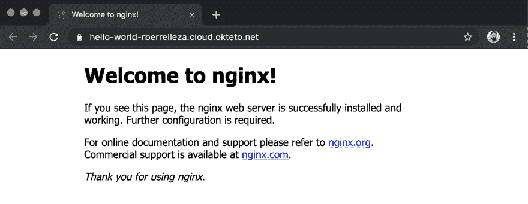
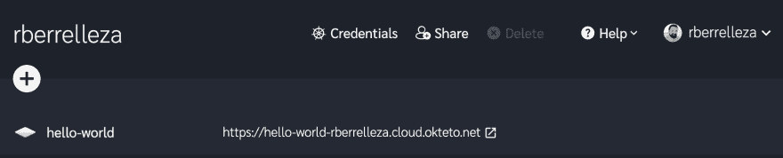

# 初看圣盔 3

> 原文:[https://dev.to/okteto/an-early-look-at-helm-3-l79](https://dev.to/okteto/an-early-look-at-helm-3-l79)

头盔 3 [第一个测试版现已发售](https://github.com/helm/helm/releases/tag/v3.0.0-beta.1)！这是一个特别重要的里程碑，因为它标志着*大掌舵重写*的完成。从现在开始，Helm 团队的重点将放在 bug 修复和稳定性上。这意味着我们可以开始制作针对头盔 3 的图表，对吗？

我真的很想尝试一下 Helm 3，但不想搞乱我的本地机器(Helm 和 Helm 3 的二进制文件不兼容，所以你需要分开安装，`$HELM_HOME`和 whatnots)，所以我没有在我的机器上测试它，而是决定在 [Okteto Cloud](https://cloud.okteto.com) 中启动一个开发环境，并从那里测试一切。

## [](#launch-your-development-environment-in-okteto-cloud)在 Okteto Cloud 中启动您的开发环境

如果这是你第一次使用 Okteto，首先安装[ok teto CLI](https://okteto.com/docs/getting-started/installation/index.html)。我们需要它来将开发环境发布到 Okteto Cloud 中。

我们将从初始化[我们的开发环境](https://okteto.com/docs/reference/development-environment/index.html)开始，使用`okteto init`命令创建我们的清单(这告诉 Okteto 启动哪种开发环境)。因为我们在一个空的目录上工作，`okteto`会要求我们选择一个运行时。选第一个。

```
$  mkdir helm3
$  cd helm3
$  okteto init 
```

既然我们已经定义了我们的开发环境，我们需要配置我们的本地环境来使用 Okteto Cloud。

首先，运行`okteto login`命令创建您的 Okteto Cloud 帐户，并将其链接到您的本地计算机(您只需在每台计算机上执行一次)。

```
$  okteto login 
 ✓  Logged in as rberrelleza
    Run `okteto namespace` to activate your download your Kubernetes credeentials. 
```

其次，运行`okteto namespace`命令下载 Okteto Cloud 的 Kubernetes 凭证，并将其设置为当前上下文。

```
$  okteto namespace 
 ✓  Updated context 'cloud_okteto_com' in '/Users/ramiro/.kube/config' 
```

现在我们准备好出发了！运行`okteto up`命令，将我们的开发环境直接启动到 Okteto Cloud:

```
$  okteto up
 Deployment okteto-helm3 doesn't exist in namespace rberrelleza. Do you want to create a new one? [y/n]: y
 ✓  Persistent volume provisioned
 ✓  Files synchronized
 ✓  Okteto Environment activated
    Namespace: rberrelleza
    Name:      okteto-helm3

Welcome to your development environment. Happy coding! okteto> 
```

`okteto up`命令在 Okteto Cloud 中启动一个开发环境，保持您的代码在您的开发环境和本地机器之间同步，并自动为您打开一个开发环境的 shell。从现在开始，我们将直接在我们的远程开发环境中运行所有的命令*(注意代码示例中的`okteto>` bash 符号😎).*

## [](#install-helm-3-in-the-development-environment)在开发环境中安装 Helm 3

从 github 下载 v3.0.0-beta.1 版本，并安装在`/usr/bin/local`中。

```
okteto>  wget https://get.helm.sh/helm-v3.0.0-beta.1-linux-amd64.tar.gz -O /tmp/helm-v3.0.0-beta.1-linux-amd64.tar.gz
okteto>  tar -xvzf /tmp/helm-v3.0.0-beta.1-linux-amd64.tar.gz -C /tmp 
okteto>  mv /tmp/linux-amd64/helm /usr/local/bin/helm
okteto>  chmod +x /usr/local/bin/helm 
```

运行`helm version`以确保一切正常(毕竟我们在处理测试版软件)。

```
okteto>  helm version
version.BuildInfo{Version:"v3.0.0-beta.1", GitCommit:"f76b5f21adb53a85de8925f4a9d4f9bd99f185b5", GitTreeState:"clean", GoVersion:"go1.12.9"} 
```

## [](#deploying-our-first-chart)部署我们的第一张图表

为了继续探索 Helm 3，我们将通过运行`helm create`创建一个简单的图表。这个命令使用 NGINX 容器及其相应服务的部署创建一个图表。

```
okteto>  helm create hello-world
Creating hello-world 
```

通过运行`helm install`命令:
部署您的图表

```
okteto>  helm install hello-world ./hello-world
NAME: hello-world
LAST DEPLOYED: 2019-08-29 23:01:17.851466604 +0000 UTC m=+0.128796294
NAMESPACE: rberrelleza
STATUS: deployed .... 
```

然后您可以运行`helm list`来查看所有已安装的版本:

```
okteto>  helm list
NAME                    NAMESPACE   REVISION    UPDATED                                 STATUS      CHART
hello-world             rberrelleza 1           2019-08-29 23:06:40.982957007 +0000 UTC deployed    hello-world-0.1.0 
```

> 当您在 Okteto Cloud 中启动开发环境时，会自动为您创建一组凭证。凭证会自动装载到您的开发环境中，因此您可以开始使用像`helm`或`kubectl`这样的工具，而不需要额外的配置。

我们将让 Okteto Cloud [通过用`dev.okteto.com/auto-ingress=true`注释服务，为我们的应用程序自动创建一个公共可访问的 SSL 端点](https://okteto.com/docs/cloud/ssl.html)，而不是运行一个到我们本地机器的端口转发。`helm create`创建的图表不支持注释，我们就直接用`kubectl annotate`:

```
okteto>  kubectl annotate service hello-world dev.okteto.com/auto-ingress=true
service/hello-world annotated 
```

让我们打开浏览器，前往 [Okteto Cloud](https://cloud.okteto.com) 查看应用程序的端点。

[T2】](https://res.cloudinary.com/practicaldev/image/fetch/s--UKzLtbVf--/c_limit%2Cf_auto%2Cfl_progressive%2Cq_auto%2Cw_880/https://thepracticaldev.s3.amazonaws.com/i/y4uzj6usnp2nujamfr0v.png)

让我们继续点击 URL，查看我们的应用程序启动并运行。

[T2】](https://res.cloudinary.com/practicaldev/image/fetch/s--c5r8pNLf--/c_limit%2Cf_auto%2Cfl_progressive%2Cq_auto%2Cw_880/https://thepracticaldev.s3.amazonaws.com/i/13ycvy0r17h0aowy70wc.png)

> 由于 [#6287](https://github.com/helm/helm/issues/6287) ，Helm 3.0.0-beta.1 无法从存储库中安装图表。它将在下一个测试版中修复。

## [](#upgrading-the-chart)升级图表

让我们改变无聊的“欢迎来到 nginx 页面！”更有天赋的东西。我们将升级我们的图表，并使用`helm upgrade`命令将容器图像从`nginx`更改为`ramiro/hello`。

```
okteto>  helm upgrade --set image.repository=ramiro/hello hello-world ./hello-world 
```

运行`helm list`查看发布的状态。注意`revision`的值是如何从`1`变为`2`的，以表明部署了新版本。

```
okteto>  helm list
NAME        NAMESPACE   REVISION    UPDATED                                 STATUS      CHART
hello-world rberrelleza 2           2019-08-30 00:05:57.204015932 +0000 UTC deployed    hello-world-0.1.0 
```

回到您的浏览器，重新加载页面，并验证它已正确升级🐶。

## [](#cleanup)清理

使用`helm uninstall`命令卸载图表并移除所有相关资源。

```
okteto>  helm uninstall hello-world
release "hello-world" uninstalled 
```

一旦您完成了开发环境，退出终端并运行`okteto down`命令关闭它。但是不要担心，您在那里创建的所有文件(比如图表)都会自动同步回您的本地机器。

## [](#conclusion)结论

我对《头盔 3》感到非常兴奋。该团队设法保留了它的所有优点(可重复安装、清单驱动的方法、易于共享的图表、相同的命令)，同时消除了使用中央服务来保持所有状态的需要(buh bye `Tiller`！).我等不及要拿到最终版本了！

短暂的开发环境是防止不同技术栈相互干扰的好方法，或者是在不“污染”我们机器的情况下快速试用测试软件的好方法。让每个人都非常容易使用它们是我们建造 Okteto 的主要动机之一。

我想听听你对这个功能的看法。