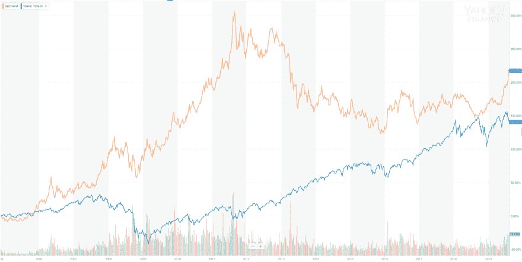
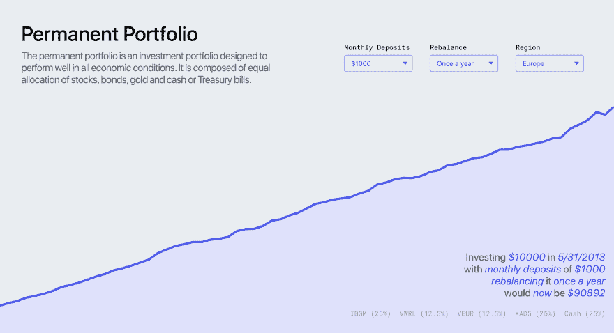

# 用灵丹妙药重新平衡金融投资组合

> 原文:[https://dev . to/El VIO/financial-portfolio-rebalancing-with-elixir-5dl 5](https://dev.to/elvio/financial-portfolio-rebalancing-with-elixir-5dl5)

## [](#whats-a-portfolio)什么是投资组合？

> 投资组合是一组金融资产，如股票、债券、商品、货币和现金等价物，以及它们的对应基金，包括共同基金、交易所交易基金和封闭式基金。投资组合也可以由非公开交易的证券组成，如房地产、艺术品和私人投资。

来源: [investopedia](https://www.investopedia.com/terms/p/portfolio.asp)

## [](#the-permanent-portfolio)“永久投资组合”

“永久投资组合”是由哈里·布朗在上世纪 80 年代创立的。它假设经济有四种可能的状态:

*   繁荣:经济增长、商业繁荣、低失业率和低利率的时期。
*   通货膨胀:消费者价格普遍上涨的时期。
*   **通货紧缩**:通货膨胀的反义词。
*   衰退:经济活动的显著下降蔓延到整个经济体。

## [](#distribution)分布

基于这些经济条件，Browne 确定了最不稳定的资产类别，提出了以下分布:

*   **繁荣** : 25%的股票
*   **通货膨胀** : 25%黄金
*   **通货紧缩** : 25%的长期国债
*   **衰退** : 25%现金

“永久投资组合”的自我调节因素是布朗思想的基本概念之一。它涵盖了最不同的经济场景，寻找补偿损失和增加回报的方法。这个概念使得“永久投资组合”对那些不想每天(甚至每月)主动管理投资组合的人很有吸引力。

让我们来看看黄金和 S&P500(衡量在美国证券交易所上市的 500 家大公司股票表现的指数)的历史价格。

 [](https://res.cloudinary.com/practicaldev/image/fetch/s--Q-lbJ61Y--/c_limit%2Cf_auto%2Cfl_progressive%2Cq_auto%2Cw_880/https://thepracticaldev.s3.amazonaws.com/i/6thlksaoal9v8b548cb1.png)
T6】

来源:[雅虎财经](https://finance.yahoo.com/quote/%5EGSPC/chart?p=%5EGSPC#eyJpbnRlcnZhbCI6Im1vbnRoIiwicGVyaW9kaWNpdHkiOjEsImNhbmRsZVdpZHRoIjo1LjcwNTg4MjM1Mjk0MTE3Nywidm9sdW1lVW5kZXJsYXkiOnRydWUsImFkaiI6dHJ1ZSwiY3Jvc3NoYWlyIjp0cnVlLCJjaGFydFR5cGUiOiJsaW5lIiwiZXh0ZW5kZWQiOmZhbHNlLCJtYXJrZXRTZXNzaW9ucyI6e30sImFnZ3JlZ2F0aW9uVHlwZSI6Im9obGMiLCJjaGFydFNjYWxlIjoibGluZWFyIiwicGFuZWxzIjp7ImNoYXJ0Ijp7InBlcmNlbnQiOjEsImRpc3BsYXkiOiJeR1NQQyIsImNoYXJ0TmFtZSI6ImNoYXJ0IiwidG9wIjowfX0sImxpbmVXaWR0aCI6Miwic3RyaXBlZEJhY2tncm91ZCI6dHJ1ZSwiZXZlbnRzIjp0cnVlLCJjb2xvciI6IiM3MmQzZmYiLCJldmVudE1hcCI6eyJjb3Jwb3JhdGUiOnsiZGl2cyI6dHJ1ZSwic3BsaXRzIjp0cnVlfSwic2lnRGV2Ijp7fX0sInN5bWJvbHMiOlt7InN5bWJvbCI6Il5HU1BDIiwic3ltYm9sT2JqZWN0Ijp7InN5bWJvbCI6Il5HU1BDIn0sInBlcmlvZGljaXR5IjoxLCJpbnRlcnZhbCI6Im1vbnRoIn0seyJzeW1ib2wiOiJHTEQiLCJzeW1ib2xPYmplY3QiOnsic3ltYm9sIjoiR0xEIn0sInBlcmlvZGljaXR5IjoxLCJpbnRlcnZhbCI6Im1vbnRoIiwiaWQiOiJHTEQiLCJwYXJhbWV0ZXJzIjp7ImNvbG9yIjoiI2UwOWMwMCIsIndpZHRoIjoyLCJpc0NvbXBhcmlzb24iOnRydWUsImNoYXJ0TmFtZSI6ImNoYXJ0Iiwic3ltYm9sT2JqZWN0Ijp7InN5bWJvbCI6IkdMRCJ9LCJwYW5lbCI6ImNoYXJ0IiwiYWN0aW9uIjoiYWRkLXNlcmllcyIsInNoYXJlWUF4aXMiOnRydWUsInN5bWJvbCI6IkdMRCIsImdhcERpc3BsYXlTdHlsZSI6InRyYW5zcGFyZW50IiwibmFtZSI6IkpaTU4yUEVFSkMiLCJvdmVyQ2hhcnQiOnRydWUsInVzZUNoYXJ0TGVnZW5kIjp0cnVlLCJoZWlnaHRQZXJjZW50YWdlIjowLjcsIm9wYWNpdHkiOjEsImhpZ2hsaWdodGFibGUiOnRydWUsInR5cGUiOiJsaW5lIiwic3R5bGUiOiJzdHhfbGluZV9jaGFydCJ9fV0sImN1c3RvbVJhbmdlIjp7InN0YXJ0IjoxMTIwMTY4ODAwMDAwLCJlbmQiOjE1NjE5MzIwMDAwMDB9LCJ3aWR0aCI6Miwic3R1ZGllcyI6eyJ2b2wgdW5kciI6eyJ0eXBlIjoidm9sIHVuZHIiLCJpbnB1dHMiOnsiaWQiOiJ2b2wgdW5kciIsImRpc3BsYXkiOiJ2b2wgdW5kciJ9LCJvdXRwdXRzIjp7IlVwIFZvbHVtZSI6IiMwMGIwNjEiLCJEb3duIFZvbHVtZSI6IiNGRjMzM0EifSwicGFuZWwiOiJjaGFydCIsInBhcmFtZXRlcnMiOnsid2lkdGhGYWN0b3IiOjAuNDUsImNoYXJ0TmFtZSI6ImNoYXJ0In19fSwicmFuZ2UiOnsiZHRMZWZ0IjoiMjAwNS0wNi0yMVQyMjowMDowMC4wMDBaIiwiZHRSaWdodCI6IjIwMTktMDgtMjJUMTI6MDM6MTcuNjgyWiIsInBlcmlvZGljaXR5Ijp7ImludGVydmFsIjoibW9udGgiLCJwZXJpb2QiOjF9LCJwYWRkaW5nIjowfX0%3D)

2008 年，全球金融危机爆发的一年，股票投资者确实对市场感到担忧，结果，S&P 指数大幅下跌。4 年来，S&P 值一直保持在低位，直到 2013 年后才回到危机前的水平。如果你的投资纯粹是股票，这将不是一次有趣的经历。

与此同时，在 2008 年前后，黄金价格开始上涨。当同时将它与 S&P 值相比较时，它的行为几乎呈现出相反的形状。黄金的价值不仅弥补了股票的损失，也为今年的盈利做出了贡献。

尽管许多投资者受到了 2008 年危机的严重影响，但“永久投资组合”的持有者却获得了以下回报:

*   2008: +1.97%
*   2009: +7.8%
*   2010: +14.5%
*   2011: +11.36%
*   2012: +6.8%
*   2013: -2.4%
*   2014: +9.1%

尽管 2013 年出现了一点小故障，但“永久投资组合”的回报一直是正的。考虑到 2008 年至 2014 年期间，该投资组合的平均年回报率为 7%。

这是“永久投资组合”的属性之一，这使得它的使用对像我这样更厌恶风险的人如此有吸引力。

快进到 2019 年，许多人都在担心新的金融危机。德国(我居住的地方)即将宣布“技术性衰退”(经济连续两个季度收缩)。如果你看图表，你可以再次看到 S&P 和黄金之间的不平衡状态。

当然，通过看这张图表，我(一个业余投资者)不能得出任何关于下一次衰退是否会到来的结论。需要强调的是，“永久投资组合”的行为再次支持了潜在的危机情景。

## [](#rebalancing-a-portfolio)重新平衡投资组合

投资组合分布(股票:25%，黄金:25%，长期政府债券:25%，现金:25%)将随着时间的推移而变化。有些个别班级会增加，有些会减少。这种变化改变了资产类别的预期配置。

“永久投资组合”包含了市场是周期性的这一事实。会有股票价值上涨、黄金价格下跌的繁荣时期，但也会有股票市场不是最佳选择的时候。

重新平衡投资组合意味着通过卖出增持的资产类别，买入减持的资产类别，让资产类别回到理想的配置(各占 25%)。

2008 年的金融危机造成了投资组合失衡的局面。它“迫使”投资组合持有人出售部分黄金，并用利润购买股票(以极低的价格)，以平衡黄金回到理想的权重。

从长期来看(记住市场是周期性的)，通过不断地重新平衡投资组合，你正在利用投资组合的内在波动性“低买高卖”。

## [](#using-elixir-to-rebalance-a-permanent-portfolio)用灵丹妙药重新平衡一个“永久投资组合”

让我们用灵丹妙药来重新平衡一个永久的投资组合。出于本教程的目的，我们将使用来自免费的 [Alpha Vantage 股票 API](https://www.alphavantage.co/)的市场数据。还有其他[金融 API](https://medium.com/@patrick.collins_58673/stock-api-landscape-5c6e054ee631)你可能想考虑作为你的股票市场数据源:

*   销售超重商品(例如，当前分配高于 25%)
*   利用增持卖出的利润，买入减持的项目(如当前配置低于 25%)。
*   减少操作的次数(如买和卖)，因为每笔交易也是有成本的。
*   根据实时信息做出决策。

我们来想象一下下面的界面:

```
allocations = %{"IAU" => 10, "TLT" => 10, "VGSH" => 10, "VTI" => 10}
orders = Rebalancex.rebalance_portfolio(allocations) 
```

<svg width="20px" height="20px" viewBox="0 0 24 24" class="highlight-action crayons-icon highlight-action--fullscreen-on"><title>Enter fullscreen mode</title></svg> <svg width="20px" height="20px" viewBox="0 0 24 24" class="highlight-action crayons-icon highlight-action--fullscreen-off"><title>Exit fullscreen mode</title></svg>

基于`allocations`的数量(一个特定项目拥有的单位数量)，您可以调用`Rebalancex.rebalance_portfolio`、
，它将返回一些要执行的订单。

这些订单包含给定符号是否必须购买、出售或保持原样的信息:

```
[
  [:sell, "IAU", 4],
  [:sell, "TLT", 1],
  [:sell, "VGSH", 1],
  [:buy, "VTI", 8]
] 
```

<svg width="20px" height="20px" viewBox="0 0 24 24" class="highlight-action crayons-icon highlight-action--fullscreen-on"><title>Enter fullscreen mode</title></svg> <svg width="20px" height="20px" viewBox="0 0 24 24" class="highlight-action crayons-icon highlight-action--fullscreen-off"><title>Exit fullscreen mode</title></svg>

考虑到以上几点，这就是负责重新平衡投资组合的代码:

```
defmodule Rebalancex do
  alias Rebalancex.Quote

  @underweight 0.25
  @overweight 0.27

  def rebalance_portfolio(allocations, quote_service \\ Quote) do
    portfolio = %{cash: 0, allocations: allocations}
    prices = get_prices(allocations, quote_service)

    new_portfolio = do_rebalance_portfolio(portfolio, prices)
    create_order(portfolio, new_portfolio)
  end

  defp do_rebalance_portfolio(portfolio, prices) do
    positions = get_positions(portfolio.allocations, prices)
    weights = get_weights(positions)

    underweight_symbol = get_underweight(weights)
    overweight_symbol = get_overweight(weights)

    portfolio
    |> maybe_buy_underweight(underweight_symbol, prices)
    |> maybe_sell_overweight(overweight_symbol, prices)
    |> maybe_rebalance_again(underweight_symbol, overweight_symbol, prices)
  end

  defp get_prices(allocations, quote_service) do
    allocations
    |> Enum.reduce(%{}, fn {symbol, _}, acc ->
      Map.put(acc, symbol, quote_service.price_for(symbol))
    end)
  end

  defp get_price(prices, symbol) do
    Map.fetch!(prices, symbol)
  end

  defp get_positions(portfolio, prices) do
    portfolio
    |> Enum.reduce(%{}, fn {symbol_name, units}, acc ->
      Map.put(acc, symbol_name, get_price(prices, symbol_name) * units)
    end)
  end

  defp get_weights(positions) do
    total_value = Enum.reduce(positions, 0, fn {_, position}, acc -> position + acc end)

    positions
    |> Enum.reduce(%{}, fn {symbol_name, position}, acc ->
      Map.put(acc, symbol_name, position / total_value)
    end)
  end

  defp get_underweight(weights) do
    {symbol, _weight} =
      weights
      |> Enum.filter(fn {_, value} -> value < @underweight end)
      |> Enum.min_by(fn {_, value} -> value end, fn -> {nil, nil} end)

    symbol
  end

  defp get_overweight(weights) do
    {symbol, _weight} =
      weights
      |> Enum.filter(fn {_, value} -> value > @overweight end)
      |> Enum.max_by(fn {_, value} -> value end, fn -> {nil, nil} end)

    symbol
  end

  defp maybe_buy_underweight(portfolio, nil, _) do
    portfolio
  end

  defp maybe_buy_underweight(portfolio, symbol, prices) do
    price = get_price(prices, symbol)
    maybe_buy_underweight(portfolio, symbol, price, portfolio.cash)
  end

  defp maybe_buy_underweight(portfolio, symbol, price, cash) when cash > price do
    portfolio
    |> incr(symbol)
    |> withdraw(price)
  end

  defp maybe_buy_underweight(portfolio, _symbol, _price, _cash) do
    portfolio
  end

  defp maybe_sell_overweight(portfolio, nil, _prices) do
    portfolio
  end

  defp maybe_sell_overweight(portfolio, symbol, prices) do
    price = get_price(prices, symbol)

    portfolio
    |> decr(symbol)
    |> deposit(price)
  end

  defp maybe_rebalance_again(portfolio, nil, nil, _prices) do
    portfolio
  end

  defp maybe_rebalance_again(portfolio, _, _, prices) do
    do_rebalance_portfolio(portfolio, prices)
  end

  defp incr(%{allocations: allocations} = portfolio, symbol) do
    new_allocations = Map.put(allocations, symbol, allocations[symbol] + 1)
    %{portfolio | allocations: new_allocations}
  end

  defp decr(%{allocations: allocations} = portfolio, symbol) do
    new_allocations = Map.put(allocations, symbol, allocations[symbol] - 1)
    %{portfolio | allocations: new_allocations}
  end

  defp deposit(%{cash: cash} = portfolio, amount), do: %{portfolio | cash: cash + amount}

  defp withdraw(%{cash: cash} = portfolio, amount), do: %{portfolio | cash: cash - amount}

  defp create_order(%{allocations: old_allocations}, %{allocations: new_allocations}) do
    Enum.map(old_allocations, fn {symbol, old_units} ->
      cond do
        new_allocations[symbol] > old_units ->
          [:buy, symbol, new_allocations[symbol] - old_units]

        new_allocations[symbol] < old_units ->
          [:sell, symbol, old_units - new_allocations[symbol]]

        true ->
          [:keep, symbol]
      end
    end)
  end
end 
```

<svg width="20px" height="20px" viewBox="0 0 24 24" class="highlight-action crayons-icon highlight-action--fullscreen-on"><title>Enter fullscreen mode</title></svg> <svg width="20px" height="20px" viewBox="0 0 24 24" class="highlight-action crayons-icon highlight-action--fullscreen-off"><title>Exit fullscreen mode</title></svg>

需要指出一些事情:

*   [`Rebalancex.Quote`](https://github.com/elvio/rebalancex/blob/master/lib/quote.ex) 模块使用 [AlphaVantage](http://alphavantage.co) API 获取实时价格。
*   它一次买入或卖出一个单位，并重新评估权重是如何受到影响的。
*   它不断重新平衡投资组合，直到其中不再有减持或增持的项目。
*   订单是通过比较原始投资组合和重新平衡的投资组合创建的。

## [](#demo)演示

我创建了一个项目来可视化“永久投资组合”的价值随时间的演变。
从$10k 的金额开始，您可以更改不同的变量，如每月存款、
再平衡策略、区域，并查看对最终值的影响。

 [
T4】](https://elviovicosa.com/permanent-portfolio)

演示项目是:

*   使用 Elixir 和 Plug 构建的 API。
*   使用 React 和 Redux 构建的前端应用程序。
*   用 D3 实现数据可视化。

参观[https://elviovicosa.com/permanent-portfolio](https://elviovicosa.com/permanent-portfolio)
现场测试。