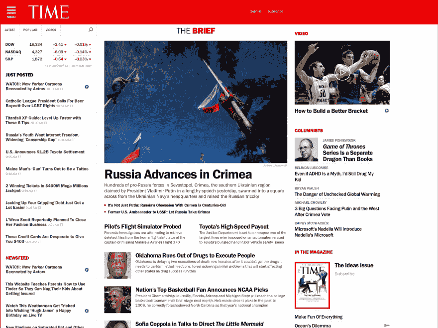
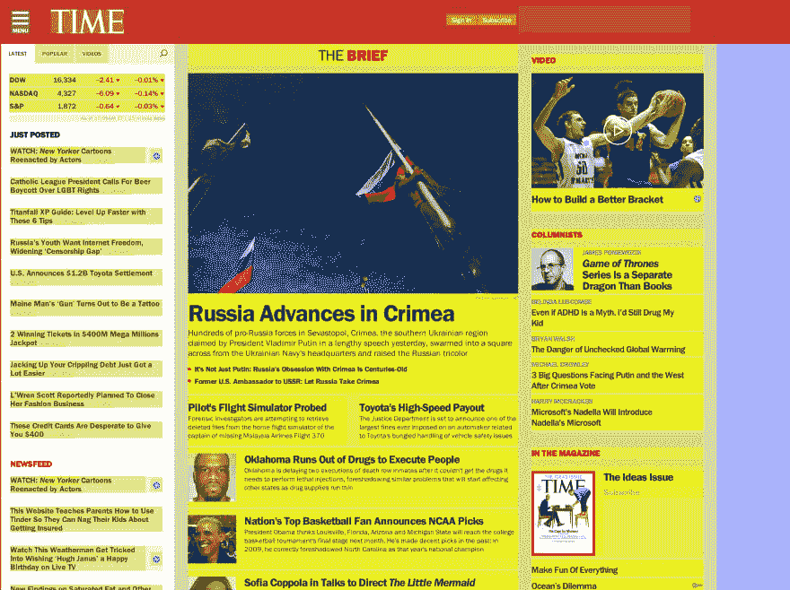

# 我最喜欢的 CSS 黑客

> 原文:[https://dev.to/gajus/my-favorite-css-hack-32g3](https://dev.to/gajus/my-favorite-css-hack-32g3)

有一个我已经复制粘贴了 5 年的 CSS 片段:

```
* { background-color: rgba(255,0,0,.2); }
* * { background-color: rgba(0,255,0,.2); }
* * * { background-color: rgba(0,0,255,.2); }
* * * * { background-color: rgba(255,0,255,.2); }
* * * * * { background-color: rgba(0,255,255,.2); }
* * * * * * { background-color: rgba(255,255,0,.2); }
* * * * * * * { background-color: rgba(255,0,0,.2); }
* * * * * * * * { background-color: rgba(0,255,0,.2); }
* * * * * * * * * { background-color: rgba(0,0,255,.2); } 
```

<svg width="20px" height="20px" viewBox="0 0 24 24" class="highlight-action crayons-icon highlight-action--fullscreen-on"><title>Enter fullscreen mode</title></svg> <svg width="20px" height="20px" viewBox="0 0 24 24" class="highlight-action crayons-icon highlight-action--fullscreen-off"><title>Exit fullscreen mode</title></svg>

^这是我最喜欢的发明之一。

更新 2020 年 10 月。此后，我采用了一个更加精细的片段:

```
* { outline: 1px solid rgba(255,0,0,.2); :hover { outline: 1px solid rgba(255,0,0,0.6); } }
* * { outline: 1px solid rgba(0,255,0,.2); :hover { outline: 1px solid rgba(0,255,0,0.6); } }
* * * { outline: 1px solid rgba(0,0,255,.2); :hover { outline: 1px solid rgba(0,0,255,0.6); } }
* * * * { outline: 1px solid rgba(255,0,255,.2); :hover { outline: 1px solid rgba(255,0,0,0.6); } }
* * * * * { outline: 1px solid rgba(0,255,255,.2); :hover { outline: 1px solid rgba(0,255,0,0.6); } }
* * * * * * { outline: 1px solid rgba(255,255,0,.2); :hover { outline: 1px solid rgba(0,0,255,0.6); } }
* * * * * * * { outline: 1px solid rgba(255,0,0,.2); :hover { outline: 1px solid rgba(255,0,0,0.6); } }
* * * * * * * * { outline: 1px solid rgba(0,255,0,.2); :hover { outline: 1px solid rgba(0,255,0,0.6); } }
* * * * * * * * * { outline: 1px solid rgba(0,0,255,.2); :hover { outline: 1px solid rgba(0,0,255,0.6); } } 
```

<svg width="20px" height="20px" viewBox="0 0 24 24" class="highlight-action crayons-icon highlight-action--fullscreen-on"><title>Enter fullscreen mode</title></svg> <svg width="20px" height="20px" viewBox="0 0 24 24" class="highlight-action crayons-icon highlight-action--fullscreen-off"><title>Exit fullscreen mode</title></svg>

2014 年我第一次在 Quora 上分享([有哪些最有趣的 HTML/JS/DOM/CSS hacks 是大多数 web 开发者不知道的？我仍然每天收到有人投票支持这个答案的通知。](https://www.quora.com/What-are-the-most-interesting-HTML-JS-DOM-CSS-hacks-that-most-web-developers-dont-know-about/answer/Gajus-Kuizinas)

但是这个可怕的东西是做什么的？

这意味着当你使用布局，例如

[T2】](https://res.cloudinary.com/practicaldev/image/fetch/s--tCJoQ55a--/c_limit%2Cf_auto%2Cfl_progressive%2Cq_auto%2Cw_880/https://thepracticaldev.s3.amazonaws.com/i/ls79zc4kh298f4mwex2i.jpg)

问题是，除非页面上的元素有一个坚实的背景或者它是一张图片，否则你看不出它如何适合布局，例如，大部分的文本节点、透明的图片等等。

应用上述 CSS 后，您将看到如下内容:

[T2】](https://res.cloudinary.com/practicaldev/image/fetch/s--j64wv6UY--/c_limit%2Cf_auto%2Cfl_progressive%2Cq_auto%2Cw_880/https://thepracticaldev.s3.amazonaws.com/i/1tmes0fhm81ddzoqnxmd.jpg)

不同深度的节点会使用不同的颜色，让你看到页面上每个元素的大小，它们的边距和填充。现在，您可以轻松识别不一致的地方。