# 我在 Android 上运行 PowerShell，你也可以！！

> 原文：<https://dev.to/thementor/i-run-powershell-on-android-and-so-can-you-458k>

#### 欢迎 PowerShell 爱好者、Android 补锅匠和各位极客！

这是关于我如何在我的 Android 设备上运行 PowerShell 的一步一步的指南。

快速免责声明:

> 所有信息和文件——包括源文件和编译文件——均按原样提供。不给予或暗示任何保证或担保。用户承担可能发生的任何损坏的所有风险，包括但不限于数据丢失、硬件损坏或商业利润损失。请自担风险使用。请注意，除非您的设备保修明确允许，否则如果您篡改系统软件或硬件，设备附带的任何保修都将失效。

在本指南中，我使用了以下设备和 Android 版本:

> 一加 5 -安卓派 9.0

好了，让我们开始吧！

1.  从 play store 下载 UserLAnd】链接
2.  第一次打开应用程序时，你需要选择一个发行版的 arch(我选择 Arch 而不是 Ubuntu，因为我在 Ubuntu 上有很多稳定性问题，它导致我的手机延迟和冻结)。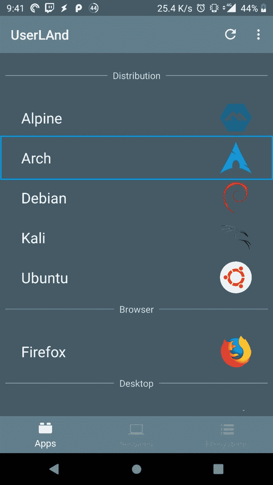
3.  选择发行版后，您需要输入用户名、密码和 VNC 密码，然后按继续。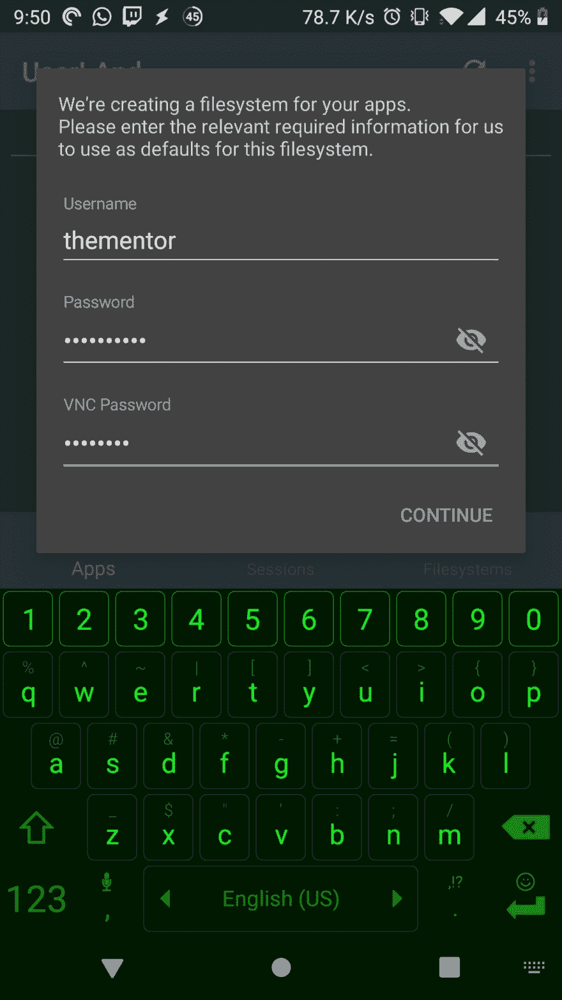
4.  在连接类型屏幕上选择 SSH，然后按继续。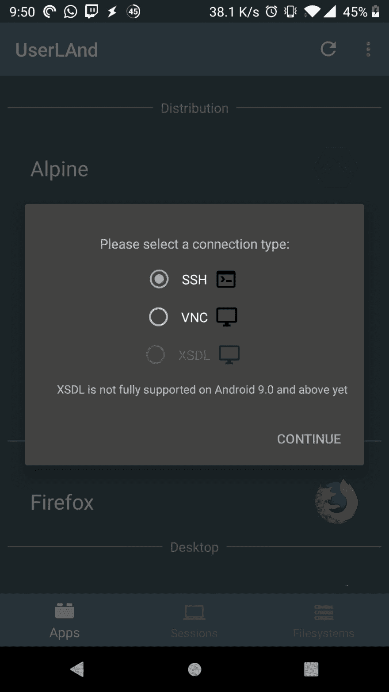
5.  一旦设置完成，UserLAnd 将获取 arch 发行版并为您进行设置。进入会话并从列表中选择 arch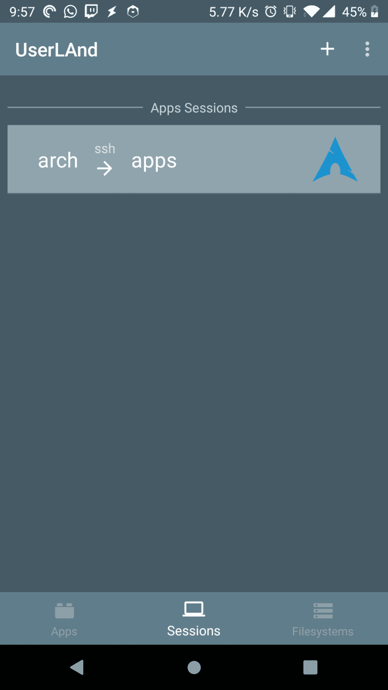
6.  输入您在步骤 3 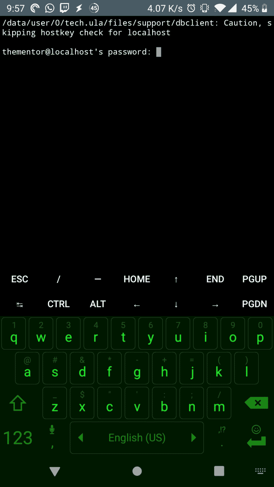中选择的密码
7.  一旦我们登录到 arch，我们将需要执行一些步骤，首先通过运行下面的代码
    更新所有的包

    ```
    sudo pacman -Syu 
    ```

    当您看到软件包列表并被提示继续安装时，请按 y
    此过程将花费一些时间，具体取决于您的互联网连接速度和设备的处理器，您可能会在更新过程中看到一些错误，这些错误是正常的，可以忽略
    [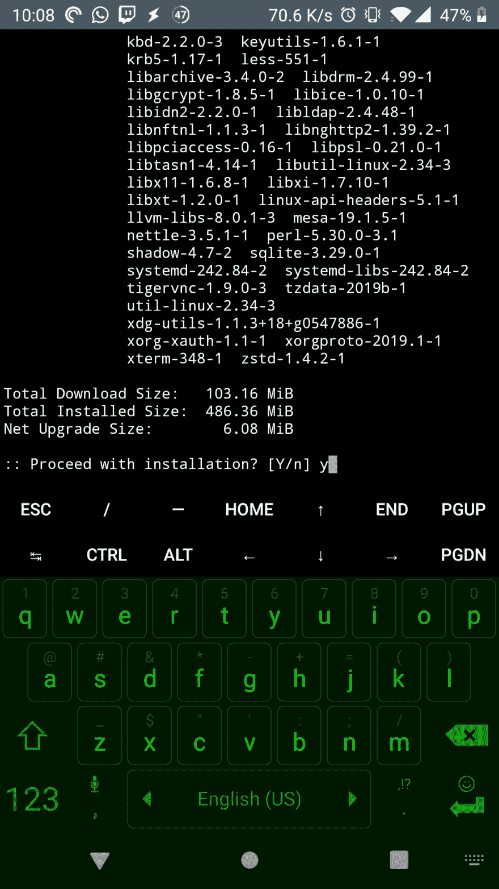](https://res.cloudinary.com/practicaldev/image/fetch/s--AqL3-WSw--/c_limit%2Cf_auto%2Cfl_progressive%2Cq_auto%2Cw_880/https://thepracticaldev.s3.amazonaws.com/i/6zp9q0r6xdt9mt8h6q3z.jpg)

8.  一旦升级完成，我们需要安装 wget 和 libuv

    ```
    sudo pacman -S wget libuv 
    ```

9.  让我们为 PowerShell 创建一个文件夹，并将 PowerShell 7 预览版 3 下载到其中

    ```
    mkdir powershell
    cd powershell

    #If your android device has an arm64 CPU download the arm64 package by running the below line
    wget https://github.com/PowerShell/PowerShell/releases/download/v7.0.0-preview.3/powershell-7.0.0-preview.3-linux-arm64.tar.gz

    #If your android device has an arm32 CPU download the arm32 package by running the below line
    https://github.com/PowerShell/PowerShell/releases/download/v7.0.0-preview.3/powershell-7.0.0-preview.3-linux-arm32.tar.gz 
    ```

    [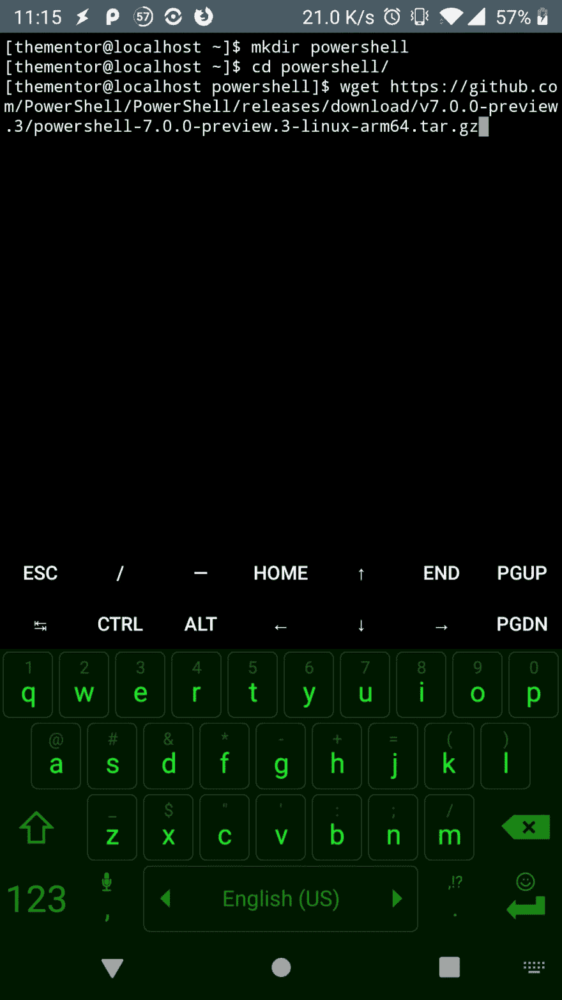](https://res.cloudinary.com/practicaldev/image/fetch/s--08vpNE_3--/c_limit%2Cf_auto%2Cfl_progressive%2Cq_auto%2Cw_880/https://thepracticaldev.s3.amazonaws.com/i/2h5d07yvbt1mqkh7cdw8.jpg)

10.  一旦下载了 powershell tar.gz 文件，我们需要解压它

    ```
    tar xzvf powershell*.tar.gz 
    ```

    [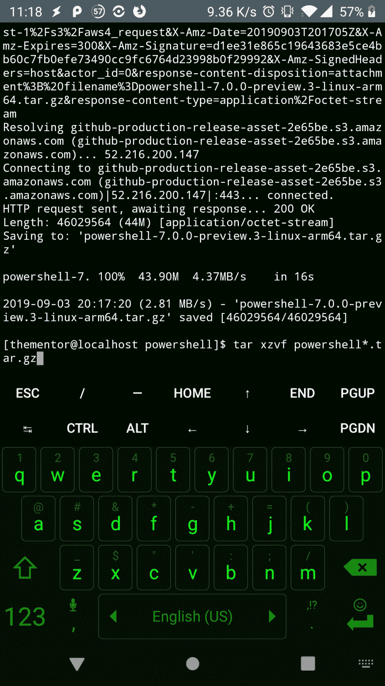](https://res.cloudinary.com/practicaldev/image/fetch/s--_PIFT_0M--/c_limit%2Cf_auto%2Cfl_progressive%2Cq_auto%2Cw_880/https://thepracticaldev.s3.amazonaws.com/i/86ms6mvewhbed0y2qkzs.jpg)

11.  让我们运行 PowerShell！！！

    ```
     ./pwsh 
    ```

    [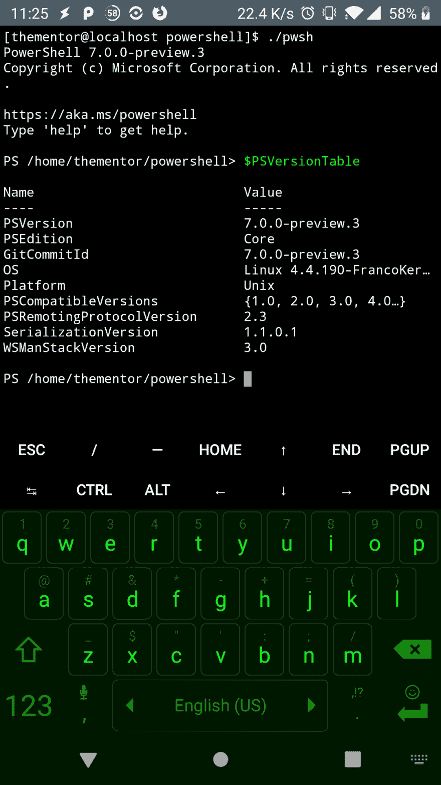](https://res.cloudinary.com/practicaldev/image/fetch/s--LoBfr0zM--/c_limit%2Cf_auto%2Cfl_progressive%2Cq_auto%2Cw_880/https://thepracticaldev.s3.amazonaws.com/i/xhuiga6p6c7yp3vvuem4.jpg)

我们有 it 人员，我们有运行在 Android 上的 PowerShell。

现在为了好玩，让我们安装通用仪表板。社区由 Adam Driscoll 从 [IronmanSoftware](https://ironmansoftware.com/universal-dashboard-2-4-release/) 模块运行。

```
Find-Module UniversalDashboard.Community | Install-Module -AcceptLicence
Import-Module UniversalDashboard.Community
Start-UDDashboard -Port 10001 
```

它在手机上本地运行 UniversalDashboard，在 PowerShell 上呈现页面、图表和你能想到的一切。
[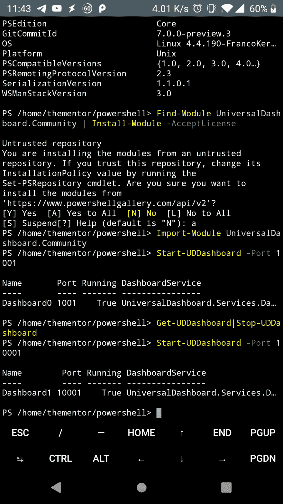T3】](https://res.cloudinary.com/practicaldev/image/fetch/s--kgSpdm28--/c_limit%2Cf_auto%2Cfl_progressive%2Cq_auto%2Cw_880/https://thepracticaldev.s3.amazonaws.com/i/jatd7r2gtq88ht41gsml.jpg)

[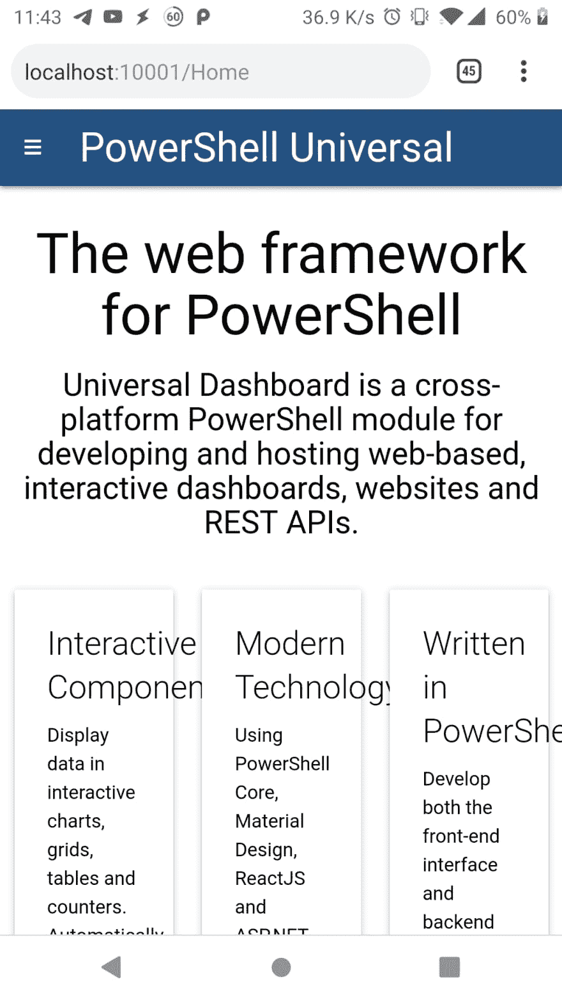](https://res.cloudinary.com/practicaldev/image/fetch/s--5vkHR_gP--/c_limit%2Cf_auto%2Cfl_progressive%2Cq_auto%2Cw_880/https://thepracticaldev.s3.amazonaws.com/i/nm6zobxz0a3n4im4t98c.jpg)

[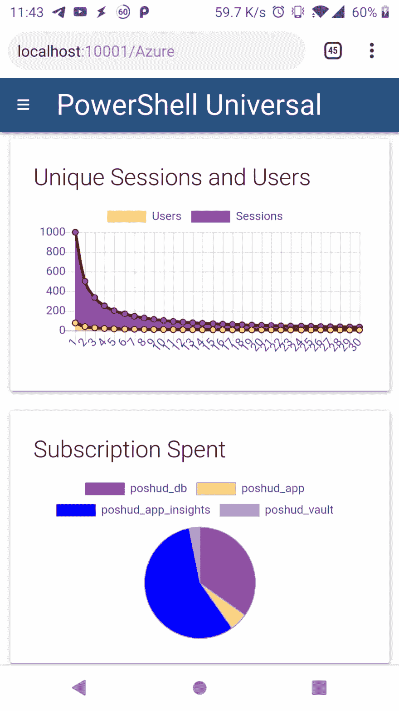](https://res.cloudinary.com/practicaldev/image/fetch/s--hpufMqzx--/c_limit%2Cf_auto%2Cfl_progressive%2Cq_auto%2Cw_880/https://thepracticaldev.s3.amazonaws.com/i/gtkvswqb28qoez5pgrc3.jpg)

感谢您阅读我的指南！请随意评论和提问。
你可以在推特上找到更多的我[PowershellOnLinux](https://www.twitter.com/@Posh4Linux)T4】你也可以加入 [PowerShellOnLinux 电报组](https://t.me/PowershellOnLinux)

-TheMentor