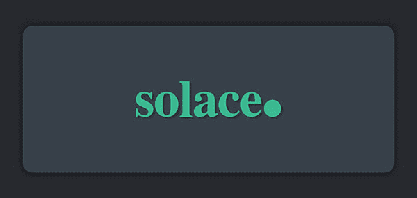
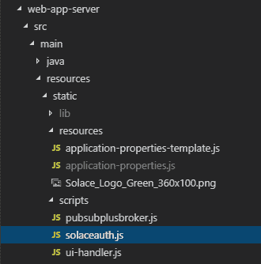
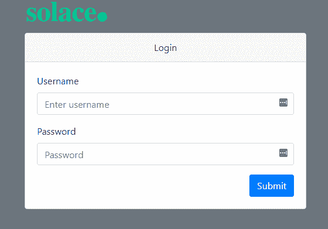

# 如何用 Solace 构建一个简单的聊天应用程序(第 3 部分)

> 原文:[https://dev . to/solace devs/how-to-build-a-simple-chat-app-with solace-part-3-2657](https://dev.to/solacedevs/how-to-build-a-simple-chat-app-with-solace-part-3-2657)

[T2】](https://res.cloudinary.com/practicaldev/image/fetch/s--bMt7Z8K1--/c_limit%2Cf_auto%2Cfl_progressive%2Cq_auto%2Cw_880/https://solace.com/wp-content/uploads/2019/08/solace-default-blog-thumbnail-600x285.jpg)

这是我用 Solace PubSub+创建一个简单聊天应用的系列博文的第 3 部分。在第一部分的[中，我解释了如何创建一个简单的聊天应用程序，它可以通过直接主题订阅发送和接收消息。在第二篇](https://dev.to/hq190204/how-to-build-a-simple-chat-app-with-solace-part-1-4hg1-temp-slug-6948697)的[中，我解释了如何修改示例代码，让应用程序使用队列中的消息。在这一部分中，我将解释如何从登录页面向 Solace PubSub+提供的虚拟认证服务发送 REST POST 请求。](https://dev.to/hq190204/how-to-build-a-simple-chat-app-with-solace-part-2-8k5-temp-slug-9259292)

具体来说，您将:

*   添加服务器 URL
*   完整提取参数

**先决条件**

*   将 Git 下载到您的电脑上
*   [安装 Apache Maven](https://maven.apache.org/install.html)
*   [在 Solace PubSub+ Cloud 上注册](https://console.solace.cloud/login)
*   [将样本库](https://github.com/SolaceTraining/fundamentals-of-solace-dev)克隆到您的计算机上

**级别**

*   新手

## [](#add-a-server-url)**添加服务器 URL**

通过添加一个服务器 URL，您可以定义将 REST POST 请求发送到哪里。要添加服务器 URL，请执行以下操作:

1.  在代码编辑器中，检查 developer-exercise-3 分支，或者在命令行中输入`git checkout remotes/origin/developer-exercise-3 -f`
2.  打开`src > main > resources > static > scripts` 下的 solaceauth.js 文件
3.  输入突出显示的代码来添加服务器 URL(第 15 行)。

```
//Enter serverUrl var serverUrl = ‘http://localhost:8081/solace/cloud/proxy’, 
```

<svg width="20px" height="20px" viewBox="0 0 24 24" class="highlight-action crayons-icon highlight-action--fullscreen-on"><title>Enter fullscreen mode</title></svg> <svg width="20px" height="20px" viewBox="0 0 24 24" class="highlight-action crayons-icon highlight-action--fullscreen-off"><title>Exit fullscreen mode</title></svg>

这个 URL 通过我们的 web 应用服务器发送请求，web 应用服务器将请求发送到我们的 Solace 实例。

## [](#complete-fetch-parameters)完成取参数

fetch 方法定义了如何从服务器获取信息。执行以下操作来添加方法和头参数:

1.  输入突出显示的代码以添加 POST 作为方法(第 22-23 行)。

```
//Complete fetch parameters; method and headers fetch(serverUrl, { method: “POST”, 
```

<svg width="20px" height="20px" viewBox="0 0 24 24" class="highlight-action crayons-icon highlight-action--fullscreen-on"><title>Enter fullscreen mode</title></svg> <svg width="20px" height="20px" viewBox="0 0 24 24" class="highlight-action crayons-icon highlight-action--fullscreen-off"><title>Exit fullscreen mode</title></svg>

1.  在上面的代码下，输入突出显示的代码来设置请求头的内容类型(第 24-25 行)。

```
headers: { “Content-Type”: “application/json; charset=utf-8”, 
```

<svg width="20px" height="20px" viewBox="0 0 24 24" class="highlight-action crayons-icon highlight-action--fullscreen-on"><title>Enter fullscreen mode</title></svg> <svg width="20px" height="20px" viewBox="0 0 24 24" class="highlight-action crayons-icon highlight-action--fullscreen-off"><title>Exit fullscreen mode</title></svg>

这告诉接收服务器使用 UTF-8 字符编码处理 JSON 格式的 REST 消息内容。

1.  在代码编辑器中，键入`mvn spring-boot:run`来运行应用程序。
2.  在 Web 浏览器中，输入 localhost:8081 以查看登录页面。
3.  键入任意用户名和密码。您应该会得到一条“登录失败”的消息。这是因为我们刚刚向 Solace 实例发送了 REST POST 请求，还没有设置登录服务器。我们将在下一个教程中这样做。

# [](#congratulations)恭喜恭喜！

您已经向 Web 应用程序添加了登录功能，以便向 Solace PubSub+发送 REST POST 请求。

在本系列的第 4 部分(即将推出)，您将学习如何添加一个简单的认证服务器。

### [](#related-resources)**相关资源**

*   [**如何用 Solace 构建一个简单的聊天应用(第一部分)**](https://dev.to/hq190204/how-to-build-a-simple-chat-app-with-solace-part-1-4hg1-temp-slug-6948697)
*   [**如何用 Solace 构建一个简单的聊天应用(第二部分)**](https://dev.to/hq190204/how-to-build-a-simple-chat-app-with-solace-part-2-8k5-temp-slug-9259292)
*   Udemy 课程:[Solace 开发基础](https://www.udemy.com/fundamentals-of-solace-development/)

帖子[如何用 Solace(第三部分)](https://solace.com/blog/build-chat-app-solace-3/)最早出现在 [Solace](https://solace.com) 上。