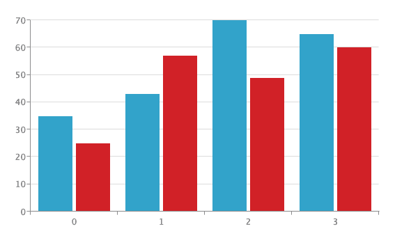
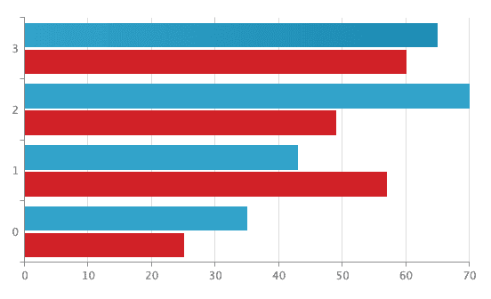
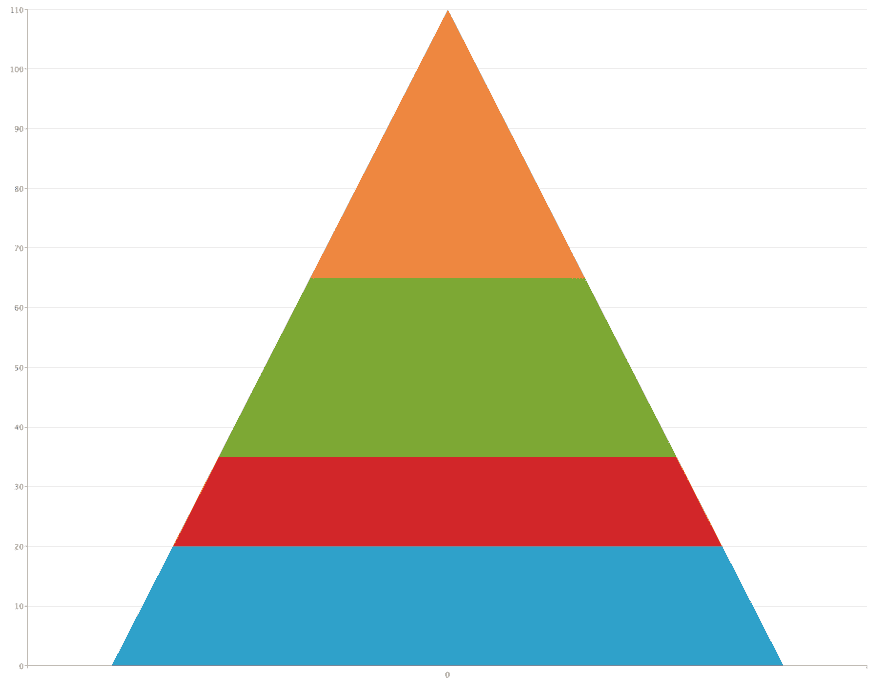
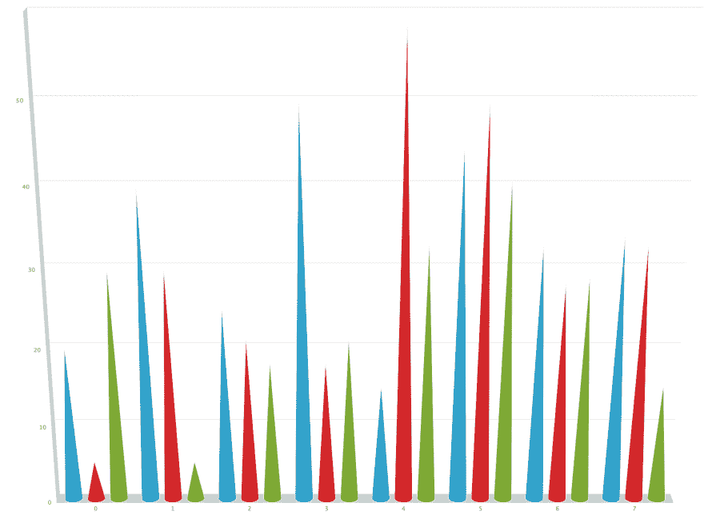
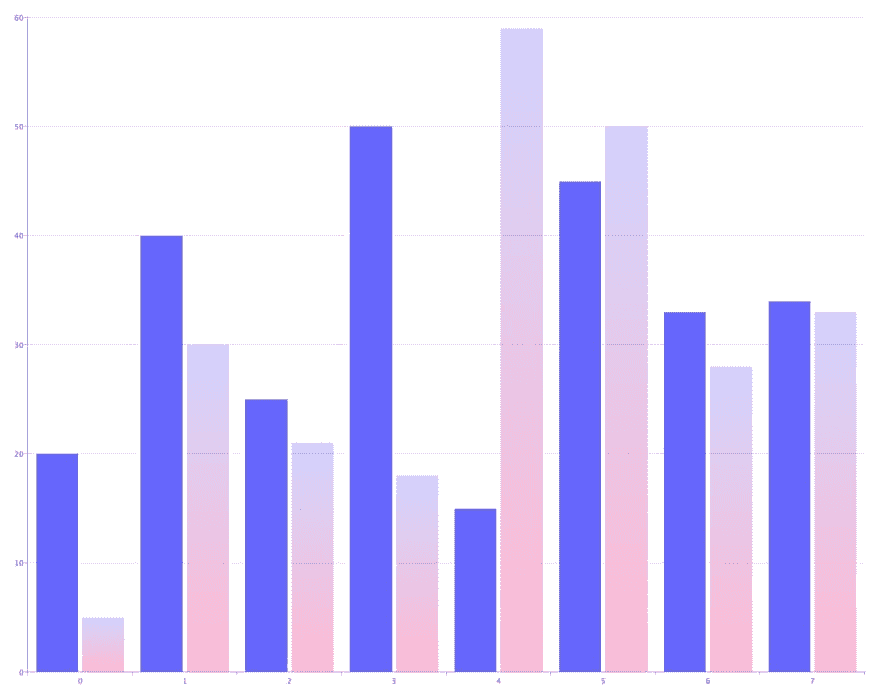
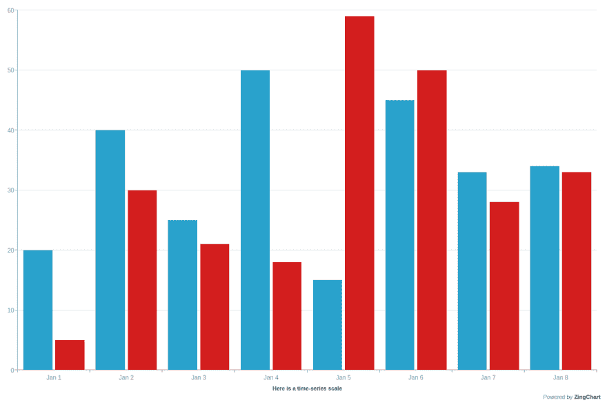

# 如何使用 JavaScript 制作条形图

> 原文：<https://dev.to/zingchartinc/how-to-make-a-bar-chart-using-javascript-2p0c>

也称为柱形图，条形图有各种形状和大小。在这篇文章中，我们将讨论如何使用免费的 JavaScript 库创建一个简单的垂直条形图， [ZingChart](https://www.zingchart.com) 。

即使对 HTML、CSS 和 JavaScript 知之甚少，您也可以轻松地通过几个简单的步骤让您的数据栩栩如生。

我们将涉及的步骤如下:

1.  引用 ZingChart 库
2.  将图表放在您的 HTML 页面上
3.  添加数据和呈现图表
4.  图表的基本定制

[](https://res.cloudinary.com/practicaldev/image/fetch/s--04Uz3pU---/c_limit%2Cf_auto%2Cfl_progressive%2Cq_auto%2Cw_880/https://thepracticaldev.s3.amazonaws.com/i/pdg4eqlpz1hjjfwcdsxj.png)

## 1。引用 ZingChart 库

如果你对 HTML 布局知之甚少，我在下面提供了一个已经引用的 ZingChart 库。

```
<!DOCTYPE html>
<html>
  <head>
    <meta charset=”utf-8">
    <title>ZingChart: My Bar Chart</title>
    <script src=”https://cdn.zingchart.com/zingchart.min.js"></script>
  </head>
  <body>

  </body>
</html> 
```

当引用 ZingChart 库时，请确保包含上面显示的 HTML 布局中包含的代码片段。

你也可以[下载](https://www.zingchart.com/download)zing chart 库或者使用包管理器，比如 [NPM](https://www.npmjs.com/package/zingchart) 。

## 2。将图表放在 HTML 页面上

在开始输入任何类型的数据之前，您会希望在代码的`<body>`中引用您的图表，以便图表可以实际呈现在页面上。

```
<!DOCTYPE html>
<html>
  <head>
    <meta charset=”utf-8">
    <title>ZingChart: My Bar Chart</title>
    <script src=”https://cdn.zingchart.com/zingchart.min.js"></script>
  </head>
  <body>
    <div id=”myChart”></div>
  </body>
</html> 
```

为此，您需要创建一个开始和结束的`<div>`。在这个`<div>`标签中，您还需要将您的图表名称作为一个 id。就 HTML 而言，您已经完成了！参考上面的例子。

## 3。添加数据和呈现图表

这就是 JavaScript 的一些知识发挥作用的地方，但是它仍然很容易实现。

您的下一步将是添加`<script>`标签。这是您将要放置 JavaScript 的地方。添加`<script>`标签时，确保将其包含在`<div>`之后，以呈现图表。

```
<script>
  var chartData = {
    type: 'bar',
    series: [
      { values: [35, 43, 70, 65] },
      { values: [25, 57, 49, 60] }
    ]
  };
  zingchart.render({
    id: 'myChart',
    data: chartData,
    height: 400,
    width: 600
  });
</script> 
```

如果您将代码包含在上面的`<script>`标签中，并在浏览器中运行该文件，您将创建一个功能齐全的条形图！

[](https://res.cloudinary.com/practicaldev/image/fetch/s--04Uz3pU---/c_limit%2Cf_auto%2Cfl_progressive%2Cq_auto%2Cw_880/https://thepracticaldev.s3.amazonaws.com/i/pdg4eqlpz1hjjfwcdsxj.png)

现在让我们来分析一下上面到底发生了什么。

```
var chartData = {    //Sets a variable with all of the chart data
  type: 'bar',       //Tells ZingChart the type of chart
  series: [          //Creates different series of data
    { values: [35, 43, 70, 65] },    //Values for the first bar
    { values: [25, 57, 49, 60] }     //Values for the second bar
  ]
}; 
```

我已经设置了一个名为`chartData`的变量或`var`。这是您的所有数据、属性和对象将被引用的地方(不要担心，我稍后将介绍更多的属性)。

在创建了`chartData`变量之后，您将希望建立您将使用的图表类型。

这个变量将被创建为一个 JavaScript 对象，所有的属性和数据将作为值在对象中列出。有关 JavaScript 对象的更多信息，请查看本文。

```
var chartData = {
  type: 'bar',       //Tells ZingChart the type of chart
  series: [
    { values: [35, 43, 70, 65] },
    { values: [25, 57, 49, 60] }
  ]
}; 
```

在这种情况下，您需要创建一个条形图。这可以通过将`type: ‘bar’`作为属性包含在对象中来实现。我将在这篇文章的后面列出 ZingChart 的许多其他选项。

```
var chartData = {
  type: 'bar',
  series: [          //Creates different series of data
    { values: [35, 43, 70, 65] },    //Values for the first bar
    { values: [25, 57, 49, 60] }     //Values for the second bar
  ]
}; 
```

接下来，您还会希望在对象中包含数据。这可以使用`series`属性来完成。您会注意到，这个属性被列为一个数组，其中列出了更多的对象。在一个系列中随意使用不同数量的对象，看看它如何影响页面上呈现的内容。

最后，您需要将图表呈现到页面上。

```
zingchart.render({   //Render method used to show chart on page
  id: 'myChart',     //Reference the id used in the <div> tag
  data: chartData,   //Reference the chartData object created above
  height: 400,       //Sets height for chart
  width: 600         //Sets width for chart
}); 
```

这可以通过调用上面显示的`zingchart.render`方法来完成。这个方法接受某些属性作为 render 函数的参数。

`id: “myChart”`用于引用 HTML 中的 div。

`data: chartData`用于引用您在呈现图表时想要提取的数据。该值应该设置为之前创建的对象变量。

`height`和`width`参数用于设置图表本身的大小。

一旦所有这些都被填充，您就可以在 DOM 中运行一个完全可用的图表。

## 在我继续之前..

玩不同类型图表的最简单方法是注册 ZingChart 的免费网络应用程序[‘zing soft Studio’](https://app.zingsoft.com/signup)。

这将使您在类似沙盒的环境中完全访问 ZingChart 库。Studio 允许您不用从头开始就能构建出功能齐全的图表和网格。

查看工作室并开始制图！

## 4。图表的基本定制

现在我已经介绍了基础知识，我将更深入地了解 ZingChart 到底有多强大。我只能介绍一小部分可用的定制，但是我鼓励您查看 [ZingChart 文档](https://www.zingchart.com/docs/chart-types/bar)来回答您可能有的任何问题。

前面，我讨论了许多不同类型的条形图。要将我之前创建的标准条形图切换到这些不同的类型之一，您将需要调整`type`属性。看看下面的几个例子，看看当您将`type`属性设置为其他一些条形图类型时会发生什么。

[ ](https://res.cloudinary.com/practicaldev/image/fetch/s--_39praqb--/c_limit%2Cf_auto%2Cfl_progressive%2Cq_auto%2Cw_880/https://thepracticaldev.s3.amazonaws.com/i/ydp9lj31mcsm0k4fp7zk.png) [ ](https://res.cloudinary.com/practicaldev/image/fetch/s---Zjy3UAv--/c_limit%2Cf_auto%2Cfl_progressive%2Cq_auto%2Cw_880/https://thepracticaldev.s3.amazonaws.com/i/3yy8tdchmvt2mm02t0a2.png)

您还可以做其他事情来更改图表中条形的形状。您可以通过向`plot`对象添加`aspect`属性来改变图表的形状。将数值设置为`cone`、`histogram`、`cylinder`或`pyramid`将相应地改变条形的形状。

[ ](https://res.cloudinary.com/practicaldev/image/fetch/s--7MiIoSlZ--/c_limit%2Cf_auto%2Cfl_progressive%2Cq_auto%2Cw_880/https://thepracticaldev.s3.amazonaws.com/i/aw1zz1b5g8c9gfc28xf1.png) [ ](https://res.cloudinary.com/practicaldev/image/fetch/s--MEhipZjl--/c_limit%2Cf_auto%2Cfl_progressive%2Cq_auto%2Cw_880/https://thepracticaldev.s3.amazonaws.com/i/vdap041njmiq2x8ot85j.png)

您还可以选择将各种样式合并到图表中。更改条形颜色就像将数据集的`background-color`属性设置为您选择的颜色一样简单。您还可以通过使用`alpha`属性并选择 0 到 1 之间的不透明度级别来设置更改栏的不透明度。

[](https://res.cloudinary.com/practicaldev/image/fetch/s--7uAgOOJA--/c_limit%2Cf_auto%2Cfl_progressive%2Cq_auto%2Cw_880/https://thepracticaldev.s3.amazonaws.com/i/kkkb9r8ce5ac3els37j2.png)

设置“x”和“y”轴的样式很简单，只需调整`scale-x`或`scale-y`对象来包含您正在寻找的比例。

通过将`min-value`属性设置为 Unix 时间中的一个数字，并将`step`属性设置为`day`值，您可以将图表设置为遵循一个时间序列。

[](https://res.cloudinary.com/practicaldev/image/fetch/s--UgtBPWTW--/c_limit%2Cf_auto%2Cfl_progressive%2Cq_auto%2Cw_880/https://thepracticaldev.s3.amazonaws.com/i/fboogxk5o5vjkipm4iqn.png)

注意:要调整每个 x 轴值的格式，您需要使用`transform`对象，将`type`设置为`date`，并将`all`属性更改为`%M %d`。这将允许 x 轴显示每个条形的月和日。

在制作条形图时，还有很多其他功能可用，我强烈建议您查看[文档](https://www.zingchart.com/docs/chart-types/bar)，并在[工作室](https://app.zingsoft.com/signup)中创建一两个图表。

* * *

作为数据可视化领域的先驱，ZingChart 是一个强大的 JavaScript 库，以大数据为设计理念。ZingChart 拥有超过 35 种图表类型，并可与您的开发堆栈轻松集成，允许您轻松创建交互式响应图表。