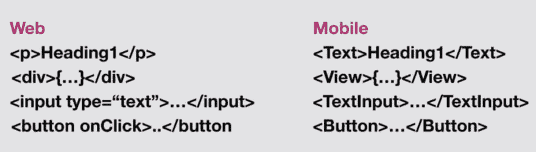
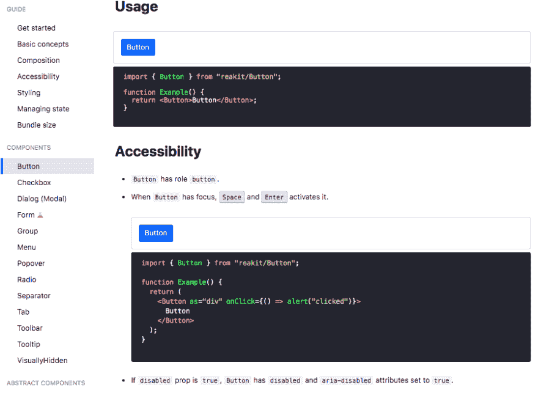
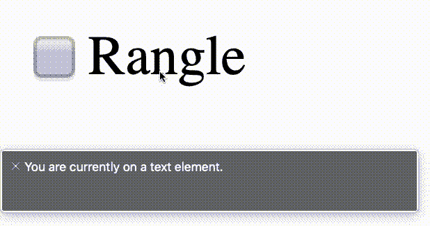
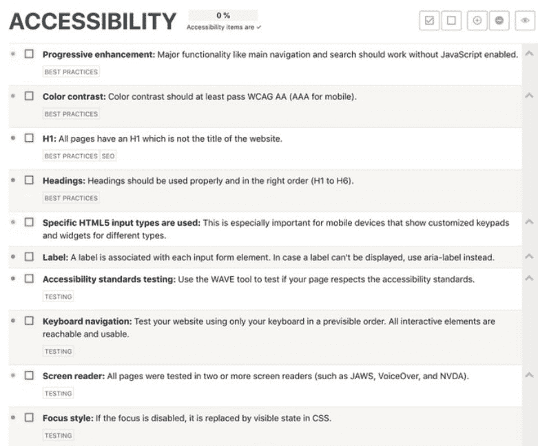

# 可访问性 360——网络和移动

> 原文:[https://dev . to/kulkarniankita 9/accessibility-360-web-and-mobile-323d](https://dev.to/kulkarniankita9/accessibility-360-web-and-mobile-323d)

### [](#accessibility-360%E2%80%8A%E2%80%8Aweb-%F0%9F%95%B8-and-mobile)无障碍 360 —网络🕸和手机📱

<figure>[](https://res.cloudinary.com/practicaldev/image/fetch/s--oE5irlx0--/c_limit%2Cf_auto%2Cfl_progressive%2Cq_auto%2Cw_880/https://cdn-images-1.medium.com/max/1024/1%2AF0yQcsKEstNX0eLlIxP9FA.png) 

<figcaption>我们需要制造这个世界🌎一个对每个人都更好的地方。</figcaption>

</figure>

[https://medium . com/media/a5f 95d 8 a 6 BCB 6 f 5 DD 9 CB 78 b 699d 9 C3 e 8/href](https://medium.com/media/a5f95d8a6bcb6f5dd9cb78b699d9c3e8/href)

作为一名开发人员，从一开始我就注意到，我们中的很多人都害怕构建可访问的应用程序。事实是，事情不一定(也不应该)是那样的。可访问性就像建筑🏗任何其他功能——需要对此有更多的认识。🤯

如果你以前已经将可访问性整合到应用程序中，或者想第一次整合可访问性，那么这篇文章适合你，⬅.我将同时使用网络🕸和手机📱举个例子。

以下是✨在引入可访问性时要考虑的一些事情。我们开始吧！

### [](#semantics)👏🏼语义学👏🏼

<figure>[](https://res.cloudinary.com/practicaldev/image/fetch/s--eVPO9dDi--/c_limit%2Cf_auto%2Cfl_progressive%2Cq_auto%2Cw_880/https://cdn-images-1.medium.com/max/1024/1%2AIoNhWQWNdQnDlRrKTlvDvg.png) 

<figcaption>语义为 Web 和移动</figcaption>

</figure>

**遵循语义🧠** 。当任何辅助设备扫描网页时，它会读取页面的 HTML 结构。这意味着当在页面上使用图像时，不要使用 div 并给它一个背景图像，而是使用一个  标签，因为语义上 img 是正确的 HTML 元素。另一个例子是

and tag which is mainly used for layout only as they are semantically meaningless, they don’t have a keyboard ⌨️ or touch support in any browser 🕸.

同样，对于📱移动，使用来自 React Native 的图像 API，这是正确的语义元素。如果没有，您将不得不用不同的可访问性标签来修补它🔖。这样，您就可以从一开始就获得可访问性，而不必进行修复🔨以后的事情。

### [](#accessibility-is-great-for-seo)易访问性对 SEO 来说很重要💹

在 HTML 中，从 H1 到 H6，我们有六层标题标签。如果用户主要使用键盘⌨️通过制表符进行导航，则标题充当屏幕阅读器用于导航的标记。通过使用正确的标题，屏幕阅读器可以帮助用户找到他们想要阅读的部分。这也有助于屏幕阅读器📖跳过内容块，只关注标题。当用户看的时候🔍对于一个使用搜索引擎的术语，如果你使用了正确的语义，它会在页面上排名更高，从而增加流量🚦。

这意味着当你考虑可访问性时，你也在考虑 SEO。💯

> 额外收获:当你把搜索引擎优化做对了，你会让营销团队很开心。😉

### [](#build-accessible-components-%E2%9B%A9)构建无障碍组件⛩

拥有力量💪🏼组件，我们得到了很多可重用性。当我们让新的开发人员加入时，他们更容易找到一个已经存在的组件并使用它，而不是创建一个新的组件。🤷🏻‍♀️这是一个设计系统💅派上用场，因为我们可以让这些组件变得触手可及。

向这些通用组件添加可访问性属性很重要，例如 React Native 的 accessibilityLabel 或 web 的 ariaLabel(看看下面的包装器示例),并使用 linters 建议开发人员在使用它们时将这些属性添加到您的组件中。因此，给这些组件添加一个包装器，并在其中加入可访问性属性是非常有用的💯。这样，任何使用该组件的人都会自动获得默认的可访问性属性。

```
interface IButtonProps {
  onPress: () => void;
  accessibilityLabel: string;
  accessibilityHint?: string;
  accessibilityRole: string;
  text: string;
  buttonStyle?: any;
  isDisabled: boolean;
  buttonTheme?: any; 
} 
```

### [](#build-a-design-system-of-accessible-components)建立一个👏🏼设计👏🏼系统👏🏼关于👏🏼易接近的👏🏼成分👏🏼

有很多关于设计系统的内容💅可以提高可访问性，要用几句话总结出很多很多的好处并不容易。例如，当你构建可访问的组件时，你的可访问性在使用这些组件的任何地方都会得到体现，从而提高你的应用程序的可访问性——记住，这并不意味着你的整个应用程序都是可访问的。不胜枚举。

组件库的一个很好的例子就是 [Reakit](https://reakit.io/) 。他们有一个单独的关于可访问性的部分，对你应该考虑的不同因素进行了精彩的解释。对于您的团队，您可以开始使用“Reakit ”,因为它会为您提供许多常见的可访问组件，因此您不必构建👷‍♀️从零开始。或者，你也可以建立一个设计系统💅自己并以 ReaKit 为参考。举个例子，

<figure>[](https://res.cloudinary.com/practicaldev/image/fetch/s--jNTKUG8l--/c_limit%2Cf_auto%2Cfl_progressive%2Cq_auto%2Cw_880/https://cdn-images-1.medium.com/max/898/1%2ARzzAyx1q5voRQXx_b9LZFQ.png) 

<figcaption>Reakit 辅助功能按钮示例💜</figcaption>

</figure>

就个人而言，我喜欢使用[故事书](https://storybook.js.org/) ❤️，因为它可以为你的组件提供文档，并且团队中的每个人都可以看到👀所有的组件，它的属性等。您还可以使用它来跟踪哪些组件是可访问的，哪些是不可访问的🛤，并对它们运行自动化的可访问性测试。

### [](#rules-to-follow)遵循的规则📐

<figure>[](https://res.cloudinary.com/practicaldev/image/fetch/s---EdEziXk--/c_limit%2Cf_auto%2Cfl_progressive%2Cq_auto%2Cw_880/https://cdn-images-1.medium.com/max/1024/1%2Ad_i5Sxdf_Dk_2wkH9gnfhA.png) 

<figcaption>不同状态要考虑申请</figcaption>

</figure>

每一个网络🕸或手机📱应用程序将有文本，按钮，键盘导航，响应等元素，其中一些已经在上面描述了。尝试用与可访问性相关的必需和可选属性为组件添加一个包装器，就像在其他情况下一样。您可以通过文档确定这些属性。这不仅有助于新开发人员快速上手，也有助于保持易访问性。🧠

> 现实😐我们人类是习惯性动物🤷🏻‍♀️:这将有助于养成良好的习惯。💯

### [](#example-of-an-accessible-component)一个可访问组件的例子💯

这只是一个基本的复选框✅组件，但会给你一个我们如何开始添加辅助功能的想法。

[https://medium . com/media/a51ee 039 BFA 1972d 0 fa 552 e 81 b 3264 a 0/href](https://medium.com/media/a51ee039bfa1972d0fa552e81b3264a0/href)

### [](#screen-reader-%F0%9F%96%A5-for-web-%F0%9F%95%B8-and-mobile)屏幕阅读器🖥用于网页🕸和手机📱

在网络上🌎，如果你是 Mac🍎用户，可以使用 cmd+f5 打开 voiceover。您应该在开发过程的早期就打开屏幕阅读器，看看它会如何不可避免地阅读您网站的内容。这将有助于创建更好的用户体验，并有助于确保您使用正确的辅助功能属性。下面是一个例子，说明当打开画外音时，屏幕阅读器将如何读取上面的复选框组件。

<figure>[](https://res.cloudinary.com/practicaldev/image/fetch/s--96HRnh3z--/c_limit%2Cf_auto%2Cfl_progressive%2Cq_66%2Cw_880/https://cdn-images-1.medium.com/max/618/1%2Auj-n_ClZSYBi3O71hz9zvQ.gif) 

<figcaption>复选框组件这时画外音被打开</figcaption>

</figure>

### [](#accessibility-checklist)可访问性检查表✅

下面是一个方便的清单，✔在考虑可访问性时应该考虑什么。这是一个良好的开端，也是一个坚实的参考点。同样重要的是要记住，可访问性不仅仅是这里列出的内容。这是🔗[将](https://frontendchecklist.io/#section-accessibility)链接到该清单。

<figure>[](https://res.cloudinary.com/practicaldev/image/fetch/s--BSH02jBP--/c_limit%2Cf_auto%2Cfl_progressive%2Cq_auto%2Cw_880/https://cdn-images-1.medium.com/max/781/1%2AvrAfQKCpinQo_1QT9k0L9g.png) 

<figcaption>无障碍检查表</figcaption>

</figure>

### [](#make-opensource-libraries-more-flexible-or-accessible)做开源👐🏼更灵活或更易访问的图书馆

如果你是开源开发者，你可以帮助推广💪可访问性通过自己添加可访问性，使您的库可管理，以便其他人可以自己添加可访问性属性— *或两者都添加*🙌🏼。这是非常重要的，因为开发人员倾向于使用大量的包📦在我们的项目上。这样，在我们决定自己编码之前，我们可以寻找现有的包来完成这项工作。

如果这些包不够灵活，不能注入属性，您可以派生🍴自己添加可访问性属性。然而，这是一个更加困难的选择😢而且要花更多的时间⏰。因此，作为开源开发者，让我们的包更加灵活是我们的责任。

我希望在阅读了《如何开始使用可访问性》之后，你会意识到从一开始就考虑它是多么重要——而不是事后才想到。如果你有兴趣了解更多，可以看看我最近在 React Europe 上的一次演讲，这里:[https://youtu.be/X_3tnSwXLls](https://youtu.be/X_3tnSwXLls)

请给它一些👏如果你喜欢的话🙏并在下面的评论中分享你的经验。

* * *