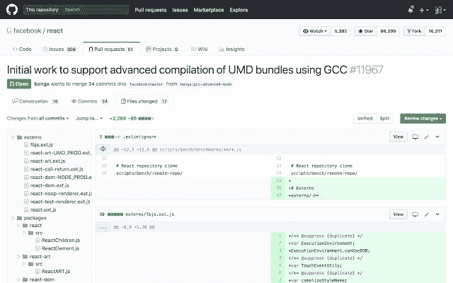
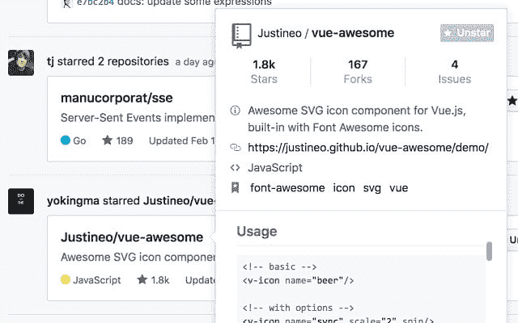

# 我的 GitHub 提示和第三方应用列表

> 原文:[https://dev . to/leonardofaria/my-list-of-github-tips-and-third-party-apps-35en](https://dev.to/leonardofaria/my-list-of-github-tips-and-third-party-apps-35en)

*还发表在[我的博客](http://bit.ly/2HKTPMS)*

我在 Thinkific 与 20 多名不同代码库的其他开发人员一起工作(我们正在[招聘](https://bit.ly/thnk-eng-team-lead) [担任](https://bit.ly/thnk-eng-lead) [多个](https://bit.ly/thnk-senior-front-end-engineer)职位)。GitHub 是我们工具包的一部分，我决定写一篇文章，分享一些 Chrome 扩展、集成和第三方应用，这些有助于我作为个人贡献者提高工作效率，并作为代码审查者和团队领导进行组织。

## 镀铬扩展

### [精制 GitHub](https://chrome.google.com/webstore/detail/refined-github/hlepfoohegkhhmjieoechaddaejaokhf?hl=en)

Sindre Sorhus 扩展为 GitHub UI 带来了[大量的改进](https://github.com/sindresorhus/refined-github#repositories)，其中许多已经成为产品的一部分。

### [更好的为 GitHub 拉请求](https://chrome.google.com/webstore/detail/better-pull-request-for-g/nfhdjopbhlggibjlimhdbogflgmbiahc?hl=en)

这个扩展名在一个树中列出项目文件。当您有一个大的拉取请求，并且您需要来回查看以更好地理解正在发生的事情时，这是非常有用的。

[T2】](https://res.cloudinary.com/practicaldev/image/fetch/s--5d9yheJX--/c_limit%2Cf_auto%2Cfl_progressive%2Cq_auto%2Cw_880/https://leonardofaria.net/wp-content/uploads/2019/09/better-pull-request-for-github.jpg)

### [GitHub 气垫卡](https://chrome.google.com/webstore/detail/github-hovercard/mmoahbbnojgkclgceahhakhnccimnplk?hl=en)

此扩展显示关于用户、项目、问题或提交的信息。这是一个很酷的 UI 技巧，就像脸书一样。这个扩展甚至适用于私有存储库，只要您有一个有效的令牌来获取服务的信息。

[T2】](https://res.cloudinary.com/practicaldev/image/fetch/s--aFHBELZ6--/c_limit%2Cf_auto%2Cfl_progressive%2Cq_auto%2Cw_880/https://leonardofaria.net/wp-content/uploads/2019/09/hover-cards.jpg)

### [GitHub 库大小](https://chrome.google.com/webstore/detail/github-repository-size/apnjnioapinblneaedefcnopcjepgkci?hl=en)

这个扩展会自动增加存储库的大小和单个文件的大小

### [GitHub 和 GitLab 的文件图标](https://chrome.google.com/webstore/detail/file-icon-for-github-and/ficfmibkjjnpogdcfhfokmihanoldbfe)

这里不多说:)

## 集成

### [拉熊猫](https://pullpanda.com/)

Pull Panda 是几个月前[收购的 GitHub 的一个集成](https://pullpanda.com/github)，他们已经免费添加到产品中。这非常方便，因为你可以将 GitHub 用户映射到 Slack 用户，然后他们将在 Slack 中获得所有关于他们在 Slack 中所做工作的信息。Pull Panda 在 PRS 中发表评论，甚至告诉你关于 git 的冲突(这个我又爱又恨)。

Pull Panda 还可以发现瓶颈，显示谁是最频繁地推送/审查代码的人，甚至可以自动分配人员来执行 Pull 请求。

## macOS 应用程序

### [数字化](https://www.gitify.io/)

Gitify 存在于你的 Mac 菜单栏中，理解起来相当简单。如果图标是绿色的，你有一个通知！提到这个应用程序是[开源的](https://github.com/manosim/gitify)也很酷(如果你好奇的话，是基于电子的)。

### [主线任务](https://steamclock.com/quests/)

Quest 类似于 Gitify，但一个重要的区别是 Quest 也支持 GitLab。

## iOS 应用程序

### [吉特霍克](http://githawk.com/)

Gitwalk 是我最喜欢的 GitHub iOS 应用。它以一种友好的方式列出了拉请求，我喜欢你在 PR 中看到受影响的文件和所有的对话。如果当你不在电脑前时，你需要在一个拉取请求中取很多，这个应用程序就是为你准备的！

*你有哪些 GitHub 招数？在评论里告诉我:)*