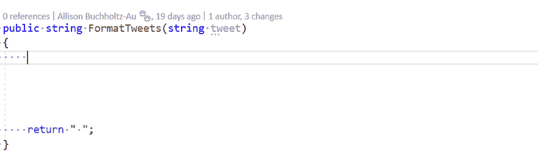

# Visual Studio IntelliCode 一年——第 1 部分:常见误解

> 原文:[https://dev . to/Allison _ au/a-year-with-visual-studio-intelli code-part-1-common-misconcepts-3j7p](https://dev.to/allison_au/a-year-with-visual-studio-intellicode-part-1-common-misconceptions-3j7p)

嗨，我是艾莉森！我已经在微软工作了 4 年，担任 Visual Studio 的项目经理，去年我一直专注于 Visual Studio IntelliCode。我从来没有写过个人博客，但是当我回顾与这个团队及其客户在一起的最后一年时，我意识到我有很多东西想与社区分享。

对于这次回顾的第一部分，我正在解决在过去的一年中我不得不解释至少一千次的误解(好吧，这有点夸张)，但我希望这可能会一劳永逸地消除困惑(我知道，大梦想)。第 2 部分将涵盖作为团队项目经理的个人学习。第 3 部分将讨论我们如何构建和发布新特性，我仍在为第 4 部分+集思广益(欢迎所有建议😊).

至此，让我试着澄清一下我在过去一年中遇到的三大 IntelliCode 误解:

IntelliCode 误解 1:它只是智能感知/最受欢迎选择的 MRU。

当我们谈论 IntelliCode 时，您经常会听到类似“它分析开放源代码库以寻找最常见的模式”这样的话，所以我完全理解这种困惑的来源！但是 IntelliCode 的人工智能辅助智能感知更重要，因为它考虑了上下文！

MRU 会建议你最近选择了什么，而基于频率的建议会给你每门课相同的建议，不管你如何使用它。借助 IntelliCode，我们可以获取更多信息来更改您的首选建议。例如，你在一个方法体中吗？你是在 if 语句中还是 for 循环中？你想给什么类型的变量赋值？

看看下面的 gif 图，看看三种不同的上下文——方法体、if 语句和变量赋值——如何改变上面标有星号的建议！

[T2】](https://res.cloudinary.com/practicaldev/image/fetch/s--Mola3bVF--/c_limit%2Cf_auto%2Cfl_progressive%2Cq_66%2Cw_880/https://thepracticaldev.s3.amazonaws.com/i/ayf8ywiqbkr8k22jzady.gif)

Intellicode 误解 2:它只涵盖“更智能”的智能感知。

IntelliCode 实际上是我的团队研究和创造的开发人员智慧集合的广义名称。我们正在研究从 ML 如何帮助测试恢复到基于您在文件中所做的更改智能地创建重构，再到基于您当前的代码库模式推断出的样式规则。我们的增强型智能感知产品是我们发布的第一个产品，但是 IntelliCode 还在开发中！

IntelliCode 误解 3:它从我输入的内容中学习——哦，不！😮

我庄严宣誓，我们不会看着你输入的内容，然后用它来改进我们的模型。我们的基本模型会定期在开源存储库中进行再培训，但我们从不从您那里获取信息。如果您选择创建定制模型，我们将从您的解决方案中提取[最小的必要信息](https://docs.microsoft.com/en-us/visualstudio/intellicode/custom-models)来创建您的模型，但仅在您选择创建模型时传输该数据。这不是一个持续的过程。您的安全和隐私对我们来说至关重要！

如果你仍然对 IntelliCode 感到困惑或有任何反馈，我很乐意在下面的评论中与你聊天。您也可以查看我们的入门文档！

下次请继续收听，听听我个人在过去一年里学到的更多东西。